## 대규모 AI 워크로드의 도전과 Harness의 역할

대규모 AI 시스템, 특히 최신 LLM(Large Language Models) 및 복합 모델은 엄청난 컴퓨팅 자원과 정교한 오케스트레이션을 요구합니다. 이러한 복잡성 증가에 따라 효율적이고 견고한 워크로드 처리를 위한 분산 처리 시스템 디자인 패턴의 정립은 필수적입니다. Harness는 CI/CD, MLOps, Feature Flags 등 통합 플랫폼을 통해 AI 모델의 개발, 배포, 운영 전반을 지원하며, 분산 AI 워크로드 관리를 위한 핵심 인프라를 제공합니다. 이는 AI 시스템의 복잡성을 관리하고, 높은 가용성과 확장성을 보장하는 데 기여합니다.

## 핵심 분산 처리 디자인 패턴

### 1. 마이크로서비스 아키텍처 (Microservices Architecture)
AI 워크로드를 독립적인 서비스로 분해하여 개발, 배포, 확장을 용이하게 합니다. 각 서비스는 특정 AI 모델 추론, 데이터 전처리, 결과 후처리 등 독립적인 기능을 수행하며, 서비스 간의 느슨한 결합(Loose Coupling)을 통해 전체 시스템의 탄력성과 재사용성을 높입니다.

### 2. 비동기 메시징 및 큐 (Asynchronous Messaging & Queues)
AI 모델 추론과 같은 시간이 오래 걸리거나 자원 집약적인 작업은 메시지 큐(예: Apache Kafka, RabbitMQ)를 통해 비동기적으로 처리됩니다. 이는 시스템의 탄력성을 높이고, 갑작스러운 요청 스파이크에 대응하며, 서비스 간의 결합도를 낮춥니다. 워커 서비스는 큐에서 작업을 가져와 처리하고, 완료 시 결과를 다시 큐나 데이터베이스에 전달합니다.

### 3. 컨테이너화 및 오케스트레이션 (Containerization & Orchestration)
Docker와 Kubernetes는 AI 모델 및 관련 서비스의 일관된 배포 환경을 제공하며, Harness는 Kubernetes 클러스터에 대한 배포 및 관리를 간소화합니다. 이를 통해 GPU와 같은 특수 자원을 효율적으로 할당하고 관리할 수 있으며, 환경 일관성을 보장하여 '내 컴퓨터에서는 되는데…' 문제를 방지합니다.

### 4. 데이터 및 모델 병렬 처리 (Data & Model Parallelism)
*   **데이터 병렬 처리 (Data Parallelism)**: 대규모 데이터셋을 여러 AI 모델 인스턴스에 분할하여 처리하고, 그 결과를 취합하는 방식입니다. 주로 훈련 단계에서 사용되지만, 대량의 배치 추론에서도 활용될 수 있습니다. 각 인스턴스는 독립적으로 동작하여 처리량을 극대화합니다.
*   **모델 병렬 처리 (Model Parallelism)**: 단일 AI 모델이 너무 커서 하나의 장치(GPU)에 올라가지 않을 때, 모델의 각 계층(layer)을 여러 장치에 분할하여 배치하고 순차적으로 처리하는 방식입니다. 주로 초대규모 모델 훈련 및 추론에 필수적입니다.

### 5. 서버리스 컴퓨팅 (Serverless Computing)
간헐적이거나 이벤트 기반의 AI 추론 작업에 적합합니다. 필요한 경우에만 컴퓨팅 자원이 할당되므로 비용 효율적이며, Harness는 서버리스 함수 배포 및 관리를 지원할 수 있습니다. 예를 들어, 특정 데이터가 업로드될 때만 트리거되는 이미지 처리 AI 서비스에 활용될 수 있습니다.

## Harness를 활용한 분산 AI 워크로드 오케스트레이션

Harness는 이러한 분산 패턴을 구현하고 관리하는 데 필요한 다양한 기능을 제공합니다.

*   **CI/CD 파이프라인**: AI 모델의 빌드, 테스트, 배포를 자동화하여 일관성을 유지하고 배포 시간을 단축합니다.
*   **CD (Continuous Delivery)**: Kubernetes, 클라우드 함수 등으로 AI 서비스를 배포하고 롤백하며, Zero-Downtime Deployment를 지원합니다.
*   **MLOps**: 모델 레지스트리 통합, 모델 버전 관리, 모델 배포 자동화를 지원하여 AI 모델의 라이프사이클을 효율적으로 관리합니다.
*   **Feature Flags**: 새로운 AI 모델 또는 추론 로직을 점진적으로 배포하고 A/B 테스트를 수행하여 위험을 최소화합니다.
*   **Observability**: 분산된 AI 서비스의 성능 모니터링, 로그 집계, 알림을 통해 운영 상태를 파악하고 문제 발생 시 신속하게 대응합니다.

### 아키텍처 예시: 비동기 AI 추론 시스템

대규모 이미지 분류 워크로드를 위한 비동기 추론 시스템의 일반적인 아키텍처는 다음과 같습니다.

```mermaid
graph TD
    UserApp[사용자 애플리케이션] --> RequestAPI(추론 요청 API)
    RequestAPI --> Kafka[Kafka Message Queue]
    Kafka --> WorkerGroup1(AI Worker Group 1)
    Kafka --> WorkerGroup2(AI Worker Group 2)
    WorkerGroup1 --> ModelService[AI Model Serving]
    WorkerGroup2 --> ModelService
    ModelService --> GPUCluster[GPU 클러스터 / K8s]
    GPUCluster -- 추론 결과 --> ModelService
    ModelService -- 결과 전송 --> ResultDB(결과 데이터베이스)
    ResultDB --> NotificationService[알림 서비스]
    NotificationService --> UserApp
    subgraph "Harness Platform"
        RequestAPI
        WorkerGroup1
        WorkerGroup2
        ModelService
        NotificationService
        GPUCluster
        ResultDB
    end
```



이 다이어그램에서:
*   **RequestAPI**: 추론 요청을 받아 Kafka 큐에 넣습니다. Harness CD를 통해 배포됩니다.
*   **Kafka Message Queue**: 요청과 응답을 비동기적으로 전달하여 시스템의 유연성을 높입니다.
*   **AI Worker Group**: Kafka 큐에서 요청을 가져와 AI 모델 서비스에 전달합니다. Harness CD 및 오토스케일링으로 관리됩니다.
*   **AI Model Serving**: 실제 AI 모델 추론을 수행합니다. GPU 클러스터 (Kubernetes) 위에 배포되며, Harness MLOps 및 CD 파이프라인이 관리합니다.
*   **GPU Cluster / K8s**: AI 모델 추론을 위한 컴퓨팅 자원입니다.
*   **Result Database**: 추론 결과를 저장합니다.
*   **Notification Service**: 추론 완료를 사용자에게 알립니다.

## 코드 예제: 분산 AI 태스크 처리 (Python)

이 예제는 Flask 웹 애플리케이션에서 비동기적으로 AI 추론 작업을 메시지 큐에 제출하고, 워커들이 이를 처리하는 개념을 보여줍니다. 실제 프로덕션에서는 Celery, Ray, Dask 등의 분산 처리 프레임워크와 결합됩니다.

```python
# app.py (Flask 애플리케이션)
from flask import Flask, request, jsonify
from uuid import uuid4
import redis # 메시지 큐 역할을 할 Redis 예시

app = Flask(__name__)
redis_client = redis.StrictRedis(host='localhost', port=6379, db=0)

@app.route('/predict', methods=['POST'])
def predict():
    data = request.json
    if not data or 'image_url' not in data:
        return jsonify({'error': 'Missing image_url'}), 400

    task_id = str(uuid4())
    task = {
        'task_id': task_id,
        'image_url': data['image_url'],
        'status': 'PENDING'
    }
    redis_client.lpush('ai_tasks_queue', str(task)) # 태스크 큐에 추가
    redis_client.set(f'task_status:{task_id}', 'PENDING') # 상태 저장

    return jsonify({'task_id': task_id, 'status': 'Task submitted'}), 202

@app.route('/status/<task_id>', methods=['GET'])
def get_status(task_id):
    status = redis_client.get(f'task_status:{task_id}')
    if status:
        return jsonify({'task_id': task_id, 'status': status.decode('utf-8')})
    return jsonify({'error': 'Task not found'}), 404

if __name__ == '__main__':
    app.run(debug=True, port=5000)
```

```python
# worker.py (AI 워커)
import time
import json
import redis # 메시지 큐 역할을 할 Redis 예시
# 실제 AI 모델 추론 라이브러리 (예: TensorFlow, PyTorch)
# from transformers import pipeline

redis_client = redis.StrictRedis(host='localhost', port=6379, db=0)
# classifier = pipeline('image-classification', model='google/vit-base-patch16-224') # 예시 모델

print("AI Worker started, listening for tasks...")

while True:
    # 큐에서 태스크를 블로킹 방식으로 가져옴
    _, task_str = redis_client.brpop('ai_tasks_queue')
    task = json.loads(task_str)

    task_id = task['task_id']
    image_url = task['image_url']
    print(f"Processing task {task_id} for image: {image_url}")

    try:
        # 실제 AI 모델 추론 로직 (placeholder)
        # result = classifier(image_url)
        time.sleep(5) # 추론 시간 시뮬레이션
        prediction_result = {'label': 'cat', 'score': 0.99} # 예시 결과

        redis_client.set(f'task_status:{task_id}', 'COMPLETED')
        redis_client.set(f'task_result:{task_id}', json.dumps(prediction_result))
        print(f"Task {task_id} completed with result: {prediction_result}")
    except Exception as e:
        redis_client.set(f'task_status:{task_id}', f'FAILED: {str(e)}')
        print(f"Task {task_id} failed: {str(e)}")

    time.sleep(1) # 다음 태스크를 기다림
```

이 코드는 Flask API가 요청을 받아 Redis 큐에 작업을 넣고, `worker.py` 스크립트가 큐에서 작업을 꺼내 처리하는 간단한 개념을 보여줍니다. Harness는 `app.py`와 `worker.py`를 컨테이너화하고 Kubernetes 클러스터에 배포하며, 워커 스케일링을 자동화하여 전체 분산 시스템을 효율적으로 관리할 수 있습니다.

## 2026년 최신 트렌드 반영

2026년에는 대규모 AI 워크로드 처리에 있어 다음과 같은 트렌드가 더욱 중요해질 것입니다.

*   **AI 에이전트 오케스트레이션**: 복잡한 다단계 AI 에이전트 워크플로우를 효율적으로 관리하고 조정하는 분산 시스템이 중요해집니다. 각 에이전트의 상태 관리와 협업이 핵심 과제입니다.
*   **엣지 AI 및 연합 학습**: 중앙 집중식 클라우드뿐만 아니라 엣지 디바이스에서도 AI 모델을 분산하여 추론하고 학습하는 패턴이 확산됩니다. 데이터 프라이버시와 저지연(Low Latency)을 위해 필수적입니다.
*   **책임감 있는 AI (Responsible AI)**: 분산 시스템 내에서 AI 모델의 편향, 공정성, 보안 등을 지속적으로 모니터링하고 제어하는 메커니즘이 강화됩니다. 규제 준수와 윤리적 AI 사용이 중요해집니다.
*   **자동화된 MLOps 파이프라인**: 모델 개발부터 배포, 모니터링, 재학습까지 전 과정을 고도로 자동화하여 AI 시스템의 신뢰성과 효율성을 극대화합니다. Harness는 이 분야에서 핵심적인 역할을 합니다.
*   **멀티모달 AI 지원**: 텍스트, 이미지, 비디오 등 다양한 형태의 데이터를 동시에 처리하는 멀티모달 AI 모델을 위한 분산 처리 및 자원 관리의 중요성이 증대됩니다. 이질적인 데이터 타입에 대한 효율적인 통합이 필요합니다.

## 트레이드오프

분산 AI 워크로드 처리 시스템 디자인 패턴을 선택할 때는 다음과 같은 트레이드오프를 고려해야 합니다.

*   **복잡성 vs 확장성**:
    *   **언제 좋은가**: 높은 확장성과 가용성이 필수적인 대규모 AI 서비스에 적합합니다. 각 컴포넌트가 독립적으로 스케일링되어 트래픽 변동에 유연하게 대응할 수 있습니다.
    *   **언제 나쁜가**: 초기 설계 및 구현에 높은 복잡성이 따릅니다. 분산 시스템은 모니터링, 디버깅, 장애 처리 등이 더 어려워집니다. 소규모 프로젝트나 PoC 단계에서는 과도한 오버헤드를 초래할 수 있습니다.

*   **일관성 vs 가용성 (CAP Theorem)**:
    *   **언제 좋은가**: 실시간에 가까운 응답과 높은 처리량이 요구되는 AI 추론 서비스에 유용합니다. 일부 데이터 일관성이 일시적으로 희생되더라도 서비스의 지속적인 가용성을 보장합니다.
    *   **언제 나쁜가**: 금융 거래나 민감한 데이터 처리와 같이 데이터 일관성이 절대적으로 중요한 AI 시스템에서는 설계에 더욱 신중해야 합니다. 데이터 동기화 지연이 발생할 수 있으므로 신중한 접근이 필요합니다.

*   **비용 효율성 vs 성능 최적화**:
    *   **언제 좋은가**: 서버리스 컴퓨팅이나 동적 자원 할당은 사용량에 따라 비용을 최적화할 수 있습니다. 간헐적인 AI 워크로드에 매우 효율적입니다.
    *   **언제 나쁜가**: 최고 성능이 항상 필요한 워크로드(예: 초저지연 실시간 추론)에서는 자원 프로비저닝 오버헤드나 콜드 스타트(Cold Start) 문제가 발생할 수 있습니다. 이 경우 전용 자원 할당이 더 적합할 수 있습니다.

*   **범용성 vs 특정 AI 워크로드 최적화**:
    *   **언제 좋은가**: 컨테이너화 및 Kubernetes는 다양한 AI 모델 및 프레임워크에 대한 범용적인 배포 환경을 제공합니다. 여러 프로젝트에서 재사용 가능하며 표준화된 운영 모델을 제공합니다.
    *   **언제 나쁜가**: 특정 AI 모델(예: 극도로 큰 LLM)에 대한 GPU 자원 할당이나 통신 최적화는 특정 클러스터 환경이나 특수 라이브러리(예: DeepSpeed)에 대한 깊은 지식을 요구할 수 있습니다. 범용 솔루션이 항상 최적의 성능을 보장하지는 않습니다.

## 실전 체크리스트

대규모 AI 워크로드 처리를 위한 Harness 분산 처리 시스템을 설계하고 구현할 때 다음 체크리스트를 활용하십시오.

- [ ] **워크로드 특성 분석 완료**: AI 모델의 추론/훈련 빈도, 데이터 크기, 지연 시간 요구사항, 자원(CPU/GPU) 요구량을 명확히 정의했습니까?
- [ ] **마이크로서비스 경계 정의**: 각 AI 기능(전처리, 추론, 후처리)이 독립적인 서비스로 명확하게 분리되었으며, 서비스 간 통신 프로토콜이 정의되었습니까?
- [ ] **메시지 큐 설계 및 통합**: 비동기 작업을 위한 메시지 큐(Kafka, RabbitMQ 등)가 선택되었고, 메시지 포맷 및 큐 처리 로직이 구현되었습니까?
- [ ] **컨테이너 이미지 최적화**: AI 모델 및 의존성을 포함하는 Docker 이미지가 최소화되고, 빌드 파이프라인이 Harness CI/CD에 통합되었습니까?
- [ ] **Kubernetes 배포 전략 수립**: AI 서비스를 위한 Kubernetes Deployment, Service, Horizontal Pod Autoscaler(HPA) 설정이 정의되었고, Harness CD로 자동 배포됩니까? 특히 GPU 자원 요청이 올바르게 설정되었는지 확인하십시오.
- [ ] **오토스케일링 및 자원 관리 정책**: CPU, 메모리, GPU 사용량 또는 메시지 큐 길이와 같은 메트릭에 기반한 워커 및 모델 서비스의 오토스케일링 정책이 설정되었습니까?
- [ ] **모니터링 및 로깅 시스템 구축**: 분산된 AI 서비스의 성능 지표(응답 시간, 처리량, 에러율)와 로그가 중앙 집중식 시스템(예: Prometheus, Grafana, ELK Stack)으로 수집되고, Harness Observability와 연동되었습니까?
- [ ] **장애 복구 및 재시도 메커니즘**: 메시지 큐에서 작업 실패 시 재시도 로직, 데드-레터 큐(Dead-Letter Queue) 처리, 서비스 간 통신 실패 시 회복 전략이 구현되었습니까?
- [ ] **보안 및 접근 제어**: AI 모델 및 데이터에 대한 접근 제어가 적절히 구성되었고, 민감한 정보는 암호화되며, Harness Vault와 같은 시크릿 관리 도구가 활용되었습니까?
- [ ] **비용 관리 및 최적화**: 클라우드 자원 사용량 모니터링 및 예측, 불필요한 자원 제거, 스팟 인스턴스 활용 등 비용 최적화 전략이 마련되었습니까?