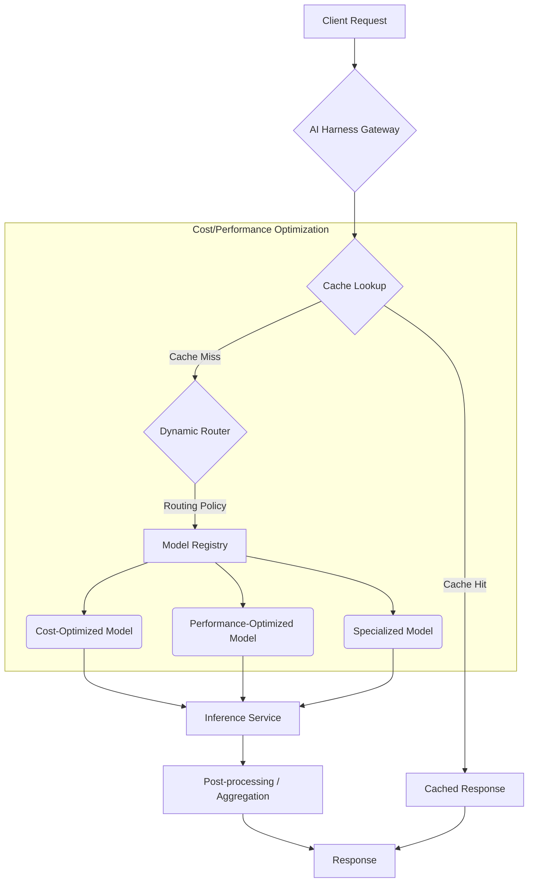

2026년, 다양한 AI 모델(Large Language Models, Vision Models, specialized ML models 등)을 통합하여 서비스를 구축하는 것은 일반적인 개발 패턴이 되었습니다. 이러한 다중 AI 모델 환경에서 자원 효율성을 극대화하고, 동시에 사용자에게 실시간에 가까운 고성능을 제공하는 것은 성공적인 서비스 운영의 핵심 과제입니다. 복잡한 AI 모델의 API 호출 비용과 추론 지연 시간은 서비스의 수익성 및 사용자 경험에 직접적인 영향을 미치므로, 이를 최적화하기 위한 정교한 하네스(Harness) 엔지니어링 전략이 필수적입니다. 이 엔트리에서는 다중 AI 모델 하네스에서 비용 및 성능을 최적화하기 위한 핵심 패턴과 실전 적용 가이드라인을 제시합니다.

## 동적 모델 라우팅 (Dynamic Model Routing)을 통한 효율성 증대

동적 모델 라우팅은 들어오는 요청의 특성(예: 입력 길이, 복잡도, 요구되는 정확도, 실시간 요구사항)에 따라 가장 적합하고 비용 효율적인 AI 모델로 트래픽을 지능적으로 분배하는 패턴입니다. 이는 고가의 대형 모델에 모든 요청을 보내는 대신, 경량 모델이나 특정 태스크에 특화된 모델을 활용하여 비용을 절감하고 응답 속도를 향상시킵니다.

### 라우팅 정책의 핵심 요소

*   **비용 기반 라우팅**: 각 모델의 토큰당/호출당 비용을 기준으로, 주어진 요청을 처리하는 데 가장 저렴한 모델을 선택합니다.
*   **성능 기반 라우팅**: 모델의 평균 지연 시간(latency)과 처리량(throughput)을 기준으로, 가장 빠른 응답을 제공할 수 있는 모델을 선택합니다.
*   **기능 기반 라우팅**: 요청이 요구하는 특정 기능(예: 멀티모달 처리, 특정 도메인 지식)을 가장 잘 수행할 수 있는 모델로 보냅니다.
*   **컨텍스트 크기 기반 라우팅**: 입력 컨텍스트의 길이가 짧으면 더 작은 컨텍스트 윈도우를 가진 저비용 모델을 사용하고, 길면 대형 모델로 라우팅합니다.

## 지능형 캐싱 전략 (Intelligent Caching Strategies)

AI 모델 추론은 종종 반복적인 입력에 대해 유사하거나 동일한 출력을 생성할 수 있습니다. 이러한 경우, 추론 결과를 캐싱하여 불필요한 API 호출을 줄이고 응답 속도를 획기적으로 개선할 수 있습니다.

### 캐싱 계층 및 유형

*   **요청 수준 캐싱 (Request-level Caching)**: 동일한 입력이 들어왔을 때, 이전에 생성된 출력을 즉시 반환합니다. 가장 직접적인 비용 및 성능 개선 효과를 제공합니다.
*   **임베딩 수준 캐싱 (Embedding-level Caching)**: RAG(Retrieval Augmented Generation) 시스템에서 문서나 질의에 대한 임베딩을 캐싱하여, 중복 임베딩 생성 API 호출을 줄입니다.
*   **부분 추론 캐싱 (Partial Inference Caching)**: 다단계 추론 워크플로우에서 중간 단계의 결과를 캐싱하여, 다음 단계에서 필요한 경우 재사용합니다.

캐시 무효화(Cache Invalidation) 정책과 TTL (Time-To-Live) 관리는 캐싱 전략의 핵심 요소이며, 데이터의 신선도와 캐시 히트율 사이의 균형을 유지해야 합니다.

## 배치 처리 (Batching) 및 비동기 처리 (Asynchronous Processing)

GPU 자원을 효율적으로 사용하고 처리량을 늘리기 위해 여러 추론 요청을 묶어서 한 번에 처리하는 배치(Batching) 방식이 중요합니다. 특히 LLM과 같이 컴퓨팅 자원을 많이 사용하는 모델에 효과적입니다.

*   **마이크로-배치 (Micro-batching)**: 실시간에 가까운 응답이 필요한 경우, 작은 배치 단위로 자주 요청을 처리하여 지연 시간을 최소화하면서도 자원 활용도를 높입니다.
*   **비동기 워크플로우**: 실시간 응답이 필수적이지 않은 장기 실행 태스크의 경우, 메시지 큐(Kafka, RabbitMQ 등)를 사용하여 요청과 응답을 분리하고, 백그라운드에서 모델 추론을 비동기적으로 수행하여 전반적인 시스템의 견고성과 처리량을 향상시킵니다.

## 모델 압축 (Model Compression) 및 양자화 (Quantization)

모델의 크기를 줄이고 계산 복잡도를 낮추는 기술은 추론 속도를 높이고, 필요한 컴퓨팅 자원을 감소시켜 비용을 절감합니다. 특히 엣지 디바이스나 리소스가 제한된 환경에 AI 모델을 배포할 때 필수적입니다.

*   **양자화 (Quantization)**: 모델의 가중치를 저정밀도(예: FP32에서 INT8)로 변환하여 메모리 사용량과 계산량을 줄입니다. 이로 인해 추론 속도가 빨라지고 에너지 소비가 줄어듭니다.
*   **가지치기 (Pruning)**: 모델의 중요하지 않은 가중치나 연결을 제거하여 모델의 희소성(sparsity)을 높이고 크기를 줄입니다.
*   **지식 증류 (Knowledge Distillation)**: 대형 '교사(teacher)' 모델의 지식을 소형 '학생(student)' 모델에 전달하여, 작은 모델이 큰 모델과 유사한 성능을 내도록 학습시킵니다.

## 아키텍처 패턴: 다중 AI 모델 하네스 설계

이러한 최적화 패턴을 효과적으로 구현하기 위해서는 견고한 하네스 아키텍처가 뒷받침되어야 합니다. 다음은 핵심 아키텍처 컴포넌트입니다.

### AI Harness Gateway
중앙 진입점으로, 모든 AI 모델 요청을 처리합니다. 인증, 권한 부여, 속도 제한, 로깅, 그리고 위에서 설명한 동적 라우팅 및 캐싱 로직의 초기 단계가 이곳에서 이루어집니다.

### Model Registry and Discovery Service
사용 가능한 모든 AI 모델에 대한 메타데이터(예: 이름, 버전, API 엔드포인트, 비용, 성능, 기능, 컨텍스트 윈도우 크기)를 중앙에서 관리합니다. 동적 라우터는 이 정보를 활용하여 최적의 모델을 선택합니다.

### Adaptive Runtime and Resource Orchestration
각 모델의 추론 요구사항에 따라 컴퓨팅 자원(GPU, CPU, 메모리)을 동적으로 할당하고 관리합니다. Kubernetes와 같은 컨테이너 오케스트레이션 도구와 통합하여 모델의 스케일링을 자동화하고, 사용률이 낮은 모델의 리소스를 회수하여 비용 효율성을 높입니다.

다음 Mermaid 다이어그램은 다중 AI 모델 하네스의 요청 처리 흐름과 최적화 지점을 시각화합니다.



### Go 언어를 활용한 동적 라우터 예시

아래 Go 언어 코드는 단순화된 동적 라우터의 구현 예시를 보여줍니다. `DynamicRouter`는 `ModelRegistry`에 등록된 모델 정보를 바탕으로, 요청의 `task`, `inputLength`, `priority`(비용 또는 성능)에 따라 가장 적합한 모델을 선정합니다.

```go
package main

import (
	"context"
	"fmt"
	"log"
	"time"
)

// ModelInfo defines metadata for an AI model
type ModelInfo struct {
	ID        string
	Name      string
	CostPerToken float64
	LatencyMS  int
	Capability string // e.g., "text-generation", "image-analysis", "complex-reasoning"
	ContextWindow int
}

// ModelRegistry stores available models and their info
type ModelRegistry struct {
	models map[string]ModelInfo
}

func NewModelRegistry() *ModelRegistry {
	return &ModelRegistry{
		models: map[string]ModelInfo{
			"gpt-3.5-turbo": {
				ID: "gpt-3.5-turbo", Name: "GPT-3.5 Turbo", CostPerToken: 0.000002, LatencyMS: 200, Capability: "text-generation", ContextWindow: 16000,
			},
			"claude-3-haiku": {
				ID: "claude-3-haiku", Name: "Claude 3 Haiku", CostPerToken: 0.00000025, LatencyMS: 150, Capability: "text-generation", ContextWindow: 200000,
			},
			"gemini-1.5-flash": {
				ID: "gemini-1.5-flash", Name: "Gemini 1.5 Flash", CostPerToken: 0.00000035, LatencyMS: 100, Capability: "multimodal", ContextWindow: 1000000,
			},
			"custom-vision-model": {
				ID: "custom-vision-model", Name: "Custom Vision", CostPerToken: 0.000005, LatencyMS: 300, Capability: "image-analysis", ContextWindow: 0,
			},
		},
	}
}

// DynamicRouter routes requests to the optimal model
type DynamicRouter struct {
	registry *ModelRegistry
}

func NewDynamicRouter(registry *ModelRegistry) *DynamicRouter {
	return &DynamicRouter{registry: registry}
}

// Route selects a model based on request parameters and optimization goals
func (r *DynamicRouter) Route(ctx context.Context, task string, inputLength int, priority string, multimodal bool) (ModelInfo, error) {
	var bestModel ModelInfo
	minCost := float64(1_000_000_000) // Arbitrarily large
	minLatency := 1_000_000 // Arbitrarily large

	for _, model := range r.registry.models {
		// Basic capability check
		if multimodal && model.Capability != "multimodal" {
			continue
		}
		if task == "image-analysis" && model.Capability != "image-analysis" {
			continue
		}
		if task == "text-generation" && model.Capability != "text-generation" && model.Capability != "multimodal" {
			continue
		}

		// Context window check
		if inputLength > model.ContextWindow && model.ContextWindow > 0 { // ContextWindow > 0 implies text model
			continue
		}

		// Optimization logic
		if priority == "cost" {
			if model.CostPerToken * float64(inputLength) < minCost {
				minCost = model.CostPerToken * float64(inputLength)
				bestModel = model
			}
		} else if priority == "performance" {
			if model.LatencyMS < minLatency {
				minLatency = model.LatencyMS
				bestModel = model
			}
		} else { // Default to balanced or specific criteria
			// A more complex heuristic could be applied here
			// For simplicity, let's prioritize lower latency for "balanced" if cost is similar
			if model.LatencyMS < minLatency {
				minLatency = model.LatencyMS
				bestModel = model
			}
		}
	}

	if bestModel.ID == "" {
		return ModelInfo{}, fmt.Errorf("no suitable model found for task '%s' with priority '%s'", task, priority)
	}
	return bestModel, nil
}

func main() {
	registry := NewModelRegistry()
	router := NewDynamicRouter(registry)

	ctx := context.Background()

	// Example 1: Cost-optimized text generation
	model1, err := router.Route(ctx, "text-generation", 500, "cost", false)
	if err != nil {
		log.Fatal(err)
	}
	fmt.Printf("Cost-optimized text model for 500 tokens: %s (Cost/token: %.8f, Latency: %dms)\n", model1.Name, model1.CostPerToken, model1.LatencyMS)

	// Example 2: Performance-optimized text generation for short input
	model2, err := router.Route(ctx, "text-generation", 50, "performance", false)
	if err != nil {
		log.Fatal(err)
	}
	fmt.Printf("Performance-optimized text model for 50 tokens: %s (Cost/token: %.8f, Latency: %dms)\n", model2.Name, model2.CostPerToken, model2.LatencyMS)

	// Example 3: Multimodal task
	model3, err := router.Route(ctx, "multimodal-analysis", 1000, "performance", true)
	if err != nil {
		log.Println(err) // Expecting no direct "multimodal-analysis" task, but will route via multimodal capability
	}
	fmt.Printf("Multimodal model: %s (Cost/token: %.8f, Latency: %dms)\n", model3.Name, model3.CostPerToken, model3.LatencyMS)

	// Example 4: Image analysis
	model4, err := router.Route(ctx, "image-analysis", 0, "performance", false)
	if err != nil {
		log.Fatal(err)
	}
	fmt.Printf("Image analysis model: %s (Cost/token: %.8f, Latency: %dms)\n", model4.Name, model4.CostPerToken, model4.LatencyMS)
}
```

## 트레이드오프

각 비용 및 성능 최적화 패턴은 특정 이점을 제공하지만, 동시에 고려해야 할 트레이드오프가 존재합니다. 다른 엔트리가 이 문서를 참조할 때 판단 근거로 활용할 수 있도록 주요 장단점을 명시합니다.

*   **동적 모델 라우팅 (Dynamic Model Routing)**:
    *   **Pros**: 비용 절감 및 성능 향상: 요청의 특성(예: 입력 길이, 복잡도, 실시간 요구사항)에 따라 가장 적합하고 비용 효율적인 모델을 선택하여 전체 시스템의 자원 효율성을 극대화합니다. 언제 좋냐면, 다양한 모델 옵션이 있고 요청의 특성이 확연히 구분될 때 좋습니다.
    *   **Cons**: 복잡도 및 오버헤드 증가: 라우팅 로직 자체의 개발 및 유지보수 비용이 발생하며, 각 요청에 대한 모델 선택 과정에서 미미한 지연이 추가될 수 있습니다. 복잡한 정책 엔진은 디버깅을 어렵게 만듭니다. 언제 나쁘냐면, 모델 간 성능/비용 차이가 미미하거나 요청 특성 구분이 모호할 때, 또는 시스템 복잡도 증가가 큰 부담일 때 좋지 않습니다.

*   **지능형 캐싱 (Intelligent Caching)**:
    *   **Pros**: 응답 속도 향상 및 비용 절감: 동일하거나 유사한 요청에 대한 중복 추론을 방지하여 API 호출 비용을 줄이고, 사용자에게 더 빠른 응답을 제공합니다. 언제 좋냐면, 동일한 입력에 대한 반복적인 요청이 많거나, 응답 지연에 민감한 서비스에 좋습니다.
    *   **Cons**: 캐시 무효화 및 메모리 관리 복잡성: 캐시된 데이터의 일관성 유지(Cache Invalidation)가 어려울 수 있으며, 대규모 캐시는 상당한 메모리 자원을 소모합니다. 오래된 데이터 제공 위험이 있습니다. 언제 나쁘냐면, 입력 데이터가 빠르게 변화하여 캐시 히트율이 낮거나, 데이터의 신선도(freshness)가 절대적으로 중요한 경우 좋지 않습니다.

*   **배치 처리 (Batching) 및 마이크로-배치 (Micro-batching)**:
    *   **Pros**: GPU/CPU 활용도 극대화 및 처리량 증가: 여러 요청을 묶어 한 번에 처리함으로써 하드웨어 자원의 효율을 높이고, 특히 GPU 기반 모델에서 비용 대비 처리량을 대폭 개선합니다. 언제 좋냐면, 높은 처리량과 자원 효율이 중요하고 개별 요청의 약간의 지연을 허용할 수 있을 때 좋습니다.
    *   **Cons**: 개별 요청의 지연 시간 증가 및 구현 복잡성: 배치 크기에 따라 개별 요청이 응답을 받기까지 대기해야 하므로, 실시간성이 중요한 애플리케이션에서는 지연 시간이 증가할 수 있습니다. 비동기 처리 파이프라인 구현 복잡도가 높습니다. 언제 나쁘냐면, 모든 요청이 엄격한 실시간 응답을 요구할 때 좋지 않습니다.

*   **모델 압축 (Model Compression) 및 양자화 (Quantization)**:
    *   **Pros**: 빠른 추론 속도와 낮은 자원 사용량: 모델 크기를 줄여 메모리 사용량을 감소시키고, 추론 속도를 향상시켜 더 적은 컴퓨팅 자원으로 더 많은 요청을 처리할 수 있게 합니다. 엣지 디바이스 배포에 유리합니다. 언제 좋냐면, 리소스가 제한된 환경(예: 엣지 AI)에서 모델을 실행하거나, 추론 비용을 극적으로 줄여야 할 때 좋습니다.
    *   **Cons**: 잠재적 정확도 손실 및 추가 엔지니어링 노력: 모델 압축 과정에서 원래 모델의 정확도가 저하될 수 있으며, 압축된 모델의 성능 평가 및 재학습에 추가적인 시간과 리소스가 필요합니다. 언제 나쁘냐면, 모델의 정확도가 서비스의 핵심 가치이며 단 1%의 성능 저하도 용납할 수 없을 때 좋지 않습니다.

## 실전 체크리스트

다중 AI 모델 하네스에서 비용 및 성능 최적화 패턴을 프로젝트에 적용할 때 다음 항목들을 검증하여 성공적인 도입을 계획하십시오.

*   - [ ] 각 AI 모델(LLM, Vision, Custom ML 등)에 대한 현재 및 목표 비용-성능 SLA (Service Level Agreement)를 명확히 정의하고 문서화했는가?
*   - [ ] 동적 모델 라우팅 정책(예: 입력 크기, 복잡도, 사용자 등급, 실시간 요구사항)을 수립하고, 이를 자동화된 테스트를 통해 검증하는 파이프라인이 구축되어 있는가?
*   - [ ] 모델 추론 요청에 대한 통합 로깅 및 모니터링 시스템을 통해 모델별 사용량, 지연 시간, API 비용을 실시간으로 추적하고 이상 징후를 감지할 수 있는가?
*   - [ ] 지능형 캐싱 전략(예: Request-level, Embedding-level)을 구현하고, 캐시 무효화(Cache Invalidation) 정책 및 TTL (Time-To-Live)을 비즈니스 요구사항에 맞춰 최적화했는가?
*   - [ ] 대규모 요청 처리를 위해 배치(Batching) 또는 마이크로-배치(Micro-batching) 처리를 도입하고, 이를 통해 처리량 및 자원 활용도가 유의미하게 개선되었음을 측정했는가?
*   - [ ] 비용 및 성능 분석 리포팅 대시보드를 구축하여 모델별 비용 지표, 성능 지표, 그리고 최적화 노력의 ROI를 주기적으로 검토하고 개선 계획을 수립하는가?
*   - [ ] 새로운 모델 버전이나 라우팅 정책 변경 시 A/B 테스트 또는 Canary 배포를 통해 실제 운영 환경에서의 비용 및 성능 영향을 사전에 평가하는 프로세스가 확립되어 있는가?