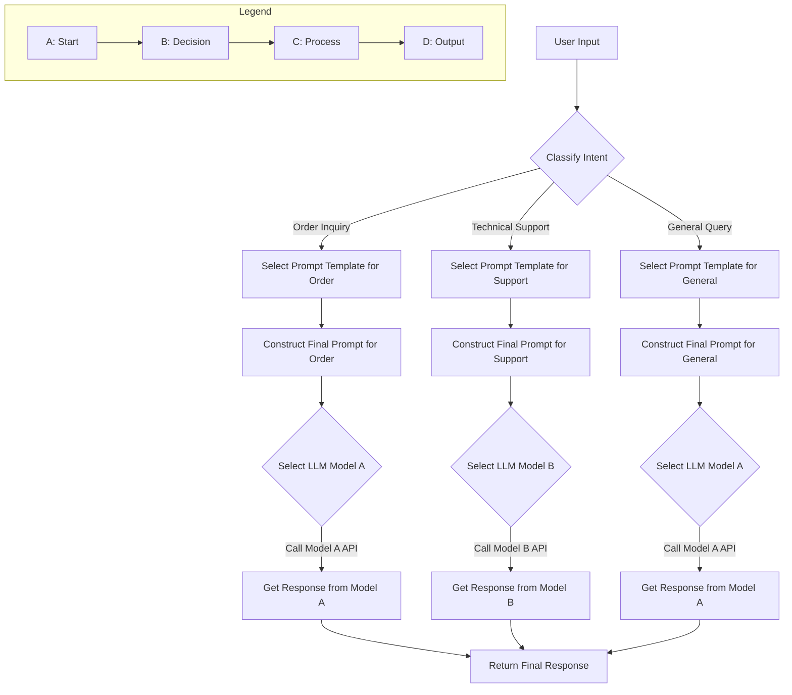

LLM (Large Language Model) 기반 애플리케이션의 성능과 효율성을 극대화하기 위해서는 다양한 사용자 입력과 상황에 맞춰 최적의 프롬프트와 LLM 모델을 동적으로 선택하는 시스템 설계가 필수적입니다. 이를 '동적 프롬프트 라우팅'이라고 하며, 이는 LLM 오케스트레이션의 핵심 요소입니다. 정적인 프롬프트와 단일 모델에 의존하는 방식은 확장성, 비용 효율성, 그리고 사용자 경험 측면에서 한계를 드러낼 수밖에 없습니다.

## 동적 프롬프트 라우팅의 필요성

LLM 애플리케이션은 종종 넓은 범위의 사용 사례를 커버해야 합니다. 예를 들어, 고객 서비스 챗봇은 단순 Q&A, 주문 조회, 기술 지원 요청 등 다양한 유형의 질의를 처리해야 합니다. 각 질의 유형에 따라 요구되는 LLM의 특성(예: 비용 효율성, 정확도, 추론 능력)과 최적의 프롬프트는 달라집니다. 동적 라우팅은 이러한 복잡성을 관리하고 다음과 같은 이점을 제공합니다:

*   **비용 최적화 (Cost Optimization)**: 저렴하고 빠른 경량 모델을 사용하여 간단한 질의를 처리하고, 더 비싸고 강력한 모델은 복잡한 질의에만 할당하여 전체 비용을 절감합니다.
*   **성능 향상 (Performance Improvement)**: 특정 작업에 최적화된 모델과 프롬프트를 사용하여 응답 속도와 품질을 개선합니다.
*   **유연성 및 확장성 (Flexibility & Scalability)**: 새로운 모델이나 프롬프트 템플릿을 쉽게 통합하고, 애플리케이션의 요구사항 변화에 따라 라우팅 로직을 조정할 수 있습니다.
*   **환각 감소 (Hallucination Reduction)**: 특정 도메인이나 작업에 특화된 프롬프트와 모델을 사용하여 부정확한 정보 생성 위험을 줄입니다.

## 핵심 오케스트레이션 패턴

동적 프롬프트 라우팅을 구현하기 위한 몇 가지 주요 오케스트레이션 패턴은 다음과 같습니다.

### 1. 규칙 기반 라우팅 (Rule-Based Routing)

가장 간단한 형태로, 사전 정의된 규칙 세트에 따라 프롬프트와 모델을 라우팅합니다. 예를 들어, 사용자 입력에 특정 키워드가 포함되거나, 입력 길이가 특정 임계값을 초과하는 경우 다른 경로로 라우팅합니다.

*   **장점**: 구현이 간단하고 예측 가능하며, 비용이 저렴합니다.
*   **단점**: 규칙이 많아질수록 관리하기 어렵고, 복잡하거나 미묘한 사용자 의도를 파악하기 어렵습니다.

### 2. LLM 기반 라우터 (LLM-as-Router)

별도의 경량 LLM (또는 강력한 LLM의 일부)을 '라우터'로 활용하여 사용자 입력의 의도를 분류하고, 이에 따라 적절한 프롬프트 템플릿과 타겟 LLM 모델을 선택하도록 합니다. 라우터 LLM은 'few-shot' 예제를 통해 다양한 의도를 파악하도록 학습될 수 있습니다.

*   **장점**: 복잡하고 미묘한 사용자 의도도 유연하게 처리할 수 있으며, 규칙 기반 시스템보다 유지보수가 용이합니다.
*   **단점**: 추가적인 LLM 호출이 발생하여 지연 시간(latency)과 비용이 증가할 수 있습니다. 라우터 LLM 자체의 성능에 의존적입니다.

### 3. 하이브리드 라우팅 (Hybrid Routing)

규칙 기반과 LLM 기반 라우팅을 결합하여 양쪽의 장점을 취합니다. 예를 들어, 명확하고 자주 발생하는 케이스는 규칙 기반으로 빠르게 처리하고, 모호하거나 복잡한 케이스는 LLM 라우터에 위임합니다.

### 4. 강화 학습 기반 라우팅 (Reinforcement Learning for Routing)

장기적인 관점에서 라우팅 결정을 최적화하기 위해 강화 학습(RL)을 적용할 수 있습니다. 각 라우팅 결정이 가져온 결과(예: 사용자 만족도, 비용, 응답 시간)를 보상으로 사용하여 라우팅 정책을 지속적으로 개선합니다.

*   **장점**: 시간에 따라 가장 효율적인 라우팅 전략을 자율적으로 학습하고 적응합니다.
*   **단점**: 구현의 복잡성이 매우 높고, 학습을 위한 대량의 데이터와 피드백 시스템이 필요합니다.

## 구현 예시: 간단한 Python LLM 라우터

다음은 LLM 라우터를 사용하여 사용자 입력에 따라 다른 프롬프트와 '모델'을 선택하는 Python 예시입니다. 여기서는 '모델'을 단순히 함수로 표현합니다.

```python
import json

def model_a_handler(prompt: str) -> str:
    return f"Model A processed: (prompt)"

def model_b_handler(prompt: str) -> str:
    return f"Model B processed with extra context: (prompt) (additional info)"

def classify_intent_mock_llm(user_input: str) -> str:
    # Simulate an LLM classifying user intent
    if "order" in user_input.lower() or "delivery" in user_input.lower():
        return "order_inquiry"
    elif "support" in user_input.lower() or "issue" in user_input.lower():
        return "technical_support"
    else:
        return "general_query"

def get_prompt_template(intent: str) -> str:
    templates = {
        "order_inquiry": "You are a helpful assistant for order inquiries. User: (user_input) What is the status of their order?",
        "technical_support": "You are a technical support agent. Provide solutions for: (user_input)",
        "general_query": "Answer the user's question directly: (user_input)"
    }
    return templates.get(intent, templates["general_query"])

def get_target_model(intent: str):
    model_map = {
        "order_inquiry": model_a_handler, # Cheaper, faster model for simple tasks
        "technical_support": model_b_handler, # More capable model for complex tasks
        "general_query": model_a_handler
    }
    return model_map.get(intent, model_a_handler)

def dynamic_llm_router(user_input: str) -> str:
    intent = classify_intent_mock_llm(user_input)
    prompt_template = get_prompt_template(intent)
    target_model_handler = get_target_model(intent)

    final_prompt = prompt_template.replace("(user_input)", user_input)
    response = target_model_handler(final_prompt)
    return f"Intent: (intent), Response: (response)"

# Test cases
print(dynamic_llm_router("Where is my order?"))
print(dynamic_llm_router("I have an issue with my login"))
print(dynamic_llm_router("Tell me about the weather"))
```

이 예시에서 `classify_intent_mock_llm` 함수는 실제 LLM 라우터가 수행할 의도 분류를 시뮬레이션합니다. 분류된 의도에 따라 `get_prompt_template`에서 적절한 프롬프트 템플릿을 선택하고, `get_target_model`에서 해당 의도에 가장 적합한 모델 핸들러(실제 LLM API 호출)를 반환합니다. 이처럼 동적으로 프롬프트를 구성하고 모델을 스위칭하는 것이 동적 프롬프트 라우팅의 핵심입니다.

## 동적 프롬프트 라우팅 흐름 (Mermaid Diagram)



## 트레이드오프

*   **복잡성 증가 (Increased Complexity)**
    *   **언제 나쁜지**: 초기 개발 단계이거나 애플리케이션의 사용 사례가 매우 제한적인 경우, 동적 라우팅을 도입하는 것은 불필요한 오버헤드를 유발할 수 있습니다. 라우팅 로직, 프롬프트 관리, 모델 선택 기준 등을 설정하고 유지보수하는 데 추가 리소스가 필요합니다.
    *   **언제 좋은지**: 다양한 사용자 입력, 모델 비용/성능 최적화가 필수적인 대규모 프로덕션 환경에서는 초기 복잡성을 감수할 만한 가치가 있습니다. 장기적인 운영 비용 절감 및 성능 향상에 기여합니다.

*   **추가 지연 시간 (Additional Latency)**
    *   **언제 나쁜지**: 실시간 응답이 최우선이거나, 라우터 LLM의 호출 시간이 길 경우 전체 응답 시간이 눈에 띄게 길어질 수 있습니다. 특히 LLM-as-Router 패턴에서 라우터 LLM 호출 자체가 병목이 될 수 있습니다.
    *   **언제 좋은지**: 라우터 LLM이 경량 모델이거나 캐싱 전략이 잘 구현되어 지연 시간이 미미한 경우, 혹은 응답 품질과 비용 최적화가 지연 시간보다 중요한 시나리오에서 유리합니다.

*   **비용 최적화 가능성 (Cost Optimization Potential)**
    *   **언제 좋은지**: 트래픽이 많고 다양한 LLM 모델(비용 효율성이 다른)을 사용할 수 있는 경우, 동적 라우팅은 값비싼 고급 모델의 사용을 최소화하여 총 운영 비용을 크게 절감할 수 있습니다.
    *   **언제 나쁜지**: 단일 저비용 모델만 사용하거나 트래픽이 적은 경우에는 비용 절감 효과가 미미할 수 있습니다. 오히려 라우팅 로직을 운영하는 데 드는 비용이 더 클 수 있습니다.

*   **유연성 및 유지보수성 (Flexibility & Maintainability)**
    *   **언제 좋은지**: 새로운 모델, 프롬프트 템플릿, 또는 사용자 의도 분류 기준이 자주 변경될 가능성이 있는 경우, 동적 라우팅은 시스템의 유연성을 높여 변화에 빠르게 대응할 수 있게 합니다. 중앙화된 라우팅 로직으로 관리가 용이합니다.
    *   **언제 나쁜지**: 변경 사항이 거의 없고 시스템이 고정적인 경우, 동적 라우팅의 이점보다는 복잡성만 부각될 수 있습니다.

## 실전 체크리스트

동적 프롬프트 라우팅 패턴을 프로젝트에 적용할 때 다음 항목들을 검증합니다.

- [ ] **의도 분류 정확도 측정**: 사용자 입력 의도를 분류하는 라우터(규칙 기반 또는 LLM 기반)의 정확도를 주기적으로 측정하고, 임계치 (예: 90% 이상) 미달 시 재학습 또는 로직 개선 계획을 수립합니다.
- [ ] **모델별 비용-성능 프로파일링**: 각 LLM 모델의 API 호출 비용, 응답 시간, 품질(정확도)을 정량적으로 프로파일링하고, 라우팅 결정 기준에 반영될 수 있는 메트릭을 확보합니다.
- [ ] **프롬프트 템플릿 버전 관리**: 동적으로 선택되는 프롬프트 템플릿들을 버전 관리하고, 변경 이력 및 A/B 테스트 결과를 추적하여 최적의 템플릿을 식별합니다.
- [ ] **라우팅 로직의 모니터링 및 로깅**: 어떤 의도가 얼마나 자주 분류되며, 어떤 모델과 프롬프트가 선택되었는지에 대한 상세 로깅 시스템을 구축하여 라우팅 결정 과정을 투명하게 관찰합니다.
- [ ] **폴백(Fallback) 전략 구현**: 라우터가 의도를 분류하지 못하거나, 선택된 모델이 오류를 반환할 경우를 대비하여 기본 프롬프트/모델 또는 사용자에게 재질의하는 폴백 메커니즘을 구현합니다.
- [ ] **지연 시간(Latency) 영향 분석**: 동적 라우팅 도입 전후의 평균 응답 시간을 측정하고, 추가 지연 시간이 사용자 경험에 미치는 영향을 분석하여 허용 가능한 수준을 유지합니다.
- [ ] **A/B 테스트 환경 구축**: 새로운 라우팅 규칙, 프롬프트 템플릿, 또는 모델 선택 전략을 점진적으로 배포하고 효과를 측정할 수 있는 A/B 테스트 환경을 구성합니다.