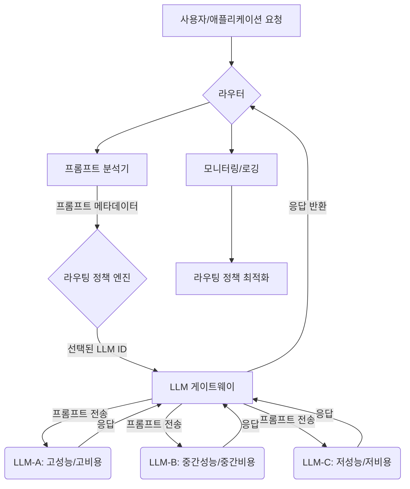

멀티 LLM 환경에서 동적 프롬프트 라우팅(Dynamic Prompt Routing)은 애플리케이션의 비용 효율성과 성능을 극대화하기 위한 핵심 전략입니다. 다양한 LLM은 각기 다른 특성(비용, 응답 속도, 특정 작업에 대한 전문성, 토큰 한계)을 가지며, 단일 모델에 의존하는 것은 비효율적일 수 있습니다. 동적 라우팅은 들어오는 프롬프트의 특성과 요구 사항에 따라 가장 적합한 LLM을 실시간으로 선택하여, 최적의 결과와 운영 효율성을 보장합니다.

## 핵심 개념 및 필요성
동적 프롬프트 라우팅은 단순한 로드 밸런싱을 넘어섭니다. 이는 프롬프트 콘텐츠 분석, 사용자 컨텍스트, 비용 제약, 성능 목표 등을 종합적으로 고려하여 AI 시스템의 '지능적인 의사결정'을 가능하게 합니다.

*   **비용 최적화 (Cost Optimization)**: 저렴하지만 성능이 우수한 모델을 특정 작업에 우선 배정하고, 고비용/고성능 모델은 복잡하고 중요한 작업에만 사용합니다.
*   **성능 향상 (Performance Enhancement)**: 응답 속도가 중요한 작업에는 빠르고 경량화된 모델을, 정확도가 중요한 작업에는 더 강력한 모델을 활용하여 전체 시스템의 처리량을 높입니다.
*   **전문성 활용 (Leveraging Specialization)**: 코드 생성, 요약, 번역 등 특정 도메인에 특화된 모델이 있다면, 해당 프롬프트를 전문 모델로 라우팅하여 결과 품질을 향상시킵니다.
*   **탄력성 및 확장성 (Resilience & Scalability)**: 특정 LLM의 과부하 또는 장애 발생 시, 자동으로 다른 모델로 전환하여 서비스 연속성을 유지합니다.

## 동적 라우팅 아키텍처
동적 프롬프트 라우팅은 일반적으로 다음과 같은 구성 요소를 포함합니다.

1.  **라우터 (Router)**: 모든 인바운드 프롬프트를 수신하고 분석하여, 어떤 LLM으로 전달할지 결정하는 핵심 모듈입니다.
2.  **프롬프트 분석기 (Prompt Analyzer)**: 프롬프트의 내용, 길이, 의도(intent), 키워드 등을 분석하여 라우팅 결정을 위한 메타데이터를 생성합니다. 이는 ML 모델, 정규 표현식, 또는 간단한 키워드 매칭으로 구현될 수 있습니다.
3.  **LLM 풀 (LLM Pool)**: 사용할 수 있는 다양한 LLM 인스턴스들의 집합입니다. 각 LLM은 모델명, 비용, 응답 속도, 전문 도메인 등의 메타데이터를 가집니다.
4.  **라우팅 정책 (Routing Policy)**: 프롬프트 분석 결과와 LLM 풀의 메타데이터를 기반으로 최적의 LLM을 선택하는 로직입니다. 규칙 기반(Rule-based), 머신러닝 기반(ML-based), 또는 하이브리드 접근 방식을 사용할 수 있습니다.
5.  **모니터링 및 로깅 (Monitoring & Logging)**: 각 프롬프트가 어떤 LLM으로 라우팅되었는지, 해당 LLM의 성능과 비용은 어땠는지 기록하고 모니터링하여 라우팅 정책을 지속적으로 개선합니다.



## 구현 세부 사항

### 프롬프트 분석 및 의도 파악
동적 라우팅의 첫 단계는 들어오는 프롬프트의 `의도(intent)`를 정확히 파악하는 것입니다.
*   **키워드 매칭 (Keyword Matching)**: "코드 작성", "요약해줘", "번역" 등의 명시적 키워드를 통해 의도를 파악합니다.
*   **정규 표현식 (Regular Expressions)**: 특정 형식의 데이터(예: 이메일 주소, 날짜)를 포함하는지 여부로 라우팅 기준을 설정합니다.
*   **경량 LLM을 활용한 분류 (Lightweight LLM Classification)**: 작은 규모의 LLM(예: `GPT-3.5-turbo` 또는 `Gemini Nano`)을 사용하여 프롬프트의 카테고리나 의도를 분류합니다. 이는 더 강력한 모델로 라우팅하기 전의 전처리 단계로 활용될 수 있습니다.

```python
import json
from typing import Dict, Any, List

class LLMService:
    def __init__(self, name: str, cost_per_token: float, speed_score: int, capabilities: List[str]):
        self.name = name
        self.cost_per_token = cost_per_token
        self.speed_score = speed_score # Higher is faster
        self.capabilities = capabilities

    def process_prompt(self, prompt: str) -> str:
        # Simulate LLM processing
        print(f"Processing '{prompt[:30]}...' with {self.name}")
        return f"Response from {self.name} for: {prompt}"

class DynamicPromptRouter:
    def __init__(self, llm_services: List[LLMService]):
        self.llm_services = {service.name: service for service in llm_services}
        self.routing_rules = {
            "code_generation": "expensive_fast_llm",
            "summarization": "cheap_slow_llm",
            "translation": "medium_llm",
            "default": "medium_llm" # Ensure 'default' points to an existing service
        }
        self.llm_metrics = {
            "expensive_fast_llm": {"cost": 0.002, "speed": 10},
            "medium_llm": {"cost": 0.0005, "speed": 5},
            "cheap_slow_llm": {"cost": 0.0001, "speed": 2}
        }

    def analyze_prompt(self, prompt: str) -> Dict[str, Any]:
        metadata = {"intent": "default", "length": len(prompt)}
        if "generate code" in prompt.lower() or "write a function" in prompt.lower():
            metadata["intent"] = "code_generation"
        elif "summarize" in prompt.lower() or "요약해줘" in prompt.lower():
            metadata["intent"] = "summarization"
        elif "translate" in prompt.lower() or "번역해줘" in prompt.lower():
            metadata["intent"] = "translation"
        # Additional logic for length, complexity etc.
        return metadata

    def choose_llm(self, prompt_metadata: Dict[str, Any]) -> LLMService:
        intent = prompt_metadata.get("intent", "default")
        
        # Rule-based routing
        chosen_llm_name = self.routing_rules.get(intent, "default")

        # Advanced routing (e.g., performance or cost-based)
        # For simplicity, we'll use the rule-based chosen_llm_name for now.
        # In a real system, you might iterate through available LLMs
        # based on real-time load, cost, speed_score, etc.
        
        selected_llm = self.llm_services.get(chosen_llm_name)
        
        # Fallback if the chosen_llm_name (from rules) doesn't match an actual service, use a safe default
        if selected_llm is None and "default" in self.llm_services:
            selected_llm = self.llm_services["default"]
        elif selected_llm is None:
            raise ValueError("No default LLM service available and chosen LLM not found.")
            
        return selected_llm

    def route_and_process(self, prompt: str) -> str:
        prompt_metadata = self.analyze_prompt(prompt)
        selected_llm = self.choose_llm(prompt_metadata)
        
        print(f"Routing prompt (intent: {prompt_metadata['intent']}) to {selected_llm.name}")
        return selected_llm.process_prompt(prompt)

# Initialize LLM Services
llm_expensive_fast = LLMService("expensive_fast_llm", 0.002, 10, ["code_generation", "complex_reasoning"])
llm_medium = LLMService("medium_llm", 0.0005, 5, ["general_purpose", "translation"])
llm_cheap_slow = LLMService("cheap_slow_llm", 0.0001, 2, ["summarization", "simple_qa"])

llm_services_list = [llm_expensive_fast, llm_medium, llm_cheap_slow]
router = DynamicPromptRouter(llm_services_list)

# Test cases
print(router.route_and_process("Generate code for a Python class that manages user data."))
print(router.route_and_process("Summarize this long document for me."))
print(router.route_and_process("Translate 'Hello, world!' to Korean."))
print(router.route_and_process("What is the capital of France?"))
```

### LLM 선택 로직 및 폴백 전략
LLM 선택은 정적 규칙 외에도 동적인 요소를 고려할 수 있습니다.
*   **실시간 지표 기반 (Real-time Metric-based)**: 각 LLM의 현재 응답 시간, 오류율, 비용, 그리고 API 호출 제한(Rate Limit)을 모니터링하여 최적의 모델을 선택합니다. Prometheus, Grafana와 같은 도구를 활용하여 메트릭을 수집하고 분석할 수 있습니다.
*   **강화 학습 (Reinforcement Learning)**: 장기적인 비용-성능 최적화를 위해 과거 라우팅 결정의 성공/실패 데이터를 바탕으로 라우팅 정책을 학습시킬 수 있습니다.
*   **폴백 메커니즘 (Fallback Mechanism)**: 선택된 LLM이 응답하지 않거나 오류를 반환할 경우, 자동으로 다른 LLM으로 전환하는 강력한 폴백 전략이 필수적입니다. 이는 시스템의 견고성(Robustness)을 크게 향상시킵니다. 예를 들어, 고성능 모델이 실패하면 중간 성능 모델로, 그것마저 실패하면 저성능 모델로 순차적으로 전환하는 계층적 폴백을 구현할 수 있습니다.

## 트레이드오프

### 1. 복잡성 vs. 최적화 (Complexity vs. Optimization)
*   **언제 좋고**: 다양한 LLM의 특성을 최대한 활용하여 비용을 절감하고 성능을 극대화할 때 매우 효과적입니다. 특히 대규모 트래픽과 다양한 LLM 사용 패턴이 있는 환경에서 큰 이점을 제공합니다.
*   **언제 나쁜지**: 라우팅 로직, 모니터링, 폴백 시스템 구현 및 유지보수에 상당한 엔지니어링 리소스가 필요합니다. 초기 개발 및 운영 복잡성이 증가하므로, 소규모 프로젝트나 단일 LLM으로 충분한 경우에는 과도한 설계일 수 있습니다.

### 2. 레이턴시 vs. 정확도 (Latency vs. Accuracy)
*   **언제 좋고**: 라우팅 결정 자체가 추가적인 레이턴시를 발생시키지만, 이를 통해 전반적인 응답 시간을 단축하거나 특정 작업의 정확도를 높일 수 있습니다. 예를 들어, 빠른 응답이 필요한 간단한 질문은 저지연 LLM으로, 복잡한 추론은 고정확도 LLM으로 라우팅하여 평균적인 사용자 경험을 개선합니다.
*   **언제 나쁜지**: 라우팅 결정 로직이 비효율적이거나 너무 복잡하면, 라우팅 과정 자체에서 발생하는 오버헤드가 LLM 호출의 이점을 상쇄하고 전반적인 레이턴시를 증가시킬 수 있습니다. 특히 매우 낮은 지연 시간이 요구되는 실시간 애플리케이션에서는 신중한 설계가 필요합니다.

### 3. 유지보수성 vs. 유연성 (Maintainability vs. Flexibility)
*   **언제 좋고**: 새로운 LLM이 출시되거나 기존 LLM의 비용/성능이 변경될 때, 라우팅 정책만 업데이트하여 시스템 전체를 유연하게 대응할 수 있습니다. 특정 LLM에 종속되지 않는 아키텍처를 구축하여 장기적인 유지보수 비용을 줄일 수 있습니다.
*   **언제 나쁜지**: 라우팅 정책이 너무 자주 변경되거나, LLM 풀의 변동성이 크면 라우팅 로직의 테스트와 검증이 어려워지고, 의도치 않은 동작을 유발할 수 있습니다. 정책 관리 및 배포 프로세스가 정교하지 않으면 유지보수 부담이 커집니다.

### 4. 비용 모니터링 vs. 복잡성 관리 (Cost Monitoring vs. Complexity Management)
*   **언제 좋고**: 각 프롬프트 요청에 대한 LLM별 비용을 정확하게 추적하고 분석할 수 있어, 예산 관리에 매우 유리합니다. 이를 통해 비용 최적화 목표를 달성했는지 명확하게 검증할 수 있습니다.
*   **언제 나쁜지**: 정밀한 비용 모니터링 및 분석 시스템을 구축하는 것 자체가 추가적인 인프라 및 개발 비용을 발생시킵니다. 또한, 다양한 LLM 공급업체별 과금 체계를 통합하여 관리하는 것은 상당한 복잡성을 수반합니다.

## 실전 체크리스트

동적 프롬프트 라우팅을 프로덕션 환경에 적용하기 위한 실전 체크리스트입니다.

- [ ] **라우팅 정책 명확화**: 애플리케이션의 핵심 유스케이스별로 어떤 LLM을, 어떤 기준으로 선택할지 명확한 규칙을 정의했는가? (예: 비용, 속도, 정확도, 특정 기능)
- [ ] **프롬프트 메타데이터 추출 정교화**: 프롬프트에서 의도, 길이, 복잡성, 키워드 등의 메타데이터를 안정적으로 추출하는 메커니즘(경량 LLM, 정규 표현식, 키워드 매칭 등)을 구현하고 충분히 테스트했는가?
- [ ] **자동화된 LLM 헬스 체크 및 폴백**: 각 LLM 서비스의 가용성(availability)과 응답 지연(latency)을 실시간으로 모니터링하고, 장애 발생 시 자동으로 다른 LLM으로 전환되는 견고한 폴백 시스템을 구축했는가?
- [ ] **비용 및 성능 모니터링 대시보드 구축**: 라우팅된 프롬프트별 LLM 사용량, 비용, 응답 시간, 성공률 등을 시각화하여 운영 효율성을 지속적으로 확인할 수 있는 대시보드를 마련했는가?
- [ ] **라우팅 정책 A/B 테스트 환경**: 새로운 라우팅 정책이나 LLM 추가 시, 실제 트래픽의 일부를 사용하여 성능 및 비용 영향을 측정하고 검증할 수 있는 A/B 테스트 환경이 준비되었는가?
- [ ] **보안 및 규정 준수**: 민감한 데이터 처리 시 특정 LLM으로의 라우팅이 데이터 주권, 개인정보 보호(GDPR, CCPA 등), 기업 보안 정책을 준수하도록 설계되었는가? (예: 온프레미스 LLM 우선 라우팅)
- [ ] **버전 관리 및 배포 전략**: 라우팅 정책, 프롬프트 분석 로직, LLM 엔드포인트 설정 등 핵심 구성 요소에 대한 버전 관리(Version Control) 시스템과 안전한 배포(Deployment) 전략을 수립했는가?