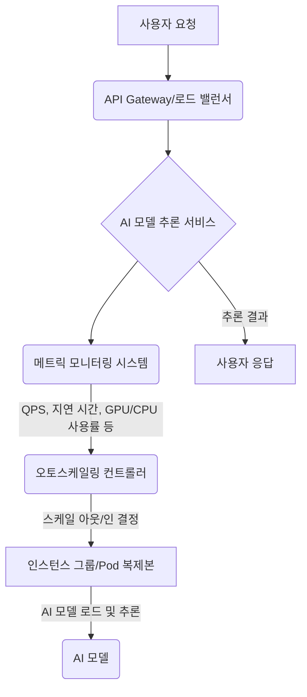

AI 모델 배포에서 변화하는 트래픽 부하에 유연하게 대응하고 자원 효율성을 극대화하는 것은 핵심 과제입니다. 특히 LLM(Large Language Model)과 같은 고비용 AI 모델의 경우, 요청량에 따라 컴퓨팅 자원을 동적으로 조절하는 동적 스케일링(Dynamic Scaling) 하네스(Harness) 구현은 운영 비용 절감과 서비스 안정성 확보에 필수적입니다.

## 동적 스케일링의 필요성

AI 모델 추론(inference) 서비스는 종종 예측 불가능한 트래픽 패턴을 보입니다. 특정 시간대에 요청이 급증하거나, 이벤트성으로 트래픽이 폭주할 수 있습니다. 이러한 상황에서 고정된 자원을 유지하면 자원 낭비(over-provisioning) 또는 서비스 지연/실패(under-provisioning)로 이어집니다. 동적 스케일링 하네스는 이러한 문제를 해결하여 트래픽 변화에 따라 AI 모델 서빙 인스턴스 수를 자동으로 조절, 최적의 자원 활용과 안정적인 서비스 품질을 보장합니다.

## 핵심 개념 및 구성 요소

동적 스케일링 하네스는 다음과 같은 핵심 개념과 구성 요소로 이루어집니다.

### 1. 메트릭 모니터링 (Metrics Monitoring)

스케일링 결정을 위한 데이터 소스입니다. 주요 메트릭은 다음과 같습니다.

*   **QPS (Queries Per Second)**: 초당 요청 수
*   **Latency**: 평균 응답 시간
*   **GPU/CPU Utilization**: GPU 또는 CPU 사용률
*   **Memory Usage**: 메모리 사용량
*   **Queue Length**: 처리 대기 중인 요청 큐 길이 (비동기 워크로드의 경우)

Prometheus, Grafana, CloudWatch, Stackdriver 같은 도구들이 활용됩니다.

### 2. 스케일링 트리거 (Scaling Triggers)

메트릭 값이 미리 정의된 임계값(threshold)을 넘어서거나 특정 조건을 만족할 때 스케일링을 시작합니다.

*   **임계값 기반 (Threshold-based)**: CPU 사용률이 70%를 초과하면 스케일 아웃(Scale-out)
*   **대상 추적 기반 (Target Tracking-based)**: 특정 메트릭(예: QPS)을 목표 값(예: 100 QPS/Instance)으로 유지하도록 스케일링
*   **예측 기반 (Predictive)**: 과거 트래픽 패턴을 학습하여 미래 트래픽을 예측하고 미리 자원을 프로비저닝(pre-provisioning)

### 3. 스케일링 정책 (Scaling Policies)

트리거 발생 시 어떻게 자원을 조절할지 정의합니다.

*   **스텝 스케일링 (Step Scaling)**: 단계별로 N개의 인스턴스/파드를 추가하거나 제거합니다.
*   **심플 스케일링 (Simple Scaling)**: 특정 트리거에 대응하여 한 번의 스케일링 액션을 수행합니다.
*   **쿨다운 기간 (Cooldown Period)**: 스케일링 액션 후 다음 스케일링 액션까지 대기하는 시간으로, 과도한 스케일링을 방지합니다.

### 4. 로드 밸런싱 및 라우팅 (Load Balancing & Routing)

새롭게 추가된 인스턴스로 트래픽을 효율적으로 분산하고, 트래픽 유형에 따라 적절한 모델 또는 인스턴스로 요청을 전달합니다. Nginx, Envoy, AWS ALB/NLB, Kubernetes Ingress/Service 등이 사용됩니다.

### 5. 우아한 종료 (Graceful Shutdown)

스케일 다운(Scale-down) 시 기존 요청을 안전하게 처리하고 새로운 요청을 받지 않도록 인스턴스를 종료합니다. 이를 통해 진행 중이던 추론 작업이 중단되거나 데이터 손실이 발생하는 것을 방지합니다.

## 동적 스케일링 하네스 구현 패턴

### 1. Kubernetes HPA (Horizontal Pod Autoscaler) 활용

Kubernetes 환경에서 가장 기본적인 동적 스케일링 메커니즘입니다. CPU, Memory 같은 기본 메트릭을 기반으로 Pod 수를 조절하며, Custom Metrics API를 통해 QPS, GPU 사용률 등 사용자 정의 메트릭으로 확장할 수 있습니다.

### 2. KEDA (Kubernetes Event-driven Autoscaling) 통합

KEDA는 HPA를 확장하여 다양한 이벤트 소스(Kafka, RabbitMQ, SQS, Prometheus, MLflow 등)를 기반으로 Kubernetes 워크로드를 스케일링할 수 있게 합니다. AI 모델 배포 시 비동기 추론 큐 길이, 배치 처리 대기열 등 복잡한 조건에 따라 스케일링이 필요한 경우 매우 유용합니다.

```yaml
apiVersion: keda.sh/v1alpha1
kind: ScaledObject
metadata:
  name: ai-model-inference-scaler
  namespace: default
spec:
  scaleTargetRef:
    apiVersion: apps/v1
    kind: Deployment
    name: ai-inference-deployment
  pollingInterval: 30 # KEDA가 메트릭 소스를 폴링하는 주기 (초)
  cooldownPeriod: 300 # 스케일 다운 후 다음 스케일링까지 대기하는 시간 (초)
  minReplicaCount: 1 # 최소 Pod 수 (콜드 스타트 방지 목적)
  maxReplicaCount: 10 # 최대 Pod 수
  triggers:
  - type: prometheus
    metadata:
      serverAddress: http://prometheus-kube-prometheus-oper-prometheus.monitoring.svc.cluster.local:9090
      metricName: model_inference_qps_total
      threshold: "100" # QPS가 100을 초과하면 스케일 아웃
      query: |
        sum(rate(model_inference_requests_total{deployment="ai-inference-deployment"}[1m]))
  - type: aws-sqs # 비동기 워크로드를 위한 SQS 큐 기반 스케일링
    metadata:
      queueURL: "https://sqs.ap-northeast-2.amazonaws.com/123456789012/my-ai-inference-queue"
      queueLength: "5" # 큐 메시지가 5개 이상이면 스케일 아웃
      awsRegion: "ap-northeast-2"
      identityOwner: "pod" # IAM Role for Service Account (IRSA) 사용
```

### 3. 클라우드 관리형 서비스 활용 (AWS SageMaker, Google Cloud AI Platform)

클라우드 벤더가 제공하는 관리형 서비스를 활용하면 스케일링 로직 구현 및 인프라 관리에 대한 부담을 크게 줄일 수 있습니다. 이들 서비스는 대부분 Auto Scaling 기능을 내장하고 있으며, 모델 서빙에 최적화된 메트릭을 제공합니다.

### 4. 사용자 정의 스케일링 로직 (Custom Scaling Logic)

매우 특수한 스케일링 요구사항이 있거나 특정 클라우드 벤더에 종속되는 것을 피하고 싶을 때 사용됩니다. 클라우드 제공사의 API (AWS Auto Scaling Group, Azure Scale Sets, GCP Managed Instance Groups)를 직접 제어하는 스케일링 컨트롤러를 구현하거나, 메시지 큐와 같은 이벤트 기반 아키텍처를 기반으로 스케일링 로직을 설계할 수 있습니다.

## 동적 스케일링 하네스 동작 흐름



2026년 최신 트렌드를 반영할 때, LLM의 등장으로 인한 높은 컴퓨팅 비용과 긴 응답 시간 요구사항은 동적 스케일링 하네스에 더 정교한 기능을 요구합니다. 멀티-모델 서빙(Multi-model Serving)을 위한 동적 라우팅, 비용 최적화를 위한 스팟 인스턴스(Spot Instance) 활용, 콜드 스타트(Cold Start) 최소화를 위한 Pre-warming 또는 모델 레이어 캐싱(Layer Caching) 전략 등이 중요하게 고려됩니다.

## 트레이드오프

동적 스케일링 하네스 구현에는 여러 트레이드오프가 존재하며, 프로젝트의 특정 요구사항에 맞춰 신중하게 선택해야 합니다.

*   **비용 효율성 vs. 응답 지연 (Cost Efficiency vs. Latency)**
    *   **언제 좋고**: 자원 사용량을 최소화하여 비용을 절감하고자 할 때 좋습니다. 유휴 인스턴스 수를 줄여 비용을 아낄 수 있습니다.
    *   **언제 나쁜지**: 트래픽 급증 시 새로운 인스턴스가 준비되는 동안 콜드 스타트(Cold Start)로 인한 응답 지연이 발생할 수 있습니다. 실시간성이 매우 중요한 서비스에는 불리합니다.

*   **구현 복잡성 vs. 제어 유연성 (Implementation Complexity vs. Control Flexibility)**
    *   **언제 좋고**: 특정 클라우드 서비스에 종속되지 않고, 매우 세밀한 스케일링 로직이나 최적화가 필요할 때 좋습니다. 사용자 정의 메트릭과 로직을 통한 완벽한 제어가 가능합니다.
    *   **언제 나쁜지**: 개발 및 운영에 더 많은 시간과 전문 지식이 필요합니다. 관리형 서비스에 비해 초기 설정 및 유지보수 부담이 큽니다.

*   **정확도 vs. 오버슈트/언더슈트 (Accuracy vs. Overshoot/Undershoot)**
    *   **언제 좋고**: 예측 기반 스케일링과 같이 정교한 분석을 통해 자원 요구량을 정확하게 예측할 수 있을 때 좋습니다. 자원 낭비와 부족을 동시에 줄일 수 있습니다.
    *   **언제 나쁜지**: 트래픽 패턴이 불규칙하거나 예측 모델의 정확도가 낮을 경우, 필요 이상의 자원을 프로비저닝(Overshoot)하거나 부족하게 프로비저닝(Undershoot)하여 비효율을 초래할 수 있습니다.

*   **반응성 vs. 안정성 (Responsiveness vs. Stability)**
    *   **언제 좋고**: 스케일링 정책의 반응성을 높여 트래픽 변화에 즉각적으로 대응해야 할 때 좋습니다. 빠르게 자원을 확보하여 서비스 품질 저하를 방지할 수 있습니다.
    *   **언제 나쁜지**: 너무 민감하게 반응하는 스케일링 정책은 '스래싱(Thrashing)' 현상(잦은 스케일 업/다운 반복)을 유발하여 시스템 불안정성과 불필요한 비용 증가를 초래할 수 있습니다.

## 실전 체크리스트

AI 모델 배포를 위한 동적 스케일링 하네스를 프로젝트에 적용할 때 다음 항목들을 검증해야 합니다.

- [ ] **핵심 메트릭 정의 및 수집**: QPS, GPU/CPU 사용률, 메모리, 지연 시간 등 AI 모델의 성능 및 자원 사용량과 직접적으로 관련된 핵심 메트릭이 정확히 정의되고 수집 파이프라인이 구축되었는가?
- [ ] **스케일링 정책 최적화**: 임계값 기반, 대상 추적 기반, 예측 기반 등 프로젝트의 트래픽 패턴에 가장 적합한 스케일링 정책이 선택되었으며, `minReplicaCount`, `maxReplicaCount`, `cooldownPeriod` 등이 최적의 값으로 설정되었는가?
- [ ] **콜드 스타트 최소화 전략**: 최소 인스턴스 유지(`min_replicas`), 모델 프리로딩(pre-loading), 컨테이너 이미지 최적화 등의 콜드 스타트(cold start) 최소화 전략이 효과적으로 적용되었으며 테스트를 통해 검증되었는가?
- [ ] **트래픽 부하 테스트**: 예상되는 트래픽 급증 및 급감 시뮬레이션을 통해 스케일링 지연(scaling lag) 및 오버슈트(overshoot)/언더슈트(undershoot) 발생 여부를 확인하고, 목표 SLA(Service Level Agreement)를 만족하는가?
- [ ] **비용 효율성 모니터링**: 유휴 자원 회수(resource reclamation) 메커니즘이 정상적으로 동작하는지, 불필요한 자원 낭비가 없는지 정기적으로 모니터링하고 분석하는 체계가 갖춰져 있는가?
- [ ] **AI 모델 버전 관리 및 A/B 테스트 통합**: 새로운 AI 모델 버전 배포 또는 A/B 테스트 환경에서 동적 스케일링이 원활하게 통합되어 작동하는지, 자원 할당이 공정하게 이루어지는지 테스트하였는가?
- [ ] **장애 복구 및 롤백 전략**: 스케일링 과정 또는 모델 자체의 문제로 서비스 장애가 발생했을 때, 안정적인 롤백(rollback) 및 페일오버(failover) 전략이 수립되어 있으며 실제 재해 복구 훈련(DR drill)을 통해 검증되었는가?