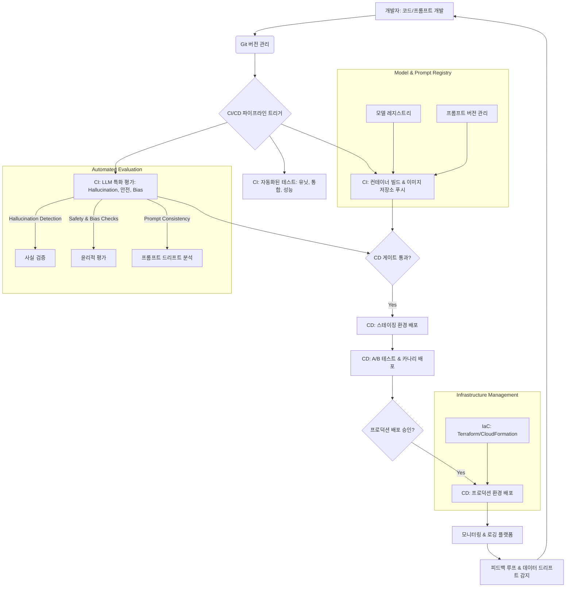

대규모 언어 모델(LLM) 애플리케이션의 성공적인 운영은 안정적이고 효율적인 배포 파이프라인 구축에 달려 있습니다. 일반적인 소프트웨어 배포와 달리 LLM은 모델 버전 관리, 프롬프트 엔지니어링, 데이터 드리프트, 그리고 환각(hallucination)과 같은 특수한 평가 지표 등 고유한 도전 과제를 안고 있습니다. 이러한 복잡성을 효과적으로 관리하기 위해 MLOps(Machine Learning Operations) 원칙을 LLM 워크플로우에 통합하는 것이 필수적입니다.

## LLM 애플리케이션 배포 파이프라인의 핵심 구성 요소

대규모 LLM 애플리케이션을 위한 배포 파이프라인은 다음과 같은 핵심 구성 요소들을 포함해야 합니다.

### 1. 코드 및 프롬프트 버전 관리

LLM 애플리케이션의 코드는 물론, 모델의 동작을 크게 좌우하는 프롬프트(prompt) 또한 Git과 같은 버전 관리 시스템으로 관리되어야 합니다. 프롬프트 변경 이력을 추적하고, 특정 버전으로 롤백할 수 있는 기능은 LLM 애플리케이션의 안정성을 확보하는 데 중요합니다.

### 2. 자동화된 빌드 및 컨테이너화

LLM 추론 서비스는 Docker와 같은 컨테이너 기술을 사용하여 빌드되고 컨테이너 레지스트리(예: Docker Hub, ECR, GCR)에 저장되어야 합니다. 이를 통해 환경 종속성을 최소화하고, 모든 환경에서 일관된 실행을 보장할 수 있습니다.

### 3. LLM 특화 테스트 및 평가

일반적인 유닛 및 통합 테스트 외에도 LLM의 특성을 고려한 평가가 자동화 파이프라인에 포함되어야 합니다. 이는 다음과 같은 항목들을 포함합니다.

*   **정확성(Accuracy)**: RAG(Retrieval-Augmented Generation) 시스템의 경우, 검색된 문서의 관련성 및 생성된 답변의 사실 여부.
*   **환각(Hallucination) 감지**: 모델이 존재하지 않는 정보를 생성하는지 여부를 탐지.
*   **안전성 및 편향(Safety & Bias)**: 유해하거나 편향된 콘텐츠 생성 여부.
*   **성능(Performance)**: 응답 시간(latency), 처리량(throughput), 자원 사용량.
*   **프롬프트 일관성**: 프롬프트 변경이 모델 출력에 의도한 영향을 미치는지 확인.

### 4. CI/CD (Continuous Integration/Continuous Delivery)

코드 및 프롬프트 변경이 발생하면 CI 파이프라인이 자동으로 트리거되어 빌드, 컨테이너화, 모든 테스트 및 평가를 실행합니다. 모든 단계가 성공하면, CD 파이프라인을 통해 스테이징 환경으로 배포하고, 추가적인 검증 후 프로덕션 환경으로 배포됩니다. 2026년 트렌드는 카나리 배포(Canary Deployment)나 A/B 테스트와 같은 점진적 배포 전략을 활용하여 위험을 최소화하는 것입니다.

### 5. 모니터링 및 관측 가능성 (Observability)

배포된 LLM 서비스의 상태, 성능, 비용, 그리고 모델의 출력 품질을 지속적으로 모니터링해야 합니다. 데이터 드리프트, 모델 성능 저하, 비정상적인 비용 발생 등을 감지하기 위한 지표를 설정하고, 임계치를 초과할 경우 알림을 받을 수 있도록 시스템을 구축해야 합니다.

### 6. 인프라스트럭처 관리 (Infrastructure as Code, IaC)

LLM 추론 서비스는 트래픽 변동에 따라 유연하게 확장되어야 하므로, Kubernetes, AWS Lambda, Google Cloud Run과 같은 클라우드 기반의 확장 가능한 인프라를 활용하는 것이 일반적입니다. Terraform, CloudFormation, Ansible 등 IaC 도구를 사용하여 인프라를 코드로 관리함으로써 일관성과 재현성을 확보합니다.

## 배포 파이프라인 예시 (Bash Script)

아래는 LLM 서비스의 컨테이너 이미지를 빌드하고 Amazon ECR에 푸시한 후, AWS ECS 서비스에 업데이트하는 간단한 배포 스크립트 예시입니다. 실제 프로덕션 환경에서는 CI/CD 시스템(예: GitLab CI, GitHub Actions) 내에서 실행됩니다.

```bash
#!/bin/bash
set -euxo pipefail

# 변수 설정 (실제 환경에서는 CI/CD 변수로 대체)
IMAGE_NAME="my-llm-inference-service"
VERSION=$(git rev-parse --short HEAD)
AWS_ACCOUNT_ID="123456789012" # Replace with your AWS Account ID
AWS_REGION="ap-northeast-2"
ECR_REPO="${AWS_ACCOUNT_ID}.dkr.ecr.${AWS_REGION}.amazonaws.com/${IMAGE_NAME}"
ECS_CLUSTER_NAME="llm-prod-cluster"
ECS_SERVICE_NAME="llm-prod-service"
ECS_TASK_DEFINITION_FAMILY="llm-prod-task-def"

echo "--- 1. Docker 이미지 빌드 ---"
docker build -t ${IMAGE_NAME}:${VERSION} .

echo "--- 2. ECR 로그인 ---
# AWS CLI를 사용하여 ECR에 로그인
aws ecr get-login-password --region ${AWS_REGION} | \
docker login --username AWS --password-stdin ${AWS_ACCOUNT_ID}.dkr.ecr.${AWS_REGION}.amazonaws.com

echo "--- 3. ECR에 이미지 푸시 ---"
docker tag ${IMAGE_NAME}:${VERSION} ${ECR_REPO}:${VERSION}
docker push ${ECR_REPO}:${VERSION}

echo "--- 4. AWS ECS 서비스 업데이트 ---"
# 현재 태스크 정의를 가져와 새로운 이미지로 업데이트
CURRENT_TASK_DEF_ARN=$(aws ecs describe-services --cluster ${ECS_CLUSTER_NAME} --services ${ECS_SERVICE_NAME} \
  --query 'services[0].taskDefinition' --output text)
CURRENT_TASK_DEF_FAMILY=$(echo $CURRENT_TASK_DEF_ARN | cut -d'/' -f2 | cut -d':' -f1)

NEW_TASK_DEFINITION=$( \
  aws ecs describe-task-definition \
  --task-definition ${CURRENT_TASK_DEF_FAMILY} \
  --query 'taskDefinition.{family:family,volumes:volumes,containerDefinitions:containerDefinitions}' \
  --output json \
  | jq --arg IMAGE_URL "${ECR_REPO}:${VERSION}" '.containerDefinitions[0].image = $IMAGE_URL' \
)

REGISTERED_TASK_DEF=$( \
  aws ecs register-task-definition \
  --cli-input-json "${NEW_TASK_DEFINITION}" \
  --query 'taskDefinition.taskDefinitionArn' --output text \
)

aws ecs update-service \
  --cluster ${ECS_CLUSTER_NAME} \
  --service ${ECS_SERVICE_NAME} \
  --task-definition ${REGISTERED_TASK_DEF}

echo "Deployment of ${ECS_SERVICE_NAME} initiated with image ${ECR_REPO}:${VERSION}. Monitor ECS service for rollout status."
```

## LLM MLOps 배포 파이프라인 아키텍처

대규모 LLM MLOps 배포 파이프라인의 전반적인 흐름을 시각화하면 다음과 같습니다.



## 트레이드오프

대규모 LLM 배포 파이프라인을 구축할 때 고려해야 할 주요 트레이드오프는 다음과 같습니다.

1.  **완전 자동화 CI/CD vs. 수동 검증 단계**: 
    *   **언제 좋고**: 배포 속도와 일관성을 극대화하며, 인적 오류를 줄일 수 있습니다. 변화의 예측 가능성이 높고, 자동화된 테스트 스위트가 강력한 경우 효율적입니다.
    *   **언제 나쁜지**: LLM의 비결정적 특성상 미묘한 성능 저하, 새로운 유형의 환각, 또는 의도치 않은 편향이 자동화된 테스트를 통과할 수 있습니다. 안전이나 규제 준수가 중요한 애플리케이션에서는 최종 수동 검증이 필수적입니다.

2.  **단일 LLM 배포 vs. 멀티 LLM/라우팅 전략**: 
    *   **언제 좋고**: 아키텍처가 단순하며 관리하기 쉽습니다. 특정 LLM에 최적화된 성능과 비용을 목표로 할 때 유리합니다.
    *   **언제 나쁜지**: 특정 LLM 공급업체에 대한 종속성이 높아지고, 비용 최적화나 성능 향상을 위한 유연성이 제한됩니다. 한 LLM에 문제가 발생할 경우 전체 시스템에 영향을 줄 수 있습니다.

3.  **Monolithic LLM 서비스 vs. Microservices (RAG, Agentic components)**: 
    *   **언제 좋고**: 초기 개발 단계에서 배포와 관리가 단순하여 빠르게 프로토타입을 구축할 수 있습니다.
    *   **언제 나쁜지**: 애플리케이션이 복잡해지고 여러 컴포넌트(예: RAG, 에이전트 도구, 프롬프트 오케스트레이션)로 분리될 때, 확장성과 유지보수가 어려워집니다. 특정 컴포넌트만 업데이트해도 전체 서비스를 재배포해야 하는 문제가 발생할 수 있습니다.

4.  **클라우드 관리형 서비스 vs. 자체 호스팅 인프라**: 
    *   **언제 좋고**: 인프라 관리 부담을 줄이고 빠른 시작, 높은 가용성 및 확장성을 얻을 수 있습니다. 초기 비용이 적게 들고 운영 인력이 적을 때 유리합니다.
    *   **언제 나쁜지**: 비용 통제가 어렵고, 특정 워크로드에 대한 세밀한 최적화가 제한될 수 있습니다. 데이터 주권 및 보안에 민감한 환경에서는 자체 호스팅이 더 적합할 수 있습니다.

5.  **프롬프트 버전 관리 및 파이프라인 통합 vs. 즉석 프롬프트 변경**: 
    *   **언제 좋고**: 모든 프롬프트 변경 이력을 추적하고 롤백할 수 있어 안정적인 A/B 테스트 및 실험 관리가 가능합니다. 협업 환경에서 일관성을 유지하고 문제를 신속하게 진단하는 데 도움이 됩니다.
    *   **언제 나쁜지**: 초기 개발 속도가 저하될 수 있으며, 사소한 프롬프트 변경에도 전체 CI/CD 파이프라인을 재실행해야 할 수도 있습니다. 빠른 실험과 반복이 필요한 탐색 단계에서는 오버헤드가 될 수 있습니다.

## 실전 체크리스트

LLM 배포 파이프라인을 구축하거나 개선할 때 다음 항목들을 검증해야 합니다.

*   [ ] LLM 모델 및 프롬프트 변경 시, **자동화된 테스트 스위트** (Hallucination, 안전성, 성능, 정확성)가 성공적으로 실행되고 결과를 보고하는가?
*   [ ] 배포 파이프라인이 컨테이너화된 LLM 서비스를 프로덕션 환경에 **15분 이내에 배포**하고 필요 시 이전 버전으로 **롤백**할 수 있는가?
*   [ ] LLM 추론 서비스의 **실시간 지연 시간(latency), 처리량(throughput), 자원 사용량, 비용(cost)** 모니터링 대시보드가 구성되어 있으며, 주요 지표의 임계치 초과 시 **자동 알림**이 전송되는가?
*   [ ] 배포된 LLM의 **모델 드리프트(data drift, concept drift)를 감지**하고, 잠재적 성능 저하에 대해 경고를 발생시키는 자동화된 시스템이 구축되어 있는가?
*   [ ] 민감 정보(PII) 처리 및 **보안 강화 조치** (예: VPC, IAM 역할 최소 권한, API 키 관리)가 LLM 배포 인프라 및 서비스에 적용되어 있는가?
*   [ ] 새로운 LLM 모델 버전 또는 프롬프트 변경 사항에 대해 **A/B 테스트 또는 카나리 배포 전략**이 정의되어 있고, 실제 적용 가능한가?
*   [ ] 재해 복구(DR) 및 고가용성(HA)을 위해 LLM 서비스가 **다중 가용 영역(Multi-AZ) 또는 리전**에 배포되어 있으며, failover 메커니즘이 정상 작동하는지 주기적으로 테스트되는가?
*   [ ] 프롬프트와 LLM 설정이 **버전 관리 시스템(Git 등)**으로 관리되며, 변경 이력 추적 및 특정 버전으로의 롤백이 가능한가?