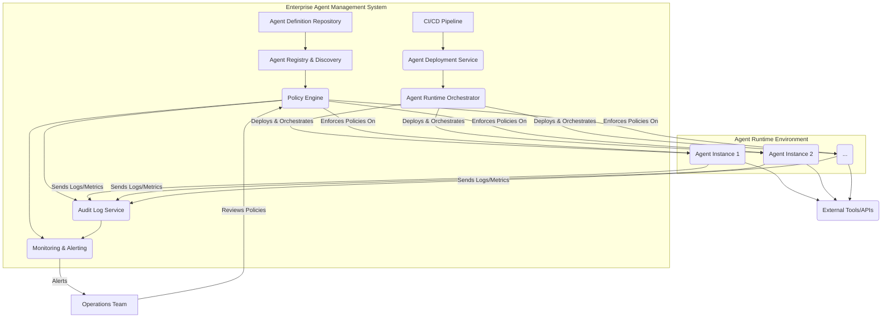

The advent of large language model (LLM) based agents introduces powerful new capabilities but also significant operational challenges in enterprise environments. Simple API integration is no longer sufficient; a robust framework for managing agent lifecycle, identity, permissions, logging, governance, and deployment is essential. Amazon Bedrock의 Managed Agents와 같은 서비스는 이러한 엔터프라이즈급 요구사항에 대한 청사진을 제시하며, 기업의 LLM 에이전트 운영을 위한 표준 모델을 구축하는 데 중요한 시사점을 제공한다. 본 엔트리는 엔터프라이즈 에이전트 관리를 위한 핵심 패턴과 그 적용 방안을 분석한다.

## 에이전트 관리의 핵심 구성 요소

엔터프라이즈 환경에서 LLM 에이전트를 효과적으로 관리하려면 다음의 핵심 구성 요소를 고려해야 한다:

### 1. Identity & Access Management (IAM)
에이전트도 고유한 신원을 가지며, 특정 리소스에 대한 접근 권한이 필요하다. 이는 서비스 계정(Service Accounts)과 유사하게 관리되어야 한다. 각 에이전트는 최소 권한의 원칙(Principle of Least Privilege)에 따라 필요한 권한만 부여받아야 한다.
-   **에이전트 신원 관리**: 각 에이전트 인스턴스에 고유한 ID를 부여하고, 이를 중앙 집중식 IAM 시스템에 등록한다.
-   **역할 기반 접근 제어 (RBAC)**: 에이전트의 기능과 수행하는 작업에 따라 역할을 정의하고, 해당 역할에 필요한 권한을 부여한다. 예를 들어, 데이터 조회 에이전트와 데이터 수정 에이전트는 다른 권한을 가져야 한다.

### 2. Permissions & Policy Enforcement
에이전트가 수행할 수 있는 작업과 접근 가능한 데이터에 대한 명확한 정책을 정의하고, 이를 강제하는 메커니즘이 필요하다.
-   **동적 정책 평가**: 에이전트의 실행 컨텍스트(사용자, 시간, 데이터 민감도 등)에 따라 실시간으로 권한을 평가하고 제어한다.
-   **Fine-grained Permissions**: 특정 API 호출, 데이터베이스 테이블, 혹은 특정 컬럼에 대한 접근 권한까지 세분화하여 제어한다.

### 3. Comprehensive Logging & Observability
에이전트의 모든 활동은 투명하게 기록되고 모니터링되어야 한다. 이는 디버깅, 감사, 보안 위협 탐지, 그리고 성능 최적화에 필수적이다.
-   **활동 로깅**: 에이전트의 프롬프트, 응답, 외부 API 호출, Tool 사용 기록 등 모든 상호작용을 기록한다.
-   **관제 대시보드**: 에이전트의 상태, 지연 시간, 오류율, 자원 사용량 등을 실시간으로 모니터링할 수 있는 대시보드를 구축한다.
-   **이상 탐지**: 에이전트의 비정상적인 행동 패턴(예: 평소와 다른 데이터 접근 시도, 과도한 API 호출)을 자동으로 탐지한다.

### 4. Governance & Compliance
기업의 정책, 법적 요구사항, 그리고 산업 표준에 따라 에이전트의 행동을 규제해야 한다. 이는 책임감 있는 AI(Responsible AI) 구현의 핵심이다.
-   **Guardrails**: 에이전트가 생성하는 콘텐츠의 품질, 안전성, 윤리성을 보장하기 위한 가드레일을 구현한다. PII(개인 식별 정보) 필터링, 유해 콘텐츠 차단 등이 포함된다.
-   **데이터 프라이버시**: 에이전트가 처리하는 데이터의 민감도를 분류하고, 해당 데이터에 대한 접근 및 사용 정책을 엄격하게 적용한다.
-   **모델 버전 관리**: 에이전트가 사용하는 LLM 및 도구의 버전을 관리하고, 변경 사항에 대한 이력 추적 및 롤백 기능을 제공한다.

### 5. Deployment & Lifecycle Management
에이전트의 개발, 테스트, 배포, 업데이트, 그리고 폐기까지 전 생애 주기를 효율적으로 관리하는 시스템이 필요하다.
-   **CI/CD 파이프라인**: 에이전트 코드 및 설정 변경 사항을 자동으로 테스트하고 배포하는 CI/CD 파이프라인을 구축한다.
-   **A/B 테스트 및 카나리 배포**: 새로운 에이전트 버전이나 설정 변경이 미치는 영향을 최소화하면서 점진적으로 배포하고 성능을 검증한다.
-   **버전 관리**: 에이전트의 구성, 사용 모델, 도구 세트 등을 버전별로 관리하여 필요시 이전 상태로 롤백할 수 있도록 한다.

## 엔터프라이즈 에이전트 관리 아키텍처 패턴

이러한 핵심 구성 요소를 통합하기 위한 아키텍처는 중앙 집중식 관리 레이어와 분산된 에이전트 실행 환경으로 구성될 수 있다.



이 아키텍처는 `Agent Definition Repository`에 저장된 에이전트 정의(코드, 설정, 도구 명세 등)를 `CI/CD Pipeline`을 통해 `Agent Deployment Service`로 전달한다. 배포된 `Agent Instance`들은 `Agent Runtime Environment`에서 실행되며, 모든 작업은 `Policy Engine`을 통해 검증된다. `Audit Log Service`와 `Monitoring & Alerting` 시스템은 에이전트의 모든 활동을 기록하고 관제한다.

## 실전 코드 예제: 파이썬 기반 에이전트 접근 제어 미들웨어

다음은 에이전트가 외부 리소스에 접근하기 전에 권한을 검사하는 간단한 미들웨어 패턴을 보여준다. 이는 `Policy Engine`의 일부분으로 구현될 수 있다.

```python
import functools
from typing import Callable, Dict, Any

class AgentAccessDeniedError(Exception):
    """Custom exception for access denied scenarios."""
    pass

class PolicyEngine:
    """
    A simplified policy engine to check agent permissions.
    In a real system, this would interact with a central IAM/RBAC system.
    """
    def __init__(self, policies: Dict[str, Any]):
        self.policies = policies

    def check_permission(self, agent_id: str, resource: str, action: str) -> bool:
        """
        Checks if the given agent_id has permission to perform action on resource.
        """
        agent_policies = self.policies.get(agent_id, {})
        allowed_actions = agent_policies.get(resource, [])
        return action in allowed_actions

# --- Agent Harness / Middleware Implementation ---
def enforce_access_policy(resource: str, action: str):
    """
    Decorator to enforce access policies before an agent executes a function.
    """
    def decorator(func: Callable):
        @functools.wraps(func)
        def wrapper(agent_instance, *args, **kwargs):
            # In a real system, agent_instance would have an `agent_id` attribute
            # and the policy_engine would be injected or globally accessible.
            agent_id = getattr(agent_instance, 'agent_id', 'unknown_agent')
            
            # This is a mock policy engine for demonstration
            # In production, pass a real PolicyEngine instance.
            mock_policies = {
                "financial_agent_001": {
                    "customer_data_db": ["read"],
                    "stock_api": ["read", "write"]
                },
                "reporting_agent_002": {
                    "customer_data_db": ["read"],
                    "analytics_dashboard": ["write"]
                }
            }
            policy_engine = PolicyEngine(mock_policies)

            if not policy_engine.check_permission(agent_id, resource, action):
                raise AgentAccessDeniedError(
                    f"Agent '{agent_id}' does not have '{action}' permission "
                    f"on resource '{resource}'."
                )
            print(f"Agent '{agent_id}' authorized for '{action}' on '{resource}'.")
            return func(agent_instance, *args, **kwargs)
        return wrapper
    return decorator

# --- Example Agent Usage ---
class MyAgent:
    def __init__(self, agent_id: str):
        self.agent_id = agent_id

    @enforce_access_policy(resource="customer_data_db", action="read")
    def fetch_customer_data(self, customer_id: str):
        print(f"Agent {self.agent_id} fetching data for {customer_id} from DB.")
        return {"customer_id": customer_id, "name": "John Doe"}

    @enforce_access_policy(resource="stock_api", action="write")
    def execute_stock_trade(self, symbol: str, quantity: int):
        print(f"Agent {self.agent_id} executing trade for {symbol} x {quantity}.")
        return {"status": "success", "order_id": "XYZ123"}

    @enforce_access_policy(resource="analytics_dashboard", action="write")
    def update_dashboard(self, report_data: Dict[str, Any]):
        print(f"Agent {self.agent_id} updating analytics dashboard.")
        return {"status": "dashboard_updated"}

# Test cases
financial_agent = MyAgent("financial_agent_001")
reporting_agent = MyAgent("reporting_agent_002")

print("\n--- Financial Agent Actions ---")
try:
    data = financial_agent.fetch_customer_data("CUST001")
    print(f"Fetched: {data}")
    trade_result = financial_agent.execute_stock_trade("AAPL", 100)
    print(f"Trade result: {trade_result}")
    financial_agent.update_dashboard({"metric": "revenue", "value": 1000}) # Should fail
except AgentAccessDeniedError as e:
    print(f"Error: {e}")

print("\n--- Reporting Agent Actions ---")
try:
    data = reporting_agent.fetch_customer_data("CUST002")
    print(f"Fetched: {data}")
    reporting_agent.update_dashboard({"metric": "users", "value": 500})
    reporting_agent.execute_stock_trade("GOOG", 50) # Should fail
except AgentAccessDeniedError as e:
    print(f"Error: {e}")

```

## 2026년 트렌드 및 미래 전망

2026년에는 엔터프라이즈 에이전트 관리가 더욱 고도화될 것으로 예상된다.
-   **자율 거버넌스 에이전트**: 에이전트 스스로 보안 정책 위반 시도를 감지하고, 수정 조치를 제안하거나 실행하는 자율 거버넌스 기능이 강화될 것이다.
-   **적응형 보안 모델**: 에이전트의 행동 패턴과 외부 환경 변화에 따라 동적으로 보안 정책을 조정하는 적응형 보안 모델이 보편화될 것이다. 이는 제로 트러스트(Zero Trust) 아키텍처와 결합되어 더욱 강력한 보호 기능을 제공한다.
-   **지속적인 규정 준수 검증**: 에이전트 시스템이 배포된 후에도 지속적으로 규정 준수 여부를 자동으로 검증하고, 변경된 규제에 따라 정책을 업데이트하는 메커니즘이 중요해진다.
-   **AI 기반 위협 인텔리전스 통합**: 에이전트 관제 시스템이 최신 AI 기반 위협 인텔리전스를 통합하여, 새로운 유형의 공격이나 오용 시도를 선제적으로 탐지하고 대응할 수 있게 된다.

## 트레이드오프

엔터프라이즈 에이전트 관리 패턴을 적용하는 것은 다음과 같은 트레이드오프를 수반한다.

*   **복잡성 증가 vs. 안정성/보안 강화**:
    *   **언제 좋고**: 높은 수준의 규제 준수, 보안, 그리고 예측 가능한 운영이 요구되는 금융, 의료, 국방 등 미션 크리티컬한 시스템에 적합하다. 에이전트의 자율성이 커질수록 관리의 복잡성을 감수하고서라도 안정성과 보안을 확보하는 것이 중요하다.
    *   **언제 나쁜지**: 빠른 프로토타이핑이나 소규모 내부 도구처럼 낮은 복잡성, 빠른 개발 속도가 우선되는 경우에는 과도한 오버헤드가 될 수 있다. 초기 단계에서는 민첩성을 저해할 위험이 있다.

*   **자원 소모 증가 vs. 가시성/감사 용이성**:
    *   **언제 좋고**: 에이전트의 모든 활동을 로깅하고 모니터링하는 것은 자원 소모를 증가시키지만, 문제 발생 시 빠른 원인 분석, 보안 감사, 규정 준수 보고서 작성에 필수적인 가시성을 제공한다. 특히 문제 발생 시 책임 소재를 명확히 해야 하는 경우에 유용하다.
    *   **언제 나쁜지**: 대규모 에이전트 인스턴스가 동시에 작동하며 방대한 양의 로그를 생성할 경우, 저장 및 처리 비용이 기하급수적으로 증가할 수 있다. 비용 효율성이 중요한 초기 서비스나 비즈니스 가치가 낮은 에이전트에게는 부담이 된다.

*   **개발 속도 저하 vs. 예측 가능한 행동 및 재현성**:
    *   **언제 좋고**: 엄격한 배포 및 버전 관리 프로세스는 개발 속도를 늦출 수 있지만, 에이전트의 행동을 예측 가능하게 하고, 버그 발생 시 쉽게 재현 및 롤백할 수 있게 한다. 이는 프로덕션 환경에서 안정적인 서비스를 유지하는 데 결정적이다.
    *   **언제 나쁜지**: 실험적인 기능을 자주 추가하거나, 시장의 변화에 매우 빠르게 대응해야 하는 경쟁적인 환경에서는 엄격한 프로세스가 혁신을 저해할 수 있다. 유연성이 중요한 스타트업 초기 단계에 부적합할 수 있다.

*   **초기 투자 비용 증가 vs. 장기적인 운영 비용 절감**:
    *   **언제 좋고**: 견고한 에이전트 관리 시스템 구축에는 상당한 초기 투자(인력, 인프라, 도구)가 필요하지만, 장기적으로는 에이전트의 확장에 따른 운영 복잡성 감소, 보안 사고 예방, 규제 준수 비용 절감 등의 효과를 가져온다. TCO(총 소유 비용) 관점에서 유리하다.
    *   **언제 나쁜지**: 단기적인 성과 달성이나 제한된 예산으로 운영해야 하는 경우에는 초기 투자 비용이 큰 장벽으로 작용할 수 있다.

## 실전 체크리스트

엔터프라이즈 에이전트 관리 패턴을 프로젝트에 적용할 때 다음 항목들을 검증한다.

-   [ ] **에이전트 신원 정의 및 중앙 IAM 연동**: 모든 에이전트 인스턴스에 고유한 `agent_id`가 부여되고, 기존 기업의 IAM 시스템(예: AWS IAM, Okta)과 연동되어 서비스 계정으로 관리되는가?
-   [ ] **최소 권한 원칙 기반 역할 정의**: 각 에이전트의 기능과 접근 리소스에 따라 역할(Role)이 명확히 정의되었으며, 불필요한 권한은 제거되어 최소 권한 원칙이 적용되었는가?
-   [ ] **동적 정책 평가 및 강제 메커니즘 구현**: 에이전트가 외부 도구 또는 데이터베이스에 접근하기 전에, 실행 컨텍스트를 고려한 실시간 정책 평가(예: OPA, Custom Policy Engine)가 이루어지고 접근이 강제되는가?
-   [ ] **종합적인 로깅 및 추적 시스템 구축**: 에이전트의 모든 프롬프트, 응답, 외부 API 호출, Tool 사용 기록이 중앙 집중식 로깅 시스템(예: ELK Stack, Splunk)에 기록되며, 특정 트랜잭션의 전체 흐름을 추적할 수 있는가?
-   [ ] **핵심 성능 지표(KPI) 및 보안 지표 모니터링 대시보드 운영**: 에이전트의 지연 시간, 오류율, 자원 사용량, 그리고 정책 위반 시도와 같은 핵심 운영 및 보안 지표가 실시간 대시보드(예: Grafana, New Relic)를 통해 모니터링되고 있는가?
-   [ ] **CI/CD 파이프라인을 통한 에이전트 배포 자동화**: 에이전트 코드 및 설정 변경 사항이 자동화된 CI/CD 파이프라인을 통해 테스트되고, 점진적 배포(카나리, A/B 테스트)가 가능한가?
-   [ ] **PII 및 유해 콘텐츠 필터링 가드레일 구현**: 에이전트의 입출력에서 개인 식별 정보(PII)나 유해 콘텐츠를 자동으로 탐지하고 필터링하는 가드레일이 적용되어 있는가?