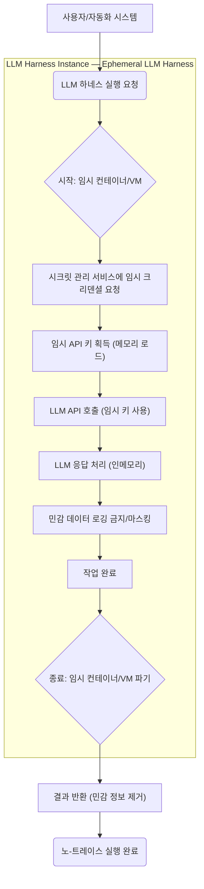

LLM (Large Language Model) 하네스를 운영하며 민감한 API 크리덴셜과 사용자 대화 로그를 안전하게 관리하는 것은 중요한 보안 과제입니다. 특히 신뢰하기 어려운 임시 환경(공용 GPU 서버, 임대 클라우드 VM, 고객사 온프레미스)에서 LLM 에이전트를 실행할 때, 크리덴셜과 세션 데이터가 영구 저장되어 정보 유출 위험을 야기할 수 있습니다. "노-트레이스(No-Trace)" 실행 모드는 이러한 위험을 최소화하기 위한 핵심 전략으로, 임시 크리덴셜 및 세션 관리 도입이 필수적입니다.

**LLM 하네스 내 임시 크리덴셜 및 세션 관리의 필요성**
기존 LLM 연동은 API 키나 OAuth 토큰을 파일 시스템(`.credentials.json` 등), 환경 변수, 또는 캐시(대화 로그)에 영구 저장하는 경우가 많습니다. 이는 개발 편의성을 높이지만, 다음과 같은 보안 및 개인 정보 보호 문제를 야기합니다.
*   **크리덴셜 유출 위험**: 파일 시스템에 저장된 토큰은 시스템 접근 권한이 있는 누구에게나 노출될 수 있습니다.
*   **세션 데이터 잔존**: 대화 로그 캐시/파일 저장은 민감한 사용자 정보나 회사 기밀을 시스템에 잔류시킵니다.
*   **규제 준수 문제**: GDPR, CCPA 등 개인 정보 보호 규제에 따라 데이터 보관 요건 충족이 어렵습니다.
*   **공용 환경 보안**: 공유 환경에서 개인 크리덴셜이 영구히 남아 다른 사용자에게 노출될 수 있습니다.

**노-트레이스 실행을 위한 핵심 원칙**
노-트레이스 실행은 LLM 하네스가 작업을 완료한 후 민감 정보를 시스템에 남기지 않는 것을 목표로 합니다.
1.  **일회성 크리덴셜(Ephemeral Credentials)**: API 토큰은 필요한 순간에만 획득하고, 메모리 내에만 유지하며, 세션 종료와 함께 즉시 파기합니다. 파일 시스템에 기록 금지.
2.  **인메모리 세션 관리(In-Memory Session Management)**: 대화 로그 등 세션 데이터는 휘발성 메모리 내에서만 처리하고, 불필요한 영구 저장소 기록을 방지합니다.
3.  **최소 권한 원칙**: 획득하는 크리덴셜은 특정 작업에 필요한 최소한의 권한과 짧은 유효 기간만을 가져야 합니다.
4.  **격리된 실행 환경**: 컨테이너(Docker, Kubernetes), 임시 가상 머신 등을 활용하여 프로세스를 격리하고, 작업 완료 후 환경 전체를 파기합니다.

### 임시 크리덴셜 관리 전략

#### 1. 시크릿 관리 서비스 연동
AWS Secrets Manager, HashiCorp Vault 등 전용 시크릿 관리 서비스와 연동하는 것이 가장 권장됩니다. LLM 하네스는 실행 시점에 시크릿 관리 서비스로부터 임시 토큰을 요청하고, 이를 환경 변수 주입 또는 애플리케이션 메모리 내에서만 사용합니다.

```python
import os
import requests
import json
from datetime import datetime

class MockSecretManager:
    def get_temporary_api_key(self, service_name: str, duration_seconds: int = 3600) -> str:
        print(f"[{datetime.now()}] Fetching temporary API key for {service_name}...")
        # In a real scenario, this involves IAM roles and time-bound token generation.
        temporary_key = f"sk-temp-{os.urandom(16).hex()}-{datetime.now().timestamp()}"
        print(f"[{datetime.now()}] Temporary API key fetched. Expires in {duration_seconds} seconds.")
        return temporary_key

def call_llm_api_ephemeral(prompt: str):
    secret_manager = MockSecretManager()
    llm_api_key = secret_manager.get_temporary_api_key("Claude", duration_seconds=3600)

    headers = {
        "x-api-key": llm_api_key,
        "anthropic-version": "2023-06-01",
        "content-type": "application/json"
    }
    payload = {
        "model": "claude-3-opus-20240229",
        "max_tokens": 100,
        "messages": [{"role": "user", "content": prompt}]
    }

    print(f"[{datetime.now()}] Calling LLM API...")
    try:
        response = requests.post("https://api.anthropic.com/v1/messages", headers=headers, json=payload, timeout=30)
        response.raise_for_status()
        result = response.json()
        print(f"[{datetime.now()}] LLM API response received: {json.dumps(result)}")
        # 민감한 대화 로그는 즉시 처리 후 영구 저장 방지 (예: PII Scrubbing)
    except requests.exceptions.RequestException as e:
        print(f"[{datetime.now()}] LLM API call failed: {e}")
    finally:
        print(f"[{datetime.now()}] Ephemeral LLM API call finished. No trace left in file system.")

if __name__ == "__main__":
    call_llm_api_ephemeral("Tell me a short story about a futuristic AI assistant.")
```
이 예시는 `MockSecretManager`로 임시 API 키 획득을 시뮬레이션합니다. 실제 환경에서는 `boto3` 등의 SDK를 사용하여 시크릿 관리 서비스와 연동하며, 키는 파일에 기록되지 않고 메모리에서 사라집니다.

#### 2. 환경 변수 주입
단기 실행 스크립트나 컨테이너 환경에서는 환경 변수로 임시 크리덴셜을 주입할 수 있습니다. Kubernetes Secrets, Docker Swarm Secrets 등을 활용해 LLM 하네스 컨테이너에 API 키를 주입하고, 컨테이너 종료 시 함께 사라지도록 합니다.
```bash
# Docker run 예시 (실제 API 키는 더욱 안전하게 관리되어야 함)
docker run -e LLM_API_KEY="sk-temp-xxxxxxxxxxxxxxxx" my-llm-harness-image python script.py
```
이 방식은 파일 저장 위험을 줄이지만, `ps` 명령 등으로 노출될 수 있어 시크릿 관리 서비스와 병행하는 것이 가장 안전합니다.

### 인메모리 세션 및 로그 관리
LLM 대화 로그는 민감 정보를 포함할 수 있으므로, 가능한 한 메모리 내에서만 처리하고 영구 저장소에 기록하지 않아야 합니다.
*   **휘발성 데이터 구조**: Python 딕셔너리, 리스트 등 인메모리 데이터 구조로 대화 히스토리를 관리합니다.
*   **로그 마스킹/필터링**: 불가피하게 로깅 시, Sentry `beforeSend` 훅처럼 PII나 기밀 정보를 마스킹/제거하는 메커니즘을 도입합니다.
*   **일회성 인스턴스**: LLM 하네스가 단일 요청/단기 세션만 처리하도록 설계하고, 매번 새로운 인스턴스를 생성하여 사용합니다.

### 아키텍처 다이어그램: 노-트레이스 LLM 하네스 플로우

이 다이어그램은 LLM 하네스 인스턴스가 임시 환경 내에서 구동되며, 크리덴셜 획득부터 환경 파기까지 '흔적을 남기지 않음'을 지향함을 보여줍니다.

## 트레이드오프

### 1. 보안 강화 vs. 운영 복잡성 증가
*   **언제 좋은가**: 민감 정보를 다루는 LLM 하네스, 규제 준수 환경, 공용/신뢰할 수 없는 인프라에서 강력한 보안 이점을 제공합니다. 크리덴셜 유출 및 데이터 잔존 위험을 현저히 줄입니다.
*   **언제 나쁜가**: 시크릿 관리 서비스 연동, 권한 관리, 짧은 TTL 토큰 갱신 로직 등 운영 및 개발 복잡성을 증가시킵니다. 내부 개발 환경이나 낮은 보안 요구사항의 PoC에서는 오버헤드가 될 수 있습니다.

### 2. 데이터 휘발성 vs. 디버깅 및 감사 어려움
*   **언제 좋은가**: 개인 정보 보호 및 기밀 유지가 최우선인 경우, 민감 데이터의 영구 저장을 원천 차단하여 규제 준수를 용이하게 합니다.
*   **언제 나쁜가**: 대화 로그가 저장되지 않으므로, LLM 오작동 디버깅, 성능 분석, 사용자 상호작용 감사에 어려움을 겪을 수 있습니다. 엄격하게 마스킹된 버전만 저장하는 전략이 필요할 수 있습니다.

### 3. 리소스 효율성 (단기) vs. 리소스 효율성 (장기)
*   **언제 좋은가**: 단기/일회성 작업에는 임시 컨테이너/VM 파기가 자원 누수를 막고 비용 효율적일 수 있습니다.
*   **언제 나쁜가**: 매번 임시 환경 프로비저닝/해제는 오버헤드를 발생시킬 수 있습니다. 장기 실행 에이전트에게는 적합하지 않으며, 콜드 스타트 지연을 유발합니다.

## 실전 체크리스트

노-트레이스 LLM 하네스 구현을 위한 실전 체크리스트입니다.

*   [ ] **시크릿 관리 서비스 연동**: 모든 민감 크리덴셜을 전용 시크릿 관리 서비스로부터 온디맨드로 획득하도록 구현했는가?
*   [ ] **크리덴셜 유효 기간(TTL) 설정**: 획득된 임시 크리덴셜의 유효 기간을 작업 수행에 필요한 최소한의 시간으로 설정하고, 만료 시 자동 파기되도록 설계했는가?
*   [ ] **메모리 내 크리덴셜 처리**: LLM API 키가 파일 시스템이나 영구 저장소에 절대 기록되지 않고, 애플리케이션 메모리 내에서만 사용되도록 구현했는가?
*   [ ] **대화 로그 영구 저장 금지**: LLM과의 대화 로그, 프롬프트, 응답 등 민감 세션 데이터가 캐시, 로컬 파일, DB 등 어떤 영구 저장소에도 기록되지 않도록 검증했는가? (필요시 엄격한 마스킹/필터링 적용)
*   [ ] **격리된 실행 환경**: LLM 하네스 워크로드를 Docker 컨테이너, Kubernetes Pod, 임시 VM과 같이 격리된 환경에서 실행하고, 작업 완료 후 해당 환경이 자동으로 파기되도록 구성했는가?
*   [ ] **IAM Role/권한 최소화**: 시크릿 관리 서비스에서 크리덴셜 획득 및 LLM API 호출에 필요한 IAM Role 또는 서비스 계정에 최소한의 권한만을 부여했는가?
*   [ ] **취약점 스캔 및 감사**: CI/CD 파이프라인에 정기적인 취약점 스캔을 포함하여 크리덴셜 처리 로직의 보안 취약점을 점검하고, 보안 감사를 수행하여 노-트레이스 원칙 준수 여부를 확인했는가?