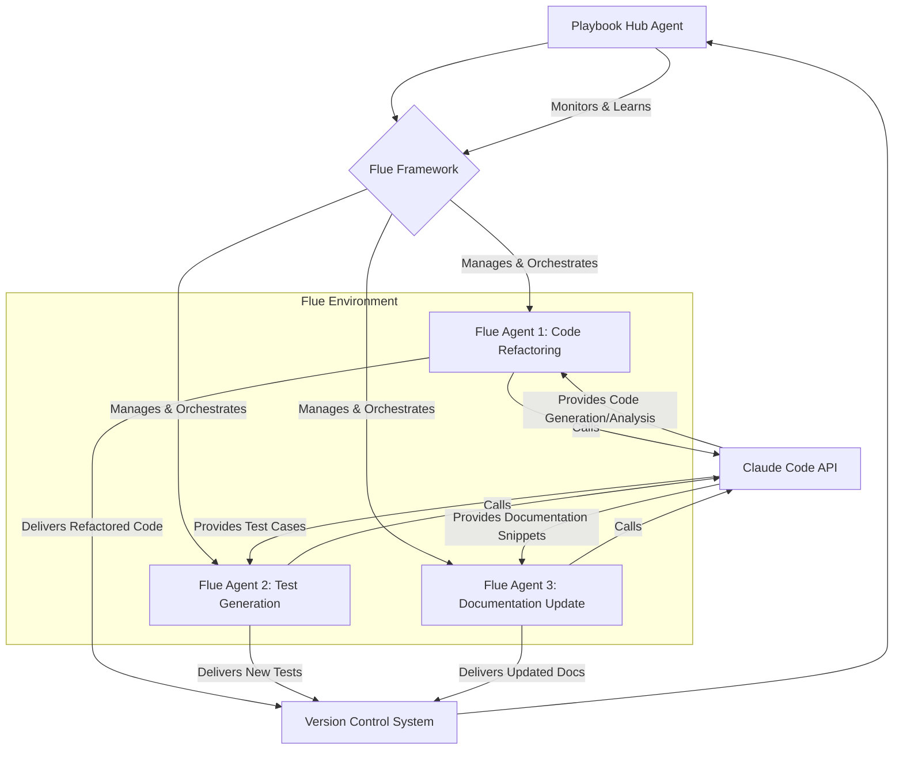

Flue 프레임워크는 TypeScript 기반의 에이전트 하네스 프레임워크로, Claude Code나 Codex와 같은 코딩 에이전트의 활용을 100% 헤드리스(headless) 및 프로그래머블(programmable) 방식으로 재구성한다. 현재 Playbook의 Claude Code 하네스 로직을 Flue의 구조에 맞춰 재구성하는 개념 증명(PoC)은 에이전트 기반 시스템의 효율성과 확장성을 극대화하기 위한 중요한 단계이다. Flue의 샌드박스 환경과 정교한 에이전트 관리 기능은 워커-허브(worker-hub) 자동화 복리(compounding)를 실현하는 데 핵심적인 역할을 한다.

## Flue 프레임워크의 핵심 가치

Flue는 에이전트가 자율적으로 문제를 해결하고 작업을 완료하도록 설계된 아키텍처를 제공한다. 이는 기존의 수동적인 LLM 호출 방식을 넘어, 에이전트가 마치 인간 프로그래머처럼 도구를 사용하고, 환경과 상호작용하며, 복잡한 태스크를 분해하고 실행하는 능력을 부여한다.

### 헤드리스 및 프로그래머블 에이전트 관리
Flue의 가장 큰 장점 중 하나는 에이전트 관리를 완전히 헤드리스 방식으로 제공한다는 점이다. 이는 UI를 통한 수동 개입 없이도 에이전트의 생명주기(lifecycle) 관리, 태스크 할당, 실행 모니터링이 가능하다는 의미이다. 또한, 모든 기능이 프로그래머블 API로 제공되어, 복잡한 자동화 스크립트나 CI/CD 파이프라인에 에이전트 로직을 쉽게 통합할 수 있다.

```typescript
// Flue Agent 정의 예시 (가상 시나리오)
import { Agent, Task, Environment, Tool } from "@flue/core";
import { ClaudeCodeTool } from "./claude-code-tool"; // Claude Code 연동 도구 가정

class CodeRefactoringAgent extends Agent {
  constructor() {
    super("CodeRefactoringAgent", "Refactors TypeScript code based on best practices.");
    this.addTool(new ClaudeCodeTool());
    this.addTool(new Tool("FileRead", "Reads content from a specified file path.", async (path: string) => {
      // Simulate file system interaction
      return `Content of ${path}...`;
    }));
    this.addTool(new Tool("FileWrite", "Writes content to a specified file path.", async (path: string, content: string) => {
      // Simulate file system interaction
      return `Wrote to ${path}.`;
    }));
  }

  async run(task: Task, env: Environment): Promise<any> {
    const filePath = task.parameters.filePath;
    const refactorGoal = task.parameters.refactorGoal;

    // Agent's internal thought process and tool usage
    env.log(`Starting refactoring for ${filePath} with goal: ${refactorGoal}`);

    // Read existing code
    const originalCode = await this.useTool("FileRead", filePath);
    env.log("Original code read.");

    // Use Claude Code Tool for refactoring suggestion
    const refactoredSuggestion = await this.useTool("ClaudeCodeTool", {
      code: originalCode,
      prompt: `Refactor the following TypeScript code to improve readability and performance, adhering to the goal: ${refactorGoal}. Provide only the refactored code.`,
    });
    env.log("Claude Code provided refactoring suggestion.");

    // Write the refactored code back (or to a new file/PR)
    await this.useTool("FileWrite", filePath, refactoredSuggestion);
    env.log(`Refactored code written to ${filePath}.`);

    return { status: "completed", message: "Code refactoring successful." };
  }
}

// 에이전트 실행 (PoC 환경)
async function startPoCRefactoring() {
  const agent = new CodeRefactoringAgent();
  const environment = new Environment(); // Flue Environment
  const task = new Task("refactor-task-1", {
    filePath: "src/utils/data-processor.ts",
    refactorGoal: "Extract common logic into helper functions and optimize loop performance."
  });

  const result = await agent.run(task, environment);
  console.log("PoC Result:", result);
}

startPoCRefactoring();
```

### 샌드박스 환경 및 에이전트 관리
Flue는 에이전트가 작업을 수행하는 동안 안전하고 격리된 샌드박스 환경을 제공한다. 이는 잠재적인 보안 위험을 줄이고, 에이전트의 잘못된 동작이 시스템 전체에 미치는 영향을 최소화한다. 또한, 에이전트의 상태 관리, 병렬 실행, 오류 처리 등 복잡한 에이전트 오케스트레이션 기능을 내장하고 있어 개발자가 에이전트의 핵심 로직에 집중할 수 있도록 돕는다. 2026년 현재, 이러한 샌드박스 기능은 프로덕션 환경에서 AI 에이전트를 안정적으로 운용하기 위한 필수 요소로 자리 잡고 있다.

### 워커-허브 자동화 복리 활용

Playbook의 Claude Code 하네스 로직을 Flue에 통합함으로써, 기존의 워커(Worker) 에이전트들이 허브(Hub) 에이전트의 지휘 아래 더욱 효율적으로 협업할 수 있다. Flue의 강력한 에이전트 관리 기능은 워커 에이전트의 동적 생성 및 할당, 태스크 우선순위 지정, 결과 취합 등을 자동화하여, 반복적이고 복잡한 개발 태스크의 처리량을 획기적으로 향상시킨다. 이는 단순한 자동화를 넘어, 에이전트들이 서로의 작업을 기반으로 학습하고 개선하는 '복리 효과'를 창출한다.



## 트레이드오프

Flue 프레임워크 통합은 상당한 이점을 제공하지만, 몇 가지 트레이드오프를 고려해야 한다.

- **초기 학습 곡선 및 설정 복잡성**: Flue는 강력한 기능을 제공하는 만큼, 프레임워크의 개념과 API에 대한 초기 학습 시간이 필요하다。
  - **언제 좋은가?**: 대규모, 장기적인 에이전트 기반 프로젝트에서 표준화된 관리와 높은 확장성이 요구될 때。
  - **언제 나쁜가?**: 간단하고 단발적인 스크립트 기반 자동화나 프로토타이핑 단계에서는 오버헤드가 될 수 있다.
- **기존 Claude Code 하네스 로직 재구성 노력**: 기존 Playbook의 Claude Code 하네스 로직을 Flue의 에이전트 모델에 맞게 재설계하고 구현하는 데 초기 공수가 발생한다。
  - **언제 좋은가?**: 기존 로직이 복잡하고 유지보수가 어렵거나, 확장성 및 재사용성이 낮은 경우 아키텍처 개선의 기회가 된다。
  - **언제 나쁜가?**: 기존 하네스가 이미 잘 작동하고 안정적이며, 기능 확장이 거의 필요 없는 상황에서는 불필요한 재작업이 될 수 있다.
- **TypeScript 의존성**: Flue는 TypeScript 기반이므로, 프로젝트 스택이 JavaScript/TypeScript가 아닌 경우 추가적인 언어/환경 통합 비용이 발생한다。
  - **언제 좋은가?**: 이미 TypeScript 생태계에 있거나, 타입 안정성과 모던 개발 워크플로우를 선호하는 팀에게는 자연스러운 선택이다。
  - **언제 나쁜가?**: Python 또는 다른 언어 스택을 주력으로 사용하는 프로젝트에서는 추가적인 기술 스택 도입으로 인한 복잡도가 증가한다.
- **프레임워크 종속성 증가**: Flue를 도입하면 특정 프레임워크에 대한 종속성이 증가하며, 이는 향후 유지보수 및 업그레이드 전략에 영향을 미칠 수 있다。
  - **언제 좋은가?**: 프레임워크가 활발히 개발되고 커뮤니티 지원이 좋은 경우, 안정성과 신뢰성을 얻을 수 있다。
  - **언제 나쁜가?**: 프레임워크의 발전 속도가 느리거나, 특정 요구사항을 충족하지 못할 경우 대체하기 어렵다.
- **샌드박스 오버헤드**: 샌드박스 환경은 보안과 안정성을 제공하지만, 격리 계층으로 인한 약간의 성능 오버헤드가 발생할 수 있다。
  - **언제 좋은가?**: 프로덕션 환경에서 에이전트의 예측 불가능한 동작으로부터 시스템을 보호해야 할 때 필수적이다。
  - **언제 나쁜가?**: 로컬 개발 환경에서 빠른 테스트나 디버깅이 필요할 때, 미미하지만 추가적인 지연을 유발할 수 있다.

## 실전 체크리스트

Flue 프레임워크를 Claude Code 하네스에 성공적으로 통합하기 위한 실전 체크리스트는 다음과 같다.

- [ ] **PoC 목표 명확화**: Flue 통합 PoC의 핵심 목표(예: 헤드리스 에이전트 관리 구현, 특정 워커 자동화 태스크 성공)를 명확히 정의하고 팀 내 공유.
- [ ] **기존 Claude Code 하네스 로직 분석**: 현재 Playbook의 Claude Code 하네스 로직 중 Flue 에이전트 모델로 전환할 대상 컴포넌트 및 인터페이스를 상세 분석.
- [ ] **Flue 에이전트 및 툴 설계**: Claude Code API를 활용하는 Flue `Tool` 및 특정 태스크를 수행하는 `Agent` 클래스 구조를 설계하고 구현.
- [ ] **샌드박스 환경 구성 및 테스트**: Flue의 샌드박스 기능을 활용하여 에이전트가 안전하게 실행되는지, 예상치 못한 파일 접근이나 네트워크 요청이 차단되는지 검증.
- [ ] **워커-허브 통합 시나리오 정의**: Flue 에이전트들이 허브 에이전트의 지시에 따라 복잡한 워크플로우를 구성하고 실행하는 구체적인 시나리오를 정의하고 테스트 케이스 작성.
- [ ] **성능 및 리소스 사용량 벤치마킹**: Flue 통합 전후의 에이전트 실행 시간, CPU/메모리 사용량 등 핵심 성능 지표를 측정하고 목표치 대비 분석.
- [ ] **에러 핸들링 및 로깅 전략 수립**: Flue 프레임워크 내에서 에이전트 오류 발생 시 효과적인 로깅 및 에러 핸들링 메커니즘을 설계하고 구현.