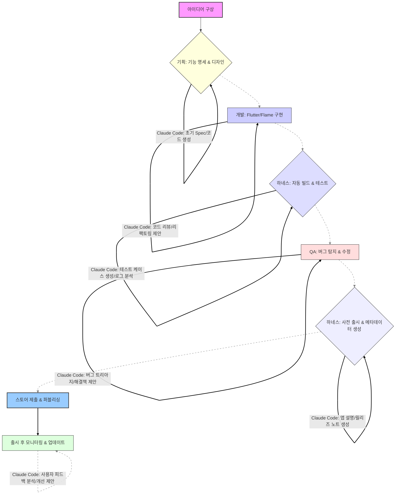

## Harness Engineering for Modern Game Development: Flutter/Flame Case Study

현대 소프트웨어 개발에서 `Harness Engineering`은 반복적인 작업을 자동화하고, 프로젝트 라이프사이클 전반의 일관성을 보장하며, 오류 발생 가능성을 줄이는 핵심 전략입니다. 특히 Flutter와 Flame 엔진을 활용한 게임 개발에서는 아이디어 구상부터 앱스토어 출시까지의 복잡한 과정을 효율적으로 관리하는 것이 중요합니다. 이 엔트리에서는 오픈소스 Flutter/Flame 게임 출시 하네스를 심층 분석하고, 이를 Claude Code 하네스 디자인 개선에 어떻게 적용하여 자동화 효율을 극대화할 수 있는지 탐구합니다.

### The Flutter/Flame Game Launch Harness: Core Principles

Flutter/Flame 게임 출시 하네스는 게임 개발의 전 과정을 `아이디어 → 기획 → 개발 → QA → 스토어 제출`로 구조화하고, 각 단계를 코드화하여 반복되는 절차와 잠재적 함정을 사전에 방지합니다. 핵심 아이디어는 '바이브 코딩(vibe coding)'과 같이 직관적이고 창의적인 개발에 집중할 수 있도록, 지루하고 반복적인 운영(Ops) 작업을 최소화하는 것입니다.

이 하네스는 다음과 같은 문제들을 해결합니다:

*   **반복적인 작업 부담**: 빌드, 테스트, 배포, 스토어 메타데이터 생성 등 매번 동일하게 수행해야 하는 작업.
*   **휴먼 에러 감소**: 수동 작업 시 발생할 수 있는 설정 오류, 누락된 단계 등의 문제.
*   **일관성 유지**: 여러 프로젝트 또는 버전 간의 일관된 출시 절차 보장.
*   **지식의 코드화**: 출시 과정에서 얻은 노하우와 모범 사례를 하네스 코드 내에 반영하여 `institutional knowledge`로 축적.

하네스는 특정 플랫폼(Android, iOS)에 맞춘 빌드 스크립트, 테스트 자동화 도구 연동, 버전 관리 정책, 그리고 스토어 제출을 위한 `fastlane` 같은 도구와의 통합을 포함할 수 있습니다. 각 단계는 스크립트 형태로 정의되어 있으며, 이는 `Infrastructure as Code`와 유사하게 `Workflow as Code` 철학을 따릅니다.

### Integrating Claude Code for Enhanced Automation

Flutter/Flame 게임 출시 하네스에 Claude Code 플러그인을 통합하면, 기존의 스크립트 기반 자동화를 넘어선 `지능형 자동화(Intelligent Automation)`를 구현할 수 있습니다. Claude Code는 특히 `프롬프트 엔지니어링`을 통해 복잡한 비즈니스 로직이나 창의적인 콘텐츠 생성을 자동화하는 데 강점을 가집니다.

1.  **Prompt Engineering for Workflow Steps**: Claude Code는 특정 작업의 입력, 출력 형식, 제약 조건을 담은 정교한 프롬프트를 통해 워크플로우의 특정 단계를 자동화할 수 있습니다. 예를 들어, 게임 기획 단계에서 아이디어를 바탕으로 초기 `Feature Specification` 문서를 생성하거나, 개발 과정에서 특정 컴포넌트의 `Boilerplate Code`를 생성하는 데 활용될 수 있습니다.
2.  **Automated Testing & QA Augmentation**: Claude Code는 게임 내 새로운 기능에 대한 테스트 케이스를 자동으로 생성하거나, QA 과정에서 발견된 버그 리포트를 분석하여 잠재적인 `Root Cause`를 추론하고 해결책을 제시할 수 있습니다. 또한, 게임 로그를 분석하여 비정상적인 패턴을 감지하는 `Anomaly Detection` 스킬을 부여할 수도 있습니다.
3.  **Content Generation for Store Submission**: 앱스토어 제출 과정에서 필요한 앱 설명, 릴리즈 노트, 스크린샷 텍스트, 마케팅 문구 등을 Claude Code가 자동으로 생성합니다. 이는 개발자가 핵심 게임 로직 개발에 집중하면서도 `Market Reach`를 극대화할 수 있도록 돕습니다. Git 커밋 히스토리나 JIRA 티켓을 기반으로 릴리즈 노트를 자동으로 요약하는 것도 가능합니다.
4.  **Issue Tracking & Feedback Loops**: 출시 후 사용자 피드백이나 에러 리포트를 Claude Code가 분석하여 중요도를 분류하고, 관련 개발자에게 할당하거나 자동화된 `Triage`를 수행할 수 있습니다. 이는 `Closed-Loop Automation`의 핵심 요소로, 지속적인 제품 개선 사이클을 가속화합니다.

### Example: Simplified Claude Code Plugin Interaction

다음은 Flutter/Flame 게임 출시 하네스 내에서 Claude Code를 활용하여 App Store 메타데이터를 자동 생성하는 개념적인 스크립트 예시입니다. 실제 구현에서는 `claude-cli` 또는 Claude API 클라이언트를 통해 LLM과 상호작용하게 됩니다.

```bash
#!/bin/bash
# Simplified game release script leveraging Claude Code for metadata generation

GAME_VERSION="1.0.0"
BUILD_TYPE="release"

echo "--- Building Flutter Flame game for $BUILD_TYPE v$GAME_VERSION ---"
flutter build apk --${BUILD_TYPE}
flutter build appbundle --${BUILD_TYPE}

echo "--- Running automated tests ---"
# Example: Integrate Claude Code for intelligent test generation or analysis
# claude-cli run-agent --skill test-case-generator --input "new game levels, boss fight updates" > generated_tests.dart
# dart run test/generated_tests.dart

echo "--- Generating App Store metadata with Claude Code ---"
# Claude Code generates release notes based on recent git commits
RELEASE_NOTES=$(claude-cli generate-release-notes \
    --version $GAME_VERSION \
    --from-git-history \
    --tone "exciting, concise" \
    --max-length 500 \
    --language "ko")

# Claude Code generates an app description optimized for discovery
APP_DESCRIPTION=$(claude-cli generate-app-description \
    --game-features "physics engine, multiplayer support, unique characters, challenging levels" \
    --keywords "arcade, casual, action, adventure, indie" \
    --target-audience "mobile gamers, casual players" \
    --call-to-action "Download now and start your adventure!")

echo "\n--- Generated Release Notes ---"
echo "${RELEASE_NOTES}"

echo "\n--- Generated App Description ---"
echo "${APP_DESCRIPTION}"

echo "--- Submitting to App Store/Google Play Console ---"
# Manual step or automated via Fastlane with generated metadata
# fastlane supply --apk_path build/app/outputs/flutter-apk/app-release.apk \
#          --track beta --release_notes "${RELEASE_NOTES}" \
#          --metadata_path deploy/metadata/android

echo "Game launch harness completed for v$GAME_VERSION."
```

### Workflow Visualization with Claude Code

Claude Code의 통합은 기존 워크플로우에 지능적인 자동화 레이어를 추가하여, 개발 주기의 각 단계에서 효율성을 증대시킵니다.



## 트레이드오프

Claude Code를 통합한 하네스 디자인은 분명한 이점을 제공하지만, 몇 가지 트레이드오프를 고려해야 합니다.

*   **높은 초기 투자 vs. 장기적인 효율성**: 
    *   **언제 좋은가**: 여러 게임 프로젝트를 개발하거나, 한 게임에 대해 빈번한 업데이트가 예상될 때. 초기 하네스 구축 및 Claude Code 프롬프트 엔지니어링에 투자된 시간과 자원은 장기적으로 반복적인 수동 작업을 줄여 복리 이득을 창출합니다.
    *   **언제 나쁜가**: 일회성 소규모 프로젝트나, 프로토타이핑처럼 빠른 실험과 유연성이 더 중요한 경우에는 초기 설정 비용이 부담될 수 있습니다.

*   **워크플로우의 일관성 vs. 유연성**: 
    *   **언제 좋은가**: 표준화된 출시 절차를 확립하고, 팀원 간의 협업 및 지식 공유를 촉진하며, 오류 발생 가능성을 최소화할 때 효과적입니다. `Compliance` 요구사항이 있는 경우에도 유용합니다.
    *   **언제 나쁜가**: 시장 변화에 대한 즉각적인 대응이나, 비표준적인 특정 요구사항이 빈번히 발생하는 경우, 하네스의 `Rigidity`가 오히려 `Agility`를 저해할 수 있습니다.

*   **AI 의존성 vs. 휴먼 전문성**: 
    *   **언제 좋은가**: 반복적이고 예측 가능한 콘텐츠 생성, 기본적인 코드 스니펫 생성, 데이터 분석 등 `Rule-based` 또는 `Pattern-based` 작업에 AI를 활용하여 인간 개발자의 시간을 절약할 때.
    *   **언제 나쁜가**: AI가 생성한 결과물에 대한 충분한 `Validation` 절차 없이 맹목적으로 신뢰할 경우, 미묘한 오류나 맥락적 오해로 인해 심각한 문제가 발생할 수 있습니다. 특히 창의성이나 비판적 사고가 요구되는 영역에서는 인간의 개입이 필수적입니다.

*   **복잡성 관리 vs. 추상화**: 
    *   **언제 좋은가**: 잘 설계된 하네스는 복잡한 빌드/배포 과정을 추상화하여 개발자가 비즈니스 로직에만 집중할 수 있도록 `개발자 경험(DX)`을 향상시킵니다.
    *   **언제 나쁜가**: 하네스 자체의 구현이 지나치게 복잡하거나 문서화가 부족할 경우, 하네스 유지보수 및 디버깅 자체가 또 다른 병목(bottleneck)이 되어 오히려 생산성을 저해할 수 있습니다.

## 실전 체크리스트

Flutter/Flame 게임 출시 하네스를 Claude Code와 통합하여 개선할 때 다음 사항들을 검증해야 합니다.

*   - [ ] 모든 게임 출시 단계(빌드, 테스트, QA, 스토어 제출 메타데이터 생성)가 자동화 스크립트로 정의되어 있는가?
*   - [ ] Claude Code 프롬프트가 각 자동화 단계의 목표, 제약 조건, 출력 형식을 명확하게 반영하며 `Parameter`화 되어 있는가?
*   - [ ] AI가 생성한 코드, 텍스트(예: 릴리즈 노트, 앱 설명)에 대한 자동화된 유효성 검사 (예: 린트, 문법 검사, 내용 일관성 검토) 파이프라인이 구축되어 있는가?
*   - [ ] 하네스 내에서 발생한 오류 (빌드 실패, 테스트 실패, Claude API 에러 등)에 대한 로깅 및 알림 시스템이 실시간으로 작동하는가?
*   - [ ] AI 생성물의 품질을 주기적으로 평가하고, 이 평가 결과를 바탕으로 프롬프트나 Claude Code 에이전트의 스킬을 개선하는 `피드백 루프`가 존재하는가?
*   - [ ] 하네스가 다양한 빌드 환경 (예: 개발, 스테이징, 프로덕션) 및 플랫폼 (iOS, Android)에 유연하게 대응하며 `Configuration`이 용이한가?
*   - [ ] Claude Code 에이전트가 처리하는 민감 정보 (예: API 키, 내부 프로젝트 정보)에 대한 보안 메커니즘 (예: `Environment Variables`, `Secret Management`)이 적절히 구현되어 있는가?
