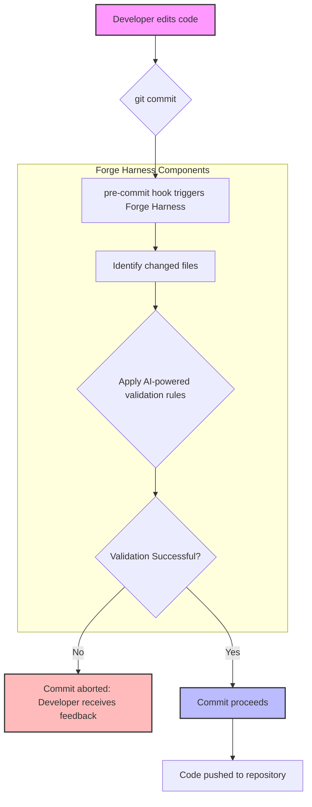

## LLM 생성 코드의 신뢰성 확보: Forge Harness 기반 검증 게이트

최근 LLM(Large Language Model) 에이전트가 코드 생성 및 수정 작업에 활발히 활용되면서, AI가 작성한 코드의 품질과 신뢰성을 확보하는 것이 중요한 과제가 되었습니다. 개발 워크플로우에 AI 에이전트가 깊이 통합될수록, 생성된 코드를 수동으로 검증하는 과정은 병목 현상을 유발하고 휴먼 에러 가능성을 높입니다. 이를 해결하기 위해 필요한 것이 바로 자동화된 AI 코드 검증 게이트입니다. Forge Harness는 이러한 요구사항을 충족시키기 위해 설계된 오픈소스 솔루션으로, 커밋 전 단계에서 AI 생성 코드의 품질을 기계적으로 검증하여 개발 생산성과 코드 안정성을 동시에 향상시킵니다.

### Forge Harness란?

Forge Harness는 AI 에이전트가 생성하거나 수정한 코드를 `git` 훅을 통해 커밋하기 전에 자동으로 검증하는 시스템입니다. 언어나 프레임워크에 구애받지 않고 코드 변경 내용 자체를 분석하며, 정의된 규칙을 통과하지 못하면 커밋을 중단시켜 문제 있는 코드가 저장소에 유입되는 것을 방지합니다. 이는 LLM 출력의 '신뢰할 수 있는지'에 대한 개발자들의 근본적인 우려를 해소하고, 고품질 코드베이스를 유지하는 데 필수적인 요소로 작용합니다.

### 아키텍처 및 동작 원리

Forge Harness는 주로 `pre-commit` 훅을 활용하여 동작합니다. 개발자가 `git commit` 명령을 실행하면, Forge Harness가 실행되어 변경된 파일들을 대상으로 검증 규칙을 적용합니다. 이 규칙들은 LLM 기반으로 작성될 수 있으며, 코드 스타일, 잠재적 버그, 보안 취약점, 비즈니스 로직 적합성 등 다양한 측면을 검사합니다. 검증에 실패하면 커밋은 중단되고, 개발자는 피드백을 받아 코드를 수정하게 됩니다.



### 기본적인 Forge Harness 게이트 구축

Forge Harness를 프로젝트에 도입하는 과정은 비교적 간단합니다. `npx`를 통해 설치하고, `forge-harness.json` 파일을 설정하여 검증 규칙을 정의할 수 있습니다. 예를 들어, `npx @chrono-meta/forge-harness init` 명령으로 초기 설정을 시작할 수 있습니다.

다음은 간단한 TypeScript 프로젝트에서 특정 패턴을 검증하는 Forge Harness 설정을 보여주는 예시입니다. 여기서는 AI가 특정 비추천 함수를 사용하지 않도록 강제하는 규칙을 정의합니다.

```json
{
  "rules": [
    {
      "name": "No-Deprecated-AI-Function",
      "description": "Ensure AI-generated code does not use deprecated `legacyAiProcess` function.",
      "prompt": "The provided code changes should NOT contain the function call `legacyAiProcess`. If it does, explain why and suggest alternatives. If not, state 'Validation Passed'.",
      "filePatterns": ["**/*.ts", "**/*.js"],
      "failOn": "contains `legacyAiProcess`",
      "message": "Found deprecated `legacyAiProcess`. Please use `newAiProcessor` instead."
    },
    {
      "name": "Security-Best-Practice-Check",
      "description": "Verify AI-generated code avoids common security pitfalls like exposed API keys.",
      "prompt": "Review the code changes for any hardcoded API keys or sensitive credentials. If found, identify them and explain the risk. Otherwise, state 'Validation Passed'.",
      "filePatterns": ["**/*.ts", "**/*.js", "**/*.py"],
      "failOn": "found hardcoded API key or sensitive credentials",
      "message": "Potential sensitive data exposed. Review your changes carefully."
    }
  ]
}
```

위 설정에서 `prompt` 필드는 LLM에 전달될 검증 지시사항을 정의하며, `failOn`은 LLM의 응답에서 특정 키워드가 발견될 경우 검증 실패로 처리하도록 합니다. 이처럼 유연한 규칙 정의를 통해 다양한 코드 품질 및 보안 요구사항을 AI 기반으로 자동 검증할 수 있습니다.

### 고급 활용 및 CI/CD 통합

Forge Harness는 단순히 `pre-commit` 훅을 넘어 CI/CD 파이프라인과 통합될 때 더욱 강력한 효과를 발휘합니다. Pull Request(PR) 제출 시점에 Forge Harness를 실행하여, 변경 사항이 머지되기 전에 잠재적인 문제를 사전에 차단할 수 있습니다. 이를 통해 코드 리뷰어의 부담을 줄이고, 일관된 코드 품질을 유지하는 데 기여합니다.

또한, Forge Harness는 기존의 린터, 정적 분석 도구(ESLint, SonarQube 등)와 연동하여 AI 기반 검증과 전통적인 코드 분석의 장점을 결합할 수 있습니다. 예를 들어, 특정 규칙은 기존 린터로, 더 복잡하거나 맥락적인 검증은 LLM 프롬프트 기반으로 처리하는 하이브리드 접근 방식이 가능합니다. 이 접근 방식은 2026년 현재, LLM의 비용과 성능적 한계를 보완하며 최적의 검증 파이프라인을 구축하는 데 중요한 트렌드로 자리 잡고 있습니다.

## 트레이드오프

### 1. 자동화된 품질 확보 vs. 초기 설정 및 튜닝 비용
*   **언제 좋음**: 대규모 AI 코드 생성 워크플로우나 빠른 개발 주기를 가진 프로젝트에서 AI 생성 코드의 일관된 품질을 유지하는 데 매우 효과적입니다. 수동 검토에 드는 시간과 비용을 절감하고, 개발자들의 반복적인 검증 부담을 크게 줄일 수 있습니다.
*   **언제 나쁨**: 초기 설정에 필요한 시간과 복잡한 규칙 튜닝 과정이 필요하므로, 소규모 프로젝트나 AI 코드 생성 빈도가 낮은 경우 초기 도입 비용이 이점보다 크게 느껴질 수 있습니다. False Positive를 줄이기 위한 반복적인 규칙 조정이 요구될 수 있습니다.

### 2. 커밋 전 빠른 피드백 vs. 성능 오버헤드
*   **언제 좋음**: 개발자가 커밋 직후 문제를 발견하고 즉시 수정할 수 있도록 하여, 문제 있는 코드가 저장소에 유입되는 것을 원천 차단합니다. 이는 잠재적인 버그나 보안 취약점이 확산되는 것을 막아 장기적인 유지보수 비용을 절감합니다.
*   **언제 나쁨**: LLM 기반 검증은 일반적인 정규식 검사보다 시간이 오래 걸릴 수 있어, 커밋 시간이 증가하는 성능 오버헤드가 발생할 수 있습니다. 개발 속도가 최우선시되는 프로토타이핑 단계에서는 이러한 지연이 생산성을 저해할 수 있습니다.

### 3. 유연한 규칙 정의 vs. LLM의 불확실성
*   **언제 좋음**: `prompt` 기반의 유연한 규칙 정의를 통해, 복잡한 비즈니스 로직이나 맥락적인 코드 품질 판단 기준까지도 AI로 검증할 수 있습니다. 이는 기존 정적 분석 도구로는 어려웠던 영역에 대한 검증을 가능하게 합니다.
*   **언제 나쁨**: LLM의 응답은 확률적이며, 때로는 `false positive`나 `false negative`를 유발할 수 있습니다. 특히 미묘한 코드 변경이나 새로운 패턴에 대한 오판 가능성이 존재하며, 이에 대한 지속적인 모니터링과 규칙 개선이 필수적입니다.

## 실전 체크리스트

Forge Harness를 프로젝트에 성공적으로 도입하기 위한 실전 체크리스트입니다.

- [ ]  **Forge Harness 초기 설치 및 설정 완료 여부**: 프로젝트 루트 디렉터리에 `npx @chrono-meta/forge-harness init` 명령어를 통해 Forge Harness를 설치하고 `.forge-harness.json` 파일이 생성되었는지 확인합니다.
- [ ]  **프로젝트 특성에 맞는 커스텀 검증 규칙 정의 및 적용 여부**: 프로젝트의 코드 컨벤션, 보안 가이드라인, 비즈니스 로직을 반영하는 LLM 기반의 커스텀 규칙(예: `no-deprecated-ai-function` 또는 `security-best-practice-check`)을 `rules` 배열에 추가하고 테스트를 통해 정상 동작하는지 확인합니다.
- [ ]  **CI/CD 파이프라인에 Forge Harness 통합 및 자동화된 실행 구성 여부**: Pull Request (PR) 생성 또는 Merge 전 단계에서 Forge Harness 검증이 자동으로 실행되도록 GitHub Actions, GitLab CI/CD 등 CI/CD 시스템을 구성하고, 실패 시 PR 머지를 차단하는 정책을 적용합니다.
- [ ]  **AI 검증 게이트의 False Positive 및 False Negative 비율 정기적 모니터링 및 규칙 튜닝 계획 수립 여부**: 초기 도입 후 일정 기간 동안 검증 결과의 정확성을 모니터링하고, 오탐 및 미탐 사례를 분석하여 `prompt` 및 `failOn` 조건을 주기적으로 개선하는 프로세스를 마련합니다.
- [ ]  **개발자들이 검증 실패 시 신속하게 문제를 해결할 수 있도록 가이드라인 및 문서화 제공 여부**: Forge Harness 검증 실패 메시지에 대한 해석 방법, 문제 해결을 위한 대체 코드 예시, 그리고 규칙 재정의 요청 절차 등을 포함하는 내부 개발 가이드를 작성하여 공유합니다.
- [ ]  **LLM 모델 업데이트 시 검증 게이트의 성능 및 정확성 재평가 프로세스 정의 여부**: 사용하는 LLM 모델이 업데이트(예: Claude 3.5 Sonnet -> Claude 3.5 Opus)될 경우, Forge Harness의 기존 규칙들이 새로운 모델에서도 동일한 성능과 정확성을 유지하는지 검증하고 필요한 경우 규칙을 튜닝하는 계획을 수립합니다.
- [ ]  **Forge Harness 검증으로 인한 커밋 시간 증가에 대한 개발팀 공지 및 수용 여부**: 자동화된 검증의 이점과 함께 발생할 수 있는 커밋 시간 증가에 대해 개발팀에 사전 공지하고, 이를 수용할 수 있는 범위 내에서 검증 규칙의 복잡도와 LLM 호출 빈도를 조절합니다.