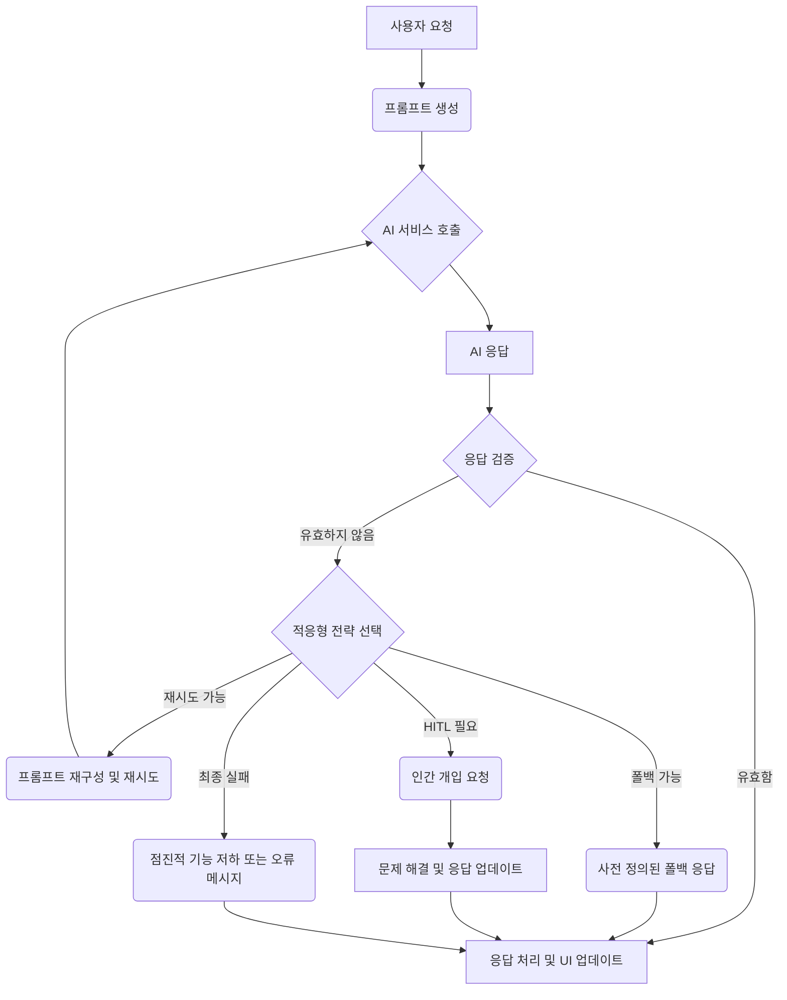

## AI 시대의 프론트엔드: 불확실성과의 싸움

모바일 및 웹 애플리케이션에 AI 기능을 통합하는 것은 더 이상 먼 미래의 이야기가 아닙니다. 개인화된 콘텐츠 추천, 지능형 챗봇, 동적 UI 생성, 온디바이스 비서 등 AI는 사용자 경험을 혁신하는 핵심 동력으로 자리매김하고 있습니다. iOS 및 프론트엔드 개발자에게 이는 새로운 기회이자 동시에 중대한 도전 과제를 의미합니다.

특히 생성형 AI(Generative AI) 모델, 예를 들어 LLM(Large Language Model)은 그 강력함만큼이나 예측 불가능성을 내포합니다. 동일한 프롬프트에도 매번 다른 응답을 내놓거나, 때로는 잘못된 정보(Hallucination), 부적절한 콘텐츠, 혹은 형식에 맞지 않는 데이터를 반환하기도 합니다. 사용자에게 직접 노출되는 프론트엔드 애플리케이션에서 이러한 AI의 불확실성은 사용자 경험 저하, 보안 취약점, 심지어 법적 문제로 이어질 수 있습니다.

여기서 **Harness Engineering**의 역할이 중요해집니다. Harness Engineering은 복잡하고 불확실한 시스템(여기서는 AI 모델)을 제품의 핵심 흐름에 안정적이고 예측 가능하게 "고정(Harness)"시키는 일련의 기술, 프로세스, 그리고 방법론을 의미합니다. AI 시대의 프론트엔드 개발자에게 Harness Engineering은 단순히 멋진 AI 기능을 구현하는 것을 넘어, 그 기능이 사용자에게 신뢰할 수 있고 일관된 가치를 제공하도록 보장하는 필수 역량이 됩니다.

이번 글에서는 AI 응답의 불확실성을 관리하고 사용자 경험의 연속성을 확보하기 위한 세 가지 핵심 축인 **검증 (Validation)**, **적응 (Adaptation)**, 그리고 **피드백 루프 (Feedback Loop)** 구축 방안에 대해 심층적으로 다룹니다.

## AI 응답 검증의 필요성: 사용자 경험의 보루

AI 모델은 인간처럼 사고하지 않으며, 단지 주어진 데이터를 기반으로 가장 확률 높은 다음 토큰을 생성할 뿐입니다. 따라서 AI가 반환하는 응답은 우리가 기대하는 형식, 내용, 또는 안전성 기준에 미치지 못할 수 있습니다. 프론트엔드 애플리케이션은 이러한 불완전한 AI 응답을 그대로 사용자에게 노출하기 전에 반드시 검증하는 과정을 거쳐야 합니다. 이는 다음과 같은 이유로 필수적입니다.

*   **사용자 경험 (UX) 저하 방지:** 잘못된 형식의 데이터는 UI 렌더링 오류를 일으키고, 비논리적인 내용은 사용자의 혼란을 초래합니다.
*   **보안 및 규정 준수:** PII (개인 식별 정보) 유출, 유해하거나 부적절한 콘텐츠 노출은 심각한 보안 문제와 법적 책임을 야기할 수 있습니다.
*   **신뢰성 확보:** AI 기능에 대한 사용자의 신뢰는 일관되고 정확한 응답에서 나옵니다.
*   **자원 효율성:** 불필요한 AI 호출이나 잘못된 응답으로 인한 추가 처리를 방지하여 시스템 자원을 효율적으로 사용합니다.

## 다차원적 AI 응답 검증 기법

AI 응답은 다양한 측면에서 검증되어야 합니다. 주로 구조적, 의미적, 그리고 안전성 및 윤리적 측면으로 나눌 수 있습니다.

### 1. 구조적 (Syntactic) 검증

AI가 특정 데이터 형식을 따르도록 지시했지만, 항상 이를 준수하는 것은 아닙니다. 구조적 검증은 응답이 미리 정의된 데이터 스키마를 따르는지 확인합니다. JSON, XML과 같은 구조화된 데이터 응답이 필요한 경우 필수적입니다.

**주요 기법:**
*   **JSON Schema:** AI 응답이 특정 JSON 스키마를 따르는지 유효성을 검사합니다. 이는 가장 강력하고 널리 사용되는 방법입니다.
*   **정규 표현식 (Regular Expressions):** 특정 패턴 (예: 이메일 주소, 전화번호, 특정 형식의 ID)을 추출하거나 검증할 때 사용됩니다.
*   **타입 검사 (Type Checking):** TypeScript와 같은 언어에서 런타임에 데이터 타입을 확인합니다.

**코드 예시 (TypeScript - JSON Schema Validation):**

```typescript
// response-schema.ts
export const articleSummarySchema = {
  type: "object",
  properties: {
    title: { type: "string", description: "요약된 기사의 제목" },
    summary: { type: "string", description: "기사의 핵심 내용을 담은 요약" },
    keywords: {
      type: "array",
      items: { type: "string" },
      description: "기사의 주요 키워드 목록",
    },
    estimatedReadingTimeMinutes: {
      type: "integer",
      minimum: 1,
      description: "예상 독서 시간(분)",
    },
  },
  required: ["title", "summary", "keywords"],
  additionalProperties: false, // 스키마에 정의되지 않은 속성 허용 안 함
};
```

```typescript
// ai-response-validator.ts
import Ajv from "ajv";
import { articleSummarySchema } from "./response-schema";

const ajv = new Ajv();
const validateArticleSummary = ajv.compile(articleSummarySchema);

export function validateAIResponse<T>(schema: object, data: any): { isValid: boolean; errors?: string[] } {
  const validator = ajv.compile(schema);
  const isValid = validator(data);
  if (!isValid) {
    // validator.errors는 유효성 검사 실패 시 존재하는 배열입니다.
    // 이는 MDX에서 `{` 와 `}`를 JSX로 해석할 수 있으므로, `...` Spread operator로 배열을 복사하거나 `JSON.stringify`를 사용해야 합니다.
    const errorMessages = validator.errors
      ? validator.errors.map((err) => `${err.instancePath} ${err.message}`).join(", ")
      : "Unknown validation error";
    return { isValid: false, errors: [errorMessages] };
  }
  return { isValid: true };
}

// 사용 예시
async function processAIResponse(aiRawResponse: string) {
  try {
    const parsedResponse = JSON.parse(aiRawResponse);
    const validationResult = validateAIResponse(articleSummarySchema, parsedResponse);

    if (validationResult.isValid) {
      console.log("AI 응답이 스키마를 준수합니다:", parsedResponse);
      // 유효한 응답을 UI에 렌더링
    } else {
      console.error("AI 응답 스키마 유효성 검사 실패:", validationResult.errors);
      // 유효하지 않은 응답 처리 로직 (예: 재시도, 폴백)
    }
  } catch (parseError) {
    console.error("AI 응답 JSON 파싱 실패:", parseError);
    // JSON 형식이 아닌 응답 처리
  }
}

// AI가 반환할 수 있는 유효하지 않은 JSON 예시
const invalidAIResponse = `
  {
    "summary": "핵심 요약입니다.",
    "keywords": ["AI", "Harness"],
    "extraField": "이건 스키마에 없어요"
  }
`;
processAIResponse(invalidAIResponse);
```

### 2. 의미적 (Semantic) 검증

구조적으로는 유효하더라도, 내용 자체가 기대와 다르거나, 맥락에 맞지 않거나, 특정 도메인 규칙을 위반할 수 있습니다. 의미적 검증은 이러한 내용의 적합성을 확인합니다.

**주요 기법:**
*   **키워드/엔티티 존재 여부:** 응답에 특정 키워드나 엔티티(예: 특정 회사명, 제품명)가 포함되어 있는지 확인합니다.
*   **감정 분석 (Sentiment Analysis):** 응답의 감정 톤(긍정, 부정, 중립)이 특정 기준에 부합하는지 확인합니다.
*   **도메인별 휴리스틱:** 특정 비즈니스 로직이나 규칙을 기반으로 응답의 타당성을 검사합니다 (예: 가격 정보가 합리적인 범위 내에 있는지).
*   **소형 ML 모델:** 특정 의미를 분류하거나 추출하는 경량 모델을 사용하여 응답의 관련성을 평가합니다.
*   **LLM 기반 재검증:** 응답을 다시 LLM에 입력하여 "이 응답이 `{원하는 조건}`에 부합하는가?"와 같은 질문으로 재검증합니다. (비용 증가 주의)

**코드 예시 (Python - Backend Semantic Validation):**

```python
# semantic_validator.py (Backend 예시)
import re
from transformers import pipeline

# 텍스트 분류 파이프라인 (예: 감정 분석)
sentiment_analyzer = pipeline("sentiment-analysis")

def validate_article_content_semantic(article_data: dict, required_topics: list) -> bool:
    """
    기사 내용의 의미적 유효성을 검사합니다.
    - 요약이 특정 주제 키워드를 포함하는지 확인
    - 요약의 감정이 부정적이지 않은지 확인
    """
    summary = article_data.get("summary", "")
    keywords = article_data.get("keywords", [])

    # 1. 필수 주제 키워드 포함 여부 검사
    for topic in required_topics:
        if topic.lower() not in summary.lower() and topic.lower() not in [k.lower() for k in keywords]:
            print(f"의미적 검증 실패: 필수 주제 '{topic}'이 요약이나 키워드에 없습니다.")
            return False

    # 2. 감정 분석 (부정적 감정 제외)
    sentiment_result = sentiment_analyzer(summary)[0]
    if sentiment_result['label'] == 'NEGATIVE' and sentiment_result['score'] > 0.8: # 80% 이상 부정적일 경우
        print(f"의미적 검증 실패: 요약 내용이 너무 부정적입니다. ({sentiment_result['score']:.2f})")
        return False

    # 3. 추가적인 도메인 규칙 (예: 요약 길이)
    if not (50 < len(summary) < 500):
        print(f"의미적 검증 실패: 요약 길이가 적절하지 않습니다. (현재 {len(summary)}자)")
        return False

    return True

# 사용 예시
sample_ai_output = {
    "title": "AI 응답 검증의 중요성",
    "summary": "AI 응답은 예측 불가능하므로, 사용자 경험과 보안을 위해 반드시 검증해야 합니다. 구조적, 의미적, 안전성 검증이 필요합니다.",
    "keywords": ["AI", "검증", "UX"],
    "estimatedReadingTimeMinutes": 5
}

if validate_article_content_semantic(sample_ai_output, ["AI", "UX"]):
    print("AI 응답이 의미적으로 유효합니다.")
else:
    print("AI 응답이 의미적으로 유효하지 않습니다.")

# 부정적인 예시
negative_ai_output = {
    "title": "최악의 AI",
    "summary": "이 AI는 정말 형편없고, 매번 틀린 답만 내놓습니다. 사용자들에게 불쾌감을 줍니다.",
    "keywords": ["실패", "문제"],
    "estimatedReadingTimeMinutes": 2
}

if not validate_article_content_semantic(negative_ai_output, ["AI"]):
    print("의미적 검증이 부정적인 AI 응답을 잘 잡아냈습니다.")
```
*주의: `transformers` 라이브러리는 백엔드 환경에서 주로 사용되며, 프론트엔드에서는 웹워커나 경량 라이브러리 (예: `compromise`)를 사용하거나 서버리스 함수를 통해 처리하는 것을 고려해야 합니다.*

### 3. 안전성 및 윤리 (Safety & Ethical) 검증

AI 모델은 의도치 않게 편향되거나 유해한 콘텐츠를 생성할 수 있습니다. 사용자에게 안전하고 윤리적인 경험을 제공하기 위한 검증은 매우 중요합니다.

**주요 기법:**
*   **콘텐츠 모더레이션 API:** OpenAI Moderation API, Google Perspective API 등 전문 서비스가 유해성, 혐오 발언, 폭력, 성적인 콘텐츠 등을 탐지합니다.
*   **PII (개인 식별 정보) 탐지 및 마스킹:** 정규 표현식 또는 전용 라이브러리를 사용하여 전화번호, 이메일 주소, 신용카드 번호 등 PII를 탐지하고 제거/마스킹합니다.
*   **편향성 검사 (Bias Detection):** 특정 그룹에 대한 편향된 내용을 탐지합니다. 이는 일반적으로 더 복잡하며, 전용 ML 모델이나 전문가 검토를 필요로 합니다.

## 적응형 응답 전략: 실패를 기회로 바꾸는 방법

검증 단계를 통과하지 못한 AI 응답을 만났을 때, 단순히 오류를 표시하고 끝내는 것은 좋은 사용자 경험이 아닙니다. Harness Engineering은 실패를 예측하고 이에 **적응 (Adaptation)**하여 사용자 경험의 연속성을 유지하는 전략을 포함합니다.

### AI 응답 검증 및 적응형 처리 흐름



### 1. 자동 재시도 및 프롬프트 재구성

가장 기본적인 적응 전략은 AI 응답이 유효성 검사를 통과하지 못했을 때, 프롬프트를 조정하여 AI에게 다시 요청하는 것입니다. 이는 "생성된 JSON이 유효하지 않습니다. 다음 형식에 맞춰 다시 생성해주세요: `{schema}`"와 같이 명시적인 오류 메시지를 프롬프트에 추가하는 방식으로 이루어집니다.

**코드 예시 (TypeScript - Retry with Prompt Refinement):**

```typescript
import { validateAIResponse } from './ai-response-validator';
import { articleSummarySchema } from './response-schema';

interface AIResponse {
  content: string;
  // ... 기타 메타데이터 (모델명, 토큰 사용량 등)
}

async function getValidatedAISummary(
  originalPrompt: string,
  maxRetries = 3
): Promise<any | null> {
  let retryCount = 0;
  let currentPrompt = originalPrompt;

  while (retryCount < maxRetries) {
    console.log(`[시도 ${retryCount + 1}] AI 호출...`);
    let aiRawResponse: string;

    try {
      // 가상의 AI API 호출
      // 실제 구현에서는 fetch 또는 axios 등을 사용합니다.
      aiRawResponse = await callAIAPI(currentPrompt); // AI API 호출 함수
    } catch (apiError) {
      console.error("AI API 호출 실패:", apiError);
      return null; // API 호출 자체가 실패한 경우
    }

    try {
      const parsedResponse = JSON.parse(aiRawResponse);
      const validationResult = validateAIResponse(articleSummarySchema, parsedResponse);

      if (validationResult.isValid) {
        console.log("AI 응답 유효성 검증 성공.");
        return parsedResponse;
      } else {
        console.warn(`AI 응답 유효성 검증 실패 (시도 ${retryCount + 1}):`, validationResult.errors);
        // 프롬프트 재구성: AI에게 오류를 알려주고 수정하도록 지시
        currentPrompt = `${originalPrompt}\n\nERROR: Previous response failed validation. 
          The errors were: ${validationResult.errors?.join("; ")}. Please provide a valid JSON response adhering to the schema: 
          ${JSON.stringify(articleSummarySchema, null, 2)}`;
      }
    } catch (parseError) {
      console.warn(`AI 응답 JSON 파싱 실패 (시도 ${retryCount + 1}):`, parseError);
      // JSON 파싱 실패 시에도 프롬프트 재구성
      currentPrompt = `${originalPrompt}\n\nERROR: Previous response was not valid JSON. 
        Please ensure your response is a properly formatted JSON string adhering to the schema: 
        ${JSON.stringify(articleSummarySchema, null, 2)}`;
    }

    retryCount++;
  }

  console.error(`최대 재시도 횟수 (${maxRetries}) 초과. 유효한 AI 응답을 얻지 못했습니다.`);
  return null;
}

// 가상의 AI API 호출 함수 (실제 구현 필요)
async function callAIAPI(prompt: string): Promise<string> {
  // 실제 AI API 호출 로직 (예: OpenAI, Google Gemini 등)
  // 여기서는 테스트를 위해 유효하지 않은 응답을 시뮬레이션합니다.
  if (Math.random() < 0.6) { // 60% 확률로 유효하지 않은 응답 반환
    return `{ "summary": "이것은 유효하지 않은 요약입니다.", "keywords": "문자열", "extra": 123 }`;
  }
  return `
    {
      "title": "AI 재시도 전략",
      "summary": "AI 응답이 실패할 경우, 프롬프트 재구성을 통해 재시도하여 유효한 응답을 얻을 수 있습니다.",
      "keywords": ["AI", "재시도", "프롬프트"],
      "estimatedReadingTimeMinutes": 4
    }
  `;
}

// 실행 예시
async function main() {
  const article = "AI 응답 검증에 대한 기사 내용입니다. 여기에 AI가 요약해야 할 내용이 들어갑니다.";
  const summary = await getValidatedAISummary(`다음 기사를 JSON 스키마에 맞춰 요약해 주세요: "${article}"`);
  if (summary) {
    console.log("최종 유효한 요약:", summary);
  } else {
    console.log("요약 생성에 실패했습니다. 폴백 또는 오류 처리 필요.");
  }
}

main();
```

### 2. 폴백 (Fallback) 메커니즘

재시도에도 불구하고 유효한 응답을 얻지 못했거나, 특정 유형의 오류가 발생했을 때, 사전 정의된 폴백 응답을 제공하여 사용자 경험의 공백을 메울 수 있습니다.
*   **정적 폴백:** "현재 AI 응답을 생성할 수 없습니다. 잠시 후 다시 시도해 주세요."와 같은 일반적인 메시지.
*   **콘텐츠 폴백:** 관련성이 높지만 AI가 생성하지 않은 대체 콘텐츠 (예: 인기 글 목록, FAQ 링크).
*   **경량 모델 폴백:** 비용이 저렴하거나 더 안정적인 소형 AI 모델을 사용하여 간단한 응답을 생성합니다.

### 3. Human-in-the-Loop (HITL) 통합

AI가 복잡하거나 민감한 작업을 처리하고 유효성 검사를 통과하지 못했을 때, 인간 전문가의 개입이 필요할 수 있습니다. HITL은 이러한 상황에서 AI의 한계를 보완하고, 동시에 AI 시스템을 개선하기 위한 귀중한 데이터를 수집하는 역할을 합니다.
*   **수동 검토 대기:** AI 응답이 유효하지 않을 때, 해당 응답을 인간 작업자가 검토하고 수정하도록 워크플로우를 라우팅합니다.
*   **사용자 피드백 요청:** "이 응답이 도움이 되었나요?"와 같은 질문을 통해 사용자에게 직접 피드백을 받아 문제 해결에 활용합니다. (아래 피드백 루프 섹션과 연결)

### 4. 점진적 기능 저하 (Graceful Degradation)

AI 기능이 완전히 작동하지 않을 때, 관련 기능의 작동 방식을 변경하거나 비활성화하여 애플리케이션 전체가 멈추는 것을 방지합니다. 예를 들어, 개인화된 추천이 불가능할 경우, 일반적인 인기 콘텐츠 목록을 대신 보여주는 방식입니다.

## AI 피드백 루프: 지속 가능한 개선의 동력

AI 응답 검증과 적응형 전략은 현재의 불확실성을 관리하지만, 장기적으로 AI 시스템 자체를 개선하기 위해서는 사용자 경험에서 발생하는 피드백을 AI 개발 프로세스에 다시 주입하는 **피드백 루프 (Feedback Loop)**가 필수적입니다. 이는 Harness Engineering의 핵심 요소로, AI 모델의 지속적인 학습과 프롬프트 엔지니어링 개선을 가능하게 합니다.

### 명시적 피드백 (Explicit Feedback)

사용자가 AI 응답에 대해 직접적으로 제공하는 피드백입니다.
*   **평가 버튼:** "좋아요/싫어요", 별점 (예: 챗봇 응답 평가).
*   **오류 보고:** AI가 잘못된 정보를 제공하거나 오작동할 때 사용자에게 직접 보고할 기회를 제공합니다.
*   **선호도 설정:** 사용자가 특정 스타일, 톤, 정보 유형을 선호하도록 설정하여 AI의 응답을 미세 조정합니다.

### 암묵적 피드백 (Implicit Feedback)

사용자의 행동에서 간접적으로 수집되는 피드백입니다.
*   **클릭률 (CTR) 및 전환율:** AI가 생성한 추천 콘텐츠나 메시지에 대한 사용자 반응.
*   **체류 시간:** AI가 생성한 콘텐츠를 소비하는 시간.
*   **수정 횟수:** AI가 생성한 초안을 사용자가 얼마나 자주, 얼마나 많이 수정하는지.
*   **A/B 테스팅:** 다양한 AI 응답이나 프롬프트 버전을 테스트하여 어떤 것이 사용자 참여도를 높이는지 확인합니다.

수집된 피드백 데이터는 다음과 같이 활용될 수 있습니다.

| 피드백 유형 | 데이터 수집 방식 | 활용 방안 |
| :---------- | :--------------- | :------- |
| **명시적 피드백** | "좋아요/싫어요" 버튼, 오류 보고 양식, 설문조사 | AI 모델 파인튜닝, 프롬프트 엔지니어링 개선, 안전성 필터 강화, HITL 작업자 지침 개선 |
| **암묵적 피드백** | 웹/앱 분석 툴, 사용자 행동 로깅 (클릭, 스크롤, 체류 시간, 수정 내역) | 개인화 추천 알고리즘 개선, 프롬프트 변형 테스트, AI 응답 길이/스타일 최적화, 기능 사용성 분석 |

프론트엔드 개발자는 이러한 피드백 수집 메커니즘을 UI에 효과적으로 통합하고, 수집된 데이터를 백엔드 AI 파이프라인으로 전송하는 역할을 합니다. 예를 들어, iOS 앱에서 AI가 생성한 요약 글에 대해 사용자가 '읽을 가치가 없음' 버튼을 탭하면, 해당 액션과 AI 응답, 관련 메타데이터가 서버로 전송되어 AI 모델 재학습에 사용될 수 있도록 하는 것입니다.

## 2026년 트렌드: AI Harness Engineering의 미래

2026년에는 AI Harness Engineering이 더욱 정교해지고 표준화될 것입니다.
*   **엣지 AI(Edge AI)와의 결합:** 온디바이스 AI 모델의 확산으로, 클라이언트(iOS/프론트엔드) 단에서의 경량 검증 및 적응 로직이 더욱 중요해질 것입니다. 개인 정보 보호가 강화된 환경에서 클라이언트 내 피드백 루프 구축도 활발해질 것입니다.
*   **멀티모달 AI(Multi-modal AI)의 부상:** 텍스트, 이미지, 오디오, 비디오를 통합적으로 처리하는 멀티모달 AI의 등장은 검증 및 적응 전략의 복잡성을 증가시킬 것입니다. 이미지 생성 AI의 부적절한 결과, 오디오 AI의 오인식 등을 처리하기 위한 새로운 Harness 기법이 필요합니다.
*   **에이전트 기반 UI (Agentic UIs):** 자율적으로 목표를 설정하고 작업을 수행하는 AI 에이전트가 프론트엔드에 통합되면서, 에이전트의 행동 계획(Planning)과 실행(Execution) 단계를 모니터링하고 필요 시 개입하는 Harness 메커니즘이 중요해질 것입니다.
*   **페더레이티드 러닝 (Federated Learning)을 통한 피드백:** 사용자 기기에서 익명화된 피드백 데이터를 분산 학습하여 중앙 서버로 전송하지 않고 모델을 개선하는 방식이 보안 및 개인 정보 보호를 강화하며 피드백 루프의 효율성을 높일 것입니다.
*   **AI옵스(AIOps) & MLOps와의 통합:** AI 시스템의 전체 라이프사이클 관리 측면에서, 프론트엔드의 Harness Engineering 기법이 백엔드의 MLOps, AIOps 파이프라인과 긴밀하게 통합되어 End-to-End 가시성과 제어 기능을 제공할 것입니다.

## 실무 적용을 위한 Harness Engineering 패턴

AI 기능을 도입하는 모든 프론트엔드 프로젝트는 다음의 Harness Engineering 패턴을 고려해야 합니다.

1.  **AI Gateway Layer:** 모든 AI API 호출을 위한 단일 진입점을 구축합니다. 이 게이트웨이는 인증, 로깅, 캐싱, 그리고 **초기 검증 (예: JSON 스키마 유효성 검사)**을 담당할 수 있습니다.
2.  **Adaptive Response Component:** UI 컴포넌트 레벨에서 AI 응답의 유효성을 최종 확인하고, 실패 시 적절한 폴백 UI를 렌더링하거나 재시도 UI를 표시하는 로직을 내장합니다.
3.  **Feedback Widget Integration:** 모든 AI 구동 기능에 사용자 피드백을 쉽게 수집할 수 있는 표준화된 위젯 (예: 엄지손가락 아이콘, 텍스트 필드)을 통합합니다.
4.  **Observability Hooks:** AI 응답의 성공/실패, 재시도 횟수, 폴백 발생 여부 등 주요 지표를 Sentry와 같은 모니터링 도구로 전송하는 훅(Hook)을 구현합니다.

이러한 패턴들은 AI 기능의 안정성과 신뢰성을 확보하며, 궁극적으로 더 나은 사용자 경험을 제공하는 데 기여할 것입니다. Harness Engineering은 AI를 제품에 성공적으로 통합하기 위한 기반이자, 예측 불가능한 미래에 대비하는 필수적인 접근 방식입니다.

## 자기 점검

1.  AI 응답 검증이 프론트엔드 애플리케이션에서 사용자 경험에 미치는 영향은 무엇이며, 왜 필수적이라고 생각하나요?
2.  구조적, 의미적, 안전성/윤리적 검증 각각의 특징과 실무 적용 사례를 설명하고, 각 검증에 적합한 기술 스택 (예: TypeScript, Python 라이브러리)을 한 가지씩 제시해 보세요.
3.  AI 응답 검증이 실패했을 때 적용할 수 있는 적응형 전략 네 가지를 들고, 각각 어떤 상황에서 효과적인지 구체적인 시나리오와 함께 설명해 보세요.
4.  AI 시스템의 지속적인 개선을 위해 명시적 피드백과 암묵적 피드백은 어떻게 수집될 수 있으며, 각각 어떤 용도로 활용될 수 있는지 비교 설명하세요.

이 개념을 동료에게 설명한다면, 'AI Harness Engineering이 무엇인지, 그리고 우리 프론트엔드 프로젝트에 AI 기능을 안전하게 도입하기 위해 왜 지금 당장 이를 고려해야 하는지'를 어떤 예시와 함께 가장 설득력 있게 설명할 수 있을까요?

**실습 과제:**
당신이 개발하고 있는 가상의 iOS/웹 애플리케이션이 AI에게 사용자 맞춤형 뉴스 기사 추천을 받는다고 가정해 봅시다. AI 응답은 JSON 형식으로 `{"title": "기사 제목", "url": "기사 URL", "summary": "짧은 요약"}` 형태여야 합니다. 이 응답에 대해 다음 요구사항을 만족하는 TypeScript 기반의 유효성 검사 모듈과 적응형 응답 처리 로직을 구현하세요.
1.  **구조적 검증:** `title`, `url`, `summary` 필드가 모두 존재하고 `string` 타입인지 검사하는 JSON 스키마를 정의하고, `ajv` 라이브러리를 사용하여 유효성 검사 함수를 작성하세요.
2.  **의미적 검증:** `url` 필드가 실제 유효한 URL 형식인지 정규 표현식으로 검사하는 로직을 추가하세요. (`/^https?:\/\/[^\s$.?#].[^\s]*$/i`와 같은 패턴 사용)
3.  **적응형 응답:** 위 검증 중 하나라도 실패하면, AI에게 "응답 형식이 잘못되었습니다. 다시 시도해 주세요."와 같은 피드백을 포함한 새로운 프롬프트로 최대 2번까지 재시도하는 로직을 구현하세요. 최종 실패 시에는 "추천을 불러올 수 없습니다."라는 메시지를 반환하는 폴백 기능을 추가하세요. (AI API 호출은 `setTimeout`을 이용한 가상 함수로 대체 가능)
