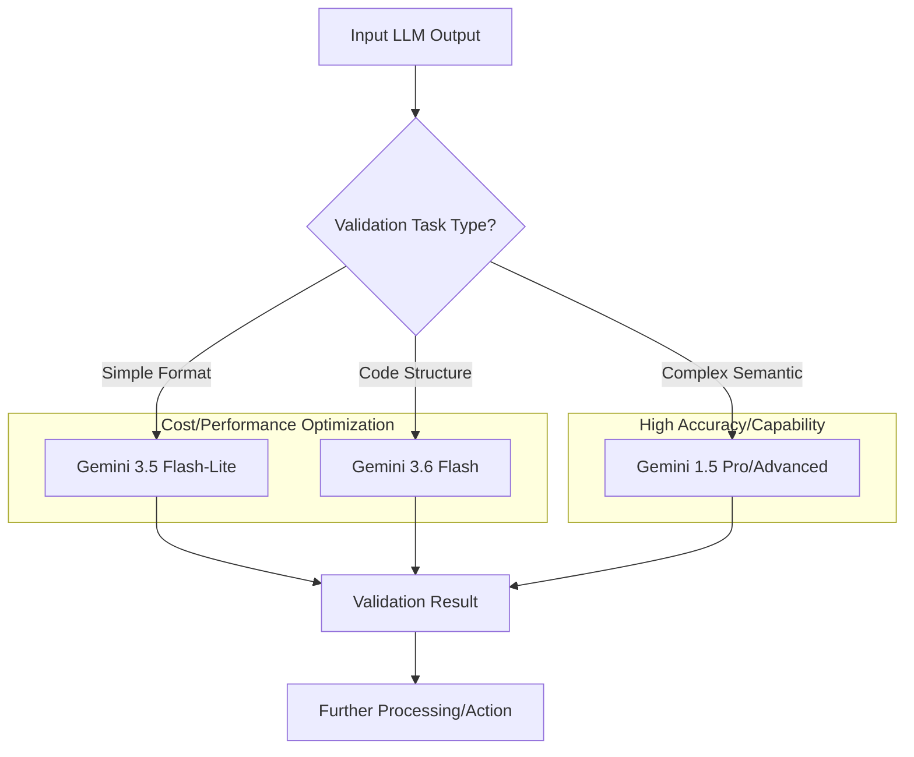

대규모 언어 모델(LLM) 기반 애플리케이션의 운영 비용과 성능은 비즈니스 성공에 직결되는 핵심 요소입니다. 특히 고빈도 호출이 발생하는 LLM 파이프라인에서는 미세한 지연 시간 증가나 토큰 비용 상승이 전체 시스템의 효율성을 저해할 수 있습니다. Google Gemini Flash 모델군(Gemini 3.6 Flash, 3.5 Flash-Lite 등)은 이러한 요구사항을 충족시키기 위해 낮은 지연 시간과 높은 비용 효율성에 초점을 맞춰 설계되었습니다.

## Gemini Flash 모델의 등장과 전략적 중요성

Gemini Flash 모델은 빠른 추론 속도와 최적화된 토큰 비용을 제공하여, 실시간 상호작용이 중요하거나 대량의 작업을 처리해야 하는 시나리오에 특히 적합합니다. 기존의 Gemini 모델들이 복잡한 추론과 고품질의 출력을 목표로 했다면, Flash 모델은 이러한 고품질을 유지하면서도 더 빠른 응답과 경제적인 운영을 가능하게 합니다. 이는 LLM의 적용 범위를 확장하고, 기존에는 비용이나 성능 제약으로 어려웠던 영역에 AI를 도입할 수 있는 기회를 제공합니다.

### 주요 특징 및 활용 시나리오

*   **Gemini 3.6 Flash**: 3.5 Flash 대비 향상된 코딩, 지식 작업, 멀티모달 성능을 제공하며 출력 토큰 사용량을 줄여 비용 절감에 기여합니다. 특히 복잡하지 않은 코드 생성, 요약, 분류, 정보 추출 등에 강점을 가집니다.
*   **Gemini 3.5 Flash-Lite**: 가장 경량화된 형태로, 극도로 낮은 지연 시간과 최소화된 비용이 요구되는 시나리오에 최적화되어 있습니다. 간단한 API 호출 응답, 실시간 사용자 인터페이스의 자동 완성, 기본적인 챗봇 응답 등 빠른 트랜잭션 처리에 유리합니다.

이러한 Flash 모델들은 특히 LLM 출력 검증 파이프라인과 같은 백그라운드 작업에서 빛을 발합니다. 검증 파이프라인은 시스템의 안정성과 신뢰성을 확보하는 데 필수적이지만, 자체적으로 비즈니스 로직에 직접적인 가치를 창출하기보다는 지원 역할에 가깝습니다. 따라서 이러한 파이프라인에서 발생하는 LLM 비용과 지연 시간을 최소화하는 것이 전체 시스템의 ROI를 극대화하는 데 중요합니다.

## LLM 출력 검증 파이프라인에 Gemini Flash 적용

기존 LLM 모델을 Gemini Flash로 교체하는 과정은 비교적 간단합니다. 주로 API 호출 시 `model` 파라미터만 변경하면 되지만, 출력 형식이나 토큰 사용량 패턴의 변화에 대한 면밀한 검토가 필요합니다.

### 코드 예시: Python API 호출 업데이트

아래 Python 코드는 `google.generativeai` 라이브러리를 사용하여 LLM 출력을 검증하는 간단한 파이프라인을 보여줍니다. 기존 `gemini-pro` 모델을 `gemini-3.5-flash-lite`로 변경하는 과정을 나타냅니다.

```python
import google.generativeai as genai
import os

genai.configure(api_key=os.environ.get("GEMINI_API_KEY"))

def validate_llm_output(output_text: str, expected_format: str, model_name: str = "gemini-pro") -> bool:
    """
    LLM 출력이 특정 형식에 부합하는지 검증합니다.
    """
    prompt = f"""
    Verify if the following text adheres to the '{expected_format}' format.
    Respond with 'True' if it adheres, 'False' otherwise.

    Text to verify: {output_text}
    Expected format: {expected_format}
    """
    try:
        model = genai.GenerativeModel(model_name=model_name)
        response = model.generate_content(prompt)
        validation_result = response.text.strip().lower()
        return validation_result == 'true'
    except Exception as e:
        print(f"Error during validation with model {model_name}: {e}")
        return False

# 기존 모델 사용 예시
original_model_output = "{'status': 'success', 'data': []}"
print(f"Original model validation: {validate_llm_output(original_model_output, 'JSON object', model_name='gemini-pro')}")

# Gemini 3.5 Flash-Lite 모델로 업그레이드
flash_model_output = "{'status': 'error', 'message': 'invalid input'}"
print(f"Flash Lite model validation: {validate_llm_output(flash_model_output, 'JSON object', model_name='gemini-3.5-flash-lite')}")

# Gemini 3.6 Flash 모델로 업그레이드 (코딩 관련 검증에 유리)
code_snippet = "def add(a, b): return a + b"
print(f"Flash 3.6 model code validation: {validate_llm_output(code_snippet, 'Python function definition', model_name='gemini-3.6-flash')}")
```

### LLM 출력 검증 파이프라인의 모델 라우팅

복잡한 시스템에서는 단순히 모델을 교체하는 것을 넘어, 특정 조건에 따라 동적으로 모델을 라우팅하는 전략이 필요할 수 있습니다. 예를 들어, 간단한 형식 검증은 Flash-Lite로, 코드 구조 검증과 같이 약간의 추론이 필요한 경우는 3.6 Flash로, 고도로 복잡한 의미론적 검증은 Gemini 1.5 Pro와 같은 더 강력한 모델로 라우팅할 수 있습니다.



이러한 동적 라우팅은 각 모델의 강점을 최대한 활용하고, 전반적인 시스템 비용 효율성과 성능을 최적화하는 데 기여합니다.

## 트레이드오프

Gemini Flash 모델로 업그레이드하는 결정은 여러 트레이드오프를 고려해야 합니다.

*   **성능/비용 최적화 vs. 모델 범용성**: Gemini Flash는 특정 작업에 최적화되어 빠른 응답과 낮은 비용을 제공합니다. 하지만 `gemini-pro`나 `gemini-1.5-pro`와 같은 범용 모델이 제공하는 복잡한 추론 능력이나 광범위한 지식 활용 측면에서는 제한적일 수 있습니다. 언제 좋고: 실시간 응답, 반복적인 단순 검증, 대량 데이터 처리에서 비용 절감이 중요할 때. 언제 나쁜지: 심층적인 분석, 창의적 글쓰기, 복잡한 문제 해결 등 높은 인지 능력이 요구될 때.
*   **낮은 지연 시간 vs. 응답의 깊이/정교함**: Flash 모델은 빠른 응답을 위해 내부적으로 경량화된 구조를 가집니다. 이는 때때로 답변의 깊이나 복잡한 뉘앙스를 포착하는 능력에서 더 큰 모델보다 떨어질 수 있습니다. 언제 좋고: 응답 속도가 SLA의 핵심이거나, 출력 길이가 짧고 예측 가능한 작업. 언제 나쁜지: 모델의 '생각' 과정이 길어야 하거나, 다양한 관점을 통합해야 하는 정교한 응답이 필요할 때.
*   **빠른 개발/배포 vs. 미세 조정된 모델 성능**: Flash 모델은 out-of-the-box 성능이 뛰어나 신속한 개발 및 배포에 유리합니다. 그러나 특정 도메인에 대한 미세 조정(fine-tuning)이 필요한 경우, 더 큰 모델이 미세 조정에 더 잘 반응하거나 더 복잡한 사용자 정의를 허용할 수 있습니다. 언제 좋고: 표준적인 API 호출만으로 충분한 성능을 기대할 수 있는 광범위한 시나리오. 언제 나쁜지: 특정 산업 또는 비즈니스 로직에 특화된 고도로 정제된 출력이 필요하여 상당한 양의 사용자 정의 데이터로 미세 조정해야 할 때.

## 실전 체크리스트

Gemini Flash 모델로의 업그레이드를 성공적으로 수행하기 위한 실전 체크리스트입니다.

*   [ ] **API 변경 호환성 검증**: 기존 `model` 파라미터 외에 Flash 모델에 특화된 새로운 파라미터나 제약 사항이 없는지 확인하고, 클라이언트 라이브러리를 최신 버전으로 업데이트합니다.
*   [ ] **토큰 사용량 및 비용 모니터링 설정**: Flash 모델 전환 후 실제 토큰 사용량과 API 비용이 예상대로 절감되는지 지속적으로 모니터링하는 시스템을 구축합니다.
*   [ ] **LLM 출력 품질 검증 기준 재정립**: Flash 모델의 특성을 고려하여, 기존 출력 검증 파이프라인의 성공 기준(정확도, 일관성 등)이 여전히 유효한지 또는 재조정해야 하는지 평가합니다.
*   [ ] **지연 시간(Latency) 벤치마킹**: 업그레이드 전후의 평균 및 99%ile 지연 시간을 측정하여, 성능 개선 효과를 정량적으로 확인합니다. 특히 피크 로드 상황에서의 동작을 중요하게 검증합니다.
*   [ ] **오류 처리 및 폴백 전략 구현**: Flash 모델이 특정 복잡한 프롬프트에서 기대 이하의 성능을 보이거나 오류를 반환할 경우, 자동으로 상위 모델(예: `gemini-pro`)로 전환하거나 다른 처리 로직을 따르는 폴백 메커니즘을 설계합니다.
*   [ ] **환경별 모델 선택 로직 구현**: 개발, 스테이징, 프로덕션 환경에서 각각 다른 Flash 모델 또는 라우팅 전략을 적용할 수 있도록 환경 변수 또는 설정 파일을 통한 동적 모델 선택 로직을 구현합니다.
*   [ ] **A/B 테스트 또는 점진적 배포 계획 수립**: 실제 서비스에 미칠 영향을 최소화하기 위해 소수의 사용자 또는 특정 기능에 먼저 Flash 모델을 적용하고, 성능 및 안정성 지표를 확인하면서 점진적으로 확대하는 전략을 수립합니다.