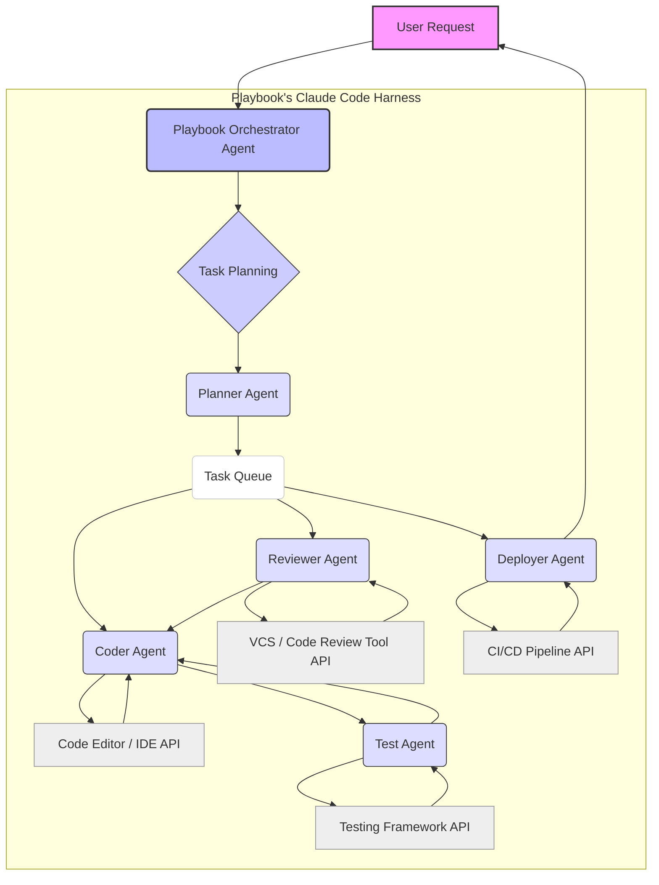

GLM-5.2의 공식 하네스인 ZCode는 개발 프로세스 전반에 걸쳐 AI 에이전트와 개발 도구를 통합하여 계획, 코딩, 리뷰, 배포를 단일 흐름으로 처리하는 혁신적인 접근 방식을 제시합니다. 특히 ZCode 3.0은 GLM-5.2에 최적화된 멀티 에이전트 협업과 추론·코딩 작업에서의 LLM 통합을 강조하며, 이는 Claude Code 하네스를 사용하는 playbook의 아키텍처 고도화 및 워커 자동화 복리 프로세스 통합에 중요한 통찰을 제공합니다.

## ZCode의 핵심 패턴 분석: 멀티 에이전트 협업 및 도구 통합

ZCode는 `multi-agent collaboration`과 `seamless tool integration`이라는 두 가지 핵심 기둥 위에서 구축됩니다. 개발 생명주기의 각 단계에 특화된 에이전트들이 유기적으로 협력하여 복잡한 소프트웨어 개발 작업을 자동화합니다.

### 멀티 에이전트 협업 모델
ZCode의 멀티 에이전트 시스템은 다음과 같은 방식으로 작동합니다:
*   **역할 분담 (Role Specialization)**: 플래너(Planner), 코더(Coder), 리뷰어(Reviewer), 배포자(Deployer) 등 각 에이전트는 특정 개발 단계에 최적화된 역할을 수행합니다.
*   **명확한 통신 프로토콜 (Clear Communication Protocols)**: 에이전트 간에는 표준화된 메시지 형식과 프로토콜을 사용하여 정보 교환의 효율성과 정확성을 보장합니다. 이는 작업의 순서, 상태, 결과 등을 공유하는 데 필수적입니다.
*   **공유 컨텍스트 관리 (Shared Context Management)**: 모든 에이전트가 접근할 수 있는 `persistent memory` 또는 `shared knowledge base`를 통해 프로젝트 상태, 코드 베이스 정보, 요구사항 등을 일관되게 유지합니다. 이를 통해 각 에이전트는 최신 정보를 바탕으로 의사결정을 내릴 수 있습니다.

### 개발 도구 통합 전략
ZCode는 기존 개발 도구들과의 강력한 통합을 통해 에이전트의 작업 범위를 확장합니다.
*   **API 기반 통합 (API-driven Integration)**: IDE, 버전 관리 시스템 (VCS), CI/CD 파이프라인, 이슈 트래커 등 다양한 개발 도구의 API를 활용하여 에이전트가 직접 코드를 수정하고, 커밋을 생성하며, Pull Request를 열고, 테스트를 실행하고, 배포를 트리거할 수 있게 합니다.
*   **스크립트/CLI 래핑 (Script/CLI Wrapping)**: 복잡한 도구 호출은 `wrapper scripts` 또는 `CLI commands`를 통해 추상화되어 에이전트가 쉽게 활용할 수 있도록 합니다. 이는 도구 의존성을 줄이고 에이전트의 재사용성을 높이는 데 기여합니다.
*   **자동화된 피드백 루프 (Automated Feedback Loops)**: 도구 실행 결과 (예: 테스트 통과/실패, 빌드 성공/실패)는 에이전트에게 실시간으로 피드백되어 `self-correction` 및 `adaptive planning`을 가능하게 합니다. 이는 2026년 `AI-driven development`의 핵심 트렌드입니다.

## Playbook의 Claude Code 하네스 개선 방안

ZCode의 패턴을 playbook의 Claude Code 하네스에 적용하여 아키텍처를 고도화하고 `worker automation`의 `compounding process`를 통합할 수 있습니다.

### 아키텍처 고도화
*   **`Orchestrator Agent` 도입**: `Playbook Agent`가 직접 모든 작업을 처리하기보다, `Orchestrator Agent`를 두어 하위 `Worker Agent`들에게 작업을 위임하고 조율하게 합니다. 이는 `task planning`, `resource allocation`, `dependency management`를 효율화합니다.
*   **`Modular Tooling Interface` 확장**: `Claude Code`가 외부 개발 도구를 보다 유연하게 통합할 수 있도록 `plugin-based architecture`를 강화합니다. 각 도구는 표준화된 인터페이스를 통해 연결되며, 에이전트는 필요한 도구를 `dynamic tool selection`을 통해 호출합니다.
*   **`Unified Context Store` 구현**: 프로젝트의 `source code`, `issue reports`, `design documents`, `test results` 등을 저장하는 중앙 집중식 `knowledge graph` 또는 `vector database`를 구축하여 모든 에이전트가 일관된 최신 컨텍스트에 접근할 수 있도록 합니다. 이는 `hallucination reduction`에 기여합니다.

### 워커 자동화 복리 프로세스 통합
ZCode의 연속적인 개발 흐름처럼, `Claude Code` 하네스도 `worker automation`을 위한 복리 프로세스를 구축해야 합니다.
*   **`Iterative Refinement Loop`**: 에이전트가 수행한 작업의 결과를 지속적으로 평가하고, 그 피드백을 바탕으로 다음 작업의 품질을 향상시키는 `closed-loop automation`을 설계합니다. 예를 들어, `code review agent`의 피드백을 `coding agent`가 즉시 반영하여 코드 품질을 개선합니다.
*   **`Automated Skill Learning`**: 에이전트가 반복적인 작업을 통해 새로운 패턴이나 최적화된 접근 방식을 학습하고, 이를 `knowledge base`에 축적하여 향후 작업에 활용하는 `self-improving agent` 메커니즘을 도입합니다.
*   **`Proactive Monitoring & Self-Healing`**: 자동화된 워커 프로세스에서 발생하는 오류나 비정상적인 동작을 `real-time monitoring`하고, `diagnose agent`가 이를 감지하여 `recovery agent`가 자동으로 문제를 해결하거나 `human intervention`을 요청하는 시스템을 구축합니다.

아래 Mermaid 다이어그램은 ZCode에서 영감을 받은 `Playbook's Claude Code Harness`의 고도화된 아키텍처를 보여줍니다.



### 코드 예시: Playbook Multi-Agent Orchestration (Python)

다음은 ZCode 패턴을 모방한 Playbook `Orchestrator`와 `Worker Agent`의 간단한 Python 예시입니다. 이 예시는 `Orchestrator`가 작업을 분배하고 `Coder Agent`가 코딩을 수행하며 `Reviewer Agent`가 이를 검토하는 과정을 보여줍니다.

```python
import json

class Agent:
    def __init__(self, name):
        self.name = name

    def execute_task(self, task_description, context):
        raise NotImplementedError

class CoderAgent(Agent):
    def execute_task(self, task_description, context):
        print(f"[{self.name}] Received task: '{task_description}'")
        # Simulate code generation based on task_description and context
        generated_code = f"# Code for {task_description}\nprint('Hello from {context.get('project', 'unknown project')}')"
        print(f"[{self.name}] Generated code.\n---\n{generated_code}\n---")
        return {"status": "completed", "output": generated_code, "agent": self.name}

class ReviewerAgent(Agent):
    def execute_task(self, task_description, context):
        print(f"[{self.name}] Reviewing code for: '{task_description}'")
        code_to_review = context.get("code_to_review", "")
        if "print('Hello" in code_to_review:
            review_comment = "Looks like a basic 'Hello World' type output. Consider adding error handling."
            status = "needs_refinement"
        else:
            review_comment = "Code looks good based on basic checks."
            status = "approved"
        print(f"[{self.name}] Review comment: {review_comment}")
        return {"status": status, "output": review_comment, "agent": self.name}

class PlaybookOrchestrator:
    def __init__(self):
        self.agents = {
            "coder": CoderAgent("CoderAgent_1"),
            "reviewer": ReviewerAgent("ReviewerAgent_1")
        }
        self.context = {"project": "MyWebApp", "current_task_id": "task-001"}

    def run_workflow(self, initial_task):
        print(f"[Orchestrator] Starting workflow for: '{initial_task}'")
        
        # 1. Coding phase
        coder_result = self.agents["coder"].execute_task(initial_task, self.context)
        self.context["code_to_review"] = coder_result["output"]
        
        # 2. Review phase
        reviewer_result = self.agents["reviewer"].execute_task(initial_task, self.context)
        
        if reviewer_result["status"] == "needs_refinement":
            print(f"[Orchestrator] Code needs refinement. Triggering re-coding...\n{reviewer_result['output']}")
            # This would ideally loop back to coder with refinement context
            # For simplicity, we'll just acknowledge.
        else:
            print(f"[Orchestrator] Code approved.\n{reviewer_result['output']}")

        print("[Orchestrator] Workflow completed.")

# --- Workflow Execution ---
orchestrator = PlaybookOrchestrator()
orchestrator.run_workflow("Implement a basic 'Hello World' API endpoint")
```

## 트레이드오프

ZCode 패턴을 활용한 하네스 개선에는 다음과 같은 트레이드오프가 존재합니다.

*   **복잡성 증가 vs. 기능성 확장**: 멀티 에이전트 시스템과 다양한 도구 통합은 초기 설계 및 구현의 복잡성을 크게 증가시킵니다. 하지만 이는 `end-to-end automation`의 폭과 깊이를 확장하여 장기적으로 개발 생산성을 비약적으로 향상시킵니다.
    *   **언제 좋은가**: 고도로 반복적이고 복잡한 개발 워크플로우를 자동화하여 인간 개입을 최소화하려는 경우.
    *   **언제 나쁜가**: 간단하고 단발적인 스크립트 기반 자동화로 충분한 소규모 프로젝트나 PoC 단계에서.

*   **오버헤드 발생 vs. 견고성 확보**: 에이전트 간 통신, 컨텍스트 관리, 도구 호출 오케스트레이션 등은 추가적인 컴퓨팅 리소스 및 Latency 오버헤드를 발생시킬 수 있습니다. 반면, 이는 각 에이전트의 실패에 대한 `fault tolerance`를 높이고 `self-healing capabilities`를 통해 전체 시스템의 견고성을 확보합니다.
    *   **언제 좋은가**: 프로덕션 환경에서 `high reliability`와 `resilience`가 요구되는 미션 크리티컬한 개발 및 운영 자동화에.
    *   **언제 나쁜가**: `real-time performance`가 매우 중요하며 `latency-sensitive`한 작업에, 또는 자원 제약이 심한 환경에.

*   **통합 노력 vs. 생태계 활용**: 기존 개발 도구들과의 심층적인 통합은 상당한 개발 및 유지보수 노력이 필요합니다. 그러나 이는 이미 잘 구축된 `developer ecosystem`의 기능을 `AI agent`가 직접 활용할 수 있게 하여, 새로운 기능을 처음부터 개발하는 대신 기존 솔루션의 `leveraging`을 가능하게 합니다.
    *   **언제 좋은가**: 광범위한 `developer tools` 및 `services`를 에이전트 워크플로우에 포함시켜 `AI`의 영향력을 극대화하려는 경우.
    *   **언제 나쁜가**: 특정 도구에 대한 의존성이 낮거나, 통합하려는 도구가 `well-documented API`를 제공하지 않아 `integration complexity`가 과도한 경우.

## 실전 체크리스트

Playbook의 Claude Code 하네스에 ZCode 패턴을 적용할 때 다음 항목들을 검증해야 합니다.

- [ ] `Playbook Orchestrator Agent`의 역할 및 책임이 명확히 정의되고, `Worker Agent`와의 통신 프로토콜이 표준화되었는가?
- [ ] 새로운 `Modular Tooling Interface`가 설계되었고, 최소 3개 이상의 핵심 개발 도구 (`VCS`, `IDE`, `CI/CD`)와 `API 기반`으로 통합되었는가?
- [ ] `Unified Context Store` 또는 `Knowledge Graph`가 구축되었으며, 모든 에이전트가 `read/write access`를 통해 일관된 `project context`를 공유하는지 검증되었는가?
- [ ] `Iterative Refinement Loop`가 최소 하나의 개발 워크플로우 (예: 코드 생성 -> 코드 리뷰 -> 코드 수정)에 적용되어 `closed-loop automation`이 작동하는지 확인되었는가?
- [ ] `Worker Agent`의 `Automated Skill Learning`을 위한 메커니즘 (예: `successful task execution` 로그 분석, `human feedback` 학습)이 설계되었으며, `knowledge base` 업데이트 주기가 정의되었는가?
- [ ] `Proactive Monitoring` 시스템이 `multi-agent workflow`의 `runtime errors` 및 `anomalies`를 실시간으로 감지하고, `recovery agent`가 자동 복구 또는 알림을 트리거하는지 테스트되었는가?
- [ ] `Harness` 개선 후 `code generation quality`, `workflow completion rate`, `human intervention` 빈도 등 핵심 `KPI`를 측정하기 위한 `baseline`이 설정되었고, `A/B 테스트` 계획이 수립되었는가?