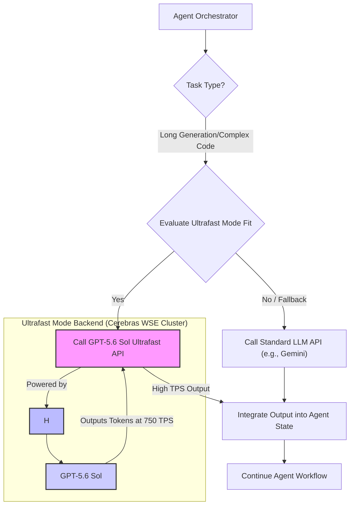

## GPT-5.6 Ultrafast Mode: Agent Output Speed 최적화

OpenAI와 Cerebras의 GPT-5.6 Sol Ultrafast Mode는 에이전트 시스템 성능의 새로운 지평을 엽니다. 초당 최대 750토큰의 출력 속도는 LLM 추론 병목을 획기적으로 개선하여, 에이전트의 응답성과 처리량을 극대화하는 핵심 기술입니다.

### Ultrafast Mode의 핵심 기술과 에이전트 아키텍처 영향

Ultrafast Mode는 Cerebras의 웨이퍼 크기 칩(WSE)에 탑재된 44GB SRAM을 활용, 모델 가중치 이동 병목을 제거하여 달성됩니다. GPT-5.6 Sol은 GPU 메모리 대역폭 제한 없이 대규모 데이터를 고속 처리하며, 이는 에이전트 워크플로우에 다음과 같은 혁신을 가져옵니다.

1.  **실시간 상호작용성**: 실시간 대화 및 복잡한 질의응답 시스템의 대기 시간 대폭 단축.
2.  **처리량 극대화**: 긴 문서 요약, 코드베이스 분석/리팩토링, 지식 허브 생성 등 토큰 집약적 작업의 병렬/순차 처리 가속화.
3.  **복잡한 추론 가속**: Agentic Workflow의 Context Compaction, Tool Use, Reflection 등 다단계 추론 과정의 LLM 호출 속도 향상.

### 에이전트 작업에의 적용 및 성능 측정

playbook 에이전트 환경에서 GPT-5.6 Sol Ultrafast Mode는 다음과 같은 시나리오에 유망합니다.

*   **긴 지식 허브 문서 생성**: 방대한 기술 문서, FAQ 등을 고품질로 빠르게 생성하여 정보 접근성 향상.
*   **복잡한 코드 스니펫/모듈 생성 및 수정**: 특정 요구사항에 맞는 코드 생성 또는 리팩토링 제안을 신속하게 제공, 개발 생산성 향상.
*   **데이터 요약 및 보고서 자동 생성**: 대량 로그, 비정형 텍스트에서 핵심 정보 추출 및 보고서 실시간 생성.

성능 측정은 초당 토큰 출력량(TPS), 작업 완료 시간(TTC), 총 비용 효율성(Cost Efficiency) 분석이 필수적입니다. 기존 Gemini 모델과의 비교 벤치마킹으로 Ultrafast Mode의 실제 가치를 정량적으로 평가해야 합니다.

```python
import openai
import time

# OpenAI API Key 설정 (실제 환경에서는 환경 변수 또는 보안 저장소 사용)
OPENAI_API_KEY = "YOUR_OPENAI_API_KEY"
openai.api_key = OPENAI_API_KEY

# GPT-5.6 Sol Ultrafast Mode를 가정한 API 호출 함수
# 실제 API 명칭 및 파라미터는 OpenAI의 공식 문서 참조 필요
def generate_with_ultrafast_mode(prompt: str, max_tokens: int = 1000) -> str:
    start_time = time.time()
    try:
        # 가상의 GPT-5.6 Sol Ultrafast Mode 모델 호출
        # service_tier 파라미터는 예시이며, 실제 API에서는 다른 방식으로 지정될 수 있음
        response = openai.Completion.create(
            model="gpt-5.6-sol-ultrafast", # 가상의 모델명
            prompt=prompt,
            max_tokens=max_tokens,
            temperature=0.7,
            service_tier="ultrafast" # 예시: Ultrafast Mode 활성화 파라미터
        )
        generated_text = response.choices[0].text
        end_time = time.time()
        
        tokens_generated = len(generated_text.split()) # 간단한 토큰 수 측정 (실제는 토크나이저 사용)
        duration = end_time - start_time
        tps = tokens_generated / duration if duration > 0 else 0
        
        print(f"Generated {tokens_generated} tokens in {duration:.2f} seconds ({tps:.2f} TPS)")
        return generated_text
    except Exception as e:
        print(f"Error calling GPT-5.6 Sol Ultrafast Mode: {e}")
        return ""

# 예제 사용
if __name__ == "__main__":
    example_prompt = "다음 주제에 대한 상세한 기술 블로그 초안을 작성해주세요: '초거대 AI 모델의 병렬 처리 아키텍처'."
    
    print("--- Generating with Ultrafast Mode ---")
    output = generate_with_ultrafast_mode(example_prompt, max_tokens=2500)
    print("\nGenerated Output Snippet:")
    print(output[:500] + "...") # 출력의 일부만 보여줌

```

### 에이전트 워크플로우에 Ultrafast Mode 통합

Ultrafast Mode는 에이전트 워크플로우의 특정 단계, 특히 대량의 텍스트 생성이 필요한 부분에 선택적으로 통합될 수 있습니다.



Mermaid 다이어그램은 Agent Orchestrator가 작업 유형을 판단하여 Ultrafast Mode의 적합성을 평가하고, 필요한 경우 GPT-5.6 Sol Ultrafast API를 호출하는 흐름을 보여줍니다. Cerebras WSE 인프라가 Ultrafast Mode 백엔드를 구동하며, GPT-5.6 Sol이 초고속으로 토큰을 출력하는 과정을 시각화합니다. 이를 통해 에이전트는 일반적인 LLM 호출과 Ultrafast Mode 호출을 유연하게 전환하며 최적의 성능을 달성할 수 있습니다.

### 트레이드오프

*   **비용 효율성 vs. 속도**:
    *   **좋을 때**: 응답 시간이 critical한 사용자 대면 에이전트, 대규모 문서 일괄 처리 등 처리량 증대가 직접적인 비즈니스 가치로 연결될 때.
    *   **나쁠 때**: 비용에 민감하거나, 실시간 응답이 중요하지 않은 백그라운드 작업, 또는 짧은 답변만 필요한 경우. 초당 토큰당 비용이 기존 모델보다 높을 수 있으므로 신중한 분석이 필요합니다.
*   **접근성 vs. 성능**:
    *   **좋을 때**: 제한된 고객에게 우선 제공되는 최신 기술을 통해 경쟁 우위를 확보하고, 혁신적인 에이전트 서비스를 빠르게 구현하고자 할 때.
    *   **나쁠 때**: 모든 고객이 바로 접근할 수 없으므로, 범용적인 솔루션 배포에는 제약이 따를 수 있습니다. 서비스의 안정적인 확장을 위해서는 일반 가용성을 기다려야 할 수 있습니다.
*   **품질 일관성 vs. 속도**:
    *   **좋을 때**: OpenAI는 품질 저하 없이 속도 향상을 주장하므로, 기존 GPT-5.6 Sol의 품질을 유지하면서 속도만 높일 수 있다면 모든 에이전트 작업에 유리합니다.
    *   **나쁠 때**: 실제 프로덕션 환경에서 미세한 품질 저하(예: 일관성, 사실성)가 발생할 가능성을 배제할 수 없으므로, 중요한 작업에는 추가적인 검증 단계가 필요할 수 있습니다.
*   **기술 의존성 vs. 최적화 잠재력**:
    *   **좋을 때**: 특정 클라우드 벤더의 최신 하드웨어 및 소프트웨어 스택에 대한 의존성을 감수하고서라도, 압도적인 성능 최적화를 통해 특정 비즈니스 문제를 해결하고자 할 때.
    *   **나쁠 때**: 벤더 종속성이 심화되어 장기적인 유연성이나 멀티 클라우드 전략에 제약을 줄 수 있습니다. 특정 인프라에 대한 lock-in 리스크를 감수해야 합니다.
*   **에이전트 복잡도 vs. 응답 시간**:
    *   **좋을 때**: 다단계 추론, 복잡한 Tool Use, 여러 에이전트 간 협업 등 구조적으로 응답 시간이 길어질 수밖에 없는 복잡한 에이전트 시스템의 전반적인 응답성을 획기적으로 개선할 수 있습니다.
    *   **나쁠 때**: 이미 응답 시간이 충분히 빠른 단순한 에이전트 작업의 경우, Ultrafast Mode 도입의 이점이 미미하거나, 오히려 추가 비용만 발생할 수 있습니다.

### 실전 체크리스트

*   [ ] OpenAI API Ultrafast Mode의 서비스 계층 접근 가능 여부를 확인하고, 필요한 경우 가용성 요청 프로세스를 완료합니다.
*   [ ] 현재 playbook 에이전트 워크플로우 내에서 초당 토큰 출력량(TPS)이 Critical 한 특정 작업(예: 긴 지식 허브 문서 생성, 복잡한 코드 스니펫 생성)을 식별합니다.
*   [ ] 식별된 작업에 대해 기존 Gemini 또는 다른 LLM 모델의 성능(TPS, TTC) 및 비용 효율을 측정하는 기준선(baseline) 벤치마킹을 수행합니다.
*   [ ] GPT-5.6 Sol Ultrafast Mode를 시범 적용하여 동일 작업에 대한 TPS 및 TTC를 측정하고, 기준선과 비교하여 성능 개선 폭을 정량적으로 평가합니다.
*   [ ] Ultrafast Mode 사용 시 예상되는 토큰당 비용 및 총 작업 비용을 분석하여, 성능 개선 대비 비용 효율성을 평가하고 예산 계획에 반영합니다.
*   [ ] Ultrafast Mode 출력의 품질 일관성을 검증하기 위한 자동화된 평가 지표(예: Hallucination Score, Coherence Score) 및 수동 검토 프로세스를 설계합니다.
*   [ ] 에이전트 시스템에 Ultrafast Mode를 통합할 때, 특정 작업 조건에서만 선택적으로 호출되도록 동적 라우팅 또는 Fallback 메커니즘을 구현합니다.