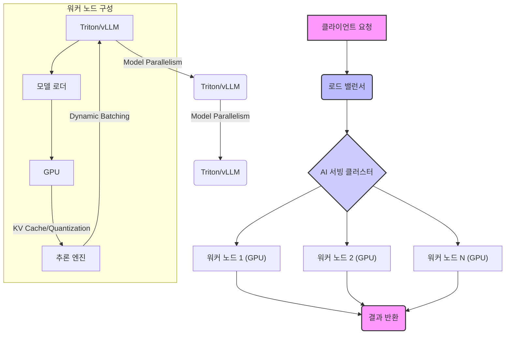

대규모 AI 모델, 특히 Large Language Models (LLMs) 및 Multimodal Models의 배포는 막대한 GPU 리소스를 요구하며, 이는 운영 비용과 직결된다. 모델 규모가 커질수록 inference latency는 증가하고 throughput은 감소하여 사용자 경험에 악영향을 미칠 수 있다. 따라서 GPU 리소스의 효율적인 최적화는 AI 서비스의 상업적 성공과 지속 가능성을 위한 필수적인 요소다. 본 엔트리에서는 대규모 AI 모델 서빙을 위한 GPU 리소스 최적화의 핵심 전략과 2026년 최신 트렌드를 다룬다.

## 핵심 개념 및 전략

### 1. 배치 처리 및 동적 배치 (Batching and Dynamic Batching)
AI 모델 추론에서 GPU 활용률을 높이는 가장 기본적인 방법은 여러 요청을 묶어 한 번에 처리하는 배치 처리(Batching)다. 고정 배치 사이즈(Fixed Batch Size)는 단순하지만, 요청 부하가 가변적일 때 리소스 낭비를 초래할 수 있다. 동적 배치(Dynamic Batching)는 실시간으로 들어오는 요청을 모아 최적의 배치 사이즈로 처리하여 GPU Utilization을 극대화한다.

### 2. 모델 양자화 (Model Quantization)
모델 양자화는 모델의 가중치와 활성화를 저정밀도(예: FP32에서 FP16, INT8, 또는 INT4)로 변환하여 모델 크기를 줄이고, 메모리 대역폭 사용량을 낮추며, 계산 속도를 높이는 기법이다. 정확도 손실을 최소화하면서 성능을 향상시키는 것이 목표다.

*   **FP16 (Half-precision floating point)**: 가장 일반적으로 사용되며, FP32 대비 메모리 및 연산 효율이 2배 증가한다. 대부분의 최신 GPU에서 네이티브로 지원된다.
*   **INT8 (8-bit integer)**: 더 큰 효율을 제공하지만, 정확도 손실이 발생할 가능성이 높다. Post-Training Quantization (PTQ)이나 Quantization-Aware Training (QAT) 기법이 활용된다.
*   **INT4 (4-bit integer)**: 최근 LLM에서 극도의 효율을 위해 연구되고 있으며, 정확도 보존이 더욱 어려운 도전 과제다.

### 3. 모델 병렬화 (Model Parallelism)
단일 GPU 메모리에 너무 큰 모델은 여러 GPU에 걸쳐 모델을 분할하여 로드해야 한다. 이를 모델 병렬화라고 한다.

*   **텐서 병렬화 (Tensor Parallelism)**: 모델의 각 레이어 내 텐서 연산을 여러 GPU로 분할하여 처리한다. 주로 행렬 곱셈과 같은 연산에서 사용된다.
*   **파이프라인 병렬화 (Pipeline Parallelism)**: 모델의 레이어들을 여러 그룹으로 나누고 각 그룹을 다른 GPU에 할당하여 파이프라인 형태로 추론을 진행한다. GPU 활용률을 높이기 위해 마이크로 배치(micro-batch) 개념이 도입되기도 한다.

### 4. 분산 추론 (Distributed Inference)
여러 서버와 GPU를 활용하여 대규모 모델을 추론하는 기법이다. DeepSpeed, Megatron-LM과 같은 라이브러리는 텐서 병렬화, 파이프라인 병렬화, 데이터 병렬화를 조합하여 효율적인 분산 추론을 지원한다.

### 5. 캐싱 전략 (Caching Strategies)
LLM 추론에서 KV Cache는 매 토큰 생성 시 이전 토큰들의 Key 및 Value 계산 결과를 캐싱하여 반복 계산을 방지한다. 스펙큘레이티브 디코딩(Speculative Decoding)은 작은 보조 모델로 빠르게 다음 토큰 시퀀스를 예측하고, 큰 모델은 예측된 시퀀스를 병렬로 검증하여 전체적인 추론 속도를 가속화한다.

### 6. GPU 스케줄링 및 리소스 할당 (GPU Scheduling and Resource Allocation)
클러스터 환경에서 GPU 리소스를 효율적으로 배분하는 것은 매우 중요하다. Kubernetes, Slurm과 같은 스케줄러는 AI 워크로드에 특화된 기능을 제공한다. NVIDIA MIG (Multi-Instance GPU)는 단일 GPU를 여러 개의 독립적인 GPU 인스턴스로 분할하여 다수의 워크로드가 공유 GPU 자원을 효율적으로 사용할 수 있게 한다.

### 7. 최신 서빙 프레임워크 활용 (Leveraging Modern Serving Frameworks)
Triton Inference Server, vLLM, TensorRT-LLM과 같은 전용 서빙 프레임워크는 위에 언급된 다양한 최적화 기법(동적 배치, KV 캐싱, 양자화)을 내장하고 있어, 개발자가 직접 구현할 필요 없이 고성능 추론을 가능하게 한다.

## 대규모 AI 모델 서빙 아키텍처 예시


## 코드 예제: PyTorch를 이용한 간단한 INT8 양자화
실제 프로덕션 환경에서는 TensorRT-LLM이나 ONNX Runtime 같은 최적화 런타임을 사용하지만, 여기서는 PyTorch의 `torch.quantization` 모듈을 이용한 간단한 양자화 개념을 보여준다.

```python
import torch
import torch.nn as nn
import torch.quantization

# 1. 예시 모델 정의
class SimpleModel(nn.Module):
    def __init__(self):
        super(SimpleModel, self).__init__()
        self.fc1 = nn.Linear(10, 5)
        self.relu = nn.ReLU()
        self.fc2 = nn.Linear(5, 2)

    def forward(self, x):
        x = self.fc1(x)
        x = self.relu(x)
        x = self.fc2(x)
        return x

# 모델 인스턴스 생성 및 학습된 가중치 로드 (가정)
model = SimpleModel()
model.eval() # 추론 모드로 전환

# 2. 양자화를 위한 모델 준비
# fuse_modules는 연속된 레이어를 하나로 묶어 양자화 효율을 높임
# 여기서는 간단히 ReLU를 Linear에 퓨징하지 않고, 모델 자체에 qconfig을 설정

# qconfig 정의: Quantization-Aware Training (QAT) 또는 Post-Training Quantization (PTQ) 설정
# 여기서는 PTQ 예시 (fp16 대신 int8으로)
model.qconfig = torch.quantization.get_default_qconfig('fbgemm') # x86 CPU 백엔드에 최적화된 QConfig

# 모델에 qconfig을 삽입하고 QuantStub/DeQuantStub 추가
model_fused = torch.quantization.fuse_modules(model, [['fc1', 'relu']]) # 예시를 위해 퓨징 추가
model_prepared = torch.quantization.prepare(model_fused)

# 3. 모델 보정 (Calibration) - PTQ의 핵심 단계
# 실제 데이터셋을 사용하여 모델을 실행하여 통계 정보를 수집
# 이 통계 정보는 각 레이어의 활성화 범위(min/max)를 결정하고, 이를 바탕으로 양자화 매핑을 생성함
print("모델 보정 중...")
with torch.no_grad():
    for _ in range(10): # 실제로는 충분한 데이터로 반복
        input_tensor = torch.randn(1, 10) # 더미 입력 데이터
        model_prepared(input_tensor)
print("모델 보정 완료.")

# 4. 모델 변환
model_quantized = torch.quantization.convert(model_prepared)

# 5. 양자화된 모델 사용
print("원본 모델:", model)
print("양자화된 모델:", model_quantized)

# 양자화된 모델 추론 예시
input_data = torch.randn(1, 10)
output_original = model(input_data)
output_quantized = model_quantized(input_data)

print("원본 모델 출력:", output_original)
print("양자화된 모델 출력:", output_quantized)

# 일반적으로 양자화는 GPU가 아닌 CPU에서 주로 이루어지거나, 
# 특정 하드웨어 가속기 (Tensor Cores 등)를 위한 포맷으로 변환됩니다.
# NVIDIA TensorRT나 ONNX Runtime 등의 툴체인을 통해 GPU 최적화된 양자화된 모델을 배포합니다.
```

## 2026년 트렌드 반영
2026년에는 대규모 AI 모델 서빙 최적화 분야에서 다음과 같은 트렌드가 두드러질 것으로 예상된다:

*   **하드웨어 발전**: NVIDIA Blackwell, AMD Instinct MI300 시리즈와 같은 차세대 GPU는 더 높은 Tensor Core 성능, 더 큰 메모리 대역폭, 더 효율적인 MIG 기능을 제공하여 추론 밀도를 극대화할 것이다. 특히, Blackwell의 FP4 및 FP6 형식 지원은 새로운 양자화 시대를 열 것으로 기대된다.
*   **AI 가속기 및 특화 칩**: GPU 외에도 AWS Trainium/Inferentia, Google TPU, Cerebras CS-2 등 AI 전용 가속기가 더욱 보편화되며, 특정 워크로드에 최적화된 솔루션들이 등장할 것이다.
*   **Universal Quantization Formats**: 다양한 하드웨어 백엔드에서 일관된 성능을 제공하는 universal quantization format 및 툴체인이 발전하여 모델 배포의 복잡성이 줄어들 것이다.
*   **MLSys 통합**: Kubernetes 기반의 MLOps 플랫폼이 더욱 성숙해지면서, GPU 스케줄링, 오토스케일링, 멀티테넌시 관리 기능이 더욱 정교해질 것이다. 특히 서버리스(Serverless) GPU 추론 환경이 확산될 것이다.
*   **Adaptive Inference**: 요청 부하, 모델 복잡성, 사용자 Latency 요구사항에 따라 동적으로 모델 버전, 양자화 레벨, 병렬화 전략을 전환하는 Adaptive Inference 시스템이 등장할 것이다.
*   **멀티모달리티 및 에이전틱 AI**: 이미지, 비디오, 오디오를 처리하는 멀티모달 모델과 자율 에이전트 모델의 등장은 GPU 리소스 최적화에 새로운 도전과 기회를 제공할 것이다. 이러한 모델들은 다양한 형태의 데이터를 효율적으로 처리하기 위한 새로운 캐싱 및 병렬화 전략을 요구한다.

## 트레이드오프

### 1. 양자화 (Quantization)
*   **언제 좋음**: 메모리 사용량을 크게 줄이고 추론 속도를 높여 비용 효율적인 서빙이 필요할 때 좋다. 특히 Edge 디바이스나 리소스 제약이 있는 환경에서 유용하다.
*   **언제 나쁨**: 일반적으로 모델의 정확도 손실이 발생할 수 있다. 미세한 정확도 저하가 치명적인 응용 분야(예: 의료 진단, 금융 예측)에서는 신중하게 접근해야 한다.

### 2. 동적 배치 (Dynamic Batching)
*   **언제 좋음**: 가변적인 요청 부하에 유연하게 대응하여 GPU Utilization을 극대화할 때 좋다. Throughput을 높이고 Latency를 낮추는 데 효과적이다.
*   **언제 나쁨**: 배치 대기 시간(Batching Latency)이 발생할 수 있어, 극도로 낮은 Latency가 요구되는 실시간 응용(예: 자율주행)에서는 Trade-off를 고려해야 한다. 너무 작은 요청에 대해서는 오히려 오버헤드가 될 수 있다.

### 3. 모델 병렬화 (Model Parallelism)
*   **언제 좋음**: 단일 GPU에 로드할 수 없는 초대형 모델(예: 100B+ 파라미터 LLM)을 서빙해야 할 때 필수적이다. 여러 GPU를 활용하여 메모리 한계를 극복한다.
*   **언제 나쁨**: 여러 GPU 간의 통신 오버헤드가 발생하여 단일 GPU에서 실행 가능한 모델에 비해 Latency가 증가할 수 있다. 구현 및 디버깅 복잡성이 높다.

### 4. 캐싱 전략 (KV Cache, Speculative Decoding)
*   **언제 좋음**: LLM의 시퀀스 생성 Latency를 크게 줄여 사용자 경험을 향상시키고 Throughput을 높일 때 좋다. 특히 긴 시퀀스 생성 시 매우 효과적이다.
*   **언제 나쁨**: KV Cache는 상당한 GPU 메모리를 소비한다. 배치 사이즈가 크고 시퀀스 길이가 길어질수록 메모리 부족 현상을 야기할 수 있어, 메모리 효율성과 Latency 사이의 균형을 찾아야 한다.

### 5. 최신 서빙 프레임워크 (vLLM, TensorRT-LLM)
*   **언제 좋음**: 자체적으로 복잡한 최적화 기법들을 구현할 필요 없이 높은 성능을 달성할 수 있다. 개발 시간 단축 및 안정적인 운영에 기여한다.
*   **언제 나쁨**: 특정 프레임워크에 대한 종속성이 발생할 수 있다. 프레임워크의 제한된 기능이나 특정 하드웨어/소프트웨어 스택에 대한 의존성으로 인해 유연성이 저하될 수 있다. 최신 모델이나 커스텀 레이어 지원이 늦어질 수 있다.

## 실전 체크리스트

대규모 AI 모델 서빙을 위한 GPU 리소스 최적화 전략을 프로젝트에 적용할 때 다음 항목들을 검증한다.

- [ ] **모델 프로파일링**: 대상 모델의 GPU 메모리 사용량, 연산량(FLOPs), 추론 Latency를 다양한 배치 사이즈와 시퀀스 길이에 대해 측정했는가?
- [ ] **양자화 전략 수립**: 모델의 정확도 허용 범위와 하드웨어 지원 여부를 고려하여 FP16, INT8, INT4 중 최적의 양자화 레벨을 결정하고 적용했는가?
- [ ] **서빙 프레임워크 선택**: Triton Inference Server, vLLM, TensorRT-LLM 등 최신 고성능 서빙 프레임워크를 모델 및 인프라 스택에 맞춰 도입했는가?
- [ ] **GPU 리소스 할당 최적화**: Kubernetes, NVIDIA MIG 등을 활용하여 GPU 리소스를 세분화하고, 워크로드 스케줄링 및 오토스케일링 정책을 구현했는가?
- [ ] **KV Cache 및 Speculative Decoding 활용**: LLM 서빙 시 KV Cache 및 가능한 경우 Speculative Decoding을 적용하여 Latency와 Throughput 개선 효과를 검증했는가?
- [ ] **분산 추론 아키텍처 설계**: 단일 GPU 한계를 넘어서는 초대형 모델의 경우, Tensor Parallelism, Pipeline Parallelism 등을 활용한 분산 추론 아키텍처를 설계하고 구현했는가?
- [ ] **성능 모니터링 및 Alerting**: GPU Utilization, 메모리 사용량, Latency, Throughput 등 핵심 메트릭을 실시간으로 모니터링하고, 이상 감지 시 Alerting 시스템을 구축했는가?