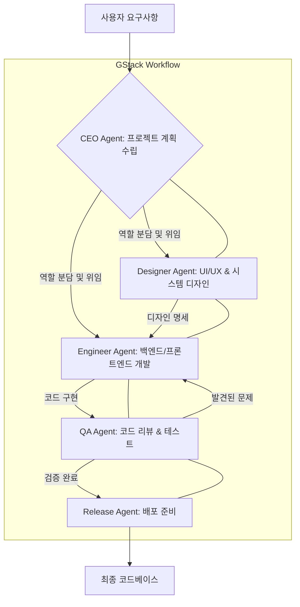

## GStack 프레임워크: AI 에이전트 협업 및 역할 분담 강화를 위한 아키텍처 패턴

GStack은 Y Combinator의 개리 탄(Garry Tan)이 개발한 오픈소스 AI 에이전트 프레임워크로, LLM을 활용하여 '가상 소프트웨어 팀'을 구성, 복잡한 개발 작업을 수행한다. CEO, 디자이너, 엔지니어, QA 담당자처럼 에이전트들이 각자 역할을 분담하여 협업하도록 설계되었다.

### GStack의 핵심 아키텍처 및 역할 분담

GStack의 핵심은 '스킬 팩(skill pack)' 기반의 명확한 에이전트 역할 분담이다. 각 에이전트는 특정 도메인 지식과 실행 능력을 가진 스킬 팩을 보유하며, CEO, 엔지니어, QA 등 각자 역할을 수행한다. 이는 단일 LLM의 컨텍스트 혼란을 해결하고, 멀티-에이전트 시스템(Multi-Agent System)을 구현하여 효율성과 결과물 품질을 극대화한다. 이는 2026년 AI 개발의 핵심 트렌드이다.

### Claude Code 하네스와의 통합 전략

기존 Claude Code 하네스를 GStack 프레임워크 기반으로 재구성하여 에이전트 역할 분담 및 협업을 강화할 수 있다. 단일 Claude 모델 워크플로우를 GStack 패턴으로 마이그레이션하여, 각 단계별로 특화된 에이전트를 도입하고 상호작용을 통해 더 정교하고 견고한 결과물을 얻는다. 이는 요구사항 분석, 설계, 구현, 테스트 등에서 최적화된 프롬프트와 외부 도구를 활용한다.



위 Mermaid 다이어그램은 GStack 기반의 다중 에이전트 협업 워크플로우를 보여준다.

### GStack 에이전트 정의 예시 (Python)

GStack은 Python 기반으로 에이전트와 스킬 팩을 정의한다. 다음은 간단한 스킬 팩과 에이전트 정의 예시이다.

```python
# gstack_agent_definitions.py

from gstack import Agent, SkillPack, Tool

# 스킬 팩 정의
class CodeGenerationSkillPack(SkillPack):
    name = "CodeGeneration"
    description = "Capable of generating Python or JavaScript code."
    tools = [
        Tool(name="write_file", description="Writes content to a file."),
        Tool(name="read_file", description="Reads content from a file.")
    ]

class CodeReviewSkillPack(SkillPack):
    name = "CodeReview"
    description = "Capable of reviewing code for issues."
    tools = [
        Tool(name="analyze_code", description="Performs static analysis."),
        Tool(name="suggest_fix", description="Suggests code changes.")
    ]

# 에이전트 정의
class EngineerAgent(Agent):
    name = "Engineer"
    role = "Implements code based on design specs."
    goal = "Deliver high-quality code."
    skill_packs = [CodeGenerationSkillPack]
    llm_model = "claude-3-opus-20240229"

class QAAgent(Agent):
    name = "QA"
    role = "Ensures code quality."
    goal = "Validate code correctness."
    skill_packs = [CodeReviewSkillPack]
    llm_model = "claude-3-sonnet-20240229"
```

이 예시는 GStack이 에이전트와 스킬 팩을 정의하는 방식을 보여준다. 실제 GStack은 오케스트레이션 로직, 메모리 관리, 피드백 루프 등을 내장한다.

## 트레이드오프

### 복잡도 증가 vs. 제어 및 확장성
*   **언제 좋은가**: 복잡한 비즈니스 로직이나 다단계 워크플로우에서 명확한 역할 분담과 모듈화를 통해 개발 및 유지보수 효율성을 높일 수 있다. LLM 기반 시스템의 예측 불가능성을 관리하고 디버깅 가시성을 확보할 때 유리하다.
*   **언제 나쁜가**: 단순하고 단일 LLM으로 충분한 소규모 태스크에는 과도한 오버헤드를 초래한다. 초기 설정 및 에이전트 간 통신 프로토콜 정의에 추가 리소스가 필요하다.

### 에이전트 간 통신 오버헤드 vs. 협업 품질
*   **언제 좋은가**: 여러 에이전트가 각자의 전문성을 바탕으로 정보를 교환하고 작업을 이어나갈 때, 결과물의 품질과 일관성을 높일 수 있다.
*   **언제 나쁜가**: 통신 메커니즘이 비효율적으로 설계되거나 불필요한 정보 교환이 많아질 경우, 전체 워크플로우의 지연 시간을 증가시키고 리소스 사용량을 높일 수 있다.

### 초기 학습 곡선 vs. 장기적 생산성
*   **언제 좋은가**: 장기적으로 AI 기반 개발 파이프라인의 자동화 수준을 높이고 반복적인 작업을 표준화하여 엔지니어링 리소스를 절감하려는 경우, 초기 투자 대비 높은 생산성 향상을 기대할 수 있다.
*   **언제 나쁜가**: 단기간 내 프로토타입을 완성해야 하거나 팀원들이 에이전트 프레임워크 경험이 부족할 경우, 초기 학습 및 도입 비용이 부담될 수 있다.

### 자율성 강화 vs. 통제력 저하 가능성
*   **언제 좋은가**: 잘 정의된 목표와 제약 조건 내에서 에이전트가 자율적으로 판단하고 작업을 수행하도록 함으로써, 인간의 개입을 최소화하고 개발 속도를 높일 수 있다.
*   **언제 나쁜가**: 에이전트의 자율성이 너무 강하거나 안전 장치(guardrails)가 미흡할 경우, 예상치 못한 행동이나 잘못된 결과물을 생성할 위험이 있다. 중요한 의사 결정에는 인간의 감독이 필수적이다.

## 실전 체크리스트

GStack 프레임워크를 프로젝트에 적용하기 전에 다음 항목들을 검토한다.

*   [ ] **핵심 워크플로우 식별 및 분해**: 현재 수동 또는 단일 LLM으로 비효율적인 핵심 개발 워크플로우를 식별하고, GStack의 다중 에이전트 패턴으로 분해 가능한지 분석했는가?
*   [ ] **에이전트 역할 및 책임 명확화**: 각 에이전트의 역할, 목표, 책임 범위를 명확히 정의하고, 각 역할이 특정 '스킬 팩'에 매핑될 수 있는가?
*   [ ] **스킬 팩 및 도구 설계**: 각 에이전트가 사용할 스킬 팩과 필요한 API 및 라이브러리 연동 계획을 수립했는가?
*   [ ] **에이전트 간 통신 프로토콜 정의**: 에이전트 간 정보 교환 방식(데이터 형식, 통신 채널, 피드백 루프)을 설계하고, 비효율적인 정보 전달을 방지할 메커니즘을 고려했는가?
*   [ ] **성능 및 비용 효율성 검증 계획**: POC 단계에서 GStack 기반 워크플로우가 기존 방식 대비 성능 및 LLM 호출 비용 측면에서 효율적인지 측정하고 검증할 계획을 수립했는가?
*   [ ] **오류 처리 및 재시도 전략 구현**: 에이전트 간 통신 오류, LLM 실패 등 발생 가능한 문제에 대한 오류 처리 및 재시도 전략을 설계에 반영했는가?
*   [ ] **보안 및 규정 준수 검토**: 에이전트가 접근하는 데이터의 민감성, 외부 도구 연동 시의 보안 취약점, 그리고 준수해야 할 규정(GDPR, PII 등)을 검토하고 필요한 보안 장치를 마련했는가?