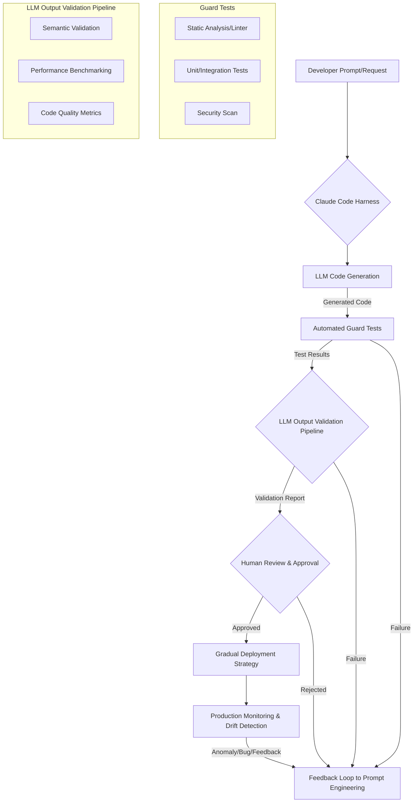

## Responsible Vibe Coding 개념과 필요성
Vibe coding은 LLM (Large Language Model)에게 코드 작성을 전적으로 위임하고 개발자는 생성된 코드의 존재 자체를 잊는 Andrej Karpathy의 정의에서 출발합니다. 그러나 프로덕션 환경에서 이러한 방식은 예측 불가능한 버그, 보안 취약성, 유지보수성 저하 등의 심각한 위험을 초래할 수 있습니다. Anthropic의 Eric은 이러한 위험을 완화하고 AI 기반 코드 생성을 안전하게 활용하기 위한 '책임감 있는 바이브 코딩 (Responsible Vibe Coding)' 전략을 제시했습니다. 이는 단순히 코드를 많이 생성하는 것을 넘어, 생성된 코드의 신뢰성과 안정성을 체계적으로 검증하고 관리하는 접근 방식입니다.

Claude Code Harness는 LLM이 코드를 생성하고 이를 시스템에 통합하는 과정을 자동화하는 프레임워크입니다. 이 하네스에 책임감 있는 바이브 코딩 원칙을 도입함으로써, 코드 생성 단계의 안정성과 신뢰도를 획기적으로 향상시킬 수 있습니다. 특히 LLM 출력 검증 파이프라인 (LLM Output Validation Pipeline)을 강화하는 것이 핵심입니다.

## Claude Code Harness 내 책임감 있는 바이브 코딩 구현
책임감 있는 바이브 코딩은 다음의 핵심 원칙들을 Claude Code Harness의 워크플로우에 통합합니다.

### 1. Guard Test 패턴 도입
생성된 코드의 통합 전에 특정 조건을 만족하는지 검증하는 가드 테스트 (Guard Test)를 모든 LLM 코드 생성 작업의 필수 단계로 포함합니다. 이는 정적 분석 (static analysis), 린팅 (linting), 단위 테스트 (unit tests), 통합 테스트 (integration tests) 등을 아우릅니다.

```typescript
// Example: Simplified Guard Test within Claude Code Harness
import { executeLinter, runUnitTests, performSecurityScan } from './validation-modules';

interface GeneratedCodeOutput {
  code: string;
  filePath: string;
}

async function validateGeneratedCode(output: GeneratedCodeOutput): Promise<boolean> {
  console.log(`Validating code for ${output.filePath}`);

  // Step 1: Run Linter Guards
  const linterResult = await executeLinter(output.filePath, output.code);
  if (!linterResult.passed) {
    console.error(`Linter failed: ${linterResult.errors}`);
    return false;
  }

  // Step 2: Run Unit/Integration Test Guards (assuming tests are generated or pre-existing)
  const testResult = await runUnitTests(output.filePath, output.code);
  if (!testResult.passed) {
    console.error(`Unit tests failed: ${testResult.failures}`);
    return false;
  }

  // Step 3: Perform basic Security Scan Guard
  const securityScanResult = await performSecurityScan(output.code);
  if (!securityScanResult.passed) {
    console.error(`Security scan flagged issues: ${securityScanResult.issues}`);
    return false;
  }

  console.log('All guard tests passed successfully.');
  return true;
}

// Usage within harness
// const generatedCode = await claude.generateCode(prompt);
// const isCodeValid = await validateGeneratedCode({ code: generatedCode, filePath: 'src/components/newFeature.ts' });
// if (isCodeValid) { /* proceed to human review/deployment */ }
```

### 2. 점진적 채택 (Gradual Adoption) 전략
LLM이 생성한 코드는 즉시 프로덕션에 배포하지 않고, 점진적으로 채택하는 전략을 따릅니다. 이는 카나리 배포 (Canary Deployment), 다크 런치 (Dark Launch) 또는 A/B 테스트와 같은 방식으로 이루어집니다. 초기에는 제한된 사용자 그룹이나 특정 트래픽에만 노출시켜 실제 환경에서의 동작을 모니터링하고 피드백을 수집합니다.

### 3. LLM 출력 검증 강화
단순한 구문 검사를 넘어, LLM이 생성한 코드의 의미론적 정확성, 성능 영향, 보안 취약성 등을 깊이 있게 검증하는 파이프라인을 구축합니다. 이는 다음을 포함합니다.
*   **의미론적 검증**: 타입 체킹 (Type Checking), 정적 분석 도구 (e.g., SonarQube, Bandit), AST (Abstract Syntax Tree) 기반 분석을 통해 코드 로직의 유효성을 확인합니다.
*   **성능 분석**: 생성된 코드가 기존 시스템의 성능에 미치는 영향을 벤치마킹 (benchmarking)하고, 잠재적인 병목 현상 (bottlenecks)을 식별합니다.
*   **보안 취약점 스캔**: SAST (Static Application Security Testing) 도구를 통합하여 LLM이 실수로 도입할 수 있는 일반적인 보안 취약점을 탐지합니다.
*   **코드 품질 지표 측정**: 복잡도 (cyclomatic complexity), 응집도 (cohesion), 결합도 (coupling) 등 코드 품질 지표를 자동으로 측정하고 기준 미달 시 리젝션합니다.

### 4. Human-in-the-Loop 및 피드백 루프
자동화된 검증 단계를 거친 후에도, 중요한 코드 변경 사항에 대해서는 항상 개발자의 최종 검토 및 승인을 거치도록 합니다. 또한, 배포 후 모니터링 시스템에서 감지된 문제점이나 성능 저하에 대한 피드백을 LLM 학습 및 프롬프트 개선에 활용하는 지속적인 피드백 루프를 구축합니다.

## Claude Code Harness 워크플로우 다이어그램


## 2026년 최신 트렌드 반영
2026년에는 LLM 기반 코드 생성 시스템이 더욱 고도화될 것이며, 책임감 있는 바이브 코딩은 다음과 같은 트렌드를 통합해야 합니다.
*   **AI 기반 자가 복구 (Self-Healing) 코드**: 모니터링 시스템에서 감지된 오류를 기반으로 LLM이 스스로 코드를 수정하고, 해당 수정 사항 또한 엄격한 검증 파이프라인을 거쳐 적용됩니다.
*   **코드 컨텍스트 인지 (Context-Aware) LLM**: LLM이 코드베이스의 전반적인 아키텍처, 기존 패턴, 비즈니스 로직을 더 깊이 이해하여 더 일관되고 신뢰할 수 있는 코드를 생성하도록 프롬프트 엔지니어링이 고도화됩니다.
*   **블록체인 기반 코드 무결성 검증**: 중요한 코드 모듈에 대해 블록체인 기술을 활용하여 생성 및 변경 이력의 불변성 (immutability)과 무결성을 보장하여, Supply Chain Security를 강화합니다.
*   **제로 트러스트 (Zero Trust) 원칙 적용**: LLM 생성 코드뿐만 아니라, LLM 자체의 출처와 학습 데이터에 대한 신뢰도를 지속적으로 검증하는 제로 트러스트 보안 모델이 적용됩니다.

## 트레이드오프

*   **높은 초기 설정 비용 vs. 장기적 안정성 및 생산성**: 책임감 있는 바이브 코딩 파이프라인 구축은 초기에는 상당한 시간과 자원 투자가 필요합니다. (언제 좋고) 복잡하거나 장기적으로 유지보수될 대규모 프로젝트에서 코드 품질 및 안정성 확보에 매우 유리합니다. (언제 나쁜지) 단기적인 POC (Proof of Concept)나 매우 작은 스크립트에는 오버헤드가 클 수 있습니다.
*   **코드 생성 속도 저하 vs. 결함 감소**: 여러 검증 단계를 거치면서 코드 생성부터 배포까지의 사이클 시간이 늘어날 수 있습니다. (언제 좋고) 고품질의 버그 없는 코드가 중요한 시스템 (금융, 의료 등)에 적합하며, 장기적인 유지보수 비용을 절감합니다. (언제 나쁜지) 빠른 프로토타이핑이나 시장 출시 속도가 최우선인 경우 속도 제약이 될 수 있습니다.
*   **복잡한 검증 로직 vs. 인간 개발자의 부담 경감**: 다양한 검증 도구와 로직을 통합하고 관리하는 복잡성이 증가합니다. (언제 좋고) 반복적이고 에러가 발생하기 쉬운 수동 검토 작업을 자동화하여 개발자의 피로도를 줄이고 더 가치 있는 작업에 집중하게 합니다. (언제 나쁜지) 검증 시스템 자체의 구축 및 유지보수 비용이 높고, 오류 발생 시 디버깅이 어려울 수 있습니다.
*   **엄격한 코드 품질 표준 vs. LLM의 유연성 제한**: LLM이 생성하는 코드의 창의성이나 비정형적인 해결책이 엄격한 검증 기준에 의해 제약받을 수 있습니다. (언제 좋고) 코드베이스의 일관성과 유지보수성을 극대화하고, 신규 개발자의 온보딩 비용을 줄입니다. (언제 나쁜지) 혁신적인 접근 방식이나 실험적인 코드 생성이 필요한 경우 LLM의 잠재력을 완전히 활용하지 못할 수 있습니다.
*   **자동화된 보안 강화 vs. 새로운 공격 벡터 노출**: 자동화된 보안 스캔을 통해 기존 취약점은 효과적으로 방어하지만, 프롬프트 주입 (Prompt Injection)과 같은 새로운 LLM 고유의 공격 벡터에 노출될 위험이 있습니다. (언제 좋고) 잘 알려진 CVE (Common Vulnerabilities and Exposures)에 대한 방어막을 구축하여 기본 보안 수준을 높입니다. (언제 나쁜지) LLM 자체의 보안 모델에 대한 깊은 이해 없이는 새로운 유형의 공격에 취약할 수 있습니다.

## 실전 체크리스트

Claude Code Harness에 책임감 있는 바이브 코딩 전략을 적용하기 위한 실전 체크리스트는 다음과 같습니다:

- [ ] 모든 코드 생성 워크플로우에 최소 3개 이상의 가드 테스트 (정적 분석, 린팅, 단위 테스트) 통합 여부를 확인합니다.
- [ ] LLM이 생성한 코드에 대한 의미론적 유효성 검사 (타입 체킹, AST 분석) 파이프라인이 구축되어 있는지 검토합니다.
- [ ] 코드 품질 지표 (예: 순환 복잡도, 코드 커버리지) 측정 및 기준 미달 시 자동 리젝션 로직이 구현되어 있는지 확인합니다.
- [ ] 생성된 코드의 성능 영향을 자동으로 측정하고 임계치 초과 시 경고를 발생시키는 벤치마킹 시스템을 갖추었는지 점검합니다.
- [ ] 프로덕션 배포 전 인간 개발자의 코드 리뷰 및 승인 단계를 필수적으로 포함하는 워크플로우를 정의했는지 확인합니다.
- [ ] 배포된 LLM 생성 코드에 대한 지속적인 모니터링 및 드리프트 감지 (drift detection) 시스템이 가동 중이며, 이상 탐지 시 자동 롤백 또는 경고 메커니즘이 있는지 확인합니다.
- [ ] LLM 프롬프트가 버전 관리되고 있으며, 특정 프롬프트 변경이 코드 품질에 미치는 영향을 추적할 수 있는 시스템이 구축되어 있는지 확인합니다.