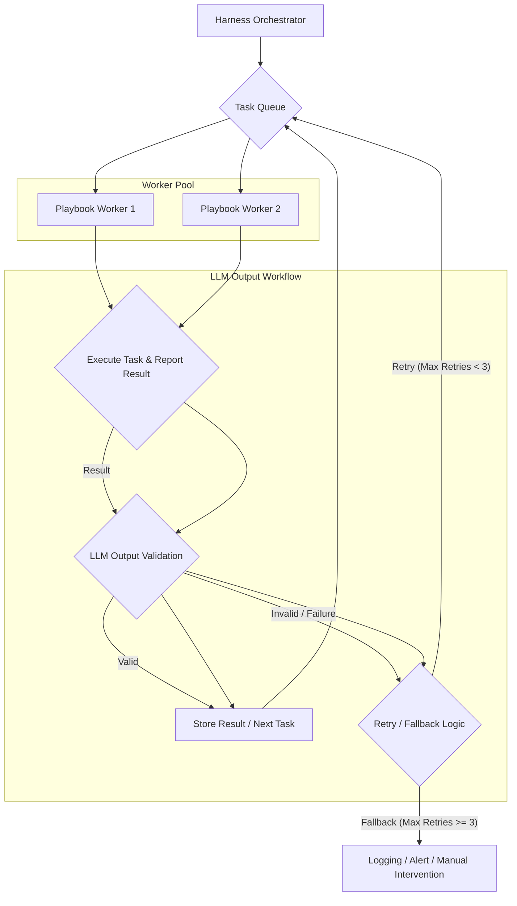

AI 에이전트의 복잡성이 심화되고 장기 실행 태스크가 증가함에 따라, 에이전트 내부에서 자율적으로 루프를 관리하는 방식은 한계에 직면하고 있습니다. 특히 프로덕션 환경에서는 예측 불가능한 상황에 대한 안정적인 대응과 유지 보수성이 중요하며, 이를 위해 '하네스 레벨 루프(Harness-level Loop)' 패턴이 새로운 중심 패턴으로 부상하고 있습니다. 이 패턴은 에이전트 자체의 자율성을 줄이는 대신, 외부의 '하네스(Harness)'가 작업 큐(Task Queue)와 반복을 관리하도록 하여, 전반적인 시스템의 복원력과 관리 용이성을 극대화합니다.

## 하네스 레벨 루프 개념

하네스 레벨 루프는 코딩 에이전트(coding agent) 혹은 LLM 기반 워커(LLM-based worker)의 바깥에서 상위 시스템이 작업의 흐름, 반복, 그리고 예외 처리를 관장하는 아키텍처 패턴입니다. 기존 에이전트 엔지니어링에서는 에이전트가 자체적으로 다음 행동을 결정하고 루프를 실행하는 경우가 많았지만, 이 방식은 장기적으로 볼 때 다음과 같은 문제점을 야기할 수 있습니다:

1.  **국소적 방어(Local Defense) 및 Fallback의 어려움**: 에이전트 내부의 로직이 복잡해질수록 강한 불변식(Strong Invariants)을 유지하기 어렵고, 부분적인 실패에 대한 견고한 방어 로직이나 대체(fallback) 경로를 추가하기가 복잡해집니다.
2.  **설계 이해 및 유지 보수의 난이도**: 에이전트의 자율 실행 루프가 길어질수록, 코드의 설계 의도를 파악하고 변경사항을 적용하는 데 더 많은 노력이 필요합니다.
3.  **예측 불가능한 행동**: 자율성이 높은 에이전트는 예상치 못한 방식으로 동작할 수 있으며, 이를 외부에서 제어하기 어렵습니다.

하네스 레벨 루프는 이러한 문제를 해결하기 위해, 에이전트가 단일 작업(atomic task)을 수행하는 '워커(Worker)'의 역할을 하도록 하고, 외부 하네스가 이 워커들에게 작업을 할당하고, 그 결과를 모니터링하며, 필요에 따라 재시도(retry), 검증(validation), 또는 다른 워커에게 위임하는 등의 반복 흐름을 관리합니다. 이는 마치 오케스트라의 지휘자가 개별 연주자들을 조율하는 것과 유사합니다.

## Playbook 워커 관제에 도입 검토

Playbook의 허브-워커 복리 자동화(Hub-Worker Compounding Automation) 및 LLM 출력 검증 루프에 하네스 레벨 루프를 적용하는 것은 시스템의 안정성과 효율성을 크게 향상시킬 수 있습니다. 특히 2026년 AI 에이전트 시스템은 더욱 복잡해지고 미션 크리티컬한 역할을 수행하게 될 것이므로, 외부에서 루프를 관제하는 방식은 필수적입니다.

### 아키텍처 개요



위 다이어그램은 하네스 레벨 루프가 Playbook 워커 관제에 어떻게 통합될 수 있는지 보여줍니다. Harness Orchestrator는 Task Queue에 작업을 할당하고, Playbook Worker들이 이를 처리한 후 결과를 반환합니다. 이 결과는 LLM Output Validation 단계를 거치며, 유효하지 않거나 실패할 경우 Retry/Fallback Logic에 따라 Task Queue로 다시 들어가거나, 최종적으로 실패 처리됩니다.

### 구현 예시 (Python)

아래 코드는 하네스 레벨 루프의 핵심 아이디어를 보여주는 Python 유사 코드입니다. `Harness` 클래스가 `Worker`에게 작업을 할당하고, LLM 출력 검증을 시뮬레이션하며, 실패 시 재시도 로직을 관리합니다.

```python
import queue
import time
import uuid

class PlaybookWorker:
    def __init__(self, worker_id):
        self.id = worker_id

    def execute_task(self, task_data):
        print(f