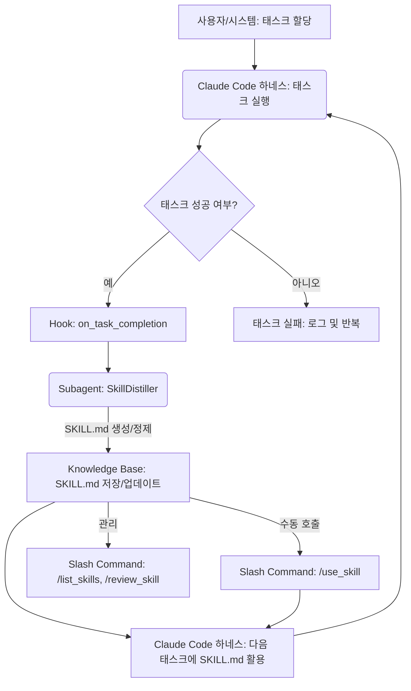

복잡한 소프트웨어 개발 및 운영 작업에서 AI 에이전트의 효율성을 극대화하려면 단순한 지시 수행을 넘어선 자기 개선 능력이 필수적입니다. Hermes Agent에서 영감을 받은 자기개선 루프는 에이전트가 수행한 작업에서 얻은 성공적인 패턴과 절차를 SKILL.md 형태로 자동 증류하고, 이를 다음 세션에서 재활용하여 지속적으로 성능을 향상시키는 강력한 접근 방식입니다. 이 문서는 이러한 Hermes Agent식 자기개선 루프를 Claude Code 하네스에 이식하는 전략과 구현 방안을 다룹니다.

## Hermes Agent의 자기개선 루프 원리

Hermes Agent의 핵심 아이디어는 에이전트가 복잡한 태스크를 성공적으로 완료했을 때, 그 과정에서 배운 중요한 절차나 해결 전략을 `SKILL.md`라는 표준화된 마크다운 형식으로 자동으로 추출하고 문서화하는 것입니다. 이 `SKILL.md`는 에이전트의 지식 기반에 추가되어 일종의 '장기 기억' 역할을 합니다. 이후 동일하거나 유사한 태스크가 주어졌을 때, 에이전트는 이 `SKILL.md`를 참조하여 과거의 성공 경험을 재활용함으로써 시행착오를 줄이고 더 효율적으로 문제를 해결할 수 있습니다. 이러한 지식 증류 및 재활용 과정은 에이전트의 자율적인 학습과 발전을 가능하게 합니다. 특히, `Curator Agent`와 같은 서브 에이전트는 이러한 스킬들을 관리하고, 중복을 제거하며, 최신 트렌드를 반영하여 정제하는 역할을 수행할 수 있습니다.

## Claude Code 하네스로의 이식 전략

Claude Code 하네스는 LLM 기반 코딩 에이전트에게 강력한 실행 환경과 유연한 확장을 제공합니다. Hermes Agent식 자기개선 루프를 Claude Code에 이식하기 위해서는 Claude Code의 `hooks`, `subagents`, 그리고 `slash commands`를 전략적으로 활용해야 합니다.

### 1. Hooks를 활용한 SKILL.md 증류 트리거

Claude Code 하네스의 `hooks`는 특정 이벤트 발생 시 사용자 정의 로직을 실행할 수 있도록 합니다. 에이전트가 할당된 태스크를 성공적으로 완료했을 때 `on_task_completion`과 같은 hook을 트리거하여 SKILL.md 증류 프로세스를 시작할 수 있습니다. 이 hook은 태스크 컨텍스트와 결과를 `SkillDistiller` 서브 에이전트로 전달합니다.

```python
# pseudo_code/claude_code_hook_for_skill_distillation.py

@claude_code_harness.hook("on_task_completion")
def trigger_skill_distillation(task_context: dict, result_summary: str):
    """
    태스크 완료 시 스킬 증류 서브 에이전트를 트리거합니다.
    """
    if "SUCCESS" in result_summary.upper():
        # SkillDistiller 서브 에이전트 호출
        print("Task completed successfully. Initiating skill distillation...")
        skill_distiller_agent = claude_code_harness.get_subagent("SkillDistiller")
        new_skill_proposal = skill_distiller_agent.run(
            "Distill key procedures from this successful task completion.",
            context=task_context
        )
        if new_skill_proposal:
            # SKILL.md 저장 또는 업데이트 로직
            claude_code_harness.knowledge_manager.add_skill(new_skill_proposal, task_context["task_id"])
            print(f"New skill proposal generated: {new_skill_proposal[:100]}...")
        else:
            print("No new skill distilled.")
    else:
        print("Task failed or not fully successful. Skipping skill distillation.")
```

### 2. Subagents를 이용한 SKILL.md 분석 및 생성

`SkillDistiller` 서브 에이전트는 실제 SKILL.md를 생성하는 핵심 구성 요소입니다. 이 서브 에이전트는 다음 기능을 수행할 수 있습니다:

*   **컨텍스트 분석:** 완료된 태스크의 전체 컨텍스트 (코드 변경사항, 로그, 커뮤니케이션 스레드 등)를 분석합니다.
*   **핵심 절차 추출:** LLM의 추론 능력을 활용하여 성공적인 절차, 사용된 도구, 문제 해결 방법 등을 구조화된 마크다운 형식으로 추출합니다.
*   **SKILL.md 포맷팅:** 추출된 정보를 표준화된 `SKILL.md` 포맷에 맞게 정제하고 문서화합니다.
*   **기존 스킬과의 비교:** 새로 제안된 스킬이 기존 스킬과 중복되는지, 혹은 개선된 버전인지를 판단합니다.

### 3. Slash Commands를 통한 SKILL.md 활용 및 관리

`slash commands`는 사용자가 에이전트와 직접 상호작용하여 특정 기능을 호출할 수 있게 합니다. 이를 통해 사용자는 다음과 같은 작업을 수행할 수 있습니다:

*   `/use_skill <skill_name>`: 특정 SKILL.md를 현재 세션 컨텍스트에 주입하여 에이전트가 해당 스킬을 활용하도록 지시합니다.
*   `/list_skills`: 저장된 모든 SKILL.md 목록을 조회합니다.
*   `/review_skill <skill_name>`: 특정 스킬의 내용을 검토하고 수동으로 수정하거나 승인합니다.

```python
# pseudo_code/claude_code_slash_command_for_skill_activation.py

@claude_code_harness.slash_command("/use_skill")
def activate_skill_for_session(skill_name: str):
    """
    지정된 스킬을 현재 세션의 컨텍스트에 주입합니다.
    """
    skill_content = claude_code_harness.knowledge_manager.get_skill(skill_name)
    if skill_content:
        claude_code_harness.inject_context(f"### Activated Skill: {skill_name}\n{skill_content}")
        print(f"Skill '{skill_name}' activated for the current session.")
    else:
        print(f"Skill '{skill_name}' not found in the knowledge base.")

@claude_code_harness.slash_command("/list_skills")
def list_all_skills():
    """
    현재 저장된 모든 스킬 목록을 출력합니다.
    """
    skills = claude_code_harness.knowledge_manager.list_skills()
    if skills:
        print("Available Skills:")
        for skill in skills:
            print(f"- {skill}")
    else:
        print("No skills found in the knowledge base.")
```

## 자기개선 루프 아키텍처

아래 Mermaid 다이어그램은 Claude Code 하네스 내에서 Hermes Agent식 자기개선 루프가 어떻게 동작하는지 보여줍니다.



이 아키텍처는 2026년 최신 에이전트 트렌드인 지속적인 학습(Continuous Learning)과 에이전트의 지식 그래프 통합(Knowledge Graph Integration)을 반영합니다. 에이전트는 경험을 통해 얻은 지식을 재사용함으로써, 시간이 지남에 따라 더욱 효율적이고 강력한 문제 해결 능력을 갖추게 됩니다.

## 트레이드오프

1.  **자동화된 SKILL.md 증류의 정확성 vs. 속도:**
    *   **장점:** 성공적인 작업 패턴을 자동으로 학습하고 지식화하여 에이전트의 반복 작업 효율을 크게 높일 수 있습니다.
    *   **단점:** LLM의 환각(hallucination)이나 잘못된 컨텍스트 해석으로 인해 부정확하거나 비최적화된 스킬이 생성될 위험이 있습니다. 이는 오히려 에이전트 성능 저하로 이어질 수 있습니다.
    *   **언제 좋은가:** 예측 가능하고 구조화된 개발 및 운영 태스크에서 패턴 인식을 통해 효율을 극대화하고자 할 때 효과적입니다.
    *   **언제 나쁜가:** 고도로 창의적이거나, 모호한 요구사항을 가진 태스크에서 잘못된 스킬을 학습하여 편향을 초래할 수 있을 때 주의가 필요합니다.

2.  **Claude Code 하네스 종속성 vs. 통합 용이성:**
    *   **장점:** Claude Code의 강력한 실행 환경과 기존 코드베이스 접근성, 그리고 `hooks`, `subagents`, `slash commands`와 같은 내장 확장 메커니즘을 활용하여 학습 루프를 자연스럽게 통합할 수 있습니다.
    *   **단점:** 특정 하네스에 대한 의존성을 높여 다른 LLM 프레임워크나 환경으로의 전환 시 추가적인 마이그레이션 비용이 발생할 수 있습니다.
    *   **언제 좋은가:** 이미 Claude Code를 주력으로 사용하는 환경에서 에이전트의 기능을 확장하고 싶을 때 탁월한 선택입니다.
    *   **언제 나쁜가:** 다양한 LLM 에이전트 프레임워크를 실험하거나, 하네스 유연성을 최우선으로 고려해야 하는 경우. 특정 하네스에 대한 종속성을 최소화해야 할 때 불리할 수 있습니다.

3.  **지속적인 학습을 통한 장기 성능 개선 vs. 스킬 관리 복잡성:**
    *   **장점:** 에이전트가 시간이 지남에 따라 점진적으로 지식을 축적하고 발전하여 복잡하고 장기적인 태스크 처리 능력이 향상됩니다.
    *   **단점:** 생성된 `SKILL.md`의 양이 증가하면서 스킬 간의 중복, 충돌, 버전 관리, 그리고 잘못된 스킬의 폐기 등 관리 복잡성이 커집니다. `Curator Agent`의 역할이 중요해지며, 잘못된 스킬이 전파될 경우 시스템 전체의 안정성을 저해할 수 있습니다.
    *   **언제 좋은가:** 에이전트가 지속적으로 동일한 유형의 작업을 수행하며, 시간이 지남에 따라 전문성을 축적해야 하는 장기 프로젝트에 적합합니다.
    *   **언제 나쁜가:** 스킬의 변경 주기가 매우 빠르거나, 환경이 급변하여 학습된 스킬의 유효 기간이 짧을 때, 또는 스킬의 신뢰성이 매우 중요하여 휴먼 검토가 필수적인 경우 관리 오버헤드가 클 수 있습니다.

## 실전 체크리스트

프로젝트에 Hermes Agent식 자기개선 루프를 이식할 때 다음 항목들을 검증해야 합니다:

- [ ] `SKILL.md` 증류 프로세스에서 생성된 스킬의 **품질을 검증하는 자동화된 메커니즘**이 존재하는가? (예: 특정 규칙 준수 여부, 기존 코드와의 일관성, 최소한의 작동 여부)
- [ ] 증류된 스킬이 기존 스킬과 **중복되거나 충돌할 경우를 처리하는 정책**이 명확히 정의되어 있으며, 버전 관리 전략을 포함하는가?
- [ ] Claude Code `hooks`가 `SKILL.md` 증류를 **안정적으로 트리거**하며, 과도한 시스템 리소스 소모나 지연을 유발하지 않는가?
- [ ] `SkillDistiller` Subagent는 `SKILL.md` 생성을 위해 필요한 **모든 관련 컨텍스트(코드, 로그, 실행 결과 등)에 충분히 접근**할 수 있도록 설계되었는가?
- [ ] `SKILL.md` 저장소는 **확장 가능하고 효율적으로 검색 가능**하며, LLM이 스킬을 쉽게 로드하고 활용할 수 있는 구조인가? (예: Vector DB, Indexing)
- [ ] `/use_skill`과 같은 `slash commands`를 통해 특정 스킬을 **수동으로 활성화하거나 비활성화**하는 기능이 견고하게 작동하는가?
- [ ] 에이전트의 자기개선 루프가 학습된 스킬로 인해 **예상치 못한 부작용(unintended side effects)**을 일으키지 않는지 지속적으로 모니터링하고 알림을 발생시키는 체계가 구축되어 있는가?
- [ ] `SKILL.md` 내에 민감 정보가 포함되지 않도록 **데이터 마스킹 또는 필터링 메커니즘**이 적용되었는가?