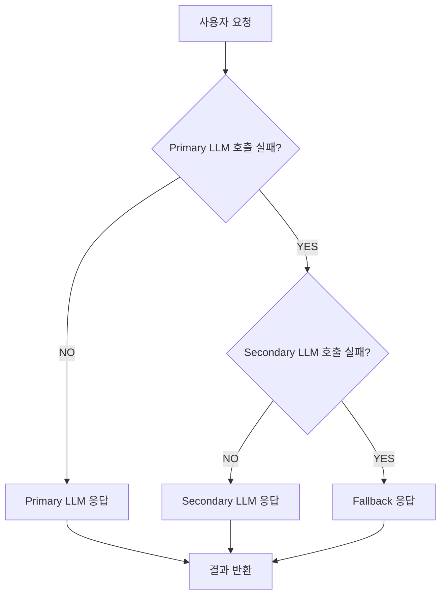

LLM 애플리케이션은 기존 소프트웨어와 다른 고유한 특성으로 인해 고가용성(High Availability, HA) 설계에 특별한 고려가 필요합니다. 비결정론적 응답, 외부 API 종속성, 요청 제한(Rate Limiting), 서비스 제공자의 장애 등 예측 불가능한 요소들이 서비스 안정성을 저해할 수 있습니다. 이러한 환경에서 견고한 애플리케이션을 구축하기 위해 재시도(Retry) 패턴과 장애 복구(Disaster Recovery) 전략은 필수적입니다.

## LLM 통신을 위한 재시도 패턴 (Retry Patterns for LLM Communication)

LLM API 호출은 네트워크 지연, 일시적인 서비스 오류, Rate Limiting 등으로 인해 실패할 수 있습니다. 이러한 일시적 오류에 대응하기 위해 재시도 패턴을 적용해야 합니다.

### 지수 백오프와 지터 (Exponential Backoff with Jitter)

가장 일반적이고 효과적인 재시도 전략은 지수 백오프(Exponential Backoff)입니다. 이는 실패 시 재시도 간격을 점진적으로 늘려 서버 과부하를 방지하고, 서비스 회복 시간을 제공합니다. 여기에 지터(Jitter)를 추가하여 여러 클라이언트의 동시 재시도로 인한 썬더링(Thundering Herd) 문제를 완화합니다. 지터는 각 재시도 간격에 무작위 값을 추가하는 기법입니다.

```python
import time
import random
from openai import OpenAI, OpenAIError

client = OpenAI(api_key="YOUR_API_KEY")

def call_llm_with_retry(prompt: str, max_retries: int = 5, base_delay: float = 1.0):
    """
    LLM API 호출을 위한 지수 백오프 및 지터가 포함된 재시도 함수
    """
    for i in range(max_retries):
        try:
            response = client.chat.completions.create(
                model="gpt-4o",
                messages=[{"role": "user", "content": prompt}]
            )
            return response.choices[0].message.content
        except OpenAIError as e:
            if i < max_retries - 1:
                delay = base_delay * (2 ** i) + random.uniform(0, 1) # Exponential backoff with jitter
                print(f"LLM 호출 실패: {e}. {delay:.2f}초 후 재시도합니다. (시도 {i+1}/{max_retries})")
                time.sleep(delay)
            else:
                print(f"최대 재시도 횟수 초과. LLM 호출 실패: {e}")
                raise

# Example usage
# try:
#     result = call_llm_with_retry("Explain the concept of quantum entanglement in simple terms.")
#     print(f"LLM 응답: {result}")
# except Exception as e:
#     print(f"최종 실패: {e}")
```

### 회로 차단기 패턴 (Circuit Breaker Pattern)

반복적인 오류가 발생하거나 서비스 제공자가 장시간 장애 상태일 때, 불필요한 재시도를 막고 시스템 리소스 고갈을 방지하기 위해 회로 차단기(Circuit Breaker) 패턴을 적용할 수 있습니다. 이는 특정 기간 동안 오류율이 임계값을 초과하면 LLM API 호출을 자동으로 차단하고, 일정 시간이 지난 후 다시 서비스 상태를 확인(half-open)하여 정상 복구 여부를 판단합니다.

```python
from tenacity import retry, wait_exponential, stop_after_attempt, before_sleep, after_log
import logging
from pybreaker import CircuitBreaker, CircuitBreakerError

# 로깅 설정
logging.basicConfig(level=logging.INFO)
logger = logging.getLogger(__name__)

# Circuit Breaker 설정
# 5초 동안 3번 실패하면 회로 차단 (closed -> open)
# 60초 후 half-open 상태로 전환하여 서비스 복구 시도
llm_breaker = CircuitBreaker(fail_max=3, reset_timeout=60, exclude=[TypeError])

@retry(wait=wait_exponential(multiplier=1, min=1, max=10),
       stop=stop_after_attempt(5),
       before_sleep=before_sleep(logger.info),
       after_log=after_log(logger, logging.DEBUG))
def reliable_llm_call(prompt: str):
    """
    Circuit Breaker와 Exponential Backoff를 통합한 LLM 호출 함수
    """
    try:
        with llm_breaker:
            print(f"LLM 호출 시도: {prompt[:30]}...")
            response = client.chat.completions.create(
                model="gpt-4o",
                messages=[{"role": "user", "content": prompt}]
            )
            return response.choices[0].message.content
    except CircuitBreakerError:
        print("Circuit Breaker가 열려 LLM 호출이 차단되었습니다. 폴백 또는 대체 로직을 실행합니다.")
        # 여기에 폴백 로직 구현
        return "죄송합니다. 현재 서비스에 문제가 있어 요청을 처리할 수 없습니다."
    except OpenAIError as e:
        logger.error(f"OpenAI API 오류 발생: {e}")
        raise # Circuit Breaker가 이 예외를 감지하여 상태 변경

# Example usage
# try:
#     result = reliable_llm_call("How does a neural network learn?")
#     print(f"LLM 응답: {result}")
# except Exception as e:
#     print(f"최종 호출 실패: {e}")
```

## LLM 애플리케이션을 위한 장애 복구 전략 (Disaster Recovery Strategies for LLM Applications)

재시도 패턴만으로는 해결할 수 없는 치명적인 장애(예: 특정 LLM 벤더 서비스 전체 중단)에 대비하여 장애 복구 전략을 수립해야 합니다.

### 다중 모델/벤더 전략 (Multi-model/Vendor Strategy)

단일 LLM 모델이나 벤더에 대한 의존성을 줄이는 전략입니다. 주력 모델(Primary Model)에 장애가 발생할 경우, 다른 벤더의 LLM(Secondary Model)이나 오픈 소스 모델(Open-source Model)로 자동 전환하여 서비스 연속성을 확보합니다. 2026년에는 여러 LLM 공급자 간의 API 표준화 및 상호 운용성(Interoperability)이 더욱 강화되어, 이러한 전략 구현이 훨씬 용이해질 것입니다.



### 캐싱 및 폴백 응답 (Caching and Fallback Responses)

자주 요청되는 질문이나 중요하지만 실시간 응답이 필수적이지 않은 시나리오에서는 LLM 응답을 캐싱하여 API 호출 횟수를 줄이고, LLM 서비스 장애 시 캐시된 응답을 제공할 수 있습니다. 또한, 예측 불가능한 LLM 오류 발생 시 사용자 경험 저하를 최소화하기 위해 미리 정의된 폴백(Fallback) 응답을 제공하는 것이 중요합니다. 이는 "지금은 서비스를 이용할 수 없습니다"와 같은 일반적인 메시지부터, 특정 도메인에 특화된 정적 응답까지 다양하게 구성할 수 있습니다.

### 능동적 모니터링 및 AI 기반 예측 (Proactive Monitoring and AI-driven Prediction)

2026년에는 LLM 애플리케이션의 안정성을 위해 AI 기반의 예측 모니터링 시스템이 더욱 중요해질 것입니다. 이는 LLM API 응답 시간, 오류율, 토큰 사용량 등을 실시간으로 분석하여 잠재적 장애 징후를 사전에 감지하고, 심지어는 특정 모델의 성능 저하나 아웃티지를 예측하여 선제적으로 트래픽을 다른 모델로 라우팅하는 데 활용됩니다. 이상 감지(Anomaly Detection) 모델이 LLM 응답의 품질 저하를 조기에 파악하여 장애 복구 프로세스를 자동 트리거할 수도 있습니다.

## 트레이드오프 (Trade-offs)

LLM 애플리케이션의 고가용성 전략을 설계할 때는 다음과 같은 트레이드오프를 고려해야 합니다.

*   **지연 시간 vs. 신뢰성 (Latency vs. Reliability)**:
    *   **언제 좋은가**: 재시도 및 폴백 로직은 일시적 오류에 대한 서비스 신뢰성을 크게 높입니다. 사용자는 일시적 장애에도 불구하고 결국 응답을 받을 가능성이 커집니다.
    *   **언제 나쁜가**: 재시도는 네트워크 지연이나 API 처리 시간 증가를 유발하여 총 응답 시간을 늘릴 수 있습니다. 특히 실시간 상호작용이 중요한 애플리케이션에서는 사용자 경험에 부정적인 영향을 줄 수 있습니다.
*   **복잡성 증가 vs. 견고성 (Robustness vs. Development Overhead)**:
    *   **언제 좋은가**: 재시도, 회로 차단기, 다중 벤더 전략 등은 애플리케이션의 견고성을 비약적으로 향상시켜 예기치 못한 상황에 효과적으로 대응합니다.
    *   **언제 나쁜가**: 이러한 패턴을 구현하고 관리하는 것은 코드의 복잡성을 증가시키고, 초기 개발 비용 및 유지보수 오버헤드를 높입니다. 특히 여러 LLM 벤더를 통합하는 것은 추가적인 추상화 계층과 관리 부담을 가져옵니다.
*   **비용 vs. 고가용성 (Cost vs. High Availability)**:
    *   **언제 좋은가**: 다중 벤더 전략은 단일 벤더 장애 시 비즈니스 연속성을 보장하여 잠재적인 손실을 줄입니다. 캐싱은 API 호출 비용을 절감할 수 있습니다.
    *   **언제 나쁜가**: 여러 LLM 벤더와의 계약, 추가 인프라(캐시 서버, 로드 밸런서) 구축 및 운영은 상당한 비용을 발생시킵니다. 특히 예비(Standby) LLM 리소스 유지 비용은 무시할 수 없습니다.
*   **상태 관리 vs. 단순성 (State Management vs. Simplicity)**:
    *   **언제 좋은가**: 일부 재시도 시나리오(예: 긴 대화 세션 중 오류)에서는 이전 상태를 유지하며 재시도하는 것이 사용자 경험에 필수적입니다.
    *   **언제 나쁜가**: 상태를 관리하는 재시도 로직은 설계 및 구현이 훨씬 복잡해지며, 분산 시스템 환경에서 상태 일관성 문제를 야기할 수 있습니다. 가능한 경우 무상태(stateless) 재시도 로직을 우선 고려하는 것이 좋습니다.
*   **모델 다양성 vs. 일관성 (Model Diversity vs. Consistency)**:
    *   **언제 좋은가**: 여러 모델을 사용하는 전략은 특정 모델의 편향, 성능 저하, 또는 중단에 대응할 수 있는 유연성을 제공합니다.
    *   **언제 나쁜가**: 다른 LLM 모델들은 응답 스타일, 품질, 심지어 안전성 가이드라인이 다를 수 있습니다. 이로 인해 사용자에게 일관되지 않은 경험을 제공하거나, 후처리 로직의 복잡성을 증가시킬 수 있습니다.

## 실전 체크리스트 (Practical Checklist)

LLM 애플리케이션에 장애 복구 및 재시도 패턴을 적용할 때 다음 항목들을 검증하여 안정성을 확보합니다.

*   [ ] **재시도 정책 정의 및 적용**: 모든 LLM API 호출에 대해 최소 `max_retries`, `base_delay`, `max_delay`를 포함한 지수 백오프 및 지터 재시도 정책이 정의되어 있고 올바르게 적용되었는가?
*   [ ] **오류 유형별 재시도 전략 구현**: `RateLimitError`, `TimeoutError`, `APIConnectionError` 등 LLM 제공자별 오류 코드를 분석하여 재시도가 적절한 오류와 즉시 실패해야 하는 오류(예: 잘못된 입력)를 구분하는가?
*   [ ] **회로 차단기 임계값 설정 및 테스트**: 회로 차단기 패턴이 구현되었고, `fail_max` 및 `reset_timeout`과 같은 임계값이 실제 서비스 환경에 맞게 최적화되었으며, 장애 시나리오에서 정상적으로 동작하는지 테스트되었는가?
*   [ ] **폴백 모델/응답 정의 및 테스트**: 주력 LLM 서비스 장애 시 사용할 백업 LLM 모델 또는 미리 정의된 정적 폴백 응답(예: 캐시된 응답, 일반 오류 메시지)이 준비되었고, 실제 장애 상황을 모의하여 테스트되었는가?
*   [ ] **모니터링 및 알림 시스템 구축**: LLM API 호출 성공률, 오류율, 응답 시간, 재시도 횟수 등을 실시간으로 모니터링하고, 특정 임계값 초과 시 즉시 담당자에게 알림을 전송하는 시스템이 구축되어 있는가?
*   [ ] **부하 테스트 및 스트레스 테스트**: LLM 애플리케이션이 예상되는 최대 트래픽 및 그 이상의 부하에서 재시도 및 장애 복구 메커니즘이 안정적으로 작동하는지 부하 테스트와 스트레스 테스트를 통해 검증되었는가?
*   [ ] **멱등성(Idempotency) 보장**: 재시도 시 동일한 요청이 여러 번 실행되어도 시스템의 상태가 중복되거나 예상치 못한 부작용을 일으키지 않도록 LLM 호출과 관련된 데이터 처리 로직의 멱등성이 보장되었는가?