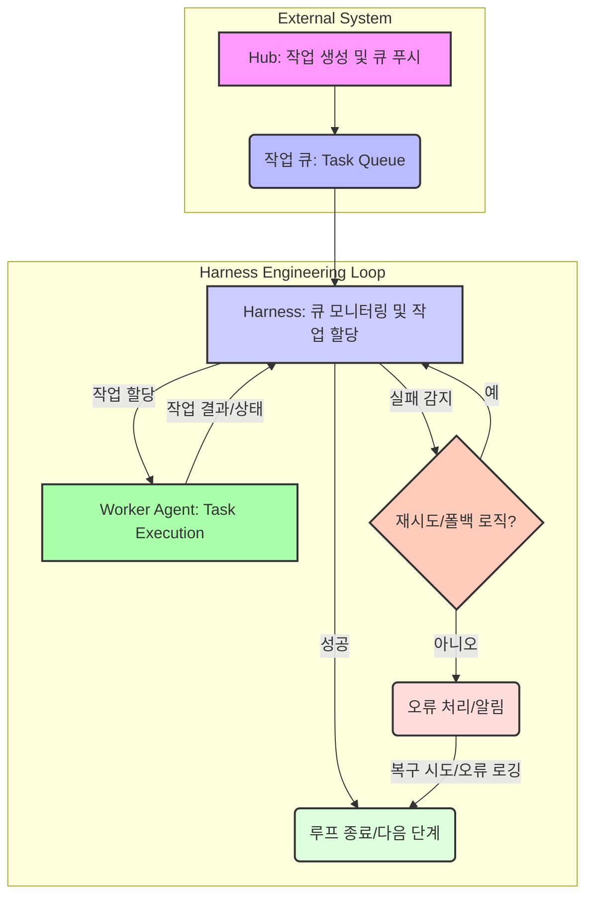

## 허브-워커 자동화 루프 견고화: 외부 제어를 통한 회복력 확보

AI 에이전트 엔지니어링의 발전과 함께, 복잡한 자동화 워크플로우를 처리하는 허브-워커(Hub-Worker) 패턴의 중요성이 커지고 있습니다. 그러나 장기적으로 안정적인 운영을 위해서는 단순히 에이전트 내의 강력한 불변식(invariants)에 의존하는 것을 넘어, 에이전트 외부에서 작업 큐와 하네스(harness)가 반복(loop)을 관리하는 '하네스 레벨 루프(harness-level loop)' 패턴으로 전환하는 것이 필수적입니다. 이 접근 방식은 시스템의 국소적 방어(local defenses)와 폴백(fallback) 메커니즘을 강화하여 장기 유지보수성을 확보하고, 예기치 않은 상황에서도 시스템이 견고하게 동작하도록 돕습니다.

### 하네스 레벨 루프 제어의 필요성

기존 에이전트 기반 시스템에서는 에이전트 자체가 자신의 작업 루프를 관리하는 경향이 있었습니다. 이는 초기 개발 단계에서는 빠르고 직관적일 수 있지만, 에이전트가 더 오래 자율 실행될수록 다음과 같은 문제에 직면하게 됩니다:

1.  **취약한 불변식**: 에이전트 내부의 상태가 복잡해지면서 불변식 유지가 어려워지고, 예상치 못한 상황에서 시스템 전체가 실패할 가능성이 높아집니다.
2.  **유지보수의 어려움**: 에이전트 로직 내에 국소적 방어 및 폴백 로직이 얽히면, 코드 이해 및 수정이 점점 더 복잡해집니다.
3.  **회복력 부족**: 에이전트의 단일 장애 지점이 전체 루프의 중단을 야기할 수 있습니다.

2026년 AI 에이전트 엔지니어링 트렌드는 이러한 문제를 해결하기 위해 루프 제어의 책임을 에이전트 외부의 하네스로 옮기는 것을 강조합니다. 하네스는 작업 큐를 통해 작업을 분배하고, 워커 에이전트의 실행을 모니터링하며, 실패를 감지하고 복구 전략을 적용하는 중앙 집중식 제어 역할을 수행합니다.

### 아키텍처 원칙

견고한 허브-워커 루프를 구축하기 위한 핵심 원칙은 다음과 같습니다.

*   **작업 큐 기반의 디커플링(Decoupling)**: 허브는 작업을 큐에 푸시하고, 워커는 큐에서 작업을 가져와 처리합니다. 이는 허브와 워커 간의 직접적인 의존성을 제거하고, 비동기 처리를 가능하게 합니다.
*   **하네스 주도의 반복(Harness-Driven Iteration)**: 워커 에이전트는 단일 작업을 완벽하게 수행하는 데 집중하고, 루프의 진행 상황, 재시도, 폴백 결정은 하네스가 담당합니다.
*   **국소적 방어(Local Defenses)**: 각 워커는 자신의 작업 범위 내에서 발생할 수 있는 오류를 자체적으로 처리하고, 실패 시 적절한 응답 코드나 상태를 하네스에 전달합니다.
*   **폴백 메커니즘(Fallback Mechanisms)**: 하네스는 워커의 반복된 실패나 특정 유형의 오류에 대해 미리 정의된 폴백 전략(예: 다른 워커에게 재할당, 대안 로직 실행, 관리자 알림)을 실행합니다.
*   **강력한 관측 가능성(Observability)**: 모든 루프의 단계, 작업의 상태, 워커의 성능 및 오류를 실시간으로 모니터링하여 문제 발생 시 즉시 식별하고 대응할 수 있도록 합니다.

### 구현 패턴

실제 시스템에서는 메시지 큐(예: RabbitMQ, Apache Kafka, AWS SQS)를 작업 큐로 활용하고, 별도의 하네스 프로세스 또는 서비스가 이 큐를 관리하고 워커를 조정합니다. 하네스는 워커의 상태를 주기적으로 확인하고, 응답이 없거나 실패 코드를 반환하는 워커에 대해 재시도 정책, 지수 백오프(exponential backoff) 등을 적용합니다.

아래 Mermaid 다이어그램은 이 패턴의 흐름을 시각적으로 보여줍니다.



### 코드 예제 (Python)

간단한 Python 예제를 통해 하네스 레벨 루프의 핵심 개념을 설명합니다. Redis를 메시지 큐로 사용합니다.

먼저, `redis` 라이브러리를 설치합니다: `pip install redis`

**1. `hub.py` (작업 생성 및 큐 푸시)**

```python
import redis
import json
import time

r = redis.Redis(decode_responses=True)
TASK_QUEUE = "task_queue"

def create_task(task_id: int):
    task = {"id": task_id, "data": f"process_item_{task_id}"}
    r.lpush(TASK_QUEUE, json.dumps(task))
    print(f"[Hub] Pushed task {task_id} to queue.")

if __name__ == "__main__":
    for i in range(1, 6):
        create_task(i)
        time.sleep(0.1)
```

**2. `worker.py` (워커 에이전트)**

```python
import redis
import json
import time
import random

r = redis.Redis(decode_responses=True)
TASK_QUEUE = "task_queue"

def process_task(task):
    task_id = task["id"]
    print(f"[Worker] Processing task {task_id}...")
    time.sleep(random.uniform(0.5, 2.0)) # Simulate work
    if random.random() < 0.3: # 30% chance of failure
        print(f"[Worker] Task {task_id} FAILED.")
        return {"task_id": task_id, "status": "FAILED", "error": "Simulated failure"}
    else:
        print(f"[Worker] Task {task_id} COMPLETED successfully.")
        return {"task_id": task_id, "status": "COMPLETED", "result": "Processed data"}

if __name__ == "__main__":
    print("[Worker] Ready to receive tasks.")
    while True:
        # Worker listens to a specific task queue, e.g., via BLPOP or custom channel
        # For simplicity, worker here acts as a function called by harness, or gets from queue
        # In a real setup, it would BLPOP from a worker-specific queue or shared one.
        time.sleep(1) # Simulate waiting for harness to assign tasks
```

**3. `harness.py` (하네스: 루프 제어 및 복구)**

```python
import redis
import json
import time

r = redis.Redis(decode_responses=True)
TASK_QUEUE = "task_queue"
FAILED_QUEUE = "failed_tasks"
MAX_RETRIES = 3

def run_worker_task(task):
    # Simulate worker execution for demonstration
    # In a real system, this would involve calling a separate worker process/service
    print(f"[Harness] Dispatching task {task['id']} to worker...")
    # For this example, we'll inline the worker logic or mock it
    # A real harness would use subprocess, RPC, or message passing
    worker_result = {} # Placeholder for actual worker call
    
    # --- Inlined Worker Logic Simulation Start ---
    task_id = task["id"]
    time.sleep(random.uniform(0.5, 1.5))
    if random.random() < 0.3: # Simulate worker failure
        worker_result = {"task_id": task_id, "status": "FAILED", "error": "Simulated worker failure"}
    else:
        worker_result = {"task_id": task_id, "status": "COMPLETED", "result": "Processed data"}
    # --- Inlined Worker Logic Simulation End ---
    
    return worker_result


def main_loop():
    print("[Harness] Starting main loop.")
    while True:
        raw_task = r.rpop(TASK_QUEUE) # Get task from right (FIFO)
        if raw_task:
            task = json.loads(raw_task)
            task_id = task["id"]
            retries = task.get("retries", 0)

            print(f"[Harness] Picked up task {task_id}. Retries: {retries}")
            
            result = run_worker_task(task)

            if result["status"] == "COMPLETED":
                print(f"[Harness] Task {task_id} successfully completed. Result: {result['result']}")
                # Optionally, push to a completed queue or trigger next stage
            elif result["status"] == "FAILED":
                print(f"[Harness] Task {task_id} failed. Error: {result['error']}")
                if retries < MAX_RETRIES:
                    task["retries"] = retries + 1
                    # Exponential backoff for retries
                    time.sleep(2 ** retries) 
                    r.lpush(TASK_QUEUE, json.dumps(task)) # Re-queue for retry
                    print(f"[Harness] Re-queued task {task_id} for retry ({task['retries']}/{MAX_RETRIES}).")
                else:
                    r.lpush(FAILED_QUEUE, json.dumps(task)) # Move to DLQ
                    print(f"[Harness] Task {task_id} moved to FAILED_QUEUE after {MAX_RETRIES} retries.")
            
        time.sleep(0.5) # Prevent busy-waiting

if __name__ == "__main__":
    import random # Ensure random is available in main scope
    main_loop()
```

이 예제에서는 `harness.py`가 `TASK_QUEUE`를 모니터링하고, 작업을 가져와 `run_worker_task` 함수를 통해 워커의 실행을 시뮬레이션합니다. 워커가 실패하면 `MAX_RETRIES`까지 재시도하고, 그 이상 실패하면 `FAILED_QUEUE` (Dead-Letter Queue)로 이동시킵니다. 이는 에이전트 외부에서 루프의 견고성을 관리하는 핵심적인 방법입니다.

## 트레이드오프

하네스 레벨 루프 제어는 여러 이점을 제공하지만, 고려해야 할 트레이드오프도 존재합니다.

*   **복잡한 초기 설정 vs. 장기 유지보수성**: 하네스, 큐, 워커 간의 통신 및 오류 처리 로직을 구축하는 데 초기 설정 비용이 높습니다. 하지만 일단 구축되면, 개별 에이전트의 변경이 전체 시스템에 미치는 영향을 최소화하고, 안정적인 운영 및 디버깅을 용이하게 하여 장기적인 유지보수 비용을 절감합니다. 대규모, 장기 프로젝트에 적합하며, MVP 단계에서는 과도할 수 있습니다.
*   **증가된 지연 시간(Latency) vs. 향상된 신뢰성**: 메시지 큐 사용 및 하네스 오케스트레이션은 직접적인 함수 호출에 비해 작업 처리의 지연 시간을 증가시킬 수 있습니다. 그러나 이는 워커의 고립된 실패가 전체 루프를 중단시키지 않도록 보장하여, 시스템 전체의 신뢰성을 크게 향상시킵니다. 실시간 응답이 필수적인 워크로드에는 추가적인 최적화가 필요할 수 있습니다.
*   **느슨하게 결합된(Decoupled) 컴포넌트 vs. 분산된 디버깅**: 허브, 큐, 하네스, 워커가 독립적인 컴포넌트로 분리되어 개발 및 배포 유연성이 높아집니다. 반면, 문제가 발생했을 때 전체 워크플로우를 추적하고 디버깅하는 것이 단일 프로세스 아키텍처보다 복잡할 수 있습니다. 통합 로깅, 분산 트레이싱 솔루션이 중요합니다.
*   **리소스 오버헤드 vs. 위험 완화**: 메시지 큐와 하네스 프로세스 등 추가적인 인프라 컴포넌트가 필요하므로 시스템 리소스 사용량이 증가할 수 있습니다. 이는 시스템의 단일 장애 지점을 줄이고, 탄력성(resilience)을 높여 치명적인 서비스 중단 위험을 효과적으로 완화합니다. 비용 효율성보다 안정성이 중요한 미션 크리티컬 시스템에 유리합니다.

## 실전 체크리스트

허브-워커 자동화 루프를 프로젝트에 적용할 때 다음 사항을 검토하여 견고성을 확보하세요.

*   [ ] **작업 큐 내구성 및 가용성**: 선택한 메시지 큐(예: Redis, Kafka, SQS)가 데이터 손실 없이 작업을 안정적으로 저장하고, 고가용성(High Availability)을 보장하는 방식으로 구성되었는가?
*   [ ] **워커 무상태성(Statelessness)**: 각 워커 에이전트가 개별 작업을 독립적으로 처리하며, 이전 작업의 상태에 의존하지 않는 무상태성 원칙을 준수하는가?
*   [ ] **재시도 및 지수 백오프 로직**: 워커에서 발생한 일시적 오류에 대해 하네스가 지수 백오프를 포함한 재시도(retry) 로직을 정확하게 구현하고 있는가?
*   [ ] **데드-레터 큐(DLQ) 또는 격리 메커니즘**: 반복적으로 실패하는 작업이 메인 큐를 막지 않고, 분석 및 수동 처리를 위해 격리될 수 있는 DLQ 또는 유사한 메커니즘이 존재하는가?
*   [ ] **통신 타임아웃 및 서킷 브레이커**: 허브-큐, 큐-워커, 워커-하네스 간의 통신에 적절한 타임아웃(timeout) 설정과 서킷 브레이커(circuit breaker) 패턴이 적용되어 시스템 과부하를 방지하는가?
*   [ ] **종합적인 모니터링 및 경고 시스템**: 루프의 현재 진행 상황, 작업 대기열 길이, 워커의 활성 상태 및 처리량, 실패율 등을 실시간으로 모니터링하고, 임계치 초과 시 즉시 경고를 발생하는 대시보드와 알림 시스템이 구축되어 있는가?
*   [ ] **확장 가능한 방어 로직 아키텍처**: 새로운 유형의 오류나 시스템 변경에 대응하여 국소적 방어 및 폴백 메커니즘을 쉽게 추가하고 수정할 수 있는 확장 가능한 아키텍처인가?