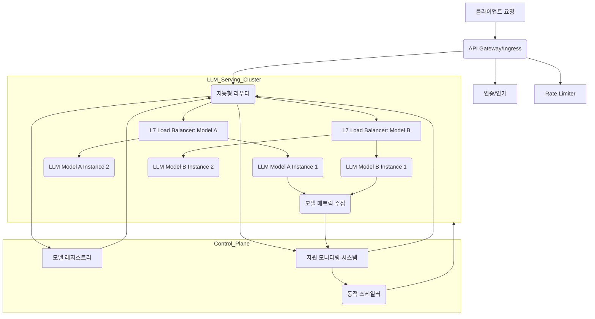

대규모 언어 모델(LLM) 기반 서비스가 널리 확산되면서, 안정적이고 효율적인 LLM 서빙은 핵심적인 과제가 되었습니다. 2026년 현재, LLM 서빙은 단순히 모델을 배포하는 것을 넘어, 동적인 트래픽 패턴, 다양한 모델 버전, 그리고 엄격한 비용 및 성능 제약을 동시에 관리해야 하는 복잡한 엔지니어링 영역으로 진화했습니다. 이를 해결하기 위한 핵심 접근 방식 중 하나는 지능형 트래픽 라우팅 및 부하 분산 시스템을 설계하는 것입니다.

## LLM 서빙의 복잡성과 도전 과제
LLM은 다른 마이크로서비스나 스테이트리스(Stateless) API와는 다른 고유한 특성을 가집니다. 첫째, 추론(Inference) 과정이 극도로 컴퓨팅 집약적이며, 주로 GPU와 같은 고가의 특수 하드웨어 자원을 요구합니다. 둘째, 모델의 크기가 수십 기가바이트에서 수백 기가바이트에 달하며, 메모리 로딩 시간이 길어 콜드 스타트(Cold Start) 문제가 발생하기 쉽습니다. 셋째, 사용자 요청의 특성(길이, 복잡성, 실시간성 요구)이 매우 다양하여 일관된 성능을 유지하기 어렵습니다. 마지막으로, 다양한 모델(예: 최신 고성능 모델, 경량화된 비용 효율 모델)과 그 버전들을 동시에 서비스해야 하는 필요성이 증가하고 있습니다.

이러한 도전 과제들은 다음과 같은 목표를 달성하기 위한 지능형 시스템의 필요성을 강조합니다.
*   **비용 최적화**: 고가의 GPU 자원을 효율적으로 사용하고, 저비용 모델을 적절히 활용하여 총 소유 비용(TCO)을 절감합니다.
*   **성능 최적화**: 낮은 Latency와 높은 Throughput을 보장하며, 사용자 경험을 극대화합니다.
*   **안정성 및 고가용성**: 특정 모델 인스턴스 또는 노드의 장애에도 서비스 중단 없이 지속적인 운영을 가능하게 합니다.
*   **확장성**: 트래픽 증가에 따라 유연하게 자원을 확장하고 축소할 수 있어야 합니다.
*   **A/B 테스트 및 Canary 배포**: 새로운 모델 버전이나 실험적 기능을 안전하게 배포하고 검증할 수 있어야 합니다.

## 지능형 트래픽 라우팅 및 부하 분산 디자인 패턴
지능형 트래픽 라우팅 및 부하 분산 시스템은 전통적인 L4/L7 로드밸런싱을 넘어, LLM의 특성과 비즈니스 로직을 이해하고 요청을 최적의 엔드포인트로 유도하는 아키텍처를 의미합니다. 주요 디자인 패턴은 다음과 같습니다.

### 1. 모델 인지 라우팅 (Model-Aware Routing)
요청된 모델의 종류, 버전, 또는 특정 모델의 가중치(Weight)에 따라 트래픽을 분산합니다. 예를 들어, `gpt-4o` 요청은 최신 GPU 클러스터로, `claude-3-haiku` 요청은 CPU 기반의 비용 효율적인 엔드포인트로 라우팅할 수 있습니다. 이는 Model Registry와 연동되어 최신 모델 정보를 반영합니다.

### 2. 비용/성능 기반 라우팅 (Cost/Performance-Based Routing)
사용자 요청의 중요도, 응답 시간 SLA, 또는 예상 비용에 따라 라우팅 전략을 동적으로 변경합니다. 실시간 대화 시스템에는 저지연 고성능 모델을, 배치 처리나 내부 도구에는 비용 효율적인 모델을 할당하는 식입니다. 이는 LLM API의 토큰 가격, GPU 자원 사용량 등을 실시간으로 모니터링하여 결정됩니다.

### 3. 부하 및 자원 상태 기반 라우팅 (Load & Resource-Aware Routing)
각 LLM 서빙 인스턴스의 현재 부하, GPU 사용률, 메모리 점유율, 큐 길이 등을 실시간으로 모니터링하여 가장 여유 있는 인스턴스로 요청을 보냅니다. 이는 오토스케일링(Autoscaling)과 연동되어 자원을 효율적으로 사용합니다.

### 4. 지리적 라우팅 및 근접성 (Geographic Routing & Proximity)
사용자 또는 서비스의 위치에 가장 가까운 리전(Region) 또는 엣지(Edge) 서버로 요청을 라우팅하여 네트워크 Latency를 최소화합니다.

### 5. 폴백 및 재시도 전략 (Fallback & Retry Strategies)
특정 LLM 엔드포인트가 응답 없거나 오류를 반환할 경우, 사전에 정의된 다른 모델이나 백업 엔드포인트로 자동으로 전환(Failover)합니다. 지능형 재시도(Intelligent Retry) 로직을 통해 일시적인 오류에 대응합니다.

## 아키텍처 구성 요소


*   **API Gateway/Ingress**: 모든 외부 요청의 진입점. 인증/인가, Rate Limiting, 기본 트래픽 필터링을 수행합니다.
*   **지능형 라우터 (Intelligent Router)**: 요청의 Context(사용자, 요청 유형, Latency SLA 등)와 Model Registry, Resource Monitoring 시스템에서 얻은 정보를 기반으로 최적의 LLM 엔드포인트를 결정합니다. 커스텀 서비스나 서비스 메시(Service Mesh)의 확장 기능으로 구현될 수 있습니다.
*   **Model Registry**: 서비스 가능한 LLM 모델의 메타데이터(버전, 성능 특성, 비용 정보, 배포 위치 등)를 관리합니다.
*   **자원 모니터링 시스템 (Resource Monitoring System)**: 각 LLM 서빙 인스턴스의 GPU 사용률, 메모리, 응답 Latency, 큐 길이 등을 실시간으로 수집하고 분석합니다. Prometheus, Grafana와 같은 도구가 활용됩니다.
*   **동적 스케일러 (Dynamic Scaler)**: 모니터링 정보를 기반으로 LLM 인스턴스를 자동으로 확장/축소하여 자원 활용도를 최적화합니다. Kubernetes HPA(Horizontal Pod Autoscaler) 및 KEDA(Kubernetes Event-driven Autoscaling) 등을 활용할 수 있습니다.
*   **L7 로드밸런서**: 라우터가 결정한 최종 엔드포인트 그룹 내에서 실제 부하 분산을 수행합니다.

## 지능형 라우팅 구현 예시 (Go 언어)
아래는 Go 언어로 작성된 간단한 지능형 라우팅 로직의 핵심 아이디어를 보여줍니다. 실제 시스템에서는 훨씬 더 복잡한 로직과 메트릭이 사용됩니다.

```go
package main

import (
	"encoding/json"
	"fmt"
	"io/ioutil"
	"log"
	"net/http"
	"sync"
	"time"
)

type LLMEndpoint struct {
	ID       string    `json:"id"`
	Model    string    `json:"model"`
	BaseURL  string    `json:"baseUrl"`
	CostPerK float64   `json:"costPerK"` // Cost per 1000 tokens
	LatencyMs int      `json:"latencyMs"`
	Load     int       `json:"load"`
	LastUpdated time.Time `json:"lastUpdated"`
}

type Router struct {
	endpoints map[string][]*LLMEndpoint
	mu        sync.RWMutex
}

func NewRouter() *Router {
	return &Router{
		endpoints: make(map[string][]*LLMEndpoint),
	}
}

// UpdateEndpoints simulates fetching fresh endpoint data from a registry/monitor
func (r *Router) UpdateEndpoints(newEndpoints []LLMEndpoint) {
	r.mu.Lock()
	defer r.mu.Unlock()

	updatedMap := make(map[string][]*LLMEndpoint)
	for i := range newEndpoints {
		ep := &newEndpoints[i] // Take address for persistent storage
		updatedMap[ep.Model] = append(updatedMap[ep.Model], ep)
	}
	r.endpoints = updatedMap
	log.Printf("Endpoints updated: %v", updatedMap)
}

// RouteRequest intelligently routes a request based on criteria
func (r *Router) RouteRequest(requestedModel string, latencyTolerance time.Duration, maxCostPerK float64) (*LLMEndpoint, error) {
	r.mu.RLock()
	defer r.mu.RUnlock()

	candidates, ok := r.endpoints[requestedModel]
	if !ok || len(candidates) == 0 {
		return nil, fmt.Errorf("no endpoints available for model %s", requestedModel)
	}

	var bestEndpoint *LLMEndpoint
	// Simple heuristic: find the least loaded endpoint that meets criteria
	for _, ep := range candidates {
		if time.Duration(ep.LatencyMs)*time.Millisecond <= latencyTolerance &&
			ep.CostPerK <= maxCostPerK {
			if bestEndpoint == nil || ep.Load < bestEndpoint.Load {
				bestEndpoint = ep
			}
		}
	}

	if bestEndpoint == nil {
		return nil, fmt.Errorf("no suitable endpoint found for model %s with given constraints", requestedModel)
	}
	return bestEndpoint, nil
}

func main() {
	r := NewRouter()

	// Simulate initial endpoint data
	initialEndpoints := []LLMEndpoint{
		{ID: "ep1", Model: "gpt-4o", BaseURL: "http://llm-gpt4o-fast.svc", CostPerK: 0.03, LatencyMs: 500, Load: 10},
		{ID: "ep2", Model: "gpt-4o", BaseURL: "http://llm-gpt4o-med.svc", CostPerK: 0.02, LatencyMs: 800, Load: 15},
		{ID: "ep3", Model: "claude-3-haiku", BaseURL: "http://llm-haiku-cpu.svc", CostPerK: 0.005, LatencyMs: 1200, Load: 5},
		{ID: "ep4", Model: "claude-3-haiku", BaseURL: "http://llm-haiku-gpu.svc", CostPerK: 0.01, LatencyMs: 700, Load: 8}
	}
	r.UpdateEndpoints(initialEndpoints)

	// Example usage
	requestedModel := "gpt-4o"
	latencyTolerance := 1 * time.Second
	maxCostPerK := 0.025

	endpoint, err := r.RouteRequest(requestedModel, latencyTolerance, maxCostPerK)
	if err != nil {
		log.Printf("Routing error: %v", err)
	} else {
		log.Printf("Routed %s request to: %+v", requestedModel, endpoint)
	}

	// Simulate a scenario where only a high-cost/low-latency model is suitable
	requestedModel = "claude-3-haiku"
	latencyTolerance = 800 * time.Millisecond
	maxCostPerK = 0.008

	endpoint, err = r.RouteRequest(requestedModel, latencyTolerance, maxCostPerK)
	if err != nil {
		log.Printf("Routing error for %s: %v", requestedModel, err)
	} else {
		log.Printf("Routed %s request to: %+v", requestedModel, endpoint)
	}

	// In a real system, endpoint data would be continuously updated
}
```

## 2026년 트렌드와 미래 방향성
2026년 LLM 서빙은 더욱 진화할 것입니다. 서버리스(Serverless) LLM 서빙은 개발자가 인프라를 직접 관리하지 않고도 LLM을 배포하고 스케일링할 수 있게 하여, 콜드 스타트 최적화와 비용 효율성을 더욱 강조할 것입니다. 특정 LLM 워크로드에 최적화된 맞춤형 ASIC(Application-Specific Integrated Circuit)과 같은 하드웨어 가속기가 보편화되어, 라우팅 시스템은 이러한 이기종 하드웨어 자원을 더욱 정교하게 관리해야 할 것입니다. 또한, 실시간 데이터 기반의 모델 미세 조정(Fine-tuning) 및 적응(Adaptation)이 보편화되면서, 라우팅 시스템은 새로 학습된 모델을 즉시 트래픽에 반영하거나, 특정 사용자 그룹에 특화된 모델로 요청을 유도하는 기능을 포함할 것입니다. 멀티모달(Multimodal) LLM의 확산은 라우팅 결정에 이미지, 오디오, 비디오 등 입력 데이터의 유형을 고려하게 만들 것입니다.

## 트레이드오프

*   **복잡성 vs. 최적화**: 지능형 라우팅 시스템은 초기 설계 및 구현에 상당한 엔지니어링 리소스가 필요하며, 유지보수 복잡도가 높습니다. 이로 인해 시스템의 **관찰 가능성(Observability)**과 **디버깅(Debugging)**이 어려워질 수 있습니다. 하지만, 대규모 트래픽 환경에서 장기적인 비용 절감, 성능 향상, 안정성 확보 측면에서 뛰어난 효율성과 최적화를 제공합니다.
    *   **언제 좋음**: 복잡한 비즈니스 로직과 다양한 LLM 모델을 운영하며, 자원 효율성 및 사용자 경험이 비즈니스 Critical 한 경우.
    *   **언제 나쁨**: 소규모 LLM 서비스이거나, 단일 모델/단일 인스턴스 운영 환경에서는 과도한 오버헤드입니다.

*   **응답 시간 (Latency) vs. 비용 (Cost)**: 항상 최저 지연 시간을 제공하는 모델은 비쌀 수 있고, 저렴한 모델은 응답 시간이 길 수 있습니다. 지능형 라우팅은 이 둘 사이의 균형점을 찾습니다. 예를 들어, 사용자 대면 애플리케이션은 Latency에 민감하므로 비싸더라도 빠른 모델을 우선하고, 백엔드 배치 작업은 비용 효율적인 모델을 사용합니다.
    *   **언제 좋음**: 다양한 Latency 및 Cost SLA를 가진 요청들이 공존하는 서비스에서 자원을 효율적으로 배분해야 할 때.
    *   **언제 나쁨**: 모든 요청이 동일한 엄격한 Latency 요구사항을 가지거나, 비용이 주요 고려 사항이 아닌 경우.

*   **일관성 (Consistency) vs. 동적 변화 (Dynamic Adaptation)**: 모델 버전 업데이트나 롤백 시 트래픽을 즉시 전환하여 최신 상태를 반영할 것인지, 아니면 점진적으로 전환하여 사용자 경험의 일관성을 유지할 것인지의 문제입니다. 동적 변화는 빠르게 최적화된 상태로 전환 가능하지만, 급격한 변화는 예측 불가능한 부작용을 낳을 수 있습니다.
    *   **언제 좋음**: 모델 성능 개선이 즉각적인 사용자 가치로 이어지거나, 보안 취약점 패치 등 긴급한 모델 업데이트가 필요한 경우.
    *   **언제 나쁨**: 모델 간 응답의 미세한 차이가 사용자 혼란을 야기할 수 있는 경우(예: 일관된 페르소나가 중요한 챗봇), 또는 모델 전환 과정에서 복잡한 세션 상태를 관리해야 하는 경우.

*   **GPU 활용률 vs. 예측 가능성**: GPU와 같은 고가 자원의 활용률을 극대화하기 위해 공격적인 스케줄링 및 배치 추론을 사용할 수 있습니다. 이는 전반적인 처리량(Throughput)을 높이지만, 개별 요청의 Latency가 예측 불가능하게 변동할 수 있습니다.
    *   **언제 좋음**: 배치 추론처럼 일정 수준의 Latency 변동을 허용하며 높은 Throughput이 요구되는 워크로드.
    *   **언제 나쁨**: 실시간 대화형 AI 서비스와 같이 낮은 Latency와 예측 가능한 응답 시간이 중요한 워크로드.

## 실전 체크리스트

LLM 서빙을 위한 지능형 트래픽 라우팅 및 부하 분산 시스템을 구축할 때 다음 사항들을 검토해야 합니다.

- [ ] **LLM 엔드포인트 메트릭 수집**: 각 LLM 엔드포인트(모델, 버전, 인스턴스)의 Latency, Throughput, 에러율, GPU/CPU 사용률, 메모리, 토큰 처리량, Cost 메트릭이 실시간으로 수집되고 중앙 집중식 모니터링 시스템에 통합되어 있는가?
- [ ] **동적 라우팅 규칙 관리**: 모델 버전별/타입별, 사용자 그룹별, 요청 Content 기반 트래픽 라우팅 규칙이 동적으로 업데이트 및 관리 가능하며, A/B 테스트 및 Canary 배포를 위한 트래픽 분할 기능이 지원되는가?
- [ ] **콜드 스타트 방지 및 자원 효율성**: 콜드 스타트(Cold Start) 방지를 위한 Pre-warming, GPU/CPU 할당 전략, 그리고 요청 부하에 따른 자동 스케일링(Autoscaling) 전략(예: KEDA를 활용한 Queue-based Scaling)이 구현되어 자원 활용률이 최적화되어 있는가?
- [ ] **장애 복구 및 고가용성**: 특정 모델 인스턴스, 노드 또는 리전의 장애 발생 시 자동 Failover 및 트래픽 재분배가 지연 없이 가능한가? 서비스 중단 없이 시스템이 자체 복구될 수 있는가?
- [ ] **비용 최적화 로직**: 요청의 중요도, Latency 요구사항, 최대 허용 비용 등 비즈니스 로직에 따라 저렴하지만 느린 모델과 빠르지만 비싼 모델 중 최적의 LLM 엔드포인트를 선택하는 라우팅 로직이 구현되어 있는가?
- [ ] **종합적인 Observability**: 시스템 전반의 트래픽 흐름, 라우팅 결정 과정, 각 LLM 엔드포인트의 성능 및 건강 상태를 실시간으로 시각화하고 문제 발생 시 신속하게 진단할 수 있는 로그, 메트릭, 트레이스 시스템이 구축되어 있는가?
- [ ] **모델 레지스트리 통합**: Model Registry가 현재 배포된 모든 모델의 메타데이터(버전, 리소스 요구 사항, 성능 특성, 비용 정보)를 최신으로 유지하며, 지능형 라우터가 이 정보를 신뢰성 있게 활용하고 있는가?
