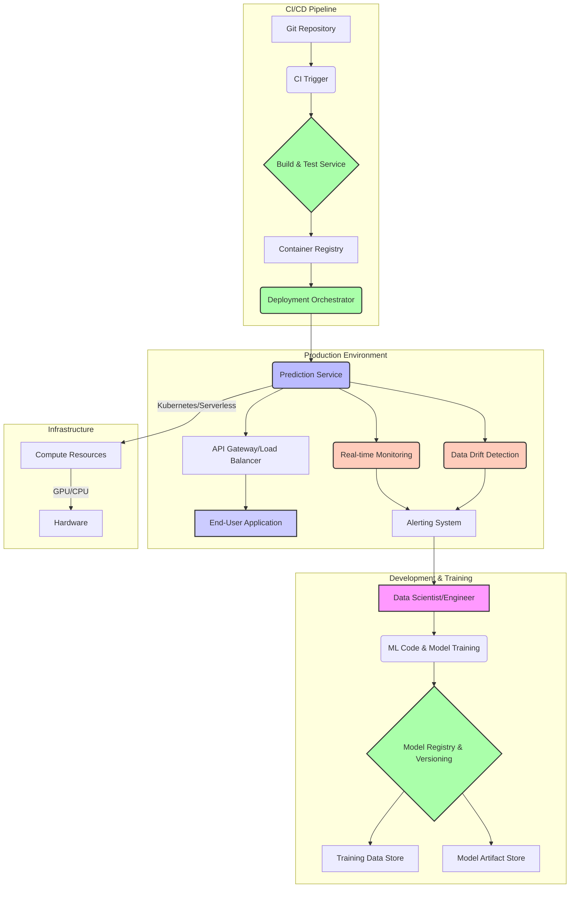

대규모 AI 서비스 배포는 현대 기업의 핵심 경쟁력이 되었지만, 복잡성과 예측 불가능성으로 인해 실무에서 중대한 도전 과제입니다. 효율적인 Harness 시스템 설계는 이러한 AI 모델을 안정적이고 확장 가능하며 비용 효율적으로 프로덕션 환경에 배포하고 관리하는 데 필수적입니다. 이 시스템은 모델 개발부터 배포, 모니터링, 재학습에 이르는 전체 라이프사이클을 자동화하고 통합하는 역할을 합니다.

## Harness 시스템의 핵심 구성 요소

대규모 AI 서비스 배포를 위한 Harness 시스템은 단순히 CI/CD 파이프라인을 넘어서, AI 특유의 요구사항을 충족하는 포괄적인 솔루션이어야 합니다.

### 모델 관리 및 버전 관리 (Model Management & Versioning)

*   **모델 레지스트리 (Model Registry)**: 학습된 모델 아티팩트, 메타데이터, 학습 파라미터 등을 중앙에서 관리합니다. 각 모델 버전은 고유하게 식별되며, 특정 배포와 연결됩니다.
*   **모델 추적 (Model Tracking)**: 모델의 성능 지표, 학습 데이터 세트, 코드 변경 이력 등을 기록하여 재현 가능성을 보장합니다.

### CI/CD 파이프라인 (Continuous Integration/Continuous Deployment)

*   **자동화된 빌드 및 테스트 (Automated Build & Test)**: 모델 코드, 추론 서비스 코드, 의존성을 포함한 컨테이너 이미지를 자동으로 빌드하고, 단위 테스트, 통합 테스트, 성능 테스트를 수행합니다.
*   **점진적 배포 (Progressive Deployment)**: Canary Deployment, Blue/Green Deployment 등 위험을 최소화하며 점진적으로 새 모델 버전을 배포하는 전략을 지원합니다. 2026년에는 Agentic 시스템을 활용한 자율적인 배포 의사결정 및 롤백이 중요해지고 있습니다.

### 모니터링 및 관측 가능성 (Monitoring & Observability)

*   **성능 모니터링 (Performance Monitoring)**: 모델의 추론 지연 시간(latency), 처리량(throughput), 자원 사용량(CPU, GPU, Memory) 등을 실시간으로 모니터링합니다.
*   **모델 품질 모니터링 (Model Quality Monitoring)**: 모델의 예측 정확도, 편향(bias), 데이터 드리프트(data drift), 개념 드리프트(concept drift) 등을 지속적으로 측정하고 알림을 발생시킵니다.
*   **로그 및 트레이싱 (Logging & Tracing)**: 분산된 AI 서비스 구성 요소 전반에 걸친 로그와 요청 트레이싱을 통해 문제 진단 및 성능 최적화를 지원합니다.

### 자원 관리 및 오케스트레이션 (Resource Management & Orchestration)

*   **컴퓨팅 자원 관리 (Compute Resource Management)**: GPU 클러스터, CPU 기반 서버리스 함수 등 AI 추론에 필요한 컴퓨팅 자원을 효율적으로 프로비저닝하고 스케일링합니다. Kubernetes와 같은 컨테이너 오케스트레이션 플랫폼이 핵심적인 역할을 합니다.
*   **서버리스 배포 (Serverless Deployment)**: 특정 AI 워크로드에 대해 서버리스 함수(e.g., AWS Lambda, Google Cloud Functions)를 활용하여 운영 오버헤드를 줄이고 비용 효율성을 높입니다.

## Harness 시스템 아키텍처 예시

다음 Mermaid 다이어그램은 대규모 AI 서비스 배포를 위한 Harness 시스템의 일반적인 아키텍처를 보여줍니다.



## 실제 동작하는 코드 예제: 배포 스크립트 (Python)

아래 Python 코드는 Harness 시스템의 배포 단계에서 모델 버전을 업데이트하고, Canary 배포를 수행하며, 기본적인 헬스 체크를 실행하는 간단한 시나리오를 보여줍니다. 실제 시스템에서는 클라우드 SDK, Kubernetes API 등과 연동됩니다.

```python
import os
import requests
import time
import json

class HarnessDeploymentClient:
    def __init__(self, api_base_url, auth_token):
        self.api_base_url = api_base_url
        self.headers = {"Authorization": f"Bearer {auth_token}", "Content-Type": "application/json"}

    def deploy_model_version(self, service_name, model_id, model_version, deployment_strategy="canary", traffic_percentage=10):
        print(f"Deploying model {model_id}:{model_version} to service {service_name} with {deployment_strategy} strategy...")
        payload = {
            "service_name": service_name,
            "model_id": model_id,
            "model_version": model_version,
            "strategy": deployment_strategy,
            "traffic_percentage": traffic_percentage
        }
        try:
            response = requests.post(f"{self.api_base_url}/deploy", headers=self.headers, data=json.dumps(payload))
            response.raise_for_status()
            deployment_id = response.json().get("deployment_id")
            print(f"Deployment initiated with ID: {deployment_id}")
            return deployment_id
        except requests.exceptions.RequestException as e:
            print(f"Deployment failed: {e}")
            return None

    def check_deployment_status(self, deployment_id):
        print(f"Checking status for deployment ID: {deployment_id}")
        try:
            response = requests.get(f"{self.api_base_url}/deployments/{deployment_id}/status", headers=self.headers)
            response.raise_for_status()
            status = response.json().get("status")
            print(f"Deployment {deployment_id} status: {status}")
            return status
        except requests.exceptions.RequestException as e:
            print(f"Failed to get deployment status: {e}")
            return "ERROR"

    def promote_deployment(self, deployment_id):
        print(f"Promoting deployment ID: {deployment_id} to full traffic.")
        try:
            response = requests.post(f"{self.api_base_url}/deployments/{deployment_id}/promote", headers=self.headers)
            response.raise_for_status()
            print(f"Deployment {deployment_id} promoted successfully.")
            return True
        except requests.exceptions.RequestException as e:
            print(f"Promotion failed for deployment {deployment_id}: {e}")
            return False

    def rollback_deployment(self, deployment_id):
        print(f"Rolling back deployment ID: {deployment_id}.")
        try:
            response = requests.post(f"{self.api_base_url}/deployments/{deployment_id}/rollback", headers=self.headers)
            response.raise_for_status()
            print(f"Deployment {deployment_id} rolled back successfully.")
            return True
        except requests.exceptions.RequestException as e:
            print(f"Rollback failed for deployment {deployment_id}: {e}")
            return False

# 예제 사용법
if __name__ == "__main__":
    HARNESS_API_URL = os.getenv("HARNESS_API_URL", "https://api.harness.example.com")
    HARNESS_AUTH_TOKEN = os.getenv("HARNESS_AUTH_TOKEN", "your_secret_token")

    client = HarnessDeploymentClient(HARNESS_API_URL, HARNESS_AUTH_TOKEN)

    SERVICE_NAME = "recommendation-service"
    MODEL_ID = "item-recommendation-v2"
    NEW_MODEL_VERSION = "2.1.0"

    # Canary 배포 시작
    deployment_id = client.deploy_model_version(SERVICE_NAME, MODEL_ID, NEW_MODEL_VERSION, traffic_percentage=10)

    if deployment_id:
        print("Waiting for canary deployment to stabilize (e.g., 5 minutes)...")
        time.sleep(300) # 실제 환경에서는 모니터링 시스템의 신호를 기다림

        status = client.check_deployment_status(deployment_id)
        if status == "STABLE":
            print("Canary deployment stable. Checking metrics...")
            # 실제 환경에서는 모니터링 시스템의 지표(성능, 오류율, 모델 품질)를 확인
            # 예를 들어, canary 배포된 모델의 CTR이 이전 버전보다 현저히 낮거나 오류율이 높으면 롤백
            metrics_ok = True # Assume metrics are good for this example
            if metrics_ok:
                client.promote_deployment(deployment_id)
            else:
                client.rollback_deployment(deployment_id)
        elif status == "DEGRADED" or status == "FAILED":
            print("Canary deployment degraded or failed. Initiating rollback.")
            client.rollback_deployment(deployment_id)
        else:
            print(f"Deployment {deployment_id} in unexpected state: {status}")
```

## 트레이드오프

대규모 AI 서비스 배포를 위한 Harness 시스템 설계에는 여러 가지 트레이드오프가 존재하며, 프로젝트의 특성과 조직의 역량에 따라 최적의 균형점을 찾아야 합니다.

*   **중앙 집중식 vs. 분산식 제어 (Centralized vs. Decentralized Control)**
    *   **언제 좋고**: 초기 단계의 소규모 팀이나 엄격한 거버넌스가 필요한 경우, 중앙에서 모델 배포 정책 및 인프라를 관리하면 일관성과 보안을 확보하기 용이합니다.
    *   **언제 나쁜지**: 여러 팀이 다양한 AI 서비스를 개발하는 대규모 조직에서는 중앙 집중식 제어가 병목 현상을 유발하고, 팀별 자율성과 혁신을 저해할 수 있습니다. 각 팀이 자체 배포 파이프라인을 커스터마이징할 필요가 있을 때 유연성이 떨어집니다.

*   **범용적인 배포 템플릿 vs. 특화된 배포 전략 (Generic Templates vs. Specialized Strategies)**
    *   **언제 좋고**: 표준화된 AI 모델(예: 이미지 분류, NLP 임베딩)을 다수 배포하는 경우, 범용 템플릿은 개발 속도를 높이고 관리 비용을 절감합니다.
    *   **언제 나쁜지**: 실시간 인터랙션이 중요한 LLM 서비스, 에지 디바이스 배포, 멀티모달 AI와 같이 특수한 요구사항이 있는 경우에는 범용 템플릿만으로는 성능 최적화나 복잡한 워크플로우를 충분히 지원하기 어렵습니다. 특정 모델의 배포 복잡도를 높이는 반면, 효율성을 저해할 수 있습니다.

*   **비용 효율성 vs. 성능 최적화 (Cost Efficiency vs. Performance Optimization)**
    *   **언제 좋고**: 배치 추론이나 낮은 지연 시간을 허용하는 서비스의 경우, 서버리스(Serverless)나 스팟 인스턴스(Spot Instance)를 활용하여 비용을 크게 절감할 수 있습니다.
    *   **언제 나쁜지**: 자율 주행, 금융 거래 분석, 실시간 추천 시스템과 같이 극도로 낮은 지연 시간과 높은 처리량이 요구되는 AI 서비스는 전용 GPU 클러스터나 최적화된 하드웨어가 필요하며, 이는 필연적으로 높은 비용을 수반합니다. 비용 절감만을 목표로 하면 서비스 품질 저하로 이어질 수 있습니다.

*   **자동화 수준 (Level of Automation)**
    *   **언제 좋고**: 반복적이고 예측 가능한 배포 작업에는 높은 수준의 자동화가 인적 오류를 줄이고 배포 속도를 높여 생산성을 극대화합니다. 2026년에는 Agentic Orchestration이 이 영역에서 더욱 발전하고 있습니다.
    *   **언제 나쁜지**: 초기 단계의 AI 서비스, 복잡한 비즈니스 로직이 얽혀있는 배포, 또는 엄격한 규제가 필요한 경우, 과도한 자동화는 문제 발생 시 디버깅을 어렵게 하고, 인간의 개입이 필요한 중요한 의사결정 포인트를 간과할 수 있습니다. 점진적인 자동화 도입이 중요합니다.

## 실전 체크리스트

대규모 AI 서비스 배포를 위한 Harness 시스템을 구축하거나 개선할 때 다음 체크리스트를 활용하여 핵심적인 요소를 검토하고 검증하세요.

*   [ ] **모델 버전 관리 및 재현성 확보**: 모든 모델 아티팩트와 학습 메타데이터가 중앙 모델 레지스트리에서 효과적으로 버전 관리되고, 필요시 언제든지 특정 모델 버전을 재현하거나 롤백할 수 있는가?
*   [ ] **자동화된 Canary/Blue-Green 배포 구현**: 새로운 AI 모델 버전 배포 시 트래픽을 점진적으로 전환하고, 이상 감지 시 자동으로 롤백되는 시스템이 구축되어 있는가? (예: 초기 5% 트래픽 전환 후 1시간 동안 오류율 < 0.1% 유지 시 점진적 확대)
*   [ ] **실시간 성능 및 품질 모니터링**: 모델의 추론 지연 시간, 처리량, 자원 사용량뿐만 아니라, 예측 정확도, 데이터 드리프트, 편향 등 모델 자체의 품질 지표를 실시간으로 모니터링하고 임계치 초과 시 알림을 발생시키는가?
*   [ ] **동적 자원 스케일링 (Auto-scaling)**: 급격한 트래픽 변화에 대응하여 컴퓨팅 자원(GPU/CPU)이 자동으로 스케일 인/아웃(Scale In/Out) 되도록 구성되어 비용 효율성과 서비스 안정성을 동시에 확보하는가?
*   [ ] **비용 효율성 최적화 정책 적용**: 사용률이 낮은 시간대에는 스팟 인스턴스 활용, 모델 캐싱 전략, 비활성화된 모델의 자원 반납 등 비용 절감 전략이 Harness 시스템에 반영되어 있는가?
*   [ ] **보안 및 접근 제어 강화**: 모델 아티팩트, 배포 파이프라인, 추론 엔드포인트에 대한 최소 권한 원칙(Principle of Least Privilege)이 적용되었으며, 모든 접근이 기록되고 감사 가능한가?
*   [ ] **장애 복구 및 고가용성 설계**: 단일 장애 지점(Single Point of Failure)이 없으며, 지역 장애 발생 시에도 서비스 연속성을 보장하는 다중 지역 배포 또는 강력한 장애 복구 메커니즘이 설계되어 있는가? (RTO/RPO 목표 명시)