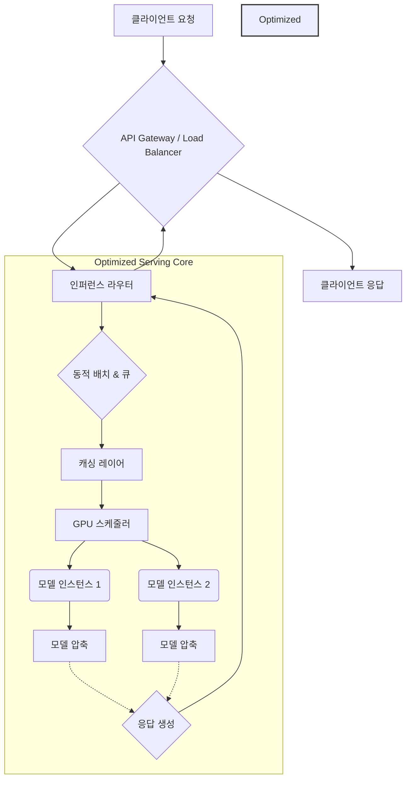

대규모 AI 모델, 특히 LLM의 효율적인 프로덕션 서빙은 막대한 연산 자원과 메모리 비용 최적화에 달려 있습니다. 안정적이고 비용 효율적인 운영을 위해 하네스(harness) 최적화는 필수적입니다. 이 엔트리에서는 2026년 최신 트렌드를 반영한 핵심 하네스 최적화 패턴을 소개하여, 비용 절감과 성능 향상을 동시에 달성하는 방안을 탐구합니다.

## 핵심 하네스 최적화 패턴

### 1. GPU 메모리 최적화 및 모델 압축 (GPU Memory Optimization & Model Compression)
모델 양자화(Quantization), 희소성(Sparsity), 가지치기(Pruning)로 GPU 메모리 사용량과 추론 속도를 최적화합니다. FP32에서 `bfloat16`, `int4` 등으로 정밀도를 낮추며, 2026년에는 `k-bit` 양자화가 보편화될 것입니다.

### 2. 동적 배치 및 PagedAttention (Dynamic Batching & PagedAttention)
들어오는 요청을 묶어 GPU 활용률을 극대화하는 동적 배치(Dynamic Batching)는 처리량을 증대합니다. LLM 서빙에선 vLLM의 PagedAttention이 KV 캐시(KV Cache) 메모리 단편화를 해결하고 가변 길이 시퀀스 GPU 메모리 활용을 혁신적으로 개선합니다.

### 3. 지능형 캐싱 전략 (Intelligent Caching Strategies)
반복/유사 요청의 응답 시간을 줄이기 위해 캐싱이 중요합니다. LLM의 KV 캐시는 이전 토큰 계산 결과를 저장하며, 모델 로딩 캐시는 자주 사용 모델을 미리 로드하여 콜드 스타트 지연을 줄입니다. 예측 기반 및 계층적 캐싱이 발전 중입니다.

### 4. 멀티-모델 서빙 및 로드 밸런싱 (Multi-Model Serving & Load Balancing)
단일 서버에 여러 모델을 동시 서빙하는 멀티플렉싱(Multiplexing)은 자원 활용도를 높입니다. 동적 모델 로딩(Dynamic Model Loading)은 요청에 따라 모델을 로드/언로드하여 유연성을 확보합니다. 지능형 라우팅(Intelligent Routing)은 요청 특성에 따라 최적의 GPU 인스턴스로 분배하여 성능과 비용을 최적화합니다.

### 5. 서버리스 인퍼런스 아키텍처 (Serverless Inference Architectures)
서버리스 접근 방식은 유휴 자원 낭비를 줄이고 트래픽 변화에 유연하게 대응합니다. 이벤트 기반(event-driven) 스케일링은 요청 시에만 자원을 할당/해제하여 비용을 절감합니다. 콜드 스타트 완화(cold start mitigation)를 위해 컨테이너 사전 로드, 빠른 스냅샷 복원 기술이 발전하고 있습니다.

## 코드 예제: 간단한 모델 서빙 (Python FastAPI)

FastAPI를 사용한 AI 모델 서빙 엔드포인트 예시입니다. 실제 환경에서는 동적 배치, 캐싱, GPU 스케줄러 연동이 필요합니다.

```python
from fastapi import FastAPI
from pydantic import BaseModel
import uvicorn
import time

class InferenceRequest(BaseModel):
    texts: list[str]

class InferenceResponse(BaseModel):
    results: list[str]

app = FastAPI()

class DummyModel:
    def predict(self, inputs: list[str]) -> list[str]:
        time.sleep(0.01 * len(inputs))
        return [f"Processed: {text.upper()}" for text in inputs]

model_instance = DummyModel()

@app.post("/infer", response_model=InferenceResponse)
async def infer_texts(request: InferenceRequest):
    results = model_instance.predict(request.texts)
    return InferenceResponse(results=results)

# if __name__ == "__main__":
#     uvicorn.run(app, host="0.0.0.0", port=8000)
```

## AI 모델 서빙 하네스 아키텍처 (Optimized AI Model Serving Harness Architecture)



## 트레이드오프

*   **성능 vs. 비용 (Performance vs. Cost)**
    *   **언제 좋음**: 양자화/압축 및 GPU 활용률 극대화는 비용 절감에 유리합니다.
    *   **언제 나쁨**: 과도한 압축은 정확도/견고성 저하를 초래할 수 있습니다.
*   **레이턴시 vs. 처리량 (Latency vs. Throughput)**
    *   **언제 좋음**: 동적 배치는 전체 시스템 처리량을 극대화할 때 효과적입니다.
    *   **언제 나쁨**: 실시간 서비스에서 배치 대기는 개별 요청 레이턴시 변동성을 증가시킬 수 있습니다.
*   **복잡성 vs. 유연성 (Complexity vs. Flexibility)**
    *   **언제 좋음**: 지능형 라우팅/멀티-모델 서빙은 다양한 모델/트래픽 패턴에 유연하게 대응합니다.
    *   **언제 나쁨**: 단순 환경에서는 불필요한 복잡성과 유지보수 비용을 증가시킬 수 있습니다.
*   **콜드 스타트 vs. 자원 활용 (Cold Start vs. Resource Utilization)**
    *   **언제 좋음**: 서버리스는 간헐적 트래픽 서비스에서 자원 활용 효율을 극대화하고 비용을 절감합니다.
    *   **언제 나쁨**: 첫 요청 시 콜드 스타트 지연이 사용자 경험에 부정적 영향을 줄 수 있으므로 완화 전략이 필수적입니다.

## 실전 체크리스트

*   - [ ] GPU utilization monitoring system을 구축하고, 모델 서빙 시 GPU 활용률이 80% 이상으로 유지되는지 주기적으로 확인 및 개선 계획 수립
*   - [ ] 각 모델 및 트래픽 패턴에 맞는 최적 동적 배치(dynamic batching) 크기 및 타임아웃(timeout) 정책을 정의하고, A/B 테스트를 통해 실제 효과를 검증 완료
*   - [ ] KV 캐시(KV Cache) hit ratio를 포함한 캐싱 관련 지표(metrics)를 모니터링하여, 주요 모델의 캐시 hit ratio가 90% 이상으로 유지되는지 확인
*   - [ ] 새로운 모델 버전 배포 시, 카나리 릴리즈(Canary Release) 또는 그림자 모드(Shadow Mode)를 활용하여 성능 및 안정성 회귀(regression) 테스트를 자동화했는지 검토
*   - [ ] 콜드 스타트(cold start) 지연 시간을 5초 이내로 줄이기 위한 프로비저닝(provisioning) 또는 모델 스냅샷(snapshot) 사전 로딩 전략이 효과적으로 구현되었는지 측정
*   - [ ] 단위 인퍼런스(inference) 요청당 비용(`달러/$` 단위)을 정확히 측정하고, 월별 10% 비용 절감 목표를 설정하여 추적하는 프로세스 구축
*   - [ ] 주요 모델의 P99 레이턴시(P99 Latency)가 500밀리초(`ms`) 이내로 2026년 목표치를 충족하는지 정기적으로 검증하고, 미달 시 최적화 방안 재검토