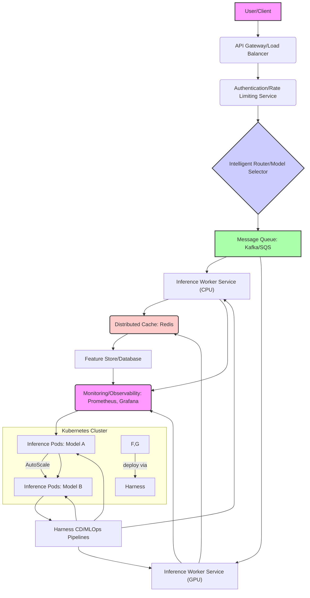

대규모 AI 서비스는 예측 불가능한 트래픽 패턴과 높은 컴퓨팅 요구사항으로 인해 확장성(Scalability)과 안정성(Stability)이 핵심 경쟁력입니다. Harness는 이러한 AI 서비스의 인프라 및 배포를 관리하며, 트래픽 급증에 효과적으로 대응하기 위한 설계 지식이 필수적입니다. 2026년 기준, 클라우드 네이티브 환경에서 AI 워크로드를 안정적으로 운영하고 비용 효율성을 극대화하는 방안은 주요 과제입니다.

## 대규모 AI 서비스 트래픽 대응을 위한 Harness 확장 전략

대규모 AI 서비스의 트래픽 급증은 주로 두 가지 시나리오에서 발생합니다: 갑작스러운 사용자 유입(Spike Traffic)과 지속적인 사용량 증가(Sustained Growth). 이에 대응하기 위한 Harness의 확장 전략은 인프라, 애플리케이션, 그리고 데이터 파이프라인 전반에 걸쳐 통합적으로 설계되어야 합니다.

### 1. 지능형 로드 밸런싱 및 API Gateway

AI 서비스의 진입점에서 트래픽을 효율적으로 분산하고 제어하는 것은 기본입니다. Layer 7 로드 밸런싱을 활용하여 요청의 내용(예: 모델 종류, 사용자 그룹)에 따라 적절한 AI 모델 인스턴스로 라우팅할 수 있습니다. API Gateway는 인증, 권한 부여, 요청/응답 변환, 속도 제한(Rate Limiting) 등 추가적인 기능을 제공하여 백엔드 AI 서비스의 부하를 줄이고 보안을 강화합니다. 특히, 멀티-모델 환경에서는 LLM 라우팅 전략을 통해 특정 요청을 최적의 모델 또는 GPU 인스턴스에 할당하여 처리 효율성을 높일 수 있습니다.

### 2. 비동기 처리 및 메시지 큐 시스템

대부분의 AI 추론 작업은 실시간 응답이 필수적이지 않거나, 작업 자체가 긴 시간을 소요하는 경우가 많습니다. 이러한 워크로드를 비동기적으로 처리하여 사용자 경험을 개선하고, 백엔드 시스템의 부하를 분산할 수 있습니다. Kafka, RabbitMQ, SQS와 같은 메시지 큐는 요청을 버퍼링하고, 백프레셔(Backpressure) 상황에서도 안정적으로 처리하며, 재시도(Retry) 메커니즘을 통해 견고성을 확보합니다. Harness는 이러한 메시지 큐와의 통합을 통해 AI 작업의 배포 및 모니터링을 자동화할 수 있습니다.

### 3. 분산 캐싱 메커니즘

반복적인 동일 요청 또는 예측 가능한 결과에 대해 캐싱(Caching)은 추론 지연 시간을 줄이고 컴퓨팅 리소스 사용량을 대폭 절감합니다. Redis, Memcached와 같은 인메모리(In-memory) 캐시를 활용하여 추론 결과를 저장하고, CDN(Content Delivery Network)을 통해 정적 콘텐츠나 엣지(Edge)에서 캐싱 가능한 추론 결과를 사용자에게 더 가깝게 제공할 수 있습니다. Harness는 캐시 무효화(Invalidation) 전략 및 캐시 인프라 배포를 관리하여 효율적인 캐싱 운영을 지원합니다.

### 4. 마이크로서비스 아키텍처 및 컨테이너 오케스트레이션

AI 서비스를 기능별로 마이크로서비스화하고 Kubernetes와 같은 컨테이너 오케스트레이션 도구를 사용하는 것은 확장성을 위한 필수 전략입니다. 각 마이크로서비스는 독립적으로 개발, 배포, 확장될 수 있으며, Kubernetes의 오토스케일링(Autoscaling) 기능은 CPU, 메모리, GPU 사용량 등 메트릭에 기반하여 자동으로 AI 모델 인스턴스를 확장/축소합니다. Harness는 Kubernetes 클러스터에 대한 CD(Continuous Delivery) 파이프라인을 구축하여 CI/CD 워크플로우를 자동화하고, AI 모델의 빠른 배포와 롤백을 가능하게 합니다.

### 5. GPU-Aware 자원 스케줄링 및 최적화

AI 워크로드의 핵심인 GPU 자원은 매우 고가이며 한정적입니다. Kubernetes 환경에서 NVIDIA GPU Operator와 같은 도구를 활용하여 GPU 자원을 효율적으로 스케줄링하고, 컨테이너화된 AI 애플리케이션이 필요한 GPU를 정확하게 할당받도록 관리해야 합니다. 또한, 추론 워크로드에 따라 GPU의 멀티인스턴스(Multi-Instance GPU, MIG) 기능을 활용하거나, 배치 추론(Batch Inference)을 최적화하여 GPU 활용률을 극대화하는 전략도 중요합니다.

### 6. Observability 및 성능 모니터링

대규모 분산 AI 서비스 환경에서는 시스템의 상태를 정확하게 파악하고 병목 현상을 진단하는 것이 매우 중요합니다. Prometheus와 Grafana를 이용한 메트릭 수집 및 시각화, Jaeger 또는 OpenTelemetry를 활용한 분산 트레이싱(Distributed Tracing), 중앙 집중식 로깅 시스템(Elastic Stack, Loki) 구축은 필수적입니다. Harness는 이러한 Observability 도구들과 연동하여 AI 서비스의 성능 저하 및 이상 징후를 조기에 감지하고, 자동화된 대응을 가능하게 합니다.



### Go 언어 기반 비동기 추론 요청 예제

아래는 Go 언어로 작성된 간단한 HTTP 서버로, 클라이언트 요청을 받아 메시지 큐(여기서는 간단한 채널로 대체)에 추론 작업을 푸시하고 즉시 응답하는 비동기 처리 패턴을 보여줍니다. 실제 시스템에서는 메시지 큐 클라이언트 라이브러리(Kafka-go, AWS SDK SQS 등)를 사용합니다.

```go
package main

import (
	"fmt"
	"log"
	"net/http"
	"time"
)

type InferenceRequest struct {
	RequestID string
	Data      string
}

// inferenceQueue는 실제 메시지 큐를 시뮬레이션합니다.
var inferenceQueue = make(chan InferenceRequest, 1000)

// inferenceWorker는 큐에서 작업을 가져와 처리합니다.
func inferenceWorker(workerID int) {
	for req := range inferenceQueue {
		log.Printf("Worker %d processing Request %s with Data: %s", workerID, req.RequestID, req.Data)
		// 실제 AI 추론 로직 (시간 소모)
		time.Sleep(2 * time.Second)
		log.Printf("Worker %d finished Request %s", workerID, req.RequestID)
		// 결과는 다른 큐에 넣거나, 캐시에 저장하거나, 콜백으로 전달할 수 있습니다.
	}
}

func main() {
	// 여러 워커 고루틴 시작
	for i := 0; i < 5; i++ {
		go inferenceWorker(i)
	}

	http.HandleFunc("/infer", func(w http.ResponseWriter, r *http.Request) {
		if r.Method != http.MethodPost {
			http.Error(w, "Only POST requests are supported.", http.StatusMethodNotAllowed)
			return
		}

		// 요청 데이터 파싱 (간단화)
		requestData := r.FormValue("data")
		if requestData == "" {
			http.Error(w, "'data' parameter is required.", http.StatusBadRequest)
			return
		}

		requestID := fmt.Sprintf("req-%d", time.Now().UnixNano())
		inferenceReq := InferenceRequest{
			RequestID: requestID,
			Data:      requestData,
		}

		// 큐에 요청 푸시
		select {
		case inferenceQueue <- inferenceReq:
			fmt.Fprintf(w, "Inference request %s submitted successfully. Processing in background.\n", requestID)
		case <-time.After(50 * time.Millisecond): // 큐가 가득 찼을 때 타임아웃 처리
			http.Error(w, "Service overloaded, please try again later.", http.StatusServiceUnavailable)
			log.Printf("Queue full for Request %s", requestID)
		}
	})

	log.Println("Server starting on port 8080...")
	log.Fatal(http.ListenAndServe(":8080", nil))
}
```

## 트레이드오프

Harness를 활용한 대규모 AI 서비스 확장 전략은 여러 트레이드오프를 수반합니다. 각 전략은 특정 상황에서 이점을 제공하지만, 동시에 다른 측면에서 복잡성이나 단점을 야기할 수 있으므로, 프로젝트의 요구사항에 맞춰 신중하게 선택해야 합니다.

*   **마이크로서비스 아키텍처**: 언제 좋은가? 유연한 개발/배포, 독립적 확장, 팀 분할에 유리할 때 좋습니다. 언제 나쁜가? 서비스 간 통신 오버헤드 증가, 분산 시스템 복잡성 증대, 디버깅 어려움 등 운영 비용이 급증할 수 있습니다.
*   **비동기 처리**: 언제 좋은가? 예측 불가능한 부하에 대한 시스템 견고성 및 처리량(Throughput) 증대가 필요하며, 실시간 응답 지연이 허용될 때 좋습니다. 언제 나쁜가? 실시간 또는 낮은 지연 시간(Low-latency)이 필수적인 서비스(예: 실시간 음성 인식)에는 적합하지 않으며, 최종 결과 확인을 위한 복잡한 콜백/폴링(Polling) 메커니즘이 필요합니다.
*   **분산 캐싱**: 언제 좋은가? 동일한 요청이 빈번하거나, 추론 결과의 변화 주기가 길어 재사용성이 높을 때 지연 시간 감소와 비용 절감에 효과적입니다. 언제 나쁜가? 데이터 정합성(Consistency)이 매우 중요하거나, 캐시 무효화 전략이 복잡해질 경우 오히려 시스템 복잡도를 높이고 버그의 원인이 될 수 있습니다.
*   **GPU-Aware 자원 스케줄링**: 언제 좋은가? 고비용의 GPU 자원 활용률을 극대화하여 운영 비용을 절감하고, 다양한 AI 워크로드 간에 효율적인 자원 공유가 필요할 때 좋습니다. 언제 나쁜가? 초기 설정 및 관리 복잡성이 높으며, Kubernetes 및 NVIDIA GPU Operator에 대한 깊은 이해가 필요하여 학습 곡선이 가파를 수 있습니다.
*   **Observability**: 언제 좋은가? 복잡한 분산 환경에서 시스템 이상 징후를 조기에 감지하고, 성능 병목 현상을 정확히 파악하여 신속한 문제 해결이 필요할 때 좋습니다. 언제 나쁜가? 모니터링 시스템 구축 및 유지보수에 상당한 리소스(비용, 인력)가 소요되며, 과도한 데이터 수집은 성능 오버헤드를 발생시킬 수 있습니다.

## 실전 체크리스트

대규모 AI 서비스의 트래픽 급증에 대응하기 위한 Harness 확장 전략을 적용할 때, 다음 체크리스트를 통해 시스템의 준비 상태와 효율성을 검증합니다.

- [ ] **부하 테스트 및 스트레스 테스트 완료 여부**: 실제 또는 예상되는 최대 트래픽 피크에 대한 부하 테스트를 수행하고, AI 서비스가 정의된 SLA(Service Level Agreement)를 만족하는지 확인했습니다.
- [ ] **자동 스케일링 정책 최적화**: CPU, GPU 사용률, 큐 길이 등 핵심 메트릭에 기반한 HPA(Horizontal Pod Autoscaler) 및 KEDA(Kubernetes Event-driven Autoscaling) 규칙이 AI 워크로드의 특성에 맞춰 적절히 설정되었는지 검증했습니다.
- [ ] **메시지 큐 백프레셔 모니터링**: 메시지 큐의 처리량, 큐 길이, 컨슈머 지연(Consumer Lag) 등 핵심 메트릭을 실시간으로 모니터링하여 병목 현상 발생 시 즉각적인 알림이 설정되었는지 확인했습니다.
- [ ] **캐시 히트율 및 응답 시간 측정**: 분산 캐시 시스템의 캐시 히트율(Cache Hit Ratio)을 주기적으로 측정하고, 캐싱 적용 후 AI 추론 응답 시간이 유의미하게 개선되었는지 확인했습니다.
- [ ] **분산 트레이싱 적용 및 분석**: OpenTelemetry와 같은 분산 트레이싱 솔루션을 AI 서비스 전반에 걸쳐 적용하고, 트랜잭션 흐름 내에서 성능 병목 지점을 식별하고 최적화했습니다.
- [ ] **GPU 자원 할당 및 활용률 보고**: GPU 자원 할당 정책이 올바르게 적용되었는지, 그리고 실제 GPU 활용률이 목표치에 부합하는지 정기적으로 보고 및 분석 시스템을 구축했습니다.
- [ ] **장애 복구 및 재시도 전략 구현**: AI 서비스의 핵심 구성 요소(예: 외부 모델 API 호출, 데이터베이스)에 대한 장애 발생 시, 적절한 재시도(Retry), 서킷 브레이커(Circuit Breaker), 폴백(Fallback) 전략이 구현되었고 테스트를 통해 검증되었습니다.