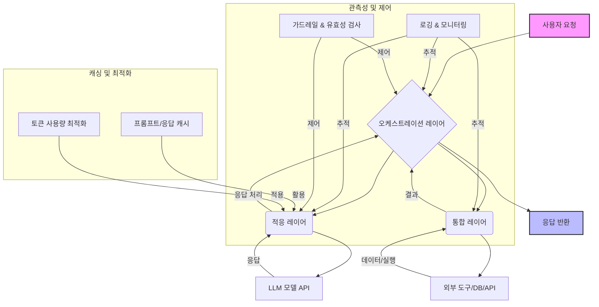

대규모 언어 모델(LLM) 애플리케이션은 단순한 API 호출을 넘어 복잡한 워크플로우, 다양한 모델 통합, 외부 시스템 연동을 요구합니다. 이러한 복잡성을 효율적으로 관리하고, 예측 가능한 성능과 안정성을 확보하며, 비용을 최적화하기 위해 '하네스 아키텍처(Harness Architecture)'는 필수적인 디자인 패턴입니다. 하네스 아키텍처는 LLM 호출을 감싸고 제어하며, 주변 시스템과의 상호작용을 중재하는 프레임워크 역할을 수행합니다. 2026년 현재, LLM 기반 시스템의 복잡도가 증가함에 따라, 견고한 하네스 디자인은 생산성, 확장성, 그리고 운영 효율성 관점에서 핵심적인 차별화 요소로 부상하고 있습니다.

## 하네스 아키텍처의 핵심 구성 요소

대규모 LLM 하네스는 단순히 모델을 호출하는 것 이상의 기능을 수행합니다. 주요 구성 요소는 다음과 같습니다:

### 1. 오케스트레이션 레이어 (Orchestration Layer)
사용자 요청을 해석하고, 이를 처리하기 위한 일련의 LLM 호출, 외부 도구 사용, 데이터 처리 단계를 조율합니다. LangChain, LlamaIndex와 같은 프레임워크가 이 레이어의 기반이 될 수 있습니다. 에이전트 기반(Agent-based) 접근 방식은 복잡한 다단계 작업을 자동화하는 데 특히 효과적입니다.

### 2. 적응 레이어 (Adaptation Layer)
다양한 LLM 모델(예: GPT-4o, Claude 3.5 Sonnet, Gemini Pro) 간의 인터페이스를 추상화하고, 프롬프트 엔지니어링, 모델 버전 관리, 입력/출력 형식 변환을 담당합니다. 이를 통해 특정 LLM에 대한 종속성을 줄이고, 모델 교체나 A/B 테스트를 용이하게 합니다.

### 3. 통합 레이어 (Integration Layer)
LLM이 실세계 데이터에 접근하고 외부 시스템과 상호작용할 수 있도록 데이터베이스, 검색 엔진, CRM, 사내 API 등 다양한 도구(Tools) 및 서비스와의 연결을 관리합니다. 효과적인 툴 스택 통합은 LLM의 역량을 비약적으로 확장시킵니다.

### 4. 관측성 및 제어 레이어 (Observability & Control Layer)
LLM 호출의 모든 단계(프롬프트, 응답, 지연 시간, 토큰 사용량, 에러)를 로깅하고 모니터링합니다. 이는 성능 병목 현상 진단, 비용 분석, 그리고 잠재적인 '환각(Hallucination)' 또는 안전성 문제를 감지하는 데 필수적입니다. 가드레일(Guardrails) 및 유효성 검사(Validation) 로직도 이 레이어에서 구현됩니다.

### 5. 캐싱 및 최적화 레이어 (Caching & Optimization Layer)
반복적인 LLM 호출에 대한 응답을 캐싱하여 지연 시간을 줄이고, API 비용을 절감합니다. 프롬프트 압축(Prompt Compression), 동적 배치(Dynamic Batching)와 같은 기술을 활용하여 성능과 비용 효율성을 최적화합니다.

## 대규모 LLM 하네스 아키텍처 다이어그램



## 코드 예제: 간단한 LLM 하네스 (Python)

아래 코드는 LLM 호출을 오케스트레이션하고, 외부 도구를 통합하며, 기본적인 캐싱 로직을 포함하는 간략한 Python 하네스 예제입니다. 실제 프로덕션 환경에서는 훨씬 더 정교한 로직과 에러 처리, 비동기 처리가 필요합니다.

```python
import hashlib
import json
import time
from typing import Dict, Any, Callable

# Mock LLM API clients
class MockGPTClient:
    def generate(self, prompt: str, model: str = "gpt-4o") -> str:
        time.sleep(0.1) # Simulate API latency
        if "날씨" in prompt:
            return f"오늘 서울의 날씨는 맑고 25도입니다. (GPT-4o)"
        return f"LLM 응답: {prompt[:30]}... (GPT-4o)"

class MockClaudeClient:
    def complete(self, text: str, model: str = "claude-3-5-sonnet") -> str:
        time.sleep(0.15)
        if "환율" in text:
            return f"1 USD는 약 1,370 KRW입니다. (Claude 3.5 Sonnet)"
        return f"LLM 응답: {text[:30]}... (Claude 3.5 Sonnet)"

# Mock External Tools
class WeatherTool:
    def get_weather(self, location: str) -> str:
        return f"날씨 API: {location}의 기온은 25도, 맑음."

class ExchangeRateTool:
    def get_exchange_rate(self, currency_pair: str) -> str:
        return f"환율 API: {currency_pair}는 1370."

class LLMHarness:
    def __init__(self):
        self.gpt_client = MockGPTClient()
        self.claude_client = MockClaudeClient()
        self.tools = {
            "weather_tool": WeatherTool(),
            "exchange_rate_tool": ExchangeRateTool()
        }
        self.cache: Dict[str, Any] = {}

    def _generate_cache_key(self, func_name: str, args: tuple, kwargs: Dict[str, Any]) -> str:
        return hashlib.md5(json.dumps([func_name, args, sorted(kwargs.items())]).encode()).hexdigest()

    def call_llm(self, prompt: str, model_preference: str = "auto", use_cache: bool = True) -> str:
        cache_key = self._generate_cache_key("call_llm", (prompt, model_preference), {"use_cache": use_cache})
        if use_cache and cache_key in self.cache:
            print("캐시 히트!")
            return self.cache[cache_key]

        response = ""
        if model_preference == "gpt" or (model_preference == "auto" and "날씨" in prompt):
            print("GPT 클라이언트 사용...")
            response = self.gpt_client.generate(prompt)
        elif model_preference == "claude" or (model_preference == "auto" and "환율" in prompt):
            print("Claude 클라이언트 사용...")
            response = self.claude_client.complete(prompt)
        else:
            print("기본 GPT 클라이언트 사용...")
            response = self.gpt_client.generate(prompt)

        if use_cache:
            self.cache[cache_key] = response
        return response

    def use_tool(self, tool_name: str, **kwargs) -> Any:
        if tool_name not in self.tools:
            raise ValueError(f"알 수 없는 도구: {tool_name}")
        tool = self.tools[tool_name]
        method = getattr(tool, list(tool.__dict__.keys())[0]) # Assuming tool has one main method
        print(f"도구 '{tool_name}' 사용...")
        return method(**kwargs)

    def process_request(self, user_query: str) -> str:
        # Orchestration logic
        if "날씨" in user_query:
            location = user_query.split(" ")[-1].replace("의", "")
            tool_result = self.use_tool("weather_tool", location=location)
            llm_prompt = f"'{location} 날씨 정보: {tool_result}'를 바탕으로 자연스러운 날씨 설명을 생성해줘."
            return self.call_llm(llm_prompt, model_preference="gpt")
        elif "환율" in user_query:
            currency = user_query.split(" ")[-1]
            tool_result = self.use_tool("exchange_rate_tool", currency_pair=currency)
            llm_prompt = f"'{currency} 환율 정보: {tool_result}'를 바탕으로 현재 환율 정보를 친절하게 설명해줘."
            return self.call_llm(llm_prompt, model_preference="claude")
        else:
            return self.call_llm(user_query)

# 사용 예시
harness = LLMHarness()
print(harness.process_request("오늘 서울의 날씨는 어때?"))
print(harness.process_request("오늘 서울의 날씨는 어때?")) # Cache hit expected
print(harness.process_request("현재 원달러 환율은 얼마야?"))
print(harness.process_request("대한민국의 수도는 어디인가요?"))
```

## 트레이드오프

하네스 아키텍처는 LLM 애플리케이션의 복잡성을 관리하지만, 몇 가지 트레이드오프가 존재합니다.

*   **추상화(Abstraction) vs. 세밀한 제어(Granularity)**
    *   **언제 좋음:** 여러 LLM 모델 및 툴을 일관된 인터페이스로 관리하여 개발 생산성을 높일 때. 복잡한 워크플로우를 간소화하고, 모델 교체를 용이하게 할 때. 특히 프롬프트 버전 관리나 모델 라우팅 로직을 중앙에서 관리할 때 유용합니다.
    *   **언제 나쁨:** 특정 모델의 고유한 최적화 기법이나 최신 기능을 즉시 활용하기 어렵거나, 미세한 성능 튜닝이 필요할 때. 추상화 레이어가 과도하면 오버헤드가 발생하거나 디버깅이 어려워질 수 있습니다.

*   **중앙 집중식 제어(Centralized Control) vs. 분산형 처리(Distributed Processing)**
    *   **언제 좋음:** 작은 규모의 팀에서 개발 속도를 높이고, 일관된 정책(예: 보안, 비용 관리)을 적용하기 용이할 때. 시스템 전체의 상태를 파악하고 디버깅하는 데 유리합니다.
    *   **언제 나쁨:** 매우 높은 트래픽과 확장성이 요구되는 경우, 단일 장애점(Single Point of Failure)이 될 수 있습니다. 각 서비스가 독립적으로 확장되거나 다른 인프라를 사용하는 마이크로서비스 아키텍처에서는 오버헤드가 발생할 수 있습니다.

*   **일반성(Generality) vs. 특수성(Specialization)**
    *   **언제 좋음:** 다양한 LLM 사용 사례에 재사용 가능한 컴포넌트를 제공하여 개발 비용을 절감하고, 일관된 사용자 경험을 제공할 때. 새로운 LLM 모델이나 도구를 빠르게 통합할 수 있는 유연성을 제공합니다.
    *   **언제 나쁨:** 특정 도메인이나 태스크에 대해 극도로 최적화된 성능이 필요할 때, 일반적인 하네스 로직이 오히려 병목이 될 수 있습니다. 복잡한 도메인 지식이 요구되는 에이전트의 미세한 행동 제어에는 한계가 있을 수 있습니다.

*   **개발 속도(Development Speed) vs. 런타임 성능(Runtime Performance)**
    *   **언제 좋음:** 초기 프로토타이핑, MVP 개발, 빠르게 변화하는 LLM 환경에 적응해야 할 때. 표준화된 패턴과 라이브러리를 통해 개발 주기를 단축할 수 있습니다.
    *   **언제 나쁨:** 낮은 레이턴시가 필수적인 실시간 서비스나, 극도로 높은 처리량(Throughput)이 요구되는 배치 처리에서는 하네스의 추상화 계층이 추가적인 오버헤드를 유발하여 성능 저하로 이어질 수 있습니다.

## 실전 체크리스트

대규모 LLM 애플리케이션을 위한 하네스 아키텍처를 설계하고 구현할 때 다음 체크리스트를 활용하여 견고성을 확보할 수 있습니다.

- [ ] **모듈성(Modularity) 확보**: 오케스트레이션, 적응, 통합, 관측성 레이어가 명확히 분리되어 있으며, 각 컴포넌트가 독립적으로 개발 및 배포 가능한가?
- [ ] **관측성(Observability) 구축**: 모든 LLM 호출 및 도구 사용에 대한 상세 로깅(입력/출력, 응답 시간, 토큰 사용량, 비용) 및 모니터링 대시보드가 구성되어 있는가? (예: `harness-engineering/llm-ops-pipeline-design-patterns-production-strategy`)
- [ ] **에러 처리 및 복구(Error Handling & Recovery)**: LLM API 장애, 외부 도구 실패 시 재시도(Retry), 폴백(Fallback), 서킷 브레이커(Circuit Breaker) 패턴이 적용되어 있는가? (예: `harness-engineering/high-availability-llm-disaster-recovery-retry-patterns`)
- [ ] **보안(Security) 및 접근 제어**: LLM API 키, 민감 데이터, 외부 시스템 접근에 대한 강력한 인증, 인가, 데이터 마스킹/암호화 정책이 구현되어 있는가? (예: `infrastructure/claude-api-key-security-audit-usage-pattern-validation`)
- [ ] **비용 관리 및 최적화**: 각 LLM 모델 및 요청 유형별 비용을 추적하고 있으며, 캐싱, 프롬프트 최적화, 동적 라우팅(Dynamic Routing)을 통해 비용을 절감하는 전략이 마련되어 있는가? (예: `harness-engineering/multi-llm-routing-design-patterns-cost-performance`)
- [ ] **컨텍스트 관리(Context Management) 전략**: 장기 컨텍스트(Long-term Context)를 효율적으로 관리하고, RAG (Retrieval Augmented Generation) 패턴을 통해 외부 지식을 효과적으로 통합하고 있는가? (예: `context-engineering/ai-agent-context-window-optimization-session-longevity`)
- [ ] **확장성 및 성능 테스트**: 예상되는 최대 트래픽 부하를 견딜 수 있도록 하네스 시스템 전체에 대한 부하 및 스트레스 테스트를 수행했으며, 병목 지점이 식별되고 개선되었는가?

이러한 하네스 아키텍처 디자인 패턴과 체크리스트를 통해, 대규모 LLM 애플리케이션은 복잡한 운영 환경 속에서도 안정적이고 효율적으로 기능할 수 있습니다. 이는 단순히 LLM을 사용하는 것을 넘어, LLM을 핵심 비즈니스 로직에 통합하고 제어하는 데 있어 필수적인 기반을 제공합니다.