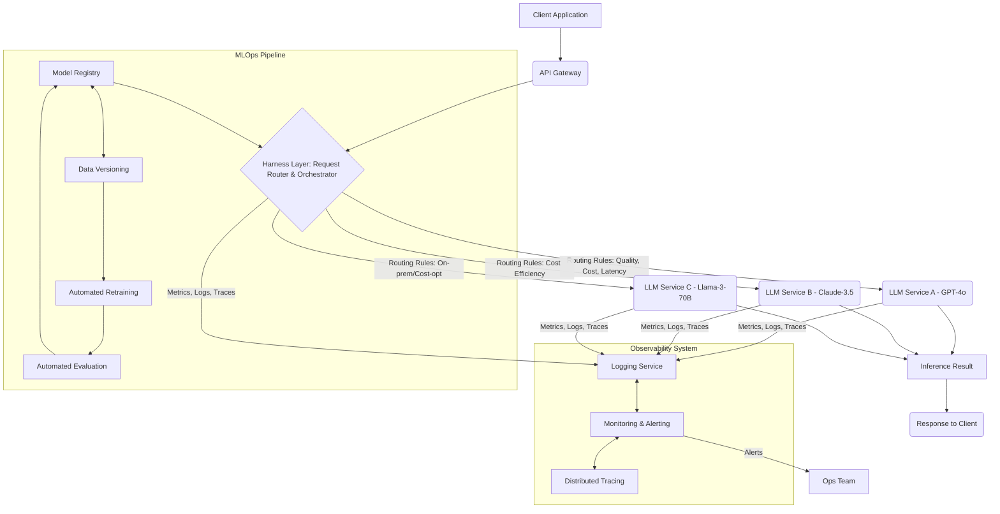

대규모 언어 모델(LLM) 기반 서비스의 성공적인 배포 및 운영은 오늘날의 Harness Engineering에서 가장 중요한 과제 중 하나입니다. LLM의 복잡성, 높은 리소스 요구사항, 그리고 동적으로 변화하는 성능 및 비용 특성 때문에 단순한 배포 전략으로는 한계가 있습니다. 안정성, 확장성, 효율성, 그리고 비용 최적화를 달성하기 위한 견고한 Harness 패턴 디자인이 필수적입니다.

## 핵심 개념: LLM Harness Engineering의 필요성
LLM은 본질적으로 불안정하고 예측 불가능한 측면을 가지고 있습니다. 이를 프로덕션 환경에서 안정적으로 운영하기 위해서는 단순한 API 호출을 넘어선 정교한 제어 메커니즘이 필요합니다. Harness Engineering은 이러한 LLM의 특성을 수용하면서도, 높은 가용성(High Availability), 저지연(Low Latency), 비용 효율성, 그리고 일관된 품질을 보장하는 시스템을 구축하는 데 중점을 둡니다. 이는 모니터링, 자동화된 테스트, 동적 라우팅, 폴백(Fallback) 전략 등을 포함합니다.

## 주요 Harness 패턴

### 1. 동적 LLM 라우팅 (Dynamic LLM Routing)
단일 LLM에 의존하기보다, 여러 LLM 모델 또는 제공업체를 활용하여 요청의 특성(예: 중요도, 길이, 보안 요구사항)에 따라 최적의 모델로 동적으로 라우팅하는 패턴입니다. 이는 비용, 지연 시간, 품질 사이의 트레이드오프를 최적화하는 데 기여합니다.

### 2. MLOps 파이프라인 통합 (MLOps Pipeline Integration)
모델 학습부터 배포, 모니터링, 재학습까지 LLM의 생명주기 전체를 자동화된 MLOps 파이프라인으로 관리합니다. 모델 버전 관리, 데이터셋 버전 관리, 자동화된 평가 및 배포 전략(Canary, A/B testing)은 LLM의 지속적인 개선과 안정적인 운영을 가능하게 합니다.

### 3. 심층 옵저버빌리티 (Deep Observability)
LLM 기반 서비스는 단순한 인프라 지표를 넘어, 프롬프트(prompt) 품질, 응답 지연 시간, 토큰 사용량, 할루시네이션(hallucination) 발생률, 사용자 만족도 등 LLM 특화 메트릭을 심층적으로 모니터링해야 합니다. 분산 트레이싱(Distributed Tracing)은 LLM 호출 체인 내의 병목 현상과 오류 지점을 식별하는 데 필수적입니다.

### 4. 회복성 및 고가용성 패턴 (Resilience & High Availability Patterns)
LLM 서비스의 장애는 사용자 경험에 치명적일 수 있습니다. 서킷 브레이커(Circuit Breaker), 리트라이(Retry) 로직, 폴백(Fallback) 모델, 레이트 리미팅(Rate Limiting), 자동 스케일링(Autoscaling) 등의 패턴을 적용하여 시스템의 회복탄력성과 고가용성을 확보합니다.

### 5. 프롬프트 및 컨텍스트 관리 (Prompt & Context Management)
프롬프트는 LLM의 핵심 입력이자 결과물의 품질을 좌우합니다. 프롬프트 버전 관리, A/B 테스트, 동적 프롬프트 생성 및 주입, 그리고 민감 정보 필터링(PII Masking) 등을 통해 프롬프트의 안정성과 보안을 관리합니다.

## 코드 예시: 동적 LLM 라우터

다음 Python 코드는 요청의 특성에 따라 LLM 서비스를 동적으로 선택하는 라우터의 핵심 로직을 보여줍니다. 이는 다양한 LLM 서비스의 상태, 비용, 품질, 지연 시간 등을 고려하여 최적의 모델을 선택합니다.

```python
# llm_router.py
import random
import time
from typing import Dict, Any, List

class LLMService:
    def __init__(self, id: str, endpoint: str, latency_ms: int, cost_per_token: float, quality_tier: int):
        self.id = id
        self.endpoint = endpoint
        self.latency_ms = latency_ms
        self.cost_per_token = cost_per_token
        self.quality_tier = quality_tier # 1 (lowest) to 5 (highest)
        self.healthy = True

    def check_health(self) -> bool:
        # Simulate a real-time health check (e.g., ping endpoint, check metrics)
        self.healthy = random.random() > 0.05 # 95% healthy
        return self.healthy

    def infer(self, prompt: str, tokens_expected: int) -> Dict[str, Any]:
        if not self.healthy:
            raise ConnectionError(f"Service {self.id} is unhealthy.")
        # Simulate actual inference call
        time.sleep(self.latency_ms / 1000.0)
        calculated_cost = tokens_expected * self.cost_per_token
        return {
            "model_id": self.id,
            "response": f"Generated by {self.id} for '{prompt[:50]}...' (cost: {calculated_cost:.5f})",
            "latency_ms": self.latency_ms,
            "cost": calculated_cost
        }

class LLMDynamicRouter:
    def __init__(self, services: List[LLMService]):
        self.services = {s.id: s for s in services}
        self.routing_rules = [
            {"condition": lambda p, t: "critical" in p.lower() or "safety" in p.lower(), "preference": {"quality_tier": 5}},
            {"condition": lambda p, t: t > 1000, "preference": {"cost_per_token": "min"}}, # Long prompts, prioritize cost
            {"condition": lambda p, t: True, "preference": {"latency_ms": "min"}} # Default, prioritize latency
        ]

    def _get_healthy_services(self) -> List[LLMService]:
        return [s for s in self.services.values() if s.check_health()]

    def route(self, prompt: str, tokens_expected: int) -> LLMService:
        healthy_services = self._get_healthy_services()
        if not healthy_services:
            raise RuntimeError("No healthy LLM services available.")

        for rule in self.routing_rules:
            if rule["condition"](prompt, tokens_expected):
                preference = rule["preference"]

                # Apply preference logic
                if "quality_tier" in preference:
                    target_tier = preference["quality_tier"]
                    candidates = [s for s in healthy_services if s.quality_tier >= target_tier]
                    if candidates:
                        return min(candidates, key=lambda s: s.latency_ms) # Pick lowest latency among high-quality

                if "cost_per_token" in preference and preference["cost_per_token"] == "min":
                    return min(healthy_services, key=lambda s: s.cost_per_token)

                if "latency_ms" in preference and preference["latency_ms"] == "min":
                    return min(healthy_services, key=lambda s: s.latency_ms)

        # Fallback if no rules match or preferences can't be met
        return healthy_services[0] # Just pick the first healthy one

    def process_request(self, prompt: str, tokens_expected: int = 200) -> Dict[str, Any]:
        try:
            selected_llm = self.route(prompt, tokens_expected)
            return selected_llm.infer(prompt, tokens_expected)
        except Exception as e:
            return {"error": str(e)}

# Example setup and usage
services = [
    LLMService("GPT-4o", "api.openai.com/v1/gpt4o", 150, 0.0003, 5),
    LLMService("Claude-3.5", "api.anthropic.com/v1/claude35", 180, 0.0002, 4),
    LLMService("Llama-3-70B-SelfHosted", "internal.llm.com/llama3", 300, 0.0001, 3)
]
router = LLMDynamicRouter(services)

print(router.process_request("Analyze the critical safety protocol for nuclear waste disposal.", tokens_expected=1500))
print(router.process_request("Generate a short poem about a cat.", tokens_expected=50))
print(router.process_request("Write a detailed report on quarterly earnings, focusing on cost efficiency.", tokens_expected=1200))
```

## 아키텍처 다이어그램: 동적 LLM 라우팅 및 모니터링

이 다이어그램은 대규모 LLM 서비스에서 요청이 어떻게 처리되고 모니터링되는지 보여줍니다. API Gateway는 모든 인바운드 요청을 받아 Harness Layer로 전달하며, 이 Layer는 동적 라우팅, 로드 밸런싱, 회복성 패턴을 적용하여 최적의 LLM 인스턴스를 선택합니다. 모든 과정은 중앙화된 옵저버빌리티 시스템에 의해 추적됩니다.



## 2026년 트렌드 반영

2026년 LLM Harness Engineering은 더욱 고도화될 것으로 예상됩니다. 멀티모달(Multimodal) LLM의 증가와 함께, 다양한 입력 양식(텍스트, 이미지, 오디오)에 대한 통합 라우팅 및 처리 패턴이 중요해집니다. 또한, 서버리스(Serverless) LLM 인스턴스 및 엣지(Edge) 디바이스에서의 경량화된 모델 배포가 확대되어, 하이브리드 클라우드 및 분산 인프라에 대한 Harness 패턴이 필수적입니다. 자율 에이전트(Autonomous Agents)의 등장으로 LLM 호출 체인의 복잡성이 증가하며, 에이전트의 상태 관리, 태스크 오케스트레이션, 그리고 장기 메모리(Long-term Memory) 통합을 위한 Harness 디자인이 중요해지고 있습니다.

## 트레이드오프

*   **복잡성 vs. 유연성**: 동적 라우팅 및 멀티 LLM 전략은 높은 유연성을 제공하지만, 시스템 설계 및 운영의 복잡성을 크게 증가시킵니다. 언제 좋은가: 다양한 요구사항(비용, 성능, 품질)을 가진 서비스에 이상적이며, 특정 LLM에 대한 의존도를 낮출 때. 언제 나쁜가: 초기 프로토타입 또는 단순한 단일 목적 서비스에서는 과도한 오버헤드가 발생할 수 있습니다.
*   **비용 vs. 지연 시간/품질**: 고품질 또는 저지연 LLM은 일반적으로 더 비쌉니다. 언제 좋은가: 지연 시간이나 품질이 비즈니스에 치명적인 영향을 미치는 경우(예: 실시간 고객 응대, 의료 진단). 언제 나쁜가: 대량의 배치(batch) 처리나 내부적인 비핵심 태스크에서 불필요하게 높은 비용을 초래할 수 있습니다.
*   **자동화 vs. 수동 제어**: MLOps 파이프라인을 통한 높은 수준의 자동화는 운영 효율성을 극대화합니다. 언제 좋은가: 모델 업데이트가 빈번하고, 배포 속도가 중요한 대규모 서비스에서 개발자 생산성을 높일 때. 언제 나쁜가: 규제 준수가 엄격하거나, 수동 검토가 필수적인 고위험 시나리오에서는 완전 자동화가 위험할 수 있습니다.
*   **범용 LLM vs. 파인튜닝된 LLM**: 범용 LLM은 광범위한 태스크에 적용 가능하지만, 특정 도메인에서는 파인튜닝된 LLM이 더 나은 성능을 보입니다. 언제 좋은가: 빠른 프로토타이핑이나 광범위한 지식 기반이 필요한 경우 범용 LLM이 효율적입니다. 언제 나쁜가: 특정 도메인의 전문성이나 기업 내부 데이터에 대한 깊은 이해가 필요한 경우 파인튜닝이 필수적이며, 범용 LLM은 성능 한계를 보일 수 있습니다.
*   **클라우드 호스팅 vs. 온프레미스/엣지**: 클라우드 LLM은 관리 편의성과 확장성을 제공하지만, 데이터 주권이나 특정 지연 시간 요구사항을 충족하기 어렵습니다. 언제 좋은가: 빠른 확장, 관리 오버헤드 감소가 중요한 경우 클라우드 호스팅이 유리합니다. 언제 나쁜가: 엄격한 데이터 보안 요구사항, 초저지연 애플리케이션, 또는 특정 하드웨어 활용이 필요한 경우 온프레미스/엣지 배포가 더 적합합니다.

## 실전 체크리스트

LLM 기반 서비스의 Harness 패턴을 디자인하고 운영할 때 다음 항목들을 검증해야 합니다.

- [ ] 모든 LLM API 호출에 대한 지연 시간, 처리량, 성공률 메트릭이 중앙화된 모니터링 시스템에서 실시간으로 수집 및 시각화되는가?
- [ ] 모델 드리프트(drift) 및 할루시네이션(hallucination)을 감지하기 위한 자동화된 평가 및 알림 시스템이 구축되어 있으며, 기준 임계값이 명확하게 정의되어 있는가?
- [ ] LLM 서비스 장애 시 트래픽을 자동으로 전환하거나, 대체 응답을 제공하는 폴백(fallback) 메커니즘이 구현되었고 정기적으로 테스트되는가?
- [ ] 새로운 프롬프트 버전, 모델 업데이트, 또는 설정을 배포하기 위한 CI/CD 파이프라인이 자동화되어 있으며, 롤백(rollback) 기능이 포함되어 있는가?
- [ ] GPU/CPU 리소스 사용률 및 비용을 최적화하기 위한 동적 스케일링(autoscaling) 정책이 정의되어 있고, 피크 로드 시나리오에서 성능 저하 없이 작동하는가?
- [ ] Multi-LLM 라우팅 로직이 요청의 특성(예: 중요도, 길이, 보안 등)에 따라 성능, 비용, 정확도 기준을 종합적으로 고려하여 LLM을 동적으로 선택하는가?
- [ ] 프롬프트 인젝션(Prompt Injection) 등 LLM 관련 보안 취약점에 대한 정기적인 보안 감사 및 방어 메커니즘(예: 입력 검증, 가드레일)이 작동하는가?
- [ ] LLM 서비스의 총 소유 비용(TCO)을 추적하고 최적화하기 위한 비용 분석 도구 및 프로세스가 마련되어 있는가?