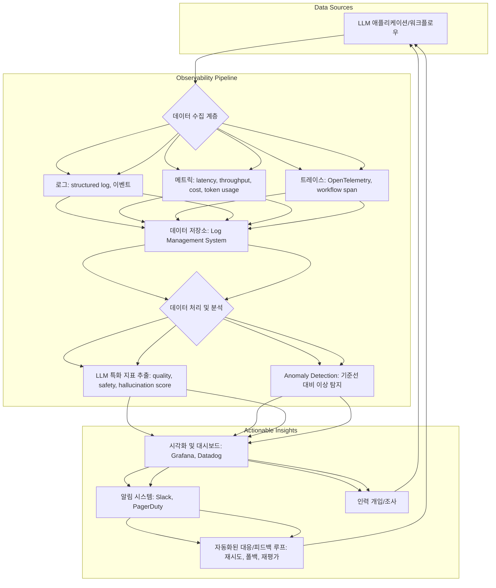

대규모 언어 모델(LLM) 기반 시스템이 프로덕션 환경에 배포되면서, 그 안정성과 효율성을 지속적으로 모니터링하는 것은 선택이 아닌 필수가 되었습니다. LLM 워크플로우는 복잡한 체인, 외부 도구 사용, 동적인 프롬프트 변경 등으로 인해 예측 불가능한 동작을 보일 수 있습니다. 성능 저하, 비용 증가, 환각(hallucination), 그리고 잠재적인 보안 취약점 등을 조기에 감지하고 대응하기 위한 견고한 모니터링 하네스(harness)는 성공적인 LLM 애플리케이션 운영의 핵심입니다.

## LLM 워크플로우 모니터링의 중요성
기존 소프트웨어 시스템과 달리 LLM 워크플로우는 다음과 같은 고유한 특성 때문에 특별한 모니터링 접근 방식이 요구됩니다.

*   **비결정론적 특성 (Non-determinism)**: 동일한 입력에도 불구하고 LLM 출력은 미묘하게 달라질 수 있습니다. 이는 품질 저하나 의도치 않은 동작으로 이어질 수 있습니다.
*   **비용 변동성 (Cost Volatility)**: 토큰 사용량에 기반한 과금 모델 때문에 프롬프트 최적화 실패나 무한 루프는 예기치 않은 비용 폭증을 초래할 수 있습니다.
*   **성능 민감도 (Performance Sensitivity)**: LLM의 응답 시간(latency)은 사용자 경험에 직접적인 영향을 미치며, 복잡한 워크플로우에서는 여러 단계의 지연이 누적될 수 있습니다.
*   **모델 드리프트 (Model Drift)**: 학습 데이터의 변화나 외부 환경 변화에 따라 모델의 성능이나 행동이 시간이 지남에 따라 점진적으로 저하될 수 있습니다.
*   **외부 도구 및 API 의존성 (External Tool & API Dependency)**: LLM 에이전트가 외부 도구를 활용할 때, 해당 도구의 신뢰성 및 응답성도 전체 워크플로우의 안정성에 영향을 미칩니다.

이러한 과제를 해결하기 위해 LLM 워크플로우 모니터링 하네스는 인프라 수준의 지표를 넘어, LLM 호출 자체의 특성과 워크플로우 단계를 깊이 있게 관찰해야 합니다.

## 모니터링 하네스 아키텍처
대규모 LLM 워크플로우를 위한 모니터링 하네스는 일반적으로 다음과 같은 구성 요소로 이루어집니다.



### 1. 데이터 수집 계층 (Data Ingestion Layer)
모든 LLM 호출, tool 사용, 워크플로우 단계별 입출력, 그리고 관련 메타데이터를 구조화된 형태로 수집합니다. OpenTelemetry와 같은 표준을 사용하여 분산 트레이싱을 구현하는 것이 중요합니다.

```python
import openai
import time
import logging
import json
from datetime import datetime

# Configure structured logging
logging.basicConfig(level=logging.INFO, format='%(asctime)s - %(levelname)s - %(message)s')

def log_llm_interaction(event_type: str, data: dict):
    log_entry = {
        "timestamp": datetime.now().isoformat(),
        "event_type": event_type,
        "data": data
    }
    logging.info(json.dumps(log_entry))

def execute_llm_workflow(prompt: str, user_id: str, trace_id: str):
    start_time = time.perf_counter()
    model_name = "gpt-4o-mini-2024-05-13"
    invocation_id = f"inv-{int(time.time())}"

    log_llm_interaction(
        "llm_request",
        {
            "invocation_id": invocation_id,
            "user_id": user_id,
            "trace_id": trace_id,
            "model": model_name,
            "prompt_tokens": len(prompt.split()), # Simplified token count
            "prompt_text": prompt[:100] + "..." if len(prompt) > 100 else prompt
        }
    )

    try:
        response = openai.chat.completions.create(
            model=model_name,
            messages=[{"role": "user", "content": prompt}],
            temperature=0.7
        )
        end_time = time.perf_counter()
        latency_ms = (end_time - start_time) * 1000
        output_content = response.choices[0].message.content
        completion_tokens = response.usage.completion_tokens if response.usage else 0
        total_tokens = response.usage.total_tokens if response.usage else 0
        cost_estimate = (total_tokens / 1_000_000) * 0.5 # Example arbitrary cost (per M tokens)

        log_llm_interaction(
            "llm_response",
            {
                "invocation_id": invocation_id,
                "user_id": user_id,
                "trace_id": trace_id,
                "model": model_name,
                "status": "success",
                "latency_ms": latency_ms,
                "completion_tokens": completion_tokens,
                "total_tokens": total_tokens,
                "cost_estimate": cost_estimate,
                "output_text": output_content[:100] + "..." if len(output_content) > 100 else output_content
            }
        )
        return output_content
    except openai.APIError as e:
        end_time = time.perf_counter()
        latency_ms = (end_time - start_time) * 1000
        log_llm_interaction(
            "llm_response",
            {
                "invocation_id": invocation_id,
                "user_id": user_id,
                "trace_id": trace_id,
                "model": model_name,
                "status": "failure",
                "error_message": str(e),
                "latency_ms": latency_ms
            }
        )
        raise

# Example usage
if __name__ == "__main__":
    try:
        result = execute_llm_workflow(
            prompt="Tell me a short story about a brave knight and a dragon.",
            user_id="test_user_001",
            trace_id="workflow_abc_123"
        )
        print(f"LLM Output: {result[:200]}...")
    except Exception as e:
        print(f"Workflow failed: {e}")
```

### 2. 데이터 저장소 (Data Storage)
수집된 로그, 메트릭, 트레이스 데이터는 Elasticsearch, Prometheus, Grafana Loki, ClickHouse 등 목적에 맞는 저장소에 보관됩니다. 장기적인 추세 분석과 감사(audit)를 위해 데이터 보존 정책을 수립해야 합니다.

### 3. 데이터 처리 및 분석 (Data Processing & Analysis)
저장된 raw 데이터를 기반으로 의미 있는 지표를 추출하고, 기준선(baseline)을 설정하여 이상 징후를 탐지합니다.

*   **핵심 지표**: 응답 시간(Latency), 처리량(Throughput), 토큰 사용량(Token Usage), API 비용(Cost), 에러율(Error Rate).
*   **LLM 특화 지표**:
    *   **품질 (Quality)**: 출력의 유용성, 정확성, 관련성. 자동화된 평가 지표(예: RAGAS, BLEU, ROUGE) 또는 사람의 피드백을 활용합니다.
    *   **안전 (Safety)**: 유해 콘텐츠, 편향된 출력 감지. Pre-trained safety classifiers나 가드레일(guardrail) 시스템의 위반 여부를 모니터링합니다.
    *   **환각 (Hallucination)**: 사실과 다른 정보 생성 여부. 외부 지식 기반이나 자체적인 검증 LLM을 통해 감지할 수 있습니다.
    *   **드리프트 (Drift)**: 모델의 입력 분포(data drift)나 출력 품질(concept drift) 변화를 감지합니다. 2026년 트렌드로는 능동적인 드리프트 예측 및 자동 교정 메커니즘이 강조됩니다.

### 4. 시각화 및 대시보드 (Visualization & Dashboards)
Grafana, Kibana, Datadog와 같은 도구를 활용하여 핵심 지표들을 시각화하고 대시보드를 구축합니다. 워크플로우의 전반적인 상태를 한눈에 파악하고, 문제 발생 시 드릴다운하여 원인을 분석할 수 있도록 구성합니다.

### 5. 알림 및 자동화된 대응 (Alerting & Automated Response)
정의된 임계값을 초과하는 이상 징후 발생 시 Slack, PagerDuty 등으로 알림을 보냅니다. 더 나아가, LLM 워크플로우의 안정성을 유지하기 위해 자동화된 대응(예: 특정 LLM 모델로 폴백, 재시도 로직 트리거, 비용 제한 초과 시 서비스 일시 중단)을 구현하여 2026년에는 'Self-healing' (자기 치유) 워크플로우에 대한 요구가 증대될 것입니다.

## 트레이드오프

### 1. 모니터링 세분화 (Granularity) vs. 비용 및 성능 오버헤드 (Cost & Performance Overhead)
*   **언제 좋은가**: 워크플로우의 미세한 단계까지 완벽한 가시성을 확보하여 복잡한 문제의 근본 원인을 빠르게 파악해야 할 때 유용합니다. 특히 초기 개발 단계나 중요도가 높은 핵심 서비스에 적합합니다.
*   **언제 나쁜가**: 모든 LLM 호출 및 중간 단계를 상세히 기록하고 분석하는 것은 엄청난 양의 데이터 저장 및 처리 비용을 발생시키고, 워크플로우 자체의 성능(latency)에 오버헤드를 줄 수 있습니다. 대규모 트래픽을 처리하는 서비스에서는 비효율적일 수 있습니다.

### 2. 실시간 모니터링 (Real-time Monitoring) vs. 배치 기반 심층 분석 (Batch-based Deep Analysis)
*   **언제 좋은가**: 즉각적인 문제 감지 및 대응이 필수적인 서비스(예: 사용자 대면 애플리케이션)에서 치명적인 서비스 중단이나 사용자 경험 저하를 방지할 때 중요합니다. 빠르게 이상 징후를 발견하고 자동화된 대응을 트리거할 수 있습니다.
*   **언제 나쁜가**: 실시간 처리는 높은 컴퓨팅 자원과 복잡한 스트리밍 데이터 파이프라인을 요구합니다. 또한, 장기적인 추세 분석이나 복잡한 품질 평가 지표는 실시간으로 계산하기 어렵거나 비효율적일 수 있습니다. 심층적인 모델 드리프트 분석이나 장기적인 비용 최적화 전략 수립에는 배치 분석이 더 적합합니다.

### 3. 상용 LLM 옵저버빌리티 플랫폼 (Off-the-shelf LLM Observability Platforms) vs. 자체 구축 (Custom Built Solution)
*   **언제 좋은가**: 빠른 도입과 최소한의 유지보수로 표준화된 모니터링 기능을 활용하고자 할 때 유리합니다. 2026년에는 LLM 특화 기능(환각 감지, 품질 평가)을 제공하는 플랫폼이 더욱 고도화될 것이므로, 복잡성을 줄이고자 할 때 탁월한 선택입니다.
*   **언제 나쁜가**: 특정 비즈니스 로직에 깊이 연결된 맞춤형 평가 지표나 독점적인 데이터 소스를 활용해야 할 경우, 상용 플랫폼의 유연성이 부족할 수 있습니다. 또한, 데이터 주권(data sovereignty)이나 특정 보안/규정 준수 요구사항을 충족하기 어려울 수 있으며, 장기적으로는 자체 구축이 총 소유 비용(TCO) 측면에서 유리할 수도 있습니다.

## 실전 체크리스트

대규모 LLM 워크플로우 모니터링 하네스를 구축하고 운영할 때 다음 항목들을 검증합니다.

*   [ ] **핵심 성능 지표 (Latency, Throughput, Error Rate) 정의 및 추적 시스템 구축 완료 여부**: LLM 호출 및 워크플로우 단계별 P90, P99 Latency가 벤치마크 대비 10% 이상 벗어날 경우 알림이 트리거되는가?
*   [ ] **토큰 사용량 및 비용 모니터링 시스템 구현 완료 여부**: 일일/시간당 토큰 사용량이 예상 임계치를 20% 초과할 경우 알림이 발생하고, 월별 API 비용이 예산을 초과할 것으로 예상될 때 사전 경고가 제공되는가?
*   [ ] **LLM 출력 품질 평가 파이프라인 (자동/수동) 구축 여부**: 주기적인 (예: 매주) 샘플링된 LLM 출력에 대해 품질 점수(정확도, 관련성)를 계산하고, 이 점수가 기준선 대비 5% 이상 하락할 경우 담당자에게 알림이 전송되는가?
*   [ ] **환각 및 안전성 관련 지표 (Hallucination & Safety Metrics) 추적 시스템 구현 여부**: LLM 출력에서 감지된 환각 지수나 안전 가이드라인 위반 비율이 설정된 임계값(예: 0.1% 이상)을 초과할 경우 즉시 경고가 발생하는가?
*   [ ] **분산 트레이싱 (Distributed Tracing) 및 로그 시스템 통합 완료 여부**: 모든 LLM 호출과 외부 도구 사용이 단일 트레이스 ID로 연결되어, 문제 발생 시 엔드-투-엔드(end-to-end) 흐름을 시각적으로 추적할 수 있는가?
*   [ ] **드리프트 감지 (Drift Detection) 및 대응 메커니즘 설계 여부**: 입력 데이터 분포의 변화(data drift)나 모델 성능의 변화(concept drift)가 감지될 경우, 재학습 또는 폴백(fallback) 모델로의 전환을 자동 또는 반자동으로 제안하는가?
*   [ ] **피드백 루프 (Feedback Loop) 자동화 여부**: 모니터링 시스템에서 감지된 문제(예: 특정 프롬프트의 품질 저하)가 자동으로 LLM 재평가 하네스 또는 개발 팀의 이슈 트래커로 연결되어 개선 주기를 단축시키는가?