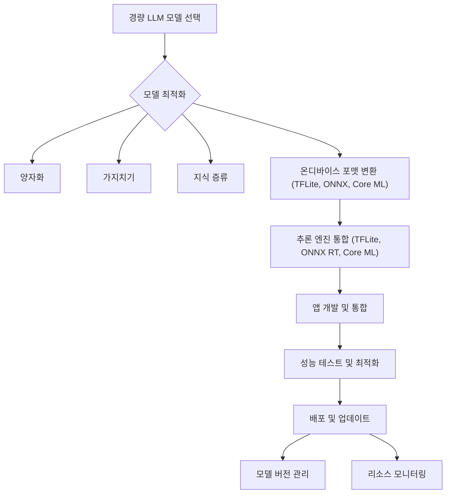

온디바이스 AI는 네트워크 연결 없이도 기기 자체에서 인공지능 모델을 실행하여 실시간 응답, 개인 정보 보호 강화, 그리고 비용 효율성을 제공한다. 2026년 실무 환경에서 온디바이스 AI의 성능 향상과 사용 증가는 경량 대규모 언어 모델(Lightweight LLM)의 효율적인 활용 기술을 핵심 역량으로 부상시킬 것이다. 클라우드 기반 LLM의 한계인 높은 레이턴시, 네트워크 의존성, 그리고 민감 데이터 처리의 보안 우려를 경량 LLM은 효과적으로 해소한다. 특히 스마트폰, 웨어러블 기기, IoT 디바이스 등 리소스가 제한적인 환경에서 LLM 기반의 지능형 애플리케이션을 구현하는 데 필수적인 접근 방식이다.

## 온디바이스 AI의 부상과 경량 LLM
모바일 및 에지 기기에서 인공지능의 필요성이 증대됨에 따라, 경량 LLM은 핵심적인 역할을 수행한다. 사용자의 음성 명령 처리, 실시간 번역, 개인화된 콘텐츠 추천 등 다양한 시나리오에서 즉각적인 응답이 요구되며, 이는 클라우드 기반 LLM만으로는 달성하기 어렵다. 경량 LLM은 모델 크기와 연산량을 최적화하여 이러한 리소스 제약을 극복하고, 저전력 환경에서도 효율적인 추론을 가능하게 한다.

## 핵심 최적화 기술
경량 LLM을 온디바이스 환경에 성공적으로 배포하기 위해서는 다양한 모델 최적화 기법이 필수적이다.

### 양자화 (Quantization)
양자화는 모델의 가중치(weights)와 활성화(activations)를 표현하는 데 사용되는 비트 수를 줄여 모델 크기를 줄이고 추론 속도를 향상시키는 기법이다. 일반적으로 32비트 부동 소수점(FP32)으로 학습된 모델을 8비트 정수(INT8)나 4비트 정수(INT4)로 변환한다. 이 과정에서 약간의 정확도 손실이 발생할 수 있지만, 대부분의 온디바이스 애플리케이션에서는 허용 가능한 수준이다.

### 가지치기 (Pruning)
가지치기는 모델 내에서 중요도가 낮은 가중치나 뉴런 연결을 제거하여 모델의 희소성(sparsity)을 높이는 기법이다. 제거된 연결은 모델 크기를 줄이고 불필요한 연산을 생략하여 추론 효율을 개선한다. 구조화된 가지치기(structured pruning)는 특정 필터나 레이어를 통째로 제거하여 하드웨어 가속에 유리한 형태로 만들기도 한다.

### 지식 증류 (Knowledge Distillation)
지식 증류는 크고 복잡한 '선생(teacher)' 모델의 지식을 작고 효율적인 '학생(student)' 모델로 전이시키는 방법이다. 선생 모델은 데이터 분포와 복잡한 패턴을 학습한 후, 학생 모델은 선생 모델의 예측 확률 분포를 모방하도록 학습된다. 이를 통해 학생 모델은 선생 모델에 근접한 성능을 유지하면서도 훨씬 작은 크기를 가진다.

### 효율적인 아키텍처
특정 LLM 아키텍처는 처음부터 온디바이스 환경을 고려하여 설계된다. 예를 들어, Gemini Nano, Phi-2, MobileNets와 같은 경량화된 트랜스포머 변형 모델들은 모바일 환경에서 효율적인 추론을 위해 최적화된 구조를 갖는다.

## 온디바이스 LLM 개발 워크플로우
온디바이스 LLM 앱 개발은 다음 단계를 따른다.

### 1. 모델 선택 및 사전 학습
온디바이스 배포를 위한 모델은 Gemma Nano, Phi-2, TinyLlama 등 경량화에 초점을 맞춘 모델 또는 `llama.cpp`와 같은 프레임워크와 호환되는 모델 중에서 선택된다. 특정 도메인에 특화된 기능을 제공해야 한다면, 추가적인 사전 학습(pre-training)이나 미세 조정(fine-tuning)을 고려한다.

### 2. 모델 최적화 및 변환
선택된 LLM은 양자화, 가지치기, 지식 증류 등의 기법을 통해 온디바이스 환경에 최적화된다. 이후 모델은 TensorFlow Lite (`.tflite`), ONNX (`.onnx`), Core ML (`.mlmodel`)와 같은 플랫폼별 온디바이스 추론 포맷으로 변환된다. 이 과정에서 Post-training Quantization (PTQ) 또는 Quantization-aware Training (QAT)이 적용될 수 있다.

### 3. 추론 엔진 통합
최적화된 모델은 대상 플랫폼의 추론 엔진 SDK를 사용하여 앱에 통합된다. Android의 경우 TensorFlow Lite 또는 MediaPipe, iOS의 경우 Core ML, 크로스 플랫폼의 경우 ONNX Runtime 등이 주로 사용된다. 이러한 엔진은 하드웨어 가속(GPU, NPU)을 활용하여 추론 성능을 극대화한다.

### 4. 앱 통합 및 배포
모델이 통합된 애플리케이션은 Android (Kotlin/Java) 또는 iOS (Swift/Objective-C) 환경에서 개발된다. 앱은 모델을 로드하고, 사용자 입력을 처리하며, LLM 추론 결과를 사용자에게 제공한다. 배포 시에는 앱 번들 크기, 모델 업데이트 전략, 그리고 기기 리소스(배터리, 메모리) 관리가 중요한 고려사항이다.

## 코드 예제: Android (Kotlin) 에서 경량 LLM 추론
다음은 Android 환경에서 TensorFlow Lite Task Library를 사용하여 경량 LLM 모델을 통합하고 추론하는 간소화된 Kotlin 예시이다. 이 예시는 `model.tflite`라는 양자화된 LLM 모델이 앱의 `assets` 폴더에 있다고 가정한다.

```kotlin
// build.gradle (app)
// implementation 'org.tensorflow.lite:tensorflow-lite-task-text:0.4.0'
// implementation 'org.tensorflow.lite:tensorflow-lite-metadata:0.4.0'

import android.content.Context
import org.tensorflow.lite.task.text.nlclassifier.NLClassifier
import org.tensorflow.lite.support.label.Category

class OnDeviceLLMClassifier(private val context: Context) {

    private var nlClassifier: NLClassifier? = null

    init {
        try {
            val options = NLClassifier.NLClassifierOptions.builder()
                .setMaxResults(1) // 결과 제한
                .build()
            nlClassifier = NLClassifier.createFromFileAndOptions(
                context,
                "model.tflite", // 양자화된 경량 LLM 모델 파일
                options
            )
        } catch (e: Exception) {
            e.printStackTrace()
            // 모델 로딩 실패 또는 초기화 오류 처리
        }
    }

    /**
     * 텍스트 입력에 대한 LLM 분류를 수행합니다.
     * @param text 분류할 입력 텍스트.
     * @return 분류 결과 (Category 리스트) 또는 오류 발생 시 null.
     */
    fun classify(text: String): List<Category>? {
        return nlClassifier?.classify(text)
    }

    fun close() {
        nlClassifier?.close()
    }
}

// 사용 예시 (Activity 또는 ViewModel 내부)
// val classifier = OnDeviceLLMClassifier(applicationContext)
// val inputPrompt = "Suggest a good movie to watch."
// val results = classifier.classify(inputPrompt)
// results?.forEach { category ->
//     println("Result: ${category.label}, Score: ${category.score}")
// }
// classifier.close()
```

## Mermaid 다이어그램: 온디바이스 LLM 개발 워크플로우


## 트레이드오프

*   **성능 vs 정확도**: 모델 양자화 및 가지치기는 추론 속도와 메모리 효율을 크게 향상시키지만, 원본 모델 대비 정확도 하락을 유발할 수 있다.
    *   *언제 좋고:* 실시간 응답이 중요하거나 기기 리소스가 제한적일 때 (예: 음성 비서, 실시간 번역). 일반적으로 미세한 정확도 손실이 사용자 경험에 큰 영향을 주지 않는 경우에 유리하다.
    *   *언제 나쁜지:* 높은 정확도가 필수적인 민감한 애플리케이션 (예: 의료 진단, 금융 분석)의 경우, 정확도 하락이 치명적인 결과를 초래할 수 있으므로 신중한 접근이 필요하다.

*   **개발 복잡도 vs 클라우드 종속성 제거**: 온디바이스 최적화 및 배포 과정은 클라우드 API를 사용하는 것보다 개발 복잡도가 높지만, 클라우드 서비스에 대한 네트워크 및 비용 종속성을 제거한다.
    *   *언제 좋고:* 네트워크 연결 없이 동작해야 하거나 개인 정보 보호가 매우 중요한 애플리케이션, 또는 클라우드 API 사용 비용을 절감하고자 할 때 유리하다.
    *   *언제 나쁜지:* 개발 팀의 에지 AI 전문성이 부족하거나 모델 업데이트 주기가 매우 잦아 신속한 배포가 중요한 경우에는 초기 개발 및 유지보수 부담이 커질 수 있다.

*   **모델 크기 vs 기능 범위**: 경량 모델은 크기가 작아 특정 도메인에 특화된 단순하고 반복적인 태스크에 적합하지만, 범용 LLM이 제공하는 광범위한 태스크 수행 능력에는 한계가 있다.
    *   *언제 좋고:* 특정 도메인의 질문 응답, 텍스트 요약, 분류 등 명확하게 정의된 소규모 태스크에 집중할 때 효율적이다.
    *   *언제 나쁜지:* 복잡한 추론, 광범위한 일반 지식 활용, 창의적 글쓰기 등 범용적인 LLM 기능이 필요한 경우에는 기능적 제약으로 인해 사용자 만족도가 낮아질 수 있다.

*   **하드웨어 의존성 vs 범용성**: 특정 칩셋(예: Neural Engine, NPU) 및 OS에 최적화된 구현은 성능을 극대화하지만, 다양한 기기 및 플랫폼에서 일관된 성능을 보장하기 어려울 수 있다.
    *   *언제 좋고:* 특정 하드웨어에 배포되는 임베디드 시스템이나 단일 플랫폼 앱(예: iOS 전용 앱)의 경우, 고성능 및 저전력 효율을 달성하는 데 유리하다.
    *   *언제 나쁜지:* 광범위한 Android 기기 또는 웹 플랫폼 호환성이 요구될 때, 각 기기의 하드웨어 특성에 맞는 최적화 부담이 증가하고, 성능 편차가 발생할 수 있다.

## 실전 체크리스트

*   - [ ] 대상 기기의 CPU, GPU, NPU 및 메모리 스펙을 명확히 정의하고, 경량 LLM 모델의 최소/권장 요구사항을 문서화했는가?
*   - [ ] 선택된 경량 LLM(예: Gemma Nano, Phi-3-mini)이 목표 태스크의 정확도 및 레이턴시 요구사항을 온디바이스 환경에서 충족하는지 사전 벤치마킹했는가?
*   - [ ] 8-bit, 4-bit 양자화 및 가지치기를 포함한 여러 최적화 기법을 적용하여 모델 크기와 추론 속도를 비교하고, 정확도와 성능의 최적 균형점을 찾았는가?
*   - [ ] TensorFlow Lite, Core ML, ONNX Runtime 등 플랫폼별 추론 엔진 통합 시, 실제 기기에서 전력 소비, 발열, 그리고 장시간 사용 시의 안정성 테스트를 수행했는가?
*   - [ ] 오프라인 환경에서의 모델 동작 및 데이터 처리 방식을 설계하고, 필요한 경우 로컬 벡터 데이터베이스(`on-device-vector-db-jit-semantic-search`) 또는 로컬 캐싱 전략을 수립했는가?
*   - [ ] 앱 업데이트를 통한 모델 버전 관리 및 배포 전략을 수립하고, 이전 모델 버전과의 호환성 및 롤백 계획을 명확히 정의했는가?
*   - [ ] 사용자 프라이버시 보호를 위해 온디바이스에서 처리되는 민감 데이터가 외부로 유출되지 않음을 보장하는 보안 아키텍처를 적용하고, 관련 규제 준수 여부를 검토했는가?