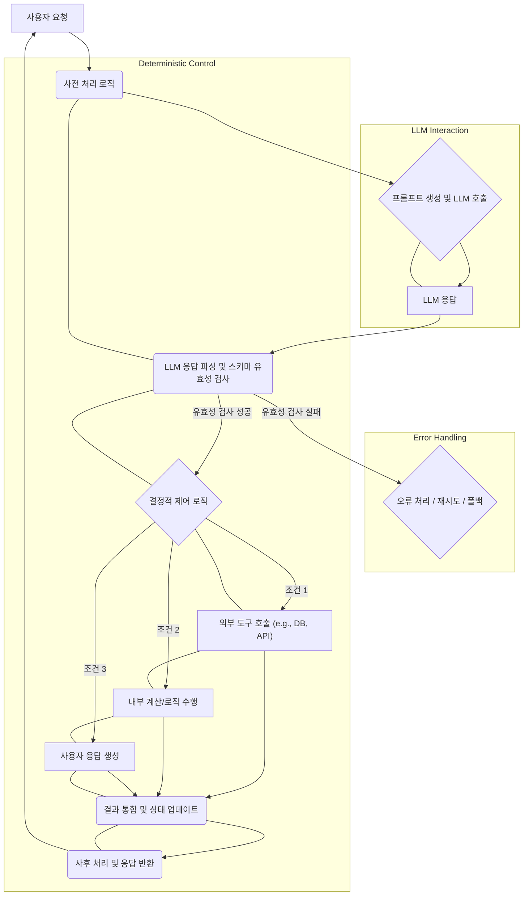

LLM 에이전트 개발에서 안정적이고 예측 가능한 동작을 확보하는 것은 핵심 과제입니다. 초기 에이전트 개발은 주로 정교한 프롬프트 엔지니어링에 의존했지만, 복잡한 작업을 안정적으로 처리하는 데에는 근본적인 한계가 드러났습니다. `MANDATORY`, `DO NOT SKIP`과 같은 강력한 프롬프트 지시어는 LLM의 확률적 특성상 언제든 무시될 수 있으며, 이는 에이전트의 불확실성을 증대시키는 요인으로 작용합니다. 2026년 이후의 프로덕션 레벨 에이전트는 이러한 프롬프트 의존도를 최소화하고 소프트웨어 공학적 원칙에 기반한 결정적 제어 흐름(deterministic control flow)을 강화하는 방향으로 진화하고 있습니다.

## 프롬프트 의존도의 한계와 제어 흐름의 필요성

LLM은 본질적으로 통계적 패턴 학습에 기반한 비결정적(non-deterministic) 시스템입니다. 아무리 잘 설계된 프롬프트라도, 모델은 일관된 방식으로 지시를 따르지 않을 수 있습니다. 특히 여러 단계로 구성된 복잡한 작업이나 민감한 비즈니스 로직이 포함된 경우, 프롬프트 내 제어 지시어에만 의존하는 것은 곧 시스템의 안정성을 포기하는 것과 같습니다.
진정한 의미의 에이전트는 단순히 LLM 호출의 연속이 아니라, 목적 달성을 위한 외부 도구 사용, 상태 관리, 조건부 실행, 반복 로직 등 전통적인 소프트웨어 애플리케이션의 특징을 가져야 합니다. 이를 위해서는 LLM의 추론 능력을 활용하되, 그 결과물을 외부 코드(control flow)로 감싸 에이전트의 행동을 명시적으로 제어하고 검증하는 아키텍처가 필수적입니다.

## 에이전트 제어 흐름 강화 전략

LLM 에이전트의 제어 흐름을 강화하는 핵심 전략은 LLM 호출 전후의 데이터 처리 및 로직 실행을 코드 레벨에서 명확히 정의하는 것입니다.

### 1. 사전 처리 (Pre-processing) 로직 강화

LLM에 입력되는 프롬프트는 가능한 한 구조화되고 정제된 형태여야 합니다. 불필요한 정보나 모호한 지시를 제거하고, LLM이 오직 핵심 추론에만 집중할 수 있도록 입력을 사전 처리하는 로직을 구현합니다.

*   **입력 정규화**: 사용자 입력을 표준화된 형식으로 변환합니다. (예: 날짜 형식 통일, 불용어 제거)
*   **Context Retrieval 최적화**: RAG(Retrieval-Augmented Generation) 시스템에서 검색된 문서를 LLM Context Window에 맞게 필터링하고 요약하는 로직을 강화합니다.
*   **프롬프트 동적 구성**: LLM 호출 직전, 현재 에이전트의 상태나 이전 단계 결과를 기반으로 프롬프트의 특정 부분을 동적으로 구성하여 불필요한 LLM 추론을 줄입니다.

### 2. 사후 처리 (Post-processing) 및 결정적 실행

LLM의 출력은 종종 예상치 못한 형식이나 내용으로 제공될 수 있습니다. 이를 소프트웨어의 다음 단계로 안전하게 전달하려면 강력한 사후 처리 로직이 필요합니다.

*   **LLM 출력 파싱**: JSON, XML 등 구조화된 출력을 기대하는 경우, 파싱 라이브러리를 사용하여 안전하게 파싱합니다.
*   **출력 검증 (Validation)**: 파싱된 데이터의 유효성을 검사합니다. 이는 특히 Zod(TypeScript)나 Pydantic(Python)과 같은 스키마 유효성 검사 라이브러리를 활용하여 강력하게 구현할 수 있습니다.
*   **조건부 로직**: LLM의 출력 내용을 기반으로 다음 동작을 결정하는 조건부(if/else) 로직을 코드 레벨에서 명시적으로 정의합니다. (예: `tool_code: "search"`가 파싱되면 검색 도구를 호출)

### 3. Zod 스키마를 활용한 출력 검증 파이프라인

LLM 에이전트의 안정성을 확보하는 가장 강력한 방법 중 하나는 출력 스키마를 정의하고, LLM의 응답이 해당 스키마를 준수하는지 강제하는 것입니다. Zod는 TypeScript 환경에서 강력한 런타임 스키마 유효성 검사를 제공하며, 이를 통해 LLM의 출력이 예측 가능한 구조를 갖도록 할 수 있습니다.

```typescript
import { z } from 'zod';

// LLM 에이전트의 액션 스키마 정의
const AgentActionSchema = z.object({
  action_type: z.enum(['search', 'analyze', 'summarize', 'respond']),
  query: z.string().optional(),
  tool_name: z.string().optional(),
  parameters: z.record(z.string(), z.any()).optional(),
  response_message: z.string().optional(),
});

type AgentAction = z.infer<typeof AgentActionSchema>;

// LLM 응답을 파싱하고 검증하는 함수
async function executeAgentStep(llmResponse: string): Promise<AgentAction> {
  try {
    const parsedResponse = JSON.parse(llmResponse);
    // Zod를 사용하여 스키마 유효성 검사
    const validatedAction = AgentActionSchema.parse(parsedResponse);
    console.log("Validated Agent Action:", validatedAction);

    // 검증된 액션 타입에 따라 분기 처리
    switch (validatedAction.action_type) {
      case 'search':
        console.log(`Executing search for: ${validatedAction.query}`);
        // 실제 검색 API 호출 로직
        break;
      case 'analyze':
        console.log(`Analyzing data with parameters: ${JSON.stringify(validatedAction.parameters)}`);
        // 데이터 분석 로직
        break;
      case 'respond':
        console.log(`Responding: ${validatedAction.response_message}`);
        // 사용자에게 응답
        break;
      default:
        throw new Error(`Unknown action type: ${validatedAction.action_type}`);
    }
    return validatedAction;
  } catch (error) {
    console.error("LLM output validation failed:", error);
    // 유효성 검사에 실패한 경우 재시도 로직, 에러 처리 또는 폴백(fallback) 전략
    throw new Error("Invalid LLM output or action.");
  }
}

// 예시 LLM 응답 (성공 케이스)
const goodLLMResponse = `{
  "action_type": "search",
  "query": "최신 AI 기술 동향"
}`;
executeAgentStep(goodLLMResponse);

// 예시 LLM 응답 (실패 케이스 - 스키마 불일치)
const badLLMResponse = `{
  "action": "lookup", // 'action_type'이 아님
  "item": "invalid item"
}`;
// executeAgentStep(badLLLResponse); // 이 호출은 에러를 발생시킬 것입니다.
```

위 예제는 LLM이 JSON 형태로 응답하도록 가이드한 후, 그 응답을 `JSON.parse`로 파싱하고 `AgentActionSchema.parse()`를 통해 유효성을 검사하는 과정을 보여줍니다. 스키마에 정의된 `action_type`에 따라 에이전트의 결정적 제어 흐름이 실행됩니다. 이를 통해 LLM의 환각(hallucination)이나 잘못된 형식의 출력을 견고하게 처리할 수 있습니다.

## LLM 에이전트 제어 흐름 아키텍처

아래 Mermaid 다이어그램은 강화된 제어 흐름을 가진 LLM 에이전트의 일반적인 아키텍처를 보여줍니다.



이 다이어그램에서, LLM 호출(C)과 응답(D)은 전체 흐름의 한 부분일 뿐이며, 그 전후로 `사전 처리`, `응답 파싱 및 검증`, `결정적 제어 로직`, `사후 처리`와 같은 코드 기반의 명확한 단계들이 에이전트의 신뢰성을 보장합니다.

## 트레이드오프

### 1. **신뢰성 및 예측 가능성 증가 vs. 개발 복잡도 증가**
*   **언제 좋은가**: 프로덕션 환경에서 에이전트의 안정성과 예측 가능성이 critical할 때 (예: 금융, 의료, 고객 서비스 챗봇).
*   **언제 나쁜가**: 초기 프로토타이핑이나 LLM의 탐색적 능력이 더 중요한 실험 단계에서는 불필요한 오버헤드가 될 수 있습니다.

### 2. **유지보수성 및 디버깅 용이성 증가 vs. 초기 개발 시간 증가**
*   **언제 좋은가**: 에이전트 로직이 복잡해지고 여러 팀원이 협업하며 장기적으로 유지보수해야 할 때. 문제 발생 시 원인 분석이 용이합니다.
*   **언제 나쁜가**: 빠르게 아이디어를 검증해야 하거나, 일회성 스크립트처럼 짧게 사용될 에이전트에는 과도한 엔지니어링이 될 수 있습니다.

### 3. **LLM 환각 및 오류 전파 감소 vs. 유연성 감소**
*   **언제 좋은가**: LLM의 부정확한 출력이 심각한 문제를 야기할 수 있는 경우 (예: 잘못된 데이터베이스 쿼리 생성, 잘못된 응답 제공). 스키마 유효성 검사를 통해 이러한 위험을 대폭 줄일 수 있습니다.
*   **언제 나쁜가**: LLM이 완전히 새로운 아이디어를 생성하거나, 정의되지 않은 형식의 창의적인 출력을 자유롭게 만들어야 하는 경우. 엄격한 스키마는 이러한 유연성을 제한할 수 있습니다.

### 4. **자원 효율성 개선 vs. 오케스트레이션 오버헤드**
*   **언제 좋은가**: 불필요한 LLM 호출을 줄이고, 정확한 정보만으로 프롬프트를 구성하여 토큰 사용량을 최적화할 때. 에이전트의 실행 경로를 명확히 하여 무한 루프나 비효율적인 탐색을 방지할 수 있습니다.
*   **언제 나쁜가**: 오케스트레이션 로직 자체가 복잡해지면, LLM 호출 자체의 비용을 상쇄하고도 남는 추가적인 컴퓨팅 자원이나 개발 인력이 필요할 수 있습니다.

## 실전 체크리스트

프로젝트에 LLM 에이전트의 제어 흐름 강화를 적용할 때 다음 항목들을 검증합니다.

- [ ] 에이전트의 각 `Step`에서 LLM의 역할과 코드 기반의 제어 로직 역할을 명확히 분리했는가?
- [ ] LLM에 전달되는 모든 입력은 비즈니스 로직에 따라 사전 처리(Pre-processing)되어 구조화되고 필요한 정보만 포함하도록 최적화되었는가?
- [ ] LLM의 출력이 기대하는 스키마를 준수하는지 런타임에 검증하는(`Zod` 또는 유사 라이브러리) 파이프라인이 구현되었는가?
- [ ] 스키마 유효성 검사에 실패했을 때, 에이전트가 오류를 처리하거나, 재시도하거나, 폴백(fallback) 로직을 실행하는 등 결정적인 복구 전략을 가지고 있는가?
- [ ] 에이전트가 사용하는 외부 도구(API, DB 등) 호출은 LLM의 지시를 직접 따르지 않고, 검증된 LLM 출력에 기반한 코드 로직으로 제어되는가?
- [ ] 에이전트의 전체 실행 경로(제어 흐름)가 Mermaid 다이어그램이나 유사한 시각화 도구로 명확하게 문서화되어 있으며, 각 단계의 책임이 정의되어 있는가?
- [ ] LLM 에이전트의 각 단계별 상태(state)가 프롬프트가 아닌 코드 레벨에서 관리되고, 필요에 따라 다음 단계로 안전하게 전달되는가?