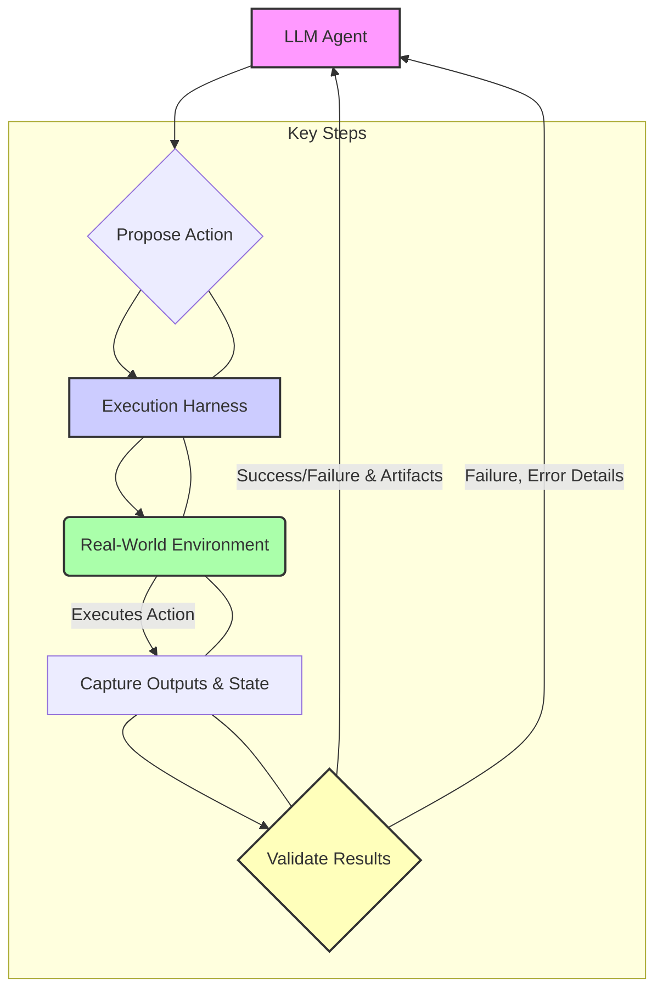

Large Language Models (LLMs) operate based on learned patterns and historical data, often lacking up-to-date, granular knowledge of specific project contexts or real-time environmental states. This inherent limitation can lead to 'hallucinations' or generation of syntactically plausible but semantically incorrect or impractical code and actions. To counteract this, integrating AI agents with real-world execution environments for direct validation is critical.

### The 'Measurement Over Guesswork' Paradigm

The core principle is to shift from speculative action generation to empirically validated execution. Instead of an LLM merely predicting the correct Unity API call, a system like `hera-agent-unity` allows the agent to propose an action, execute it within a live Unity editor instance, and then receive tangible feedback on the outcome. This 'measurement over guesswork' approach provides concrete evidence of success or failure, enabling agents to self-correct and refine their understanding of the environment and task.

This method mirrors the scientific process: hypothesize (agent proposes), experiment (execute in environment), observe (capture results), and conclude (validate/refine). For AI agents operating in complex domains like software development, infrastructure management, or robotics, this closed-loop feedback is indispensable for achieving high reliability and autonomous operation in 2026 and beyond.

### Architectural Workflow for Real-time Validation

Implementing real-time validation for AI agents typically involves a robust harness engineering design. The workflow can be broken down into several stages:

1.  **Agent Action Proposal**: The LLM agent, based on its current goal and context, proposes an action (e.g., a code snippet, a CLI command, an API call).
2.  **Harness Orchestration**: A dedicated execution harness intercepts this proposal. This harness is responsible for setting up an isolated, real-world environment (e.g., a containerized development environment, a sandboxed testbed, or a specific application instance like Unity).
3.  **Execution in Environment**: The harness executes the agent's proposed action within the live environment. This involves dispatching commands, running scripts, or interacting with application APIs.
4.  **Result Capture and Telemetry**: Crucially, the harness captures all relevant outputs, including standard output/error, logs, actual state changes, performance metrics, and any specific validation signals (e.g., return codes, file modifications, database entries, visual changes).
5.  **Validation and Feedback**: The captured results are analyzed against predefined success criteria or expected outcomes. This validation can range from simple checks (e.g., exit code 0) to complex semantic analysis (e.g., parsing log output, comparing before-and-after snapshots). The validation outcome, along with detailed execution artifacts, is then fed back to the AI agent.
6.  **Agent Adaptation/Refinement**: The agent uses this feedback to either confirm success and proceed, identify errors and self-correct, or refine its understanding and retry with a modified approach. This iterative loop is fundamental to autonomous agent design.



### Code Example: Simplified Execution Harness Logic (Python)

This Python example illustrates a basic execution harness that simulates running a command in an environment and validating its output.

```python
import subprocess
import json
import os

def execute_and_validate(command: str, expected_output_substring: str = None, timeout: int = 60) -> dict:
    """
    Executes a command in a simulated environment and validates its output.
    Returns a dict with execution details and validation status.
    """
    try:
        # Simulate environment setup/teardown (e.g., container creation)
        print(f"Executing command in isolated environment: {command}")
        
        # Use subprocess to run the command, capturing output
        process = subprocess.run(
            command,
            shell=True, # Be cautious with shell=True in production
            capture_output=True,
            text=True,
            timeout=timeout,
            check=False # Do not raise CalledProcessError automatically
        )

        stdout = process.stdout.strip()
        stderr = process.stderr.strip()
        exit_code = process.returncode

        is_success = (exit_code == 0)
        validation_message = "Execution completed."

        if expected_output_substring:
            if expected_output_substring in stdout:
                validation_message += " Expected output found."
            else:
                is_success = False
                validation_message += " Expected output NOT found."

        if exit_code != 0:
            is_success = False
            validation_message = f"Command failed with exit code {exit_code}. {stderr}"

        return {
            "command": command,
            "stdout": stdout,
            "stderr": stderr,
            "exit_code": exit_code,
            "is_success": is_success,
            "validation_message": validation_message,
            "execution_artifacts": {
                "log_file_path": "/tmp/execution_log.txt" # Placeholder
            }
        }

    except subprocess.TimeoutExpired:
        return {
            "command": command,
            "is_success": False,
            "validation_message": "Command timed out.",
            "stdout": "", "stderr": "", "exit_code": -1
        }
    except Exception as e:
        return {
            "command": command,
            "is_success": False,
            "validation_message": f"An error occurred during execution: {e}",
            "stdout": "", "stderr": "", "exit_code": -1
        }

# Example usage by an AI agent
if __name__ == "__main__":
    # Agent proposes a command to list files
    proposed_command_1 = "ls -l"
    result_1 = execute_and_validate(proposed_command_1, expected_output_substring="total")
    print(f"\nResult for '{proposed_command_1}': {json.dumps(result_1, indent=2)}")

    # Agent proposes a command that might fail or produce specific output
    proposed_command_2 = "python -c \"print('Hello from Agent')\""
    result_2 = execute_and_validate(proposed_command_2, expected_output_substring="Hello from Agent")
    print(f"\nResult for '{proposed_command_2}': {json.dumps(result_2, indent=2)}")

    # Agent proposes a command with an error
    proposed_command_3 = "non_existent_command"
    result_3 = execute_and_validate(proposed_command_3, expected_output_substring="command not found")
    print(f"\nResult for '{proposed_command_3}': {json.dumps(result_3, indent=2)}")
```

### LLM Agent in 2026: Beyond Mere Code Generation

The 2026 landscape for AI agents emphasizes a shift from purely generative models to autonomous, self-correcting entities. This includes:

*   **Closed-Loop Autonomy**: Agents continuously learn and adapt based on real-world feedback, moving beyond single-shot interactions.
*   **Enhanced Tool Use**: Sophisticated tool integration frameworks that allow agents to interact with arbitrary external systems and validate actions.
*   **Security and Sandboxing**: Secure, isolated execution environments are paramount to prevent runaway agents or malicious actions, especially when interacting with production systems.
*   **Observability and Auditability**: Detailed logging and artifact capture from execution environments are essential for debugging, auditing agent behavior, and ensuring compliance.
*   **Human-in-the-Loop Validation**: While aiming for autonomy, critical or high-impact actions may still require human oversight and explicit approval based on the harness's validation reports.

## 트레이드오프

Integrating real-world execution and validation introduces several trade-offs that teams must consider:

*   **Latency vs. Accuracy**: Live execution is inherently slower than purely cognitive reasoning. Each execution step adds significant latency due to environment setup, command execution, and result parsing. However, it drastically increases the accuracy and reliability of the agent's actions by grounding them in empirical evidence.
    *   **언제 좋고**: 높은 정확도와 신뢰성이 critical path인 경우 (예: 프로덕션 코드 배포, 민감한 시스템 설정 변경).
    *   **언제 나쁜지**: 실시간 응답이 필수적이거나, 빠른 탐색/아이디어 생성이 중요한 경우 (예: 대화형 프로토타이핑, 단순 정보 검색).

*   **Complexity vs. Reliability**: Building and maintaining a robust execution harness, isolated environments, and comprehensive validation logic adds considerable system complexity. This includes managing infrastructure for sandboxes, handling environment state, and parsing diverse outputs. However, this complexity directly contributes to a more reliable and resilient AI agent system.
    *   **언제 좋고**: 에이전트의 실패가 큰 비용이나 심각한 결과를 초래할 수 있는 경우 (예: 금융 거래, 의료 시스템 관리).
    *   **언제 나쁜지**: 개발 초기 단계에서 유연한 실험과 빠른 반복이 중요하고, 실패의 여파가 낮은 경우.

*   **Cost vs. Risk Mitigation**: Operating real execution environments, especially at scale, incurs infrastructure costs (compute, storage, network) and operational overhead. This is balanced against the significant cost savings and risk mitigation achieved by preventing erroneous actions, hallucinations, and potential system failures that could result from unvalidated agent outputs.
    *   **언제 좋고**: 에이전트의 오작동으로 인한 잠재적 손실 (데이터 손상, 시스템 다운타임, 보안 취약점)이 실행 환경 운영 비용보다 훨씬 큰 경우.
    *   **언제 나쁜지**: 예산 제약이 매우 엄격하거나, 에이전트의 실험적 용도로 비용 효율성이 최우선인 경우.

*   **Scope vs. Generality**: A highly specialized harness tailored to a specific environment (e.g., Unity editor, a particular cloud API) can provide deep, precise control and validation. A more general-purpose tool execution framework offers wider applicability but might lack the fine-grained feedback or specific context required for complex tasks in niche environments.
    *   **언제 좋고**: 특정 도메인이나 애플리케이션에 대한 에이전트의 능력을 극대화하고 싶을 때 (예: 특정 IDE에서 코드를 생성하고 실행하며 디버깅).
    *   **언제 나쁜지**: 다양한 환경과 태스크에 걸쳐 범용적으로 적용 가능한 에이전트를 개발하고자 할 때, 각 환경에 대한 맞춤형 하네스 개발 비용이 부담될 경우.

## 실전 체크리스트

프로젝트에 AI 에이전트의 실제 환경 실행 및 결과 검증을 도입할 때 다음 항목들을 검증하세요:

- [ ] **환경 격리 및 재현성 확보**: 에이전트 실행을 위한 독립적이고 재현 가능한 샌드박스 환경 (Docker 컨테이너, 가상 머신 등)이 구축되었는가? 환경 초기화 및 정리 프로세스가 자동화되었는가?
- [ ] **명확한 성공/실패 기준 정의**: 각 에이전트 액션에 대해 예상되는 결과와 성공/실패를 판단할 수 있는 구체적이고 측정 가능한 기준(exit codes, 로그 패턴, 파일 변경, API 응답 등)이 명시적으로 정의되었는가?
- [ ] **실행 결과 피드백 루프 구현**: 에이전트가 실행 환경으로부터 받은 모든 출력(stdout, stderr, 로그 파일, 상태 변화)을 파싱하고, 이 정보를 바탕으로 다음 행동을 결정하거나 자체 수정할 수 있는 메커니즘이 구현되었는가?
- [ ] **보안 및 권한 관리**: 에이전트가 실제 환경에서 실행될 때 최소한의 필요한 권한(least privilege)만 부여되며, 잠재적인 위험을 완화하기 위한 보안 대책(예: 네트워크 격리, 리소스 제한)이 마련되었는가?
- [ ] **실행 비용 및 성능 모니터링**: 에이전트의 실시간 실행이 발생하는 비용(클라우드 리소스 사용량)과 성능(latency)을 지속적으로 모니터링하고, 비정상적인 지출이나 성능 저하 발생 시 알림 시스템이 작동하는가?
- [ ] **오류 처리 및 롤백 전략**: 예상치 못한 실행 실패나 환경 오류 발생 시 에이전트가 이를 감지하고, 적절한 오류 처리(재시도, 대체 전략) 또는 시스템 롤백을 수행할 수 있는 전략이 설계되었는가?
- [ ] **실행 아티팩트 저장 및 감사**: 모든 실행 시도에 대한 입력, 출력, 환경 상태 스냅샷, 검증 결과 등의 아티팩트가 체계적으로 저장되어 향후 감사, 디버깅 및 에이전트 훈련 데이터로 활용될 수 있는가?
- [ ] **버전 관리 및 변경 추적**: 실행 환경의 구성, 하네스 코드, 검증 로직 등 모든 관련 컴포넌트가 버전 관리 시스템에 통합되어 변경 이력을 추적하고 필요한 경우 롤백할 수 있는가?