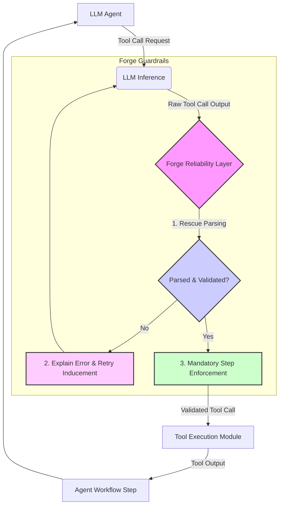

LLM 에이전트가 복잡한 태스크를 수행하기 위해 외부 도구를 활용하는 것은 현대 AI 시스템의 핵심 역량입니다. 그러나 특히 8B와 같은 중소형 로컬 모델의 경우, 도구 호출(tool call)의 정확성과 신뢰성 부족은 에이전트 워크플로우의 실패로 직결되는 주된 원인 중 하나입니다. 잘못된 구문의 출력, 필수 인자 누락, 혹은 논리적 오류를 포함하는 도구 호출은 전체 시스템의 안정성을 저해하며, 개발 및 운영에 상당한 오버헤드를 발생시킵니다. Forge는 이러한 문제를 해결하기 위해 고안된 신뢰성 계층으로, LLM 에이전트의 도구 호출을 안정적으로 가이드하고 복구하여 워크플로우의 성공률을 혁신적으로 향상시킵니다.

## Forge의 핵심 기능
Forge는 다단계 에이전트 워크플로우에서 LLM의 도구 호출을 강화하기 위한 여러 핵심 기능을 제공합니다.

### 1. Rescue Parsing (복구 파싱)
LLM이 생성한 도구 호출이 유효하지 않을 때, Forge는 단순히 실패를 보고하는 대신 해당 호출을 분석하고 잘못된 부분을 지능적으로 복구하거나 재구성하려고 시도합니다. 예를 들어, JSON 형식의 도구 호출에서 쉼표나 괄호가 누락되었을 경우, Forge는 이를 수정하여 파싱 가능한 형태로 변환합니다. 이는 53%에 머물 수 있는 성공률을 99% 수준까지 끌어올리는 데 중요한 역할을 합니다.

### 2. Retry Inducement (재시도 유도)
복구 파싱만으로 해결되지 않는 경우, Forge는 LLM에게 오류의 원인을 명확히 설명하고 올바른 형식 또는 내용으로 다시 시도하도록 유도합니다. 이 과정에서 이전 시도의 실패 맥락을 상세하게 제공하여, LLM이 '학습'하고 다음 시도에서 더 나은 출력을 생성하도록 돕습니다. 이는 시스템의 탄력성을 높이고 예측 불가능한 LLM의 특성을 제어하는 효과적인 방법입니다.

### 3. Mandatory Step Enforcement (필수 단계 강제)
에이전트 워크플로우에서 특정 도구 호출이나 단계가 반드시 실행되어야 할 때, Forge는 이를 강제할 수 있습니다. 예를 들어, 데이터베이스에서 특정 정보를 조회하는 단계가 필수적이라면, LLM이 다른 방향으로 이탈하더라도 Forge는 해당 단계를 성공적으로 완료하도록 가이드합니다. 이는 비즈니스 로직의 무결성을 유지하고 중요한 프로세스가 누락되지 않도록 보장합니다.

### 4. VRAM-aware Token Budgeting (VRAM 인식 토큰 예산 관리)
특히 자체 호스팅되는 작은 모델의 경우, 제한된 VRAM 내에서 효율적인 토큰 관리가 중요합니다. Forge는 토큰 예산을 VRAM 사용량과 연동하여 관리함으로써, 모델이 최적의 성능을 발휘하고 메모리 부족으로 인한 오류를 방지하도록 돕습니다. 이는 비용 효율적인 로컬 LLM 운영에 필수적인 기능입니다.

## Forge 통합 아키텍처
Forge를 기존 LLM 출력 검증 파이프라인 및 AI 에이전트 하네스에 통합하는 개념은 다음과 같습니다.



위 다이어그램에서 보듯이, LLM이 도구 호출을 생성하면 Forge 레이어가 이를 즉시 인터셉트하여 유효성을 검사합니다. 문제가 있을 경우 Rescue Parsing과 Retry Inducement를 통해 LLM이 스스로 오류를 수정하도록 유도하며, Mandatory Step Enforcement를 통해 필수적인 단계를 강제합니다. 이 과정을 거쳐 검증된 도구 호출만이 실제 Tool Execution Module로 전달되어 실행됩니다.

## 실전 코드 예시 (Python)

Forge를 파이썬 기반 LLM 에이전트에 통합하는 예시는 다음과 같습니다. 여기서는 가상의 `AgentForge` 라이브러리를 사용합니다.

```python
from typing import Dict, Any, Callable
import json
import time

# --- Mock Tools --- #
def search_web(query: str) -> str:
    print(f"Executing web search for: '{query}'")
    if "2026" in query:
        return "Found recent AI agent frameworks data for 2026."
    return "General search results."

def analyze_data(data: str) -> str:
    print(f"Analyzing data: {data[:20]}...")
    return "Data analysis complete."

tools: Dict[str, Callable[[Any], Any]] = {
    "search_web": search_web,
    "analyze_data": analyze_data
}

# --- Mock LLM --- #
class MockLLM:
    def generate_tool_call(self, prompt: str, available_tools: Dict[str, Callable]) -> str:
        # Simulate LLM output, sometimes faulty
        if "recent AI" in prompt and self.retry_count == 0:
            # Simulate a malformed JSON output on first try
            return '{"tool_name": "search_web", "parameters": {"query": "recent AI frameworks 2026"}' # Missing closing brace
        elif "data" in prompt and self.retry_count < 2:
            return '{"tool_name": "analyze_data", "parameters": "data": "some raw text"}' # Malformed parameters
        return json.dumps({"tool_name": "search_web", "parameters": {"query": "default query"}})

    def __init__(self):
        self.retry_count = 0

# --- Forge Reliability Layer (Simplified) --- #
class AgentForge:
    @staticmethod
    def validate_and_execute(
        llm_output: str,
        available_tools: Dict[str, Callable],
        mandatory_tools: list = None,
        max_retries: int = 3,
        llm_instance: MockLLM = None # Pass LLM instance to allow retries
    ) -> Dict[str, Any]:
        mandatory_tools = mandatory_tools or []

        for attempt in range(max_retries):
            try:
                # 1. Rescue Parsing
                try:
                    tool_call_data = json.loads(llm_output)
                except json.JSONDecodeError as e:
                    print(f"Forge: JSON parse error. Attempting rescue: {e}")
                    # Simple rescue: try to fix missing brace or quote
                    if llm_output.endswith('{'):
                        llm_output += '}'
                    elif llm_output.count('"') % 2 != 0:
                        llm_output += '"}' # Add missing quote and brace (very basic)
                    tool_call_data = json.loads(llm_output)

                tool_name = tool_call_data.get("tool_name")
                parameters = tool_call_data.get("parameters")

                if tool_name not in available_tools:
                    raise ValueError(f"Unknown tool: {tool_name}")
                if not isinstance(parameters, dict):
                     raise ValueError(f"Parameters must be a dictionary, got {type(parameters)}")

                # 3. Mandatory Step Enforcement
                if mandatory_tools and tool_name not in mandatory_tools:
                    raise ValueError(f"Mandatory tool '{mandatory_tools[0]}' not called. Instead got '{tool_name}'")

                # Execute the tool
                result = available_tools[tool_name](**parameters)
                return {"success": True, "result": result}

            except (json.JSONDecodeError, ValueError) as e:
                print(f"Forge: Validation/execution error (Attempt {attempt + 1}/{max_retries}): {e}")
                if llm_instance and attempt < max_retries - 1:
                    llm_instance.retry_count += 1
                    # 2. Retry Inducement: Provide feedback to LLM for next attempt
                    llm_output = llm_instance.generate_tool_call(
                        prompt=f"Correction needed: '{llm_output}' failed due to: {e}. Please provide a valid tool call for the task.",
                        available_tools=available_tools
                    )
                    print(f"Forge: Retrying with new LLM output: {llm_output}")
                    time.sleep(0.1) # Simulate delay
                else:
                    return {"success": False, "error": str(e)}
        return {"success": False, "error": "Max retries reached."}

# --- Agent Workflow --- #
def execute_agent_task(query: str):
    llm = MockLLM()
    initial_llm_output = llm.generate_tool_call(
        prompt=f"Perform a task based on: {query}.",
        available_tools=tools
    )

    print(f"Initial LLM output: {initial_llm_output}")

    result = AgentForge.validate_and_execute(
        llm_output=initial_llm_output,
        available_tools=tools,
        mandatory_tools=["search_web"], # Example: search_web is mandatory for this task
        llm_instance=llm
    )

    if result["success"]:
        print(f"Agent task succeeded: {result['result']}")
    else:
        print(f"Agent task failed: {result['error']}")

# Example Usage
execute_agent_task("Find recent AI agent frameworks from 2026")
print("\n---\n")
execute_agent_task("Analyze the market data from Q1") # This will fail mandatory_tools check initially
```

이 예시 코드는 Forge의 핵심 기능인 Rescue Parsing, Retry Inducement, 그리고 Mandatory Step Enforcement가 어떻게 동작하는지 간략하게 보여줍니다. LLM이 초기에 잘못된 JSON을 출력하더라도 Forge는 이를 복구하거나 LLM에 재시도를 요청하여 결국 올바른 도구 호출을 수행하도록 유도합니다.

## 트레이드오프

### 1. 신뢰성 및 안정성 향상 vs. 복잡성 및 지연 시간 증가
*   **언제 좋은가**: LLM 에이전트의 오작동으로 인한 비즈니스 영향이 크거나, 다단계 워크플로우에서 작은 오류가 전체 실패로 이어질 수 있는 미션 크리티컬한 상황에 매우 유용합니다. 신뢰성 향상이 최우선 목표일 때 적합합니다.
*   **언제 나쁜가**: 극도의 저지연(low-latency)이 요구되는 실시간 시스템이나, 에이전트 태스크 자체가 매우 단순하여 오류 발생 가능성이 낮은 경우에는 Forge의 추가적인 검증 및 재시도 로직이 불필요한 오버헤드와 지연 시간을 발생시킬 수 있습니다.

### 2. 작은 모델의 활용성 증대 vs. 통합 및 관리 오버헤드
*   **언제 좋은가**: 강력한 대형 LLM에 대한 의존도를 줄이고, 비용 효율적인 작은 로컬 모델로도 높은 수준의 에이전트 안정성을 달성하고자 할 때 강력한 이점을 제공합니다. 온프레미스 환경이나 데이터 주권이 중요한 환경에 적합합니다.
*   **언제 나쁜가**: 이미 매우 강력하고 안정적인 대형 모델(예: GPT-4o, Claude 3 Opus)을 사용하고 있어 기본 도구 호출 신뢰성이 높은 경우, Forge 통합에 필요한 개발 및 유지보수 비용이 이득보다 클 수 있습니다.

### 3. 예측 가능한 워크플로우 실행 vs. LLM의 유연성 제약
*   **언제 좋은가**: 비즈니스 로직에 따라 특정 도구 호출의 순서나 실행이 필수적인 경우, Forge의 'Mandatory Step Enforcement'는 워크플로우의 예측 가능성과 안정성을 극대화합니다.
*   **언제 나쁜가**: LLM 에이전트가 고도로 창의적이거나 탐색적인 태스크를 수행하며, 정해진 경로 없이 자유로운 판단에 따라 도구를 호출해야 하는 경우, 엄격한 가드레일이 LLM의 유연성을 저해하고 새로운 솔루션 탐색을 방해할 수 있습니다.

## 실전 체크리스트

Forge를 실제 프로젝트에 적용하기 전, 다음 항목들을 점검하여 성공적인 통합과 효과 측정을 준비해야 합니다.

- [ ] **현재 LLM 에이전트의 도구 호출 성공률 baseline 측정 완료 여부:** Forge 도입 전, 현재 에이전트의 잘못된 도구 호출로 인한 오류율을 구체적인 지표(예: 53%)로 측정했는가?
- [ ] **Forge의 핵심 기능(Rescue Parsing, Retry Inducement, Mandatory Steps) 중 프로젝트에 필요한 기능 정의 및 우선순위 설정 완료 여부:** 모든 기능을 도입할 필요는 없으므로, 현재 문제 해결에 가장 필요한 기능부터 점진적으로 적용할 계획이 수립되었는가?
- [ ] **Forge 통합 후 예상되는 에러 감소율 및 워크플로우 성공률 목표치 설정 완료 여부:** (예: 53% -> 90% 이상) 구체적인 목표 수치를 설정하고, 이를 달성하기 위한 검증 계획이 있는가?
- [ ] **오류 발생 시 LLM에 피드백(retry inducement)을 위한 상세한 오류 메시지/형식 표준화 완료 여부:** LLM이 재시도 시 효과적으로 학습할 수 있도록 명확하고 구조화된 피드백 메시지 구성 방안이 마련되었는가?
- [ ] **VRAM 및 토큰 예산 관리가 필요한 로컬 LLM 환경에서 Forge의 리소스 관리 기능 활용 계획 수립 여부:** 로컬 모델 사용 시, 메모리 오버헤드를 최소화하고 효율성을 극대화하기 위한 전략이 포함되었는가?
- [ ] **Forge 통합 후 A/B 테스트 또는 단계적 롤아웃(canary deployment) 계획 수립 여부:** 실제 운영 환경에 점진적으로 적용하여 부작용을 최소화하고 성능 개선을 검증할 계획이 있는가?
- [ ] **Forge 가드레일 설정 및 구성에 대한 버전 관리 및 지속적인 개선 프로세스 수립 여부:** 가드레일 규칙도 코드처럼 관리하고, LLM의 변화에 따라 지속적으로 업데이트할 계획이 있는가?