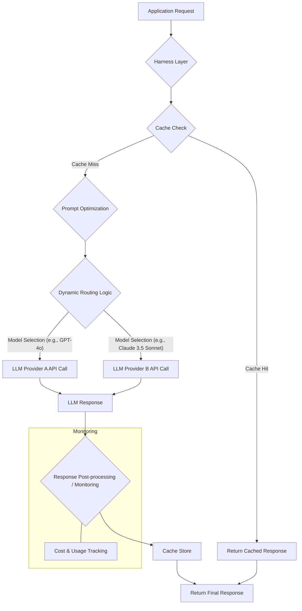

LLM 기반 서비스의 확산은 API 호출 비용을 주요 운영 부담으로 만들고 있습니다. 예측 불가능한 트래픽과 토큰 기반 과금 체계는 효율적인 비용 최적화 전략을 필수적으로 만듭니다. Harness 디자인 패턴은 LLM API 호출을 효과적으로 관리하고 비용을 절감하기 위한 구조적 접근 방식을 제공합니다. 이 계층은 API 호출 전후에 다양한 최적화 로직을 삽입하여 효율성을 극대화합니다.

## Harness 디자인 패턴 개요

Harness는 LLM API와 애플리케이션 사이에 위치하는 제어 계층입니다. 모든 LLM 요청과 응답을 중앙에서 관리하며, 캐싱, 동적 라우팅, 프롬프트 최적화, 모니터링 등 다양한 기능을 통합하여 비용 절감 및 성능 향상을 목표로 합니다. 2026년 현재, Harness는 AI 에이전트의 자율성을 지원하면서도 비용 효율성을 확보하는 핵심 인프라로 진화하고 있습니다.

### 핵심 비용 최적화 전략

1.  **캐싱 (Caching)**: 반복적이거나 유사한 요청에 대한 LLM API 호출을 줄여 비용 절감 및 응답 지연 시간 단축. 시맨틱 캐싱(Semantic Caching)은 의미적으로 유사한 요청까지 처리하여 캐시 히트율을 높입니다. TTL(Time-To-Live) 또는 LRU(Least Recently Used) 무효화 전략으로 데이터 신선도를 유지합니다.

2.  **동적 라우팅 (Dynamic Routing)**: 요청의 특성(길이, 복잡도, 필요한 응답 품질)에 따라 가장 적합하고 비용 효율적인 LLM 모델 또는 프로바이더로 요청을 전달. 간단한 작업에는 저렴한 모델을, 복잡한 추론에는 고성능 모델을 동적으로 선택합니다. 모델별 성능-비용 매트릭스를 주기적으로 업데이트하여 라우팅 규칙을 개선합니다.

3.  **프롬프트 최적화 (Prompt Optimization)**: LLM에 전달되는 프롬프트의 토큰 수를 최소화하면서 필요한 정보를 온전히 전달. 불필요한 반복, 장황한 설명, 중복 정보 등을 제거하고 `Chain-of-Thought` 중간 단계를 최적화합니다. 대화 요약, irrelevant context 필터링, 압축 기술(예: LLMLingua) 등으로 `context window` 사용량을 줄이는 것이 핵심입니다.

4.  **API 호출 모니터링 및 제어 (Monitoring & Control)**: LLM API 사용량 및 비용을 실시간으로 추적하고 과도한 지출을 방지. 모든 API 호출에 대한 메트릭을 수집하고 시각화하며, 임계치 초과 시 알림을 발송하거나 자동 `Rate Limiting`을 적용합니다.

### Harness 디자인 패턴의 예시 (Python)

```python
import hashlib
from typing import Dict, Optional

class GPT4oClient:
    def __init__(self):
        self.cost_per_token = 0.03
    def complete(self, prompt: str, max_tokens: int = 100) -> str:
        return f"GPT-4o response to '{prompt[:50]}'"

class ClaudeSonnetClient:
    def __init__(self):
        self.cost_per_token = 0.015
    def complete(self, prompt: str, max_tokens: int = 100) -> str:
        return f"Claude 3.5 Sonnet response to '{prompt[:50]}'"

class LLMHarness:
    def __init__(self):
        self.cache: Dict[str, str] = {}
        self.gpt4o = GPT4oClient()
        self.claude_sonnet = ClaudeSonnetClient()
        self.model_costs = {
            "gpt-4o": self.gpt4o.cost_per_token,
            "claude-3.5-sonnet": self.claude_sonnet.cost_per_token,
        }

    def _generate_cache_key(self, prompt: str, model_name: str) -> str:
        return hashlib.md5(f"{prompt}-{model_name}".encode('utf-8')).hexdigest()

    def _determine_model(self, prompt: str) -> str:
        if len(prompt) < 100 and "complex calculation" not in prompt.lower():
            return "claude-3.5-sonnet"
        return "gpt-4o"

    def query_llm(self, prompt: str, model_override: Optional[str] = None) -> str:
        selected_model_name = model_override if model_override else self._determine_model(prompt)
        cache_key = self._generate_cache_key(prompt, selected_model_name)

        if cache_key in self.cache:
            return self.cache[cache_key]

        response = ""
        if selected_model_name == "gpt-4o":
            response = self.gpt4o.complete(prompt)
        elif selected_model_name == "claude-3.5-sonnet":
            response = self.claude_sonnet.complete(prompt)
        else:
            raise ValueError(f"Unsupported model: {selected_model_name}")
        
        self.cache[cache_key] = response
        return response
```

### Harness 워크플로우



## 트레이드오프

*   **캐싱 도입**:
    *   **장점**: 반복적/예측 가능한 질의에 대한 비용 절감 및 응답 지연 시간 단축.
    *   **단점**: 프롬프트 고유성 높거나 신선도 중요 시 오버헤드만 발생. 캐시 무효화 전략 설계 복잡성.

*   **동적 라우팅**:
    *   **장점**: 다양한 LLM 모델 활용 환경에서 요청 특성(비용 민감도, 지연 시간, 복잡도)에 따른 최적 모델 선택으로 비용-성능 균형.
    *   **단점**: 라우팅 로직 복잡성, 모델 간 성능 차이 미미 시 오버헤드 증가. 라우팅 오류는 잘못된 응답/비용 증가 유발.

*   **프롬프트 최적화**:
    *   **장점**: 긴 `context window` 프롬프트의 토큰 수 감소로 비용 절감 및 API 처리 속도 향상.
    *   **단점**: 과도한 압축으로 중요 정보 손실 또는 LLM 추론 능력 저하 위험. 최적화 로직 개발 및 유지보수 비용 발생.

*   **Harness 계층 도입 복잡성**:
    *   **장점**: LLM API 호출 중앙 집중식 제어, 모니터링, 확장성 및 복원력 확보. 장기적 비용 효율성 및 아키텍처 유연성 제공.
    *   **단점**: 소규모 프로젝트나 PoC 단계에서 과도한 초기 설정/유지보수 오버헤드. 추가적인 지연 시간(latency) 유발 가능성.

## 실전 체크리스트

프로젝트에 LLM API 비용 최적화를 위한 Harness 디자인 패턴을 적용할 때 다음 항목들을 검토하십시오.

*   [ ] LLM API 호출 패턴을 분석하고, 캐싱 도입 시 예상되는 비용 절감 효과를 수치화하였는가?
*   [ ] 동적 라우팅을 위한 LLM 모델별 성능-비용 매트릭스를 구축하고, 각 요청 유형에 대한 최적의 모델 선택 기준을 명확히 정의하였는가?
*   [ ] 프롬프트 최적화 적용 후, LLM 응답의 품질 저하 여부를 측정하기 위한 자동화된 평가 지표 또는 회귀 테스트를 마련하였는가?
*   [ ] Harness 계층에서 LLM API 호출 비용과 토큰 사용량을 실시간으로 모니터링하고, 설정된 비용 임계치 초과 시 즉시 알림을 발송하는 시스템을 구축하였는가?
*   [ ] LLM API 호출 실패율, 재시도 로직, 타임아웃 설정 등 장애 대응 전략이 Harness 계층에 통합되어 서비스 복원력을 확보하고 있는가?
*   [ ] 캐싱 전략의 데이터 신선도 유지와 무효화 정책이 애플리케이션 요구사항과 일치하며, 주기적인 캐시 퍼지 메커니즘을 마련하였는가?
*   [ ] 대량의 비동기 LLM 요청 처리를 위한 배치 처리 또는 큐잉 시스템을 Harness 계층에 통합하여 API 호출 효율성을 증대시켰는가?