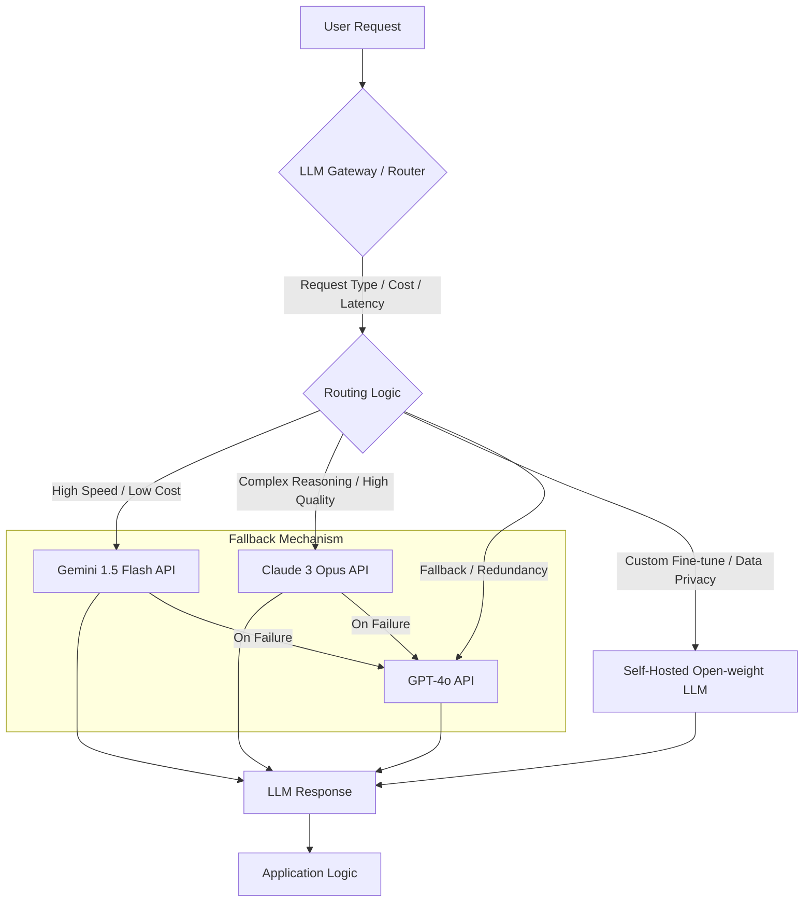

최근 LLM (Large Language Model) 공급자들의 정책 변화, 특히 Anthropic의 Claude API 사용 조건 변경은 `Claude Code Harness`와 같은 핵심 시스템의 LLM API 의존성을 재평가할 필요성을 제기한다. 개발자 경험의 마찰 증가와 특정 사용처 제한은 단일 LLM 공급자 종속성의 위험을 명확히 보여준다.

## 기존 의존성 재평가 배경
`Claude Code Harness`는 Claude의 고급 추론, 코드 생성 및 컨텍스트 처리 능력에 크게 의존해 왔다. 그러나 `Anthropic`이 `Claude` 구독을 자사 도구 중심 체계에 묶고 제3자 에이전트 사용에 별도 과금을 붙이면서, 개발자가 기대한 구독 가치와 실제 사용 조건 사이의 간극이 커졌다. 이러한 변화는 다음과 같은 목표를 가진 재평가로 이어진다:

*   **벤더 종속성 완화 (Vendor Lock-in Mitigation)**: 단일 공급자에 대한 과도한 의존성 감소.
*   **비용 최적화 (Cost Optimization)**: `Total Cost of Ownership` (TCO) 관점에서 효율적인 모델 활용 전략 모색.
*   **견고성 및 유연성 향상 (Robustness & Flexibility)**: 특정 LLM의 장애 또는 정책 변경에 대한 시스템의 회복력 강화.
*   **최적의 모델 선택 (Optimal Model Selection)**: 다양한 워크로드에 가장 적합한 LLM을 동적으로 선택할 수 있는 아키텍처 구축.

## 대체 LLM 환경 탐색
`Claude` 의존도를 줄이기 위한 대안으로, 다양한 상용 및 오픈 가중치 LLM이 고려된다.

### Google Gemini 계열
*   **Gemini 1.5 Flash**: 저비용, 고효율, 낮은 지연 시간을 요구하는 작업에 적합하다. 대량의 트래픽을 처리하며 비용 효율성을 높일 수 있다.
*   **Gemini 1.5 Pro**: 복잡한 추론, 긴 컨텍스트 처리, 고품질 코드 생성 등 `Claude`의 고급 기능을 대체할 수 있는 강력한 대안이다. Google Cloud Platform (GCP) 및 `Vertex AI`와의 긴밀한 통합은 운영 편의성을 제공한다.

### 오픈 가중치 모델 (Open-weight Models)
*   **Mistral, Llama, Qwen**: 이러한 모델들은 자체 호스팅 또는 특정 클라우드 환경에서 배포하여 데이터 주권, 높은 커스터마이징 가능성, 그리고 장기적인 비용 예측 가능성을 확보할 수 있다. 특히, `Agentic Coding` 워크로드에 특화된 파인튜닝을 통해 특정 도메인 성능을 극대화할 수 있다.

### 기타 상용 API
*   **GPT-4o**: 성능 면에서 여전히 강력한 옵션이며, 특정 작업에서 `Claude`나 `Gemini` 대비 우위를 보일 경우 비용 대비 효용을 고려하여 통합할 수 있다.

## 구현 전략: LLM 게이트웨이 및 동적 라우팅
다중 LLM 전략의 핵심은 `LLM Gateway` (`AI Gateway`) 계층의 도입이다. 이 게이트웨이는 애플리케이션과 LLM API 사이에 위치하여 다음과 같은 기능을 수행한다.

*   **동적 라우팅 (Dynamic Routing)**: 요청의 특성(예: 복잡성, 지연 시간 요구사항, 비용 예산), 모델 성능 메트릭, 가용성 등을 기반으로 가장 적합한 LLM으로 요청을 보낸다.
*   **폴백 메커니즘 (Fallback Mechanism)**: 주력 LLM이 실패하거나 응답 시간이 지연될 경우, 자동으로 다른 LLM으로 요청을 전환하여 시스템의 안정성을 확보한다.
*   **통합 API 인터페이스 (Unified API Interface)**: 다양한 LLM API의 상이한 인터페이스를 추상화하여, 애플리케이션 레벨에서는 단일화된 방식으로 LLM을 호출할 수 있도록 한다.
*   **중앙 집중식 관리 (Centralized Management)**: `API Key` 관리, 비용 추적, 로깅, 모니터링, `Rate Limiting` 등을 한 곳에서 처리하여 운영 복잡성을 줄인다.

### Go 기반 LLM 라우터 예제
다음은 Go 언어로 구현된 간단한 `LLM Gateway`의 개념적 예시이다. 이 예제는 `Gemini`를 기본으로 사용하고, 실패 시 `Claude`로 폴백하는 로직을 보여준다.

```go
package main

import (
	"bytes"
	"encoding/json"
	"fmt"
	"io/ioutil"
	"net/http"
	"time"
)

// LLMRequest represents a generic request to an LLM
type LLMRequest struct {
	Model     string `json:"model"`
	Prompt    string `json:"prompt"`
	MaxTokens int    `json:"max_tokens"`
}

// LLMResponse represents a generic response from an LLM
type LLMResponse struct {
	Content string `json:"content"`
	Model   string `json:"model"`
	Error   string `json:"error,omitempty"`
}

// LLMClient interface for different LLM providers
type LLMClient interface {
	Name() string
	Call(req LLMRequest) (LLMResponse, error)
}

// ClaudeClient implements LLMClient for Claude API
type ClaudeClient struct {
	APIKey   string
	Endpoint string
}

func (c *ClaudeClient) Name() string { return "Claude" }
func (c *ClaudeClient) Call(req LLMRequest) (LLMResponse, error) {
	// Simulate Claude API call
	fmt.Printf("Calling Claude API with model %s...\n", req.Model)
	time.Sleep(500 * time.Millisecond) // Simulate latency
	if req.Prompt == "fail_claude" {
		return LLMResponse{Error: "Claude API error"}, fmt.Errorf("Claude API failure")
	}
	return LLMResponse{Content: fmt.Sprintf("Claude processed: %s", req.Prompt), Model: req.Model}, nil
}

// GeminiClient implements LLMClient for Gemini API
type GeminiClient struct {
	APIKey   string
	Endpoint string
}

func (g *GeminiClient) Name() string { return "Gemini" }
func (g *GeminiClient) Call(req LLMRequest) (LLMResponse, error) {
	// Simulate Gemini API call
	fmt.Printf("Calling Gemini API with model %s...\n", req.Model)
	time.Sleep(300 * time.Millisecond) // Simulate latency
	if req.Prompt == "fail_gemini" {
		return LLMResponse{Error: "Gemini API error"}, fmt.Errorf("Gemini API failure")
	}
	return LLMResponse{Content: fmt.Sprintf("Gemini processed: %s", req.Prompt), Model: req.Model}, nil
}

// LLMRouter dynamically routes requests
type LLMRouter struct {
	Clients []LLMClient
}

func (r *LLMRouter) RouteAndCall(req LLMRequest) (LLMResponse, error) {
	// Simple routing: try Gemini first, then Claude as fallback
	// In a real scenario, this would involve more sophisticated logic (cost, latency, capacity)
	for _, client := range r.Clients {
		if client.Name() == "Gemini" && req.Model == "gemini-pro" {
			resp, err := client.Call(req)
			if err == nil {
				return resp, nil
			}
			fmt.Printf("Gemini failed, falling back: %v\n", err)
		}
	}

	// Fallback to Claude for specific models or if Gemini failed
	for _, client := range r.Clients {
		if client.Name() == "Claude" && (req.Model == "claude-3-opus-20240229" || req.Model == "gemini-pro") { // Also handle Gemini fallback here
			resp, err := client.Call(req)
			if err == nil {
				return resp, nil
			}
			fmt.Printf("Claude failed too: %v\n", err)
		}
	}

	// Generic fallback if no specific routing rule matched or all failed
	if len(r.Clients) > 0 {
		// Attempt with the first available client or a default one
		resp, err := r.Clients[0].Call(req)
		if err == nil {
			return resp, nil
		}
	}

	return LLMResponse{Error: "No LLM could process the request"}, fmt.Errorf("all LLM clients failed")
}

func main() {
	claude := &ClaudeClient{APIKey: "sk-claude", Endpoint: "https://api.anthropic.com"}
	gemini := &GeminiClient{APIKey: "sk-gemini", Endpoint: "https://generativelanguage.googleapis.com"}

	router := &LLMRouter{
		Clients: []LLMClient{gemini, claude}, // Order matters for simple fallback
	}

	// Test case 1: Successful Gemini call
	req1 := LLMRequest{Model: "gemini-pro", Prompt: "Explain quantum physics", MaxTokens: 100}
	resp1, err1 := router.RouteAndCall(req1)
	if err1 != nil {
		fmt.Printf("Error: %v\n", err1)
	} else {
		fmt.Printf("Response from %s: %s\n\n", resp1.Model, resp1.Content)
	}

	// Test case 2: Gemini fails, falls back to Claude
	req2 := LLMRequest{Model: "gemini-pro", Prompt: "fail_gemini", MaxTokens: 100}
	resp2, err2 := router.RouteAndCall(req2)
	if err2 != nil {
		fmt.Printf("Error: %v\n", err2)
	} else {
		fmt.Printf("Response from %s (fallback): %s\n\n", resp2.Model, resp2.Content)
	}

	// Test case 3: Claude only model
	req3 := LLMRequest{Model: "claude-3-opus-20240229", Prompt: "Write a haiku about clouds", MaxTokens: 50}
	resp3, err3 := router.RouteAndCall(req3)
	if err3 != nil {
		fmt.Printf("Error: %v\n", err3)
	} else {
		fmt.Printf("Response from %s: %s\n\n", resp3.Model, resp3.Content)
	}
}
```

### LLM 게이트웨이 아키텍처 다이어그램


## 트레이드오프
*   **복잡성 증가 (Increased Complexity)**
    *   **언제 좋은가:** 단일 공급자 종속성을 회피하고, 시스템의 견고성과 유연성을 극대화할 때 유용하다. 다양한 LLM의 특장점을 활용하여 특정 워크로드에 최적화된 모델을 선택할 수 있다.
    *   **언제 나쁜가:** 소규모 프로젝트나 `Minimum Viable Product` (MVP) 단계에서는 불필요한 오버헤드가 될 수 있다. 초기 개발 속도 저하 및 유지보수 비용 증가를 야기한다.
*   **성능 vs. 비용 (Performance vs. Cost)**
    *   **언제 좋은가:** 동적 라우팅을 통해 특정 요청은 저비용 고효율 모델(예: `Gemini 1.5 Flash`), 고품질 또는 복잡한 요청은 고비용 고성능 모델(예: `Claude 3 Opus`, `Gemini 1.5 Pro`)로 분산하여 전체 `Total Cost of Ownership` (TCO)를 최적화할 수 있다.
    *   **언제 나쁜가:** `LLM Gateway` 자체의 지연 시간(latency)이 추가될 수 있으며, 라우팅 로직의 비효율성은 예상치 못한 비용 증가나 성능 저하로 이어질 수 있다. 모델 전환 시 컨텍스트 불일치 문제가 발생할 수 있다.
*   **관리 오버헤드 (Management Overhead)**
    *   **언제 좋은가:** 여러 LLM을 중앙에서 관리하고 모니터링하여 `API Key` 관리, 요금 추적, 장애 감지 및 복구 프로세스를 일관되게 적용할 수 있다. 새로운 LLM 통합 및 테스트가 용이해진다.
    *   **언제 나쁜가:** 각 LLM의 API 변경, 버전 관리, 특정 모델의 특성(예: `Tool Use`, `Function Calling` 스키마)에 대한 추상화 계층 유지에 지속적인 노력이 필요하다.
*   **보안 및 규정 준수 (Security & Compliance)**
    *   **언제 좋은가:** `LLM Gateway`를 통해 모든 LLM 요청에 대한 중앙 집중식 보안 정책(예: `Sensitive Data Redaction`, `Personally Identifiable Information` (PII) 필터링)을 적용할 수 있으며, 특정 규제 요구사항에 맞는 LLM을 선택적으로 사용할 수 있다. `Open-weight` 모델 사용 시 데이터 주권(Data Sovereignty) 확보에 유리하다.
    *   **언제 나쁜가:** `LLM Gateway` 자체가 새로운 공격 표면(attack surface)이 될 수 있으며, 여러 공급자 간의 데이터 흐름에 대한 추적 및 감사가 더욱 복잡해질 수 있다. `Open-weight` 모델의 경우 자체 호스팅 환경의 보안 책임이 증가한다.
*   **모델 일관성 (Model Consistency)**
    *   **언제 좋은가:** 각 LLM의 강점을 활용하여 다양한 유형의 작업에 가장 적합한 모델을 사용할 때 유용하다. 예를 들어, `Code Generation`에는 특정 `Code LLM`을, `Creative Writing`에는 다른 LLM을 사용할 수 있다.
    *   **언제 나쁜가:** 동일한 유형의 요청이라도 라우팅 로직에 따라 다른 LLM이 사용될 경우, 응답의 스타일, 형식, 미묘한 뉘앙스에서 일관성이 저해될 수 있다. 이는 사용자 경험에 부정적인 영향을 미치거나 `Agent`의 행동 예측 가능성을 낮출 수 있다.

## 실전 체크리스트
*   - [ ] 현재 `Claude Code Harness`의 `API` 호출 패턴 및 `Token Usage`를 분석하여 주요 비용 및 성능 병목 지점을 식별했는가?
*   - [ ] 대체 `LLM` (예: `Gemini 1.5 Flash/Pro`, `Mistral`, `Qwen`)을 최소 2개 이상 선정하고, `Proof of Concept` (PoC) 단계에서 `Agentic Coding` 및 `Context Handling` 성능을 정량적으로 평가했는가?
*   - [ ] `LLM Gateway` 또는 `Dynamic Routing` 계층을 도입하여 모델 선택 로직, `Fallback` 메커니즘, `Rate Limiting`, `Caching` 기능을 설계하고 구현했는가?
*   - [ ] 각 `LLM`에 대한 `API Key` 및 `Credential` 관리 방안, 그리고 `Personally Identifiable Information` (PII) 처리 등 보안 및 규정 준수(예: `GDPR`, `CCPA`) 전략을 명확히 수립했는가?
*   - [ ] `A/B Testing` 또는 `Canary Deployment`를 통해 새로운 `LLM` 조합 또는 라우팅 전략이 프로덕션 환경에서 기존 성능 지표(예: 응답 시간, 성공률, `Total Cost of Ownership`)에 미치는 영향을 측정할 계획을 수립했는가?
*   - [ ] `Monitoring` 및 `Observability` 시스템을 구축하여 `LLM Gateway`의 라우팅 결정, 각 `LLM`의 응답 시간, 오류율, 그리고 실제 비용을 실시간으로 추적하고 분석할 수 있는가?
*   - [ ] `LLM`의 `Tool Use` 또는 `Function Calling` 스키마가 모델마다 다를 경우, 이를 `LLM Gateway`에서 일관된 인터페이스로 추상화하는 방안을 고려했는가?