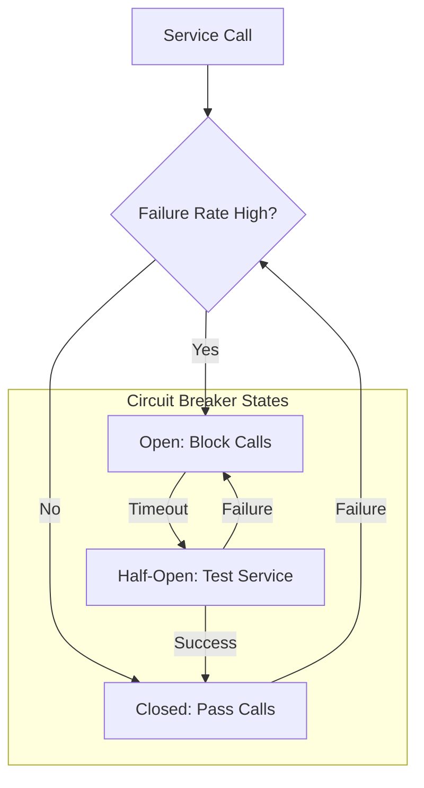

LLM (Large Language Model) API는 외부 서비스 의존성을 가지며, 이는 네트워크 지연, 서비스 과부하, 일시적인 오류 등 다양한 원인으로 인해 호출 실패를 겪을 수 있음을 의미한다. 이러한 불확실성은 AI 서비스의 안정성과 사용자 경험을 저해하는 주된 요인이 되므로, 견고한 재시도(Retry) 로직은 LLM 기반 애플리케이션의 필수적인 디자인 패턴으로 자리 잡았다.

## 재시도 로직의 중요성과 기본 패턴

LLM API 호출 실패는 크게 일시적(transient) 오류와 영구적(permanent) 오류로 나눌 수 있다. 일시적 오류(예: 5xx 서버 오류, 네트워크 타임아웃, 속도 제한)는 잠시 후 재시도하면 성공할 가능성이 높지만, 영구적 오류(예: 4xx 클라이언트 오류, 잘못된 파라미터)는 재시도해도 실패할 것이다. 효과적인 재시도 로직은 일시적 오류에 대응하여 시스템의 복원력을 높이는 데 초점을 맞춘다.

### 기본 재시도 전략: Exponential Backoff with Jitter

가장 기본적인 재시도 전략은 지수 백오프(Exponential Backoff)이다. 이는 실패할 때마다 다음 재시도까지 기다리는 시간을 기하급수적으로 늘리는 방식이다. 여기에 지터(Jitter)를 추가하여 여러 클라이언트가 동시에 재시도하여 또 다른 서비스 과부하를 유발하는 '떼 효과(thundering herd)'를 방지한다. 지터는 대기 시간에 무작위성을 부여하는 기법이다.

```python
import time
import random
import requests
from requests.exceptions import RequestException

def call_llm_api_with_retry(api_url, payload, max_retries=5, initial_delay=1, max_delay=60):
    for i in range(max_retries + 1):
        try:
            print(f"Attempt {i + 1} to call LLM API...")
            response = requests.post(api_url, json=payload, timeout=10)
            response.raise_for_status() # Raise an exception for HTTP errors (4xx or 5xx)
            print("LLM API call successful!")
            return response.json()
        except RequestException as e:
            print(f"LLM API call failed: {e}")
            if i == max_retries:
                print("Max retries reached. Failing permanently.")
                raise

            # Check for permanent errors (e.g., 400 Bad Request, 401 Unauthorized)
            if response is not None and response.status_code in [400, 401, 403, 404, 422]:
                print(f"Permanent error {response.status_code}. Not retrying.")
                raise

            # Exponential backoff with jitter
            delay = min(max_delay, initial_delay * (2 ** i))
            jitter = random.uniform(0, delay * 0.2) # Add up to 20% jitter
            sleep_time = delay + jitter
            print(f"Retrying in {sleep_time:.2f} seconds...")
            time.sleep(sleep_time)

# Example Usage
# MOCK_LLM_API_URL = "http://localhost:8000/llm"
# MOCK_PAYLOAD = {"prompt": "Generate a short story about AI."}

# try:
#     result = call_llm_api_with_retry(MOCK_LLM_API_URL, MOCK_PAYLOAD)
#     print(f"Final result: {result}")
# except Exception as e:
#     print(f"Application failed to get LLM response: {e}")
```

### 고급 재시도 패턴

#### Circuit Breaker Pattern (회로 차단기 패턴)

회로 차단기 패턴은 서비스가 반복적으로 실패할 때 추가 요청이 실패할 서비스를 호출하는 것을 방지한다. 이는 실패한 서비스에 대한 부하를 줄이고, 클라이언트에게 즉각적인 실패 응답을 제공하여 지연을 줄이며, 서비스가 복구될 시간을 벌어준다. 회로 차단기는 세 가지 상태를 갖는다: Closed (정상), Open (차단), Half-Open (복구 시도).



#### Rate Limiter (속도 제한기)

클라이언트 측에서 LLM API의 속도 제한(Rate Limit) 정책을 준수하도록 요청 빈도를 제어한다. 이는 API 제공자의 정책 위반으로 인한 서비스 거부(Denial of Service)를 방지하고, 클라이언트가 불필요하게 API 호출 횟수를 소모하는 것을 막는다.

#### Idempotency (멱등성)

재시도 로직을 설계할 때 멱등성은 매우 중요하다. 멱등성이 보장되지 않는 작업은 여러 번 실행될 경우 예상치 못한 부작용을 일으킬 수 있다. 예를 들어, 결제 요청이 멱등하지 않다면 재시도 시 중복 결제가 발생할 수 있다. LLM API 호출 자체는 일반적으로 멱등하지만, 호출 결과로 인한 후속 작업(데이터베이스 쓰기 등)은 멱등하게 설계해야 한다.

#### Dead-Letter Queue (DLQ, 데드 레터 큐)

최대 재시도 횟수를 초과했음에도 불구하고 실패한 요청은 DLQ로 라우팅될 수 있다. 이는 복구 불가능한 오류를 격리하여 메인 처리 흐름에 영향을 주지 않으면서, 나중에 수동 또는 자동화된 분석 및 처리를 통해 문제를 해결할 수 있는 기회를 제공한다. 2026년에는 DLQ에 축적된 실패 패턴을 AI가 분석하여 근본 원인을 진단하고 해결책을 제안하는 시스템이 더욱 보편화될 것이다.

## 2026년 트렌드 반영

LLM API 통합의 안정성은 2026년에도 핵심적인 엔지니어링 과제이다. 최신 트렌드는 다음과 같다:

*   **Adaptive Retries**: 과거 실패 기록과 실시간 서비스 상태(예: API 제공자의 상태 페이지, 모니터링 데이터)를 기반으로 재시도 전략을 동적으로 조정하는 방식. 예를 들어, 서비스 전체에 문제가 감지되면 재시도 간격을 더 길게 가져가거나, 특정 오류 코드에 대한 재시도를 일시 중단할 수 있다.
*   **AI-Driven Error Prediction & Root Cause Analysis**: DLQ에 쌓이는 오류 패턴을 AI가 분석하여 잠재적 문제를 예측하고, 오류 발생 시 근본 원인을 자동으로 진단하여 개발자에게 인사이트를 제공한다.
*   **Serverless Function Retry Integration**: AWS Lambda, Google Cloud Functions와 같은 서버리스 환경에서 빌트인 재시도 및 DLQ 기능을 적극적으로 활용하여 인프라 레벨에서 복원력을 확보한다. 개발자는 비즈니스 로직에 집중하고 플랫폼이 재시도를 관리한다.
*   **Observability-Driven Retry Tuning**: 분산 트레이싱, 로깅, 메트릭을 통해 재시도 로직의 실제 동작을 면밀히 관찰하고, 이를 통해 재시도 파라미터(max_retries, initial_delay, max_delay 등)를 최적화한다. 특히, 재시도로 인해 증가하는 전체 요청 지연 시간과 성공률 간의 균형을 찾는 것이 중요하다.

## 트레이드오프

재시도 로직 설계에는 항상 트레이드오프가 존재하며, 시스템의 요구사항에 맞춰 신중하게 선택해야 한다.

*   **복잡성 vs. 복원력**: 간단한 재시도는 구현하기 쉽지만, 다양한 실패 시나리오에 덜 견고하다. 회로 차단기, DLQ 같은 고급 패턴은 복원력을 크게 높이지만, 시스템의 설계 및 운영 복잡성을 증가시킨다. 언제 좋은가: 미션 크리티컬한 서비스에 필수적일 때. 언제 나쁜가: 간단한 유틸리티 스크립트나 비용에 민감한 배치 작업에 과도한 복잡성을 추가할 때.
*   **지연 시간 vs. 성공률**: 공격적인 재시도는 성공률을 높일 수 있지만, 전체 요청 처리 시간을 증가시킨다. 반대로 보수적인 재시도는 빠른 실패를 야기할 수 있다. 언제 좋은가: 사용자 경험에 직접적인 영향을 미치지 않으면서 최종 일관성이 중요한 비동기 작업. 언제 나쁜가: 실시간 응답성이 필수적인 대화형 AI 서비스.
*   **자원 소비 vs. 회복 탄력성**: 무한 또는 과도한 재시도는 API 제공자에게 불필요한 부하를 주거나 클라이언트 측 자원을 고갈시킬 수 있다. 최적화된 재시도는 자원 효율성을 유지하며 회복 탄력성을 제공한다. 언제 좋은가: 일시적인 외부 서비스 장애 시 자체 시스템의 안정성을 유지해야 할 때. 언제 나쁜가: 재시도로 인한 자원 소모가 서비스 중단 위험보다 클 때 (예: 무한 루프).
*   **즉각적인 실패 vs. 지연된 성공**: 어떤 오류는 즉시 실패 처리하는 것이 사용자의 빠른 피드백이나 리소스 해제에 유리할 수 있다. 반면, 일부는 지연되더라도 성공시키는 것이 최종 목표 달성에 중요하다. 언제 좋은가: 사용자 입력 오류(4xx) 등 명확히 클라이언트 측 문제인 경우. 언제 나쁜가: 간헐적인 네트워크 문제와 같은 일시적 오류를 즉시 실패 처리하여 사용자에게 불필요한 불편을 줄 때.
*   **상태 관리 vs. 무상태성**: 회로 차단기처럼 재시도 상태를 관리해야 하는 패턴은 분산 시스템에서 상태 동기화 및 관리 오버헤드를 발생시킨다. 무상태 재시도는 단순하지만, 전체 시스템 관점의 최적화가 어렵다. 언제 좋은가: 서비스 인스턴스 간의 협업이 필요한 고가용성 시스템. 언제 나쁜가: 각 요청이 독립적으로 처리되는 경량 마이크로서비스.

## 실전 체크리스트

프로젝트에 LLM API 재시도 로직을 적용할 때 다음 항목들을 검증하십시오.

- [ ] **Exponential Backoff with Jitter 구현**: 재시도 간격이 기하급수적으로 증가하며 무작위 지터가 적용되었는지 확인.
- [ ] **최대 재시도 횟수 및 총 타임아웃 정의**: 무한 재시도를 방지하고 합리적인 시간 내에 작업을 완료하도록 `max_retries` 및 `total_timeout`이 명확히 설정되었는지 확인.
- [ ] **오류 유형 분류 및 처리**: transient(일시적) 오류(예: 5xx, 네트워크 오류, 429 Rate Limit)와 permanent(영구적) 오류(예: 4xx 클라이언트 오류)를 구분하여 영구적 오류에는 즉시 실패 처리가 되는지 확인.
- [ ] **Circuit Breaker 패턴 통합**: 반복적인 서비스 실패 시 회로가 개방되어 불필요한 API 호출을 방지하고 서비스 복구 시간을 제공하는지 확인.
- [ ] **API 호출 멱등성 보장**: 재시도로 인해 LLM API를 여러 번 호출해도 시스템 상태에 중복되거나 예상치 못한 부작용이 발생하지 않도록 멱등성이 확보되었는지 확인 (특히 후속 작업).
- [ ] **재시도 메트릭 및 로깅**: 재시도 횟수, 성공/실패율, 각 재시도에 소요된 시간 등의 메트릭을 수집하고, 상세한 로깅을 통해 문제 진단이 가능한지 확인.
- [ ] **Dead-Letter Queue (DLQ) 활용**: 최종적으로 실패한 요청들이 DLQ로 라우팅되어 사후 분석 및 수동 복구가 가능한지 확인. (선택 사항이나, 미션 크리티컬 시스템에서는 권장).
- [ ] **환경별 재시도 전략 미세 조정**: 개발/스테이징/운영 환경의 특성(예: 속도 제한, 네트워크 안정성)에 따라 재시도 파라미터가 적절하게 튜닝되었는지 확인.
- [ ] **경쟁 조건(Race Condition) 방지**: 여러 인스턴스 또는 스레드에서 동시에 재시도를 수행할 때 발생하는 경쟁 조건을 방지하는 메커니즘이 있는지 확인.