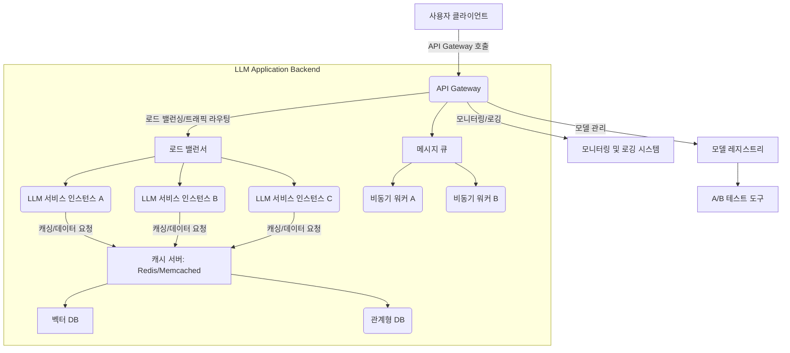

LLM 기반 애플리케이션의 배포 및 스케일링은 2026년 이후 상업적 성공을 위한 핵심 요소입니다. 예측 가능한 성능, 비용 효율성, 그리고 안정성은 복잡한 AI 워크로드를 관리하는 데 필수적인 고려사항입니다. LLM 서비스는 높은 연산 자원을 요구하며, 예측 불가능한 트래픽 패턴과 다양한 사용자 요청에 동적으로 대응해야 합니다. 이러한 도전과제를 해결하기 위해 견고한 디자인 패턴을 적용하는 것이 중요합니다.

주요 도전 과제는 다음과 같습니다:
*   **고비용 및 자원 소모 (High Cost & Resource Consumption):** LLM 추론은 GPU 자원을 많이 소모하며, 이는 곧 높은 운영 비용으로 이어집니다.
*   **지연 시간 (Latency):** 실시간 대화형 애플리케이션에서는 응답 시간이 critical합니다.
*   **동시성 및 처리량 (Concurrency & Throughput):** 급증하는 사용자 요청을 처리하기 위한 높은 동시성과 처리량 보장이 필수적입니다.
*   **모델 관리 및 업데이트 (Model Management & Updates):** LLM 모델은 빠르게 진화하므로, 모델 업데이트 및 버전 관리를 효율적으로 수행해야 합니다.
*   **신뢰성 및 장애 복구 (Reliability & Fault Tolerance):** 서비스 중단을 최소화하고 예상치 못한 오류에 대응할 수 있는 시스템이 필요합니다.

### 마이크로서비스 및 서버리스 아키텍처 (Microservices & Serverless Architectures)
LLM 애플리케이션을 마이크로서비스 형태로 분리하면 개발, 배포, 스케일링을 독립적으로 관리할 수 있습니다. 예를 들어, 프롬프트 엔지니어링, LLM 호출, 응답 파싱, 데이터 저장 등의 기능을 별도의 서비스로 구성합니다. 서버리스 함수(AWS Lambda, Google Cloud Functions)는 트래픽 변동에 따라 자동으로 스케일링되고 유휴 시 비용이 발생하지 않아 비용 효율적입니다.

### 비동기 처리 및 메시지 큐 (Asynchronous Processing & Message Queues)
LLM 추론은 시간이 오래 걸릴 수 있으므로, 사용자 요청을 즉시 처리하는 대신 메시지 큐(Kafka, RabbitMQ, AWS SQS)를 사용하여 비동기적으로 처리하는 패턴이 효과적입니다. 이를 통해 사용자 경험을 개선하고 백엔드 서비스의 부하를 분산할 수 있습니다.

### 캐싱 전략 (Caching Strategies)
자주 요청되는 LLM 응답이나 중간 결과물(예: 임베딩 벡터, 특정 프롬프트의 결과)을 캐시하여 지연 시간을 줄이고 비용을 절감할 수 있습니다. Redis나 Memcached와 같은 인메모리 데이터 스토어를 활용하며, 캐시 무효화 전략을 신중하게 설계해야 합니다.

### 로드 밸런싱 및 트래픽 라우팅 (Load Balancing & Traffic Routing)
LLM 서비스의 다중 인스턴스(instance) 간에 트래픽을 효율적으로 분산하여 단일 지점 실패를 방지하고 처리량을 극대화합니다. 지능형 라우팅은 모델 성능, 비용, 지연 시간을 기준으로 특정 LLM 엔드포인트로 요청을 보낼 수 있습니다. 예를 들어, 간단한 요청은 더 작고 저렴한 모델로, 복잡한 요청은 더 크고 비싼 모델로 라우팅하는 방식입니다.

### 모델 버전 관리 및 A/B 테스트 (Model Versioning & A/B Testing)
새로운 LLM 모델 버전이 출시되거나 파인튜닝(fine-tuning)된 모델을 배포할 때, 모든 사용자에게 한 번에 적용하기보다는 특정 사용자 그룹에만 새로운 버전을 노출하여 성능과 안정성을 검증하는 A/B 테스트 전략을 사용합니다. 이를 통해 위험을 최소화하면서 점진적으로 모델을 배포할 수 있습니다.

### 다중 LLM 오케스트레이션 (Multi-LLM Orchestration)
단일 LLM에 의존하지 않고 여러 LLM(예: GPT-4, Claude 3, Gemini)을 동시에 활용하여 각 모델의 강점을 살리고 단점을 보완합니다. 특정 작업에 최적화된 모델을 선택하거나, 실패 시 다른 모델로 자동 전환하는 폴백(fallback) 메커니즘을 구현하여 시스템의 견고성을 높일 수 있습니다.

```go
package main

import (
	"bytes"
	"encoding/json"
	"fmt"
	"io/ioutil"
	"log"
	"net/http"
	"sync"
	"time"
)

// LLMService represents a single LLM endpoint
type LLMService struct {
	URL string
}

// LLMResponse represents a simplified LLM API response
type LLMResponse struct {
	Text string `json:"text"`
}

// LLMGateway manages multiple LLM services and routes requests
type LLMGateway struct {
	services []*LLMService
	index    int
	mu       sync.Mutex
}

// NewLLMGateway creates a new gateway with provided LLM service URLs
func NewLLMGateway(urls []string) *LLMGateway {
	services := make([]*LLMService, len(urls))
	for i, url := range urls {
		services[i] = &LLMService{URL: url}
	}
	return &LLMGateway{
		services: services,
		index:    0,
	}
}

// GetNextService uses round-robin to select the next LLM service
func (g *LLMGateway) GetNextService() *LLMService {
	g.mu.Lock()
	defer g.mu.Unlock()
	service := g.services[g.index]
	g.index = (g.index + 1) % len(g.services)
	return service
}

// PromptLLM sends a prompt to an LLM service with retry logic
func (g *LLMGateway) PromptLLM(prompt string) (string, error) {
	const maxRetries = 3
	for i := 0; i < maxRetries; i++ {
		service := g.GetNextService()
		log.Printf("Attempt %d: Sending prompt to %s", i+1, service.URL)

		requestBody, _ := json.Marshal(map[string]string{"prompt": prompt})
		resp, err := http.Post(service.URL+"/generate", "application/json", bytes.NewBuffer(requestBody))
		if err != nil {
			log.Printf("Error contacting LLM service %s: %v", service.URL, err)
			time.Sleep(time.Duration(i+1) * time.Second) // Exponential backoff
			continue
		}
		defer resp.Body.Close()

		if resp.StatusCode == http.StatusOK {
			body, _ := ioutil.ReadAll(resp.Body)
			var llmResp LLMResponse
			if err := json.Unmarshal(body, &llmResp); err != nil {
				return "", fmt.Errorf("failed to parse LLM response: %w", err)
			}
			return llmResp.Text, nil
		} else {
			log.Printf("LLM service %s returned status %d", service.URL, resp.StatusCode)
			time.Sleep(time.Duration(i+1) * time.Second)
		}
	}
	return "", fmt.Errorf("failed to get response from LLM after %d retries", maxRetries)
}

func main() {
	// Simulate multiple LLM endpoints
	llmServiceURLs := []string{
		"http://localhost:8081",
		"http://localhost:8082",
		"http://localhost:8083",
	}
	gateway := NewLLMGateway(llmServiceURLs)

	// Example usage for an HTTP server
	http.HandleFunc("/api/prompt", func(w http.ResponseWriter, r *http.Request) {
		if r.Method != http.MethodPost {
			http.Error(w, "Only POST method is allowed", http.StatusMethodNotAllowed)
			return
		}

		var req struct {
			Prompt string `json:"prompt"`
		}
		if err := json.NewDecoder(r.Body).Decode(&req); err != nil {
			http.Error(w, "Invalid request body", http.StatusBadRequest)
			return
		}

		response, err := gateway.PromptLLM(req.Prompt)
		if err != nil {
			http.Error(w, fmt.Sprintf("LLM inference failed: %v", err), http.StatusInternalServerError)
			return
		}

		json.NewEncoder(w).Encode(LLMResponse{Text: response})
	})

	log.Println("LLM Gateway running on :8080")
	// For demonstration, you'd typically have mock LLM services running on 8081-8083
	// to test this gateway.
	log.Fatal(http.ListenAndServe(":8080", nil))
}

// To simulate LLM services (run these in separate terminals):
/*
package main

import (
    "encoding/json"
    "fmt"
    "log"
    "net/http"
    "os"
    "time"
)

type PromptRequest struct {
    Prompt string `json:"prompt"`
}

type LLMResponse struct {
    Text string `json:"text"`
}

func main() {
    port := os.Getenv("PORT")
    if port == "" {
        log.Fatal("PORT environment variable not set")
    }

    http.HandleFunc("/generate", func(w http.ResponseWriter, r *http.Request) {
        if r.Method != http.MethodPost {
            http.Error(w, "Only POST method is allowed", http.StatusMethodNotAllowed)
            return
        }

        var req PromptRequest
        if err := json.NewDecoder(r.Body).Decode(&req); err != nil {
            http.Error(w, "Invalid request body", http.StatusBadRequest)
            return
        }

        log.Printf("Service on port %s received prompt: %s", port, req.Prompt)
        
        // Simulate processing time
        time.Sleep(100 * time.Millisecond)

        // Simulate occasional failure for retry testing
        if port == "8082" && time.Now().Second()%10 < 3 { // Fail 30% of the time
            http.Error(w, "Simulated internal server error", http.StatusInternalServerError)
            return
        }

        response := fmt.Sprintf("Response from LLM on port %s for: \"%s\"", port, req.Prompt)
        json.NewEncoder(w).Encode(LLMResponse{Text: response})
    })

    log.Printf("Mock LLM Service running on :%s", port)
    log.Fatal(http.ListenAndServe(":"+port, nil))
}

// To run mock services:
// PORT=8081 go run main.go
// PORT=8082 go run main.go
// PORT=8083 go run main.go
*/
```



## 트레이드오프 (Trade-offs)

LLM 애플리케이션의 배포 및 스케일링 디자인 패턴은 여러 요소를 복합적으로 고려해야 합니다. 각 패턴에는 장단점이 명확하며, 프로젝트의 특성과 요구사항에 따라 적절한 선택이 필요합니다.

*   **마이크로서비스 vs 모놀리식 (Microservices vs. Monolithic):**
    *   **마이크로서비스 (Microservices):** 독립적인 개발, 배포, 스케일링이 용이하며 팀 간의 분업 효율성이 높습니다. 언제 좋은가: 대규모 팀, 복잡한 비즈니스 로직, 특정 서비스에 대한 높은 스케일링 요구사항이 있을 때. 언제 나쁜가: 초기 개발 비용과 복잡성이 높고, 분산 시스템 관리 오버헤드가 크며, 트랜잭션 일관성 유지가 어려울 수 있습니다.
    *   **모놀리식 (Monolithic):** 초기 개발이 빠르고 배포가 단순합니다. 언제 좋은가: 작은 프로젝트, 빠른 프로토타입 개발, 팀 규모가 작을 때. 언제 나쁜가: 특정 컴포넌트의 병목 현상이 전체 시스템에 영향을 미치고, 기술 스택 변경이 어렵습니다.

*   **서버리스 vs 컨테이너 (Serverless vs. Containers):**
    *   **서버리스 (Serverless):** 트래픽 변동에 따른 자동 스케일링과 유휴 시 비용 절감 효과가 큽니다. 언제 좋은가: 예측 불가능한 트래픽 패턴, 간헐적인 워크로드, 운영 오버헤드를 줄이고 싶을 때. 언제 나쁜가: 콜드 스타트(cold start) 지연이 발생할 수 있고, 실행 시간 및 메모리 제한이 있으며, 공급업체 종속성(vendor lock-in)이 있을 수 있습니다.
    *   **컨테이너 (Containers: Kubernetes, Docker):** 환경 일관성과 세밀한 자원 제어를 제공합니다. 언제 좋은가: 커스텀 런타임 환경이 필요할 때, 장시간 실행되는 워크로드, 강력한 오케스트레이션 기능이 필요할 때. 언제 나쁜가: 인프라 관리 및 운영 복잡성이 높고, 비용 최적화를 위한 노력이 추가됩니다.

*   **동기 vs 비동기 처리 (Synchronous vs. Asynchronous Processing):**
    *   **동기 처리 (Synchronous Processing):** 즉각적인 응답이 필요한 간단한 요청에 적합합니다. 언제 좋은가: 빠른 응답 시간이 필수적인 간단한 쿼리나 검증 작업. 언제 나쁜가: LLM 추론처럼 시간이 오래 걸리는 작업에서 사용자 경험을 저해하고, 백엔드 서비스에 병목 현상을 유발할 수 있습니다.
    *   **비동기 처리 (Asynchronous Processing):** 사용자 요청을 즉시 처리하지 않고 백그라운드에서 처리하여 응답성을 유지합니다. 언제 좋은가: 장시간 걸리는 LLM 추론, 배치 처리, 결과가 즉시 필요하지 않은 작업. 언제 나쁜가: 시스템 복잡도가 증가하고, 결과의 최종 일관성(eventual consistency)을 고려해야 하며, 에러 처리 및 상태 추적이 더 어려워질 수 있습니다.

*   **캐싱 깊이 (Caching Depth):**
    *   **깊은 캐싱 (Deep Caching):** 응답 속도를 극대화하고 비용을 최소화하지만, 데이터 신선도(freshness)를 유지하기 어렵습니다. 언제 좋은가: 자주 요청되고 변경이 적은 콘텐츠, 비용 절감이 최우선인 경우. 언제 나쁜가: 실시간 데이터 또는 개인화된 응답이 중요한 경우, 캐시 무효화 로직이 복잡해질 때.
    *   **얕은 캐싱/미니 캐싱 (Shallow/Minimal Caching):** 데이터 신선도를 유지하기 쉽지만, 성능 및 비용 절감 효과는 제한적입니다. 언제 좋은가: 실시간 데이터 일관성이 중요한 경우, 캐시 일관성 유지가 단순할 때. 언제 나쁜가: 트래픽이 매우 많거나 LLM 호출 비용이 높은 경우, 성능 최적화에 한계가 있습니다.

*   **단일 LLM vs 다중 LLM (Single LLM vs. Multi-LLM):**
    *   **단일 LLM (Single LLM):** 아키텍처가 단순하고 관리가 용이합니다. 언제 좋은가: 초기 개발, 특정 LLM이 모든 요구사항을 충족할 때, 비용 효율성이 최우선일 때. 언제 나쁜가: 특정 작업에 대한 최적화 부족, 단일 공급업체 종속성, LLM 자체의 장애나 성능 저하에 취약합니다.
    *   **다중 LLM (Multi-LLM):** 유연성과 장애 복구 능력이 뛰어나고, 다양한 모델의 강점을 활용할 수 있습니다. 언제 좋은가: 고가용성(High Availability), 최적의 성능/비용 트레이드오프, 복잡하고 다양한 작업 처리. 언제 나쁜가: 시스템 복잡도가 크게 증가하고, 라우팅 로직 개발 및 유지보수 비용이 발생하며, 여러 API 관리 오버헤드가 있습니다.

## 실전 체크리스트 (Practical Checklist)

LLM 기반 애플리케이션을 성공적으로 배포하고 스케일링하기 위해 다음 체크리스트를 활용하여 시스템을 검토하고 개선하십시오.

- [ ] **워크로드 분석 및 패턴 식별:** 예상되는 트래픽 패턴(peak/off-peak), 요청 유형(실시간/배치), 허용 가능한 지연 시간(latency)을 명확히 정의했는가?
- [ ] **마이크로서비스 분리 여부 평가:** LLM 호출, 프롬프트 관리, 데이터 처리 등 핵심 기능을 독립적인 서비스로 분리하여 스케일링 유연성을 확보했는가?
- [ ] **비동기 처리 도입 검토:** 장시간 응답이 필요한 LLM 작업에 메시지 큐(message queue)를 활용한 비동기 처리 메커니즘을 적용했는가?
- [ ] **캐싱 전략 구현 및 검증:** 자주 사용되는 LLM 응답, 임베딩, 또는 중간 처리 결과를 캐시하고, 캐시 무효화(cache invalidation) 정책은 명확하며 올바르게 동작하는가?
- [ ] **지능형 로드 밸런싱 및 라우팅 구성:** 여러 LLM 인스턴스 또는 다양한 LLM 모델 간에 트래픽을 효율적으로 분산하고, 특정 조건에 따라 동적으로 라우팅하는 시스템을 구축했는가? (예: 비용, 성능 기준)
- [ ] **모델 버전 관리 및 A/B 테스트 파이프라인:** 새로운 LLM 모델 버전 또는 파인튜닝된 모델을 안전하게 배포하고 A/B 테스트를 통해 성능을 검증할 수 있는 MLOps 파이프라인이 준비되었는가?
- [ ] **모니터링 및 알림 시스템 구축:** LLM 서비스의 지연 시간, 처리량, 에러율, 비용 등을 실시간으로 모니터링하고, 이상 징후 발생 시 자동으로 알림을 받을 수 있는 시스템이 구축되었는가?