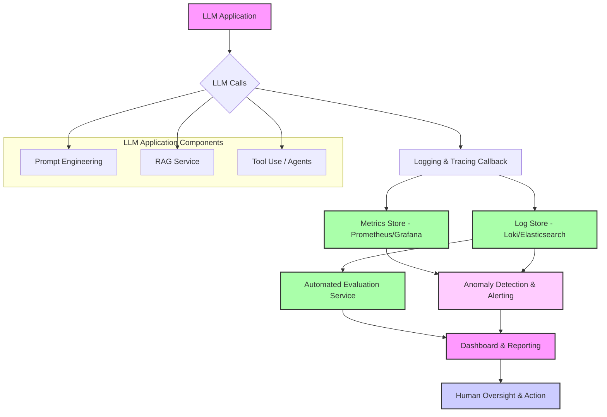

LLM (Large Language Model) 기반 애플리케이션은 기존 소프트웨어와는 다른 복잡성을 가집니다. 추론의 비결정성, 동적인 토큰 사용량, 외부 API 의존성, 그리고 RAG (Retrieval Augmented Generation) 및 에이전트 패턴 도입으로 인한 복합적인 워크플로우는 프로덕션 환경에서의 성능 문제를 예측하고 디버깅하기 어렵게 만듭니다. 효과적인 모니터링 시스템은 이러한 복잡성을 관리하고, 사용자 경험을 최적화하며, 운영 비용을 절감하는 데 필수적입니다.

## LLM 애플리케이션 모니터링의 핵심 과제

LLM 애플리케이션의 성능을 모니터링하는 것은 다음과 같은 고유한 과제를 포함합니다.

### 1. 응답 품질 (Response Quality)
LLM의 응답은 비결정적이며, 맥락 (context) 의존성이 높습니다. 환각 (hallucination), 불필요한 장황함, 일관성 부족 등의 문제를 지속적으로 감지하고 평가해야 합니다. 이는 단순히 HTTP 200 OK 여부를 확인하는 것 이상의 심층적인 분석을 요구합니다.

### 2. 레이턴시 (Latency)
LLM 호출 자체의 레이턴시뿐만 아니라, RAG 시스템의 검색 단계, 외부 도구 (tool) 호출, 멀티턴 대화에서의 컨텍스트 관리 등 전체 워크플로우의 각 단계별 레이턴스를 측정해야 합니다. 병목 현상을 정확히 파악하는 것이 중요합니다.

### 3. 비용 (Cost)
대부분의 LLM은 토큰 사용량에 따라 과금됩니다. 불필요한 토큰 사용, 반복적인 호출, 비효율적인 프롬프트 엔지니어링 등은 예상치 못한 비용 증가로 이어질 수 있습니다. 인풋/아웃풋 토큰의 양을 모니터링하고 최적화하는 것이 중요합니다.

### 4. 신뢰성 및 안정성 (Reliability and Stability)
LLM API 오류, 외부 서비스 연동 실패, 과도한 요청으로 인한 Rate Limit 도달 등 다양한 요인이 애플리케이션의 안정성을 저해할 수 있습니다. 각 컴포넌트의 오류율과 재시도 (retry) 로직의 효율성을 모니터링해야 합니다.

### 5. 컨텍스트 드리프트 및 에이전트 실패 (Context Drift and Agent Failure)
장기 실행 에이전트 (long-running agent) 나 복잡한 대화 시스템에서는 컨텍스트가 초기 의도와 다르게 흐르거나, 에이전트가 예상치 못한 상태에 빠지는 '컨텍스트 드리프트' 현상이 발생할 수 있습니다. 에이전트의 의사결정 경로와 상태 변화를 추적하는 심층적인 모니터링이 필요합니다.

## LLM 모니터링 시스템의 핵심 컴포넌트

효과적인 LLM 모니터링 시스템은 다음 컴포넌트들의 통합으로 구축됩니다.

### 1. 로깅 및 트레이싱 (Logging & Tracing)
모든 LLM 호출과 관련 API 요청에 대해 상세한 로깅 및 트레이싱을 구현합니다. 다음 정보를 포함해야 합니다.

*   **입력**: 사용자 쿼리, 시스템 프롬프트, 컨텍스트 정보 (RAG 문서, 대화 기록)
*   **출력**: LLM 응답, 파싱된 출력 (JSON 등), 최종 사용자에게 전달된 응답
*   **메타데이터**: 모델 ID, 버전, 호출 시각, 레이턴시, 인풋/아웃풋 토큰 수, 비용, API 호출 상태 코드, 에러 메시지
*   **워크플로우**: 에이전트의 중간 스텝, 도구 사용 내역, 의사결정 경로

OpenTelemetry와 같은 표준화된 트레이싱 도구를 활용하여 분산 트레이싱을 구현하면, 복잡한 에이전트 워크플로우의 흐름을 시각적으로 파악하고 병목 지점을 식별하는 데 큰 도움이 됩니다.

### 2. 메트릭 수집 (Metrics Collection)
주요 성능 지표들을 실시간으로 수집합니다. Prometheus 같은 시계열 데이터베이스에 저장하여 시각화 및 경고 (alerting) 에 활용합니다.

*   **레이턴시**: 전체 요청 레이턴시, LLM API 호출 레이턴시, RAG 검색 레이턴시 등 각 단계별 P50, P90, P99 값
*   **처리량 (Throughput)**: 초당 요청 수 (RPS), 초당 토큰 수
*   **비용**: 요청당 평균 비용, 총 비용, 모델별 비용
*   **에러율**: LLM API 에러율, 파싱 에러율, 도구 호출 에러율
*   **토큰 사용량**: 인풋/아웃풋 토큰 수 분포, 평균 토큰 수
*   **모델별 지표**: 특정 모델의 사용률 및 성능 변화

### 3. 자동화된 평가 (Automated Evaluation)
LLM 응답의 품질을 자동으로 평가하는 메커니즘을 도입합니다. 이는 2026년 트렌드로 매우 중요하며, 지속적인 모델 개선에 핵심적인 역할을 합니다.

*   **평가 메트릭**: Relevance (관련성), Coherence (일관성), Fluency (유창성), Conciseness (간결성), Safety (안정성) 등
*   **평가 방법**: Golden Dataset 기반 평가, LLM-as-a-Judge (다른 LLM이 응답을 평가), 정규 표현식 (regex) 또는 키워드 기반 검증
*   **A/B 테스트**: 새로운 프롬프트나 모델 버전을 배포하기 전에 실제 트래픽의 일부에 적용하여 성능을 비교 분석합니다.

### 4. 경고 및 이상 감지 (Alerting & Anomaly Detection)
수집된 메트릭과 로그를 기반으로 임계값 (threshold) 을 설정하고, 이상 징후 (anomaly) 발생 시 즉시 알림을 발생시킵니다. ML 기반 이상 감지 모델을 활용하여 미묘한 성능 저하도 감지할 수 있습니다.

*   **경고 기준**: 레이턴시 임계값 초과, 에러율 급증, 토큰 비용 임계값 초과, 특정 프롬프트의 품질 저하
*   **알림 채널**: Slack, PagerDuty, 이메일 등

### 5. 대시보드 및 시각화 (Dashboards & Visualization)
수집된 모든 데이터를 한눈에 파악할 수 있는 대시보드를 구축합니다. Grafana, Kibana, 또는 LLM 옵스 플랫폼이 제공하는 대시보드를 활용합니다.

*   **주요 대시보드**: 전체 시스템 현황, 모델별 성능, 비용 추이, 에러 로그 분석, 사용자 세션 흐름 분석

## 구현 예시: Python 및 LangChain을 활용한 모니터링

LangChain과 같은 프레임워크는 콜백 (callback) 기능을 통해 LLM 호출의 모든 단계를 로깅하고 추적할 수 있는 강력한 기능을 제공합니다. 이를 OpenTelemetry와 통합하여 상세한 트레이싱 데이터를 수집할 수 있습니다.

```python
import os
from langchain_openai import ChatOpenAI
from langchain.callbacks.base import BaseCallbackHandler
from langchain.schema import LLMResult
from opentelemetry import trace
from opentelemetry.sdk.resources import Resource
from opentelemetry.sdk.trace import TracerProvider
from opentelemetry.sdk.trace.export import ConsoleSpanExporter, SimpleSpanProcessor

# OpenTelemetry 설정 (예시: 콘솔 출력)
resource = Resource.create({"service.name": "llm-application-monitoring"})
provider = TracerProvider(resource=resource)
processor = SimpleSpanProcessor(ConsoleSpanExporter())
provider.add_span_processor(processor)
trace.set_tracer_provider(provider)

tracer = trace.get_tracer(__name__)

class CustomLLMMonitoringCallback(BaseCallbackHandler):
    def on_llm_start(self, serialized: dict, prompts: list[str], **kwargs):
        with tracer.start_as_current_span("llm_call") as span:
            span.set_attribute("llm.model_name", serialized["kwargs"].get("model_name", "unknown"))
            span.set_attribute("llm.prompts", str(prompts))
            print(f"--- LLM Call Started --- Model: {serialized['kwargs'].get('model_name')}, Prompts: {prompts[:1]}...")

    def on_llm_end(self, response: LLMResult, **kwargs):
        span = trace.get_current_span()
        if span.is_recording():
            token_usage = response.llm_output.get("token_usage") if response.llm_output else {}
            span.set_attribute("llm.completion_tokens", token_usage.get("completion_tokens", 0))
            span.set_attribute("llm.prompt_tokens", token_usage.get("prompt_tokens", 0))
            span.set_attribute("llm.total_tokens", token_usage.get("total_tokens", 0))
            span.set_attribute("llm.finish_reason", response.generations[0][0].generation_info.get("finish_reason", "unknown"))
            print(f"--- LLM Call Ended --- Total Tokens: {token_usage.get('total_tokens')}")

    def on_llm_error(self, error: Exception, **kwargs):
        span = trace.get_current_span()
        if span.is_recording():
            span.set_attribute("llm.error", str(error))
            span.set_attribute("llm.error_type", type(error).__name__)
            print(f"--- LLM Call Error --- {error}")

    def on_tool_start(self, serialized: dict, input_str: str, **kwargs):
        with tracer.start_as_current_span("tool_call") as span:
            span.set_attribute("tool.name", serialized["name"])
            span.set_attribute("tool.input", input_str)
            print(f"--- Tool Call Started --- Tool: {serialized['name']}, Input: {input_str}")

    def on_tool_end(self, output: str, **kwargs):
        span = trace.get_current_span()
        if span.is_recording():
            span.set_attribute("tool.output", output)
            print(f"--- Tool Call Ended --- Output: {output[:50]}...")


# LLM 초기화 (실제 API 키 필요)
llm = ChatOpenAI(model="gpt-4o-mini", temperature=0, openai_api_key=os.environ.get("OPENAI_API_KEY"))

def run_llm_app(query: str):
    with tracer.start_as_current_span("user_request") as span:
        span.set_attribute("user.query", query)
        try:
            response = llm.invoke(query, config={"callbacks": [CustomLLMMonitoringCallback()]})
            print(f"Final Response: {response.content}")
            return response.content
        except Exception as e:
            print(f"Application Error: {e}")
            return "Error processing your request."

if __name__ == "__main__":
    # 환경 변수 설정 필요: export OPENAI_API_KEY='your_api_key'
    print("Running LLM application...")
    run_llm_app("한국의 수도는 어디이며, 면적은 얼마나 되나요?")
    run_llm_app("What is the capital of France?")
    print("Monitoring data sent to console (OpenTelemetry Span)...")
```

위 코드는 LangChain의 콜백 핸들러를 사용하여 LLM 호출의 시작, 종료, 에러 발생 시 OpenTelemetry 스팬 (span) 을 생성하고 필요한 메타데이터를 기록하는 예시입니다. 이 스팬들은 Prometheus, Grafana, Jaeger와 같은 모니터링 시스템으로 전송되어 시각화 및 분석에 활용될 수 있습니다.

### 모니터링 아키텍처 다이어그램

다음 Mermaid 다이어그램은 LLM 애플리케이션의 일반적인 모니터링 시스템 아키텍처를 보여줍니다.



## 2026년 LLM 모니터링 트렌드

*   **실시간 온디맨드 평가 (Real-time On-demand Evaluation)**: 배치 (batch) 기반 평가를 넘어, 프로덕션 트래픽의 일부를 실시간으로 평가하고 즉시 피드백 루프를 가동하여 모델 드리프트 (model drift) 나 성능 저하를 빠르게 감지하고 대응합니다.
*   **에이전트 기반 모니터링 (Agent-based Monitoring)**: LLM 에이전트가 다른 LLM 에이전트의 동작을 모니터링하고, 이상 징후를 감지하거나 자율적으로 문제 해결을 시도하는 패턴이 부상하고 있습니다. 이는 자율 복구 (self-healing) 시스템의 핵심이 됩니다.
*   **적응형 임계값 및 예측 (Adaptive Thresholds & Prediction)**: 고정된 임계값 대신, 과거 데이터를 기반으로 동적으로 임계값을 조정하고, 미래 성능 저하를 예측하여 선제적으로 대응하는 예측 모니터링 (predictive monitoring) 기술이 발전하고 있습니다.
*   **설명 가능한 AI (Explainable AI, XAI) 통합**: LLM 응답의 비결정성을 이해하기 위해, 어떤 입력 요소가 특정 출력에 영향을 미쳤는지 설명하는 XAI 기술이 모니터링 시스템에 통합되어 디버깅 효율성을 높입니다.

## 트레이드오프

LLM 모니터링 시스템을 설계할 때 고려해야 할 주요 트레이드오프는 다음과 같습니다.

*   **데이터 수집의 상세도 (Granularity) vs. 스토리지 및 비용 (Storage & Cost)**:
    *   **언제 좋은가**: 모든 LLM 호출의 인풋/아웃풋, 중간 단계, 토큰 수 등 상세한 데이터를 수집하면 문제 발생 시 심층적인 원인 분석이 가능합니다. 특히 초기 개발 단계나 복잡한 에이전트 시스템에서 유리합니다.
    *   **언제 나쁜가**: 데이터 볼륨이 매우 커지므로 스토리지 비용과 처리 부하가 증가합니다. 대규모 서비스에서는 모든 데이터를 상세하게 기록하는 것이 비효율적일 수 있습니다. 정형화된 메트릭 위주로 전환하거나 샘플링 (sampling) 전략을 고려해야 합니다.

*   **실시간 평가 (Real-time Evaluation) vs. 배치 평가 (Batch Evaluation)**:
    *   **언제 좋은가**: 실시간 평가는 모델 성능 저하나 드리프트를 즉시 감지하여 빠른 대응을 가능하게 합니다. 사용자 경험에 민감한 서비스나 중요한 에이전트 기능에 적합합니다.
    *   **언제 나쁜가**: 실시간 평가는 추가적인 컴퓨팅 리소스와 복잡한 인프라 (예: 스트리밍 데이터 처리 파이프라인) 를 요구합니다. 비용이 높고, 평가 로직의 정확성과 효율성 확보가 어렵습니다. 낮은 중요도의 기능이나 비용에 민감한 환경에서는 배치 평가가 더 합리적일 수 있습니다.

*   **오픈소스 솔루션 (Open-source Solutions) vs. 관리형 LLM 옵스 플랫폼 (Managed LLM Ops Platforms)**:
    *   **언제 좋은가**: 오픈소스 (예: OpenTelemetry, Prometheus, Grafana) 는 높은 유연성과 커스터마이징 가능성을 제공하며, 초기 비용이 낮습니다. 자체 인프라 관리에 익숙한 팀에 적합합니다.
    *   **언제 나쁜가**: 오픈소스 솔루션은 구축 및 유지보수, 통합에 상당한 공수와 전문 지식을 요구합니다. 빠르게 프로덕션 시스템을 구축해야 하거나 운영 리소스가 부족한 팀에게는 Langfuse, Phoenix 같은 관리형 LLM 옵스 플랫폼이 더 효율적일 수 있습니다. 하지만 관리형 플랫폼은 벤더 종속성과 높은 서비스 비용을 수반할 수 있습니다.

*   **인간 개입 (Human-in-the-loop) vs. 완전 자동화 (Full Automation)**:
    *   **언제 좋은가**: LLM 응답 품질 평가와 같은 작업에 인간 전문가의 판단이 개입되면, 평가의 정확성과 신뢰성이 높아집니다. 특히 모델 학습 데이터셋 구축이나 초기 품질 검증 단계에서 필수적입니다.
    *   **언제 나쁜가**: 인간 개입은 비용과 시간이 많이 소요되며, 확장성이 떨어집니다. 대규모 트래픽을 처리하는 프로덕션 환경에서는 인간 개입의 비중을 최소화하고, 자동화된 평가 시스템을 우선적으로 구축해야 합니다.

## 실전 체크리스트

LLM 애플리케이션의 성능 모니터링 시스템을 구현할 때 다음 항목들을 검토하십시오.

*   [ ] 모든 LLM 호출 및 외부 도구 사용에 대해 인풋, 아웃풋, 토큰 사용량, 레이턴시, 모델 ID를 포함하는 상세 로깅 및 트레이싱이 구현되어 있는가?
*   [ ] LLM API 에러율, 전체 요청 레이턴시 (P90, P99), 요청당 평균 토큰 비용을 실시간으로 집계하고 시각화하는 대시보드가 구축되어 있는가?
*   [ ] 주요 비즈니스 로직에 해당하는 LLM 응답에 대해 자동화된 품질 평가 (예: 골든 데이터셋 기반 테스트, LLM-as-a-Judge) 파이프라인이 최소 2가지 이상 구현되어 있는가?
*   [ ] 레이턴시, 에러율, 토큰 비용 임계값 초과 시 담당자에게 자동으로 알림을 전송하는 경고 시스템이 설정되어 있으며, 오탐 (false positive) 율이 허용 가능한 수준인가?
*   [ ] RAG 시스템을 사용하는 경우, 검색 단계의 레이턴시, 검색 결과의 관련성 (relevance) 메트릭이 별도로 수집 및 모니터링되고 있는가?
*   [ ] 컨텍스트 드리프트 또는 에이전트의 잘못된 의사결정을 감지하기 위해 에이전트의 내부 상태 변화, 도구 호출 시퀀스, 최종 목표 달성 여부를 추적하는 메커니즘이 포함되어 있는가?
*   [ ] 새로운 프롬프트나 모델 버전 배포 시, 성능 저하 및 비용 증가를 사전에 감지하기 위한 A/B 테스트 또는 카나리 배포 (canary deployment) 전략이 마련되어 있는가?