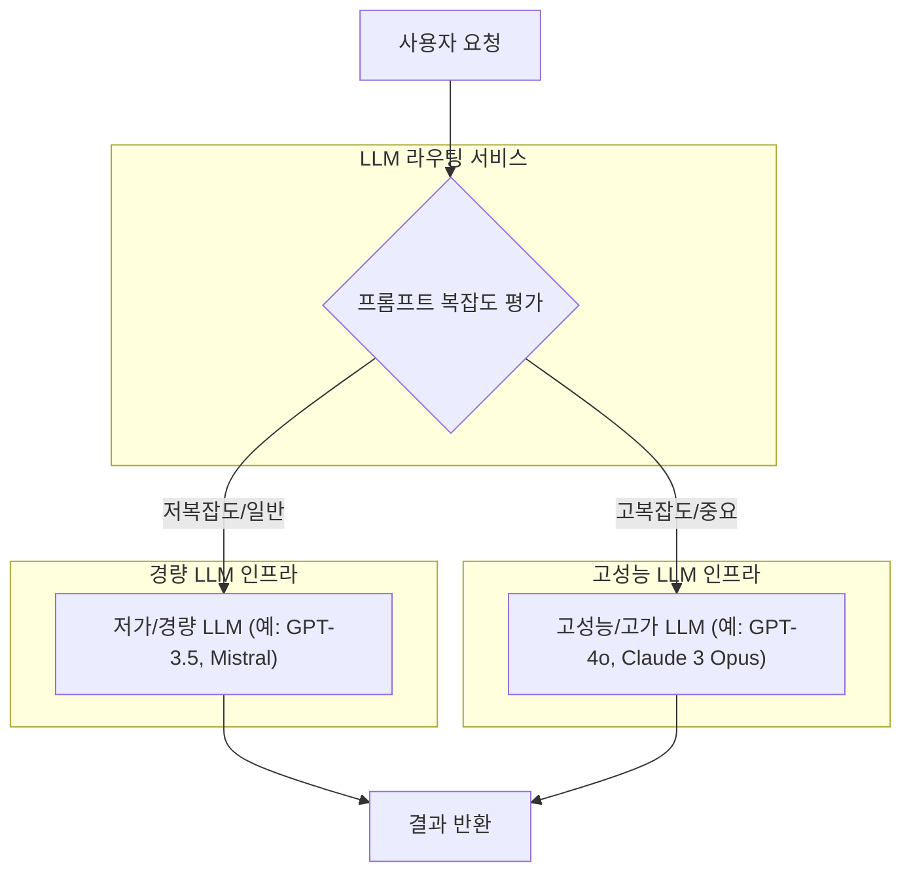

LLM 기반 애플리케이션의 급증하는 수요에 발맞춰 실제 서비스에 적용 가능한 비용 최적화 배포 전략은 필수적입니다. 단순히 기능 구현을 넘어, 지속 가능한 운영을 위한 비용 효율성은 LLM 애플리케이션의 성공을 좌우하는 핵심 요소입니다. 이 엔트리에서는 LLM 기반 애플리케이션의 비용을 절감하면서도 성능을 유지 또는 향상시키는 다양한 배포 패턴과 전략을 탐구합니다.

## LLM 애플리케이션의 비용 구조 이해

LLM 애플리케이션의 주요 비용은 크게 다음 세 가지로 분류할 수 있습니다.
*   **토큰 비용 (Token Cost):** LLM API 호출 시 입력 프롬프트와 출력 응답의 토큰 수에 따라 부과되는 비용입니다. 모델의 크기, 복잡도, 그리고 공급업체에 따라 토큰당 비용이 크게 달라집니다. 특히 최신 고성능 모델일수록 토큰 비용이 높습니다.
*   **인프라 비용 (Infrastructure Cost):** 자체 호스팅 (Self-hosting) 모델의 경우 GPU 인스턴스, 스토리지, 네트워크 트래픽 등에 발생하는 비용입니다. 클라우드 기반 LLM API를 사용하더라도 API 게이트웨이, 로깅, 모니터링 등의 관련 인프라 비용이 발생할 수 있습니다.
*   **운영 및 개발 비용 (Operational & Development Cost):** LLM 워크플로우를 구축하고 유지보수하며, 지속적으로 개선하는 데 필요한 인력 및 도구 비용입니다. 이는 직접적인 LLM 사용 비용은 아니지만, 전체 비용 최적화 전략에서 고려해야 할 중요한 부분입니다.

## 비용 효율적인 LLM 배포 패턴

### 1. 동적 모델 티어링 및 라우팅 (Dynamic Model Tiering & Routing)

모든 LLM 요청에 최고 성능의 모델을 사용할 필요는 없습니다. 작업의 복잡도, 중요도, 응답 속도 요구사항에 따라 적절한 LLM을 동적으로 선택하여 라우팅하는 전략은 비용을 크게 절감할 수 있습니다. 예를 들어, 간단한 요약이나 번역에는 저렴하고 빠른 모델을 사용하고, 복잡한 추론이나 코드 생성에는 고가의 고급 모델을 활용합니다.



**구현 고려사항:**
*   **복잡도 측정:** 프롬프트 길이, 키워드 밀도, 요청 유형(질의응답, 요약, 코드 생성 등)을 기준으로 복잡도를 평가하는 로직을 구현합니다. 이는 규칙 기반, 머신러닝 모델, 또는 다른 LLM을 통한 자체 평가 등 다양한 방식으로 가능합니다.
*   **라우팅 정책:** 각 LLM의 비용, 성능, 기능 제약을 고려하여 최적의 라우팅 정책을 정의합니다. A/B 테스트를 통해 최적의 임계값을 찾는 것이 중요합니다.
*   **폴백 메커니즘:** 저가 모델이 실패하거나 만족스러운 결과를 제공하지 못할 경우, 고성능 모델로 재시도하는 폴백(Fallback) 전략을 마련합니다.

### 2. 프롬프트 캐싱 (Prompt Caching)

동일하거나 유사한 프롬프트에 대한 LLM 호출은 캐싱을 통해 비용을 절감하고 응답 속도를 향상시킬 수 있습니다. 특히 RAG(Retrieval-Augmented Generation) 시스템에서 자주 조회되는 문서나 요약본에 대한 프롬프트는 효과적인 캐싱 대상이 됩니다.

```python
import hashlib
import json
from functools import lru_cache

class LLMCache:
    def __init__(self, max_size=128):
        self.cache = lru_cache(maxsize=max_size)(self._cached_call)

    def _cached_call(self, prompt_hash, model_name):
        # 실제 LLM API 호출 로직 (여기는 더미)
        print(f"Calling actual LLM for hash: {prompt_hash}, model: {model_name}")
        return f"Response for {prompt_hash} from {model_name}"

    def get_response(self, prompt, model_name="default_model"):
        prompt_data = {"prompt": prompt, "model_name": model_name}
        # 프롬프트와 모델 정보를 해시하여 고유 키 생성
        prompt_hash = hashlib.md5(json.dumps(prompt_data, sort_keys=True).encode('utf-8')).hexdigest()
        return self.cache(prompt_hash, model_name)

# 사용 예시
llm_cache = LLMCache(max_size=100)
print(llm_cache.get_response("오늘 날씨는?", "gpt-3.5-turbo"))
print(llm_cache.get_response("오늘 날씨는?", "gpt-3.5-turbo")) # 캐시된 응답
print(llm_cache.get_response("내일 날씨는?", "gpt-4o"))
print(llm_cache.get_response("내일 날씨는?", "gpt-4o"))     # 캐시된 응답
print(llm_cache.get_response("오늘 날씨는?", "gpt-4o"))     # 다른 모델이므로 새로 호출
```
이 예시는 간단한 `lru_cache`를 사용했지만, 실제 프로덕션 환경에서는 Redis, Memcached 등의 분산 캐시 시스템을 활용하여 스케일링과 데이터 지속성을 확보해야 합니다. 캐시 무효화 전략, TTL(Time-To-Live) 설정도 중요하게 고려해야 합니다.

### 3. 배치 처리 및 비동기 호출 (Batch Processing & Asynchronous Calls)

실시간 응답이 필수적이지 않은 작업 (예: 문서 요약, 보고서 생성, 이메일 초안 작성 등)의 경우, 여러 요청을 묶어 배치로 처리하면 LLM inference 비용을 줄일 수 있습니다. 배치 처리는 GPU 활용률을 극대화하여 추론 비용을 낮추고 처리량을 높입니다. 또한, 비동기 API 호출을 사용하여 사용자의 응답 대기 시간을 최소화하고, 백그라운드에서 LLM 작업을 효율적으로 처리할 수 있습니다.

### 4. 경량 모델 및 미세 조정 (Lightweight Models & Fine-tuning)

특정 도메인이나 작업에 최적화된 소규모 모델을 사용하거나, 더 큰 모델을 미세 조정(Fine-tuning)하여 비용을 절감할 수 있습니다. 미세 조정된 경량 모델은 특정 작업에서 더 큰 범용 모델과 유사하거나 더 나은 성능을 보이면서도 훨씬 적은 추론 비용과 짧은 지연 시간을 가집니다.
*   **온디바이스 LLM (On-device LLM):** Gemini Nano와 같은 모델을 모바일 기기나 엣지 디바이스에 배포하여 클라우드 호출 없이 로컬에서 추론을 수행하면 클라우드 비용을 완전히 없앨 수 있습니다. 이는 개인 정보 보호에도 유리합니다.
*   **양자화 및 증류 (Quantization & Distillation):** 모델의 크기를 줄이고 실행 속도를 높이는 기법입니다. 양자화는 모델 파라미터의 정밀도를 낮추고, 증류는 큰 모델(teacher)의 지식을 작은 모델(student)로 전이시킵니다.

### 5. RAG (Retrieval-Augmented Generation) 최적화

RAG는 LLM의 컨텍스트 윈도우 한계를 극복하고 최신 정보에 접근하게 하는 효과적인 방법이지만, 비효율적인 RAG 구현은 오히려 토큰 비용을 증가시킬 수 있습니다.
*   **정확한 문서 청킹 및 임베딩 (Precise Document Chunking & Embedding):** 검색 관련성이 높은 작은 청크를 생성하여 LLM에 전달되는 컨텍스트의 양을 최소화합니다.
*   **컨텍스트 압축 및 재순위화 (Context Compression & Re-ranking):** 검색된 문서들 중 핵심 내용만 추출하거나, 프롬프트에 가장 관련성이 높은 문서를 재순위화하여 LLM에 전달되는 토큰 수를 줄입니다.
*   **캐스케이드 RAG (Cascade RAG):** 처음에는 가벼운 검색 전략으로 시작하고, 필요한 경우에만 더 광범위하거나 복잡한 검색을 수행합니다.

## 트레이드오프 (Trade-offs)

LLM 애플리케이션의 비용 효율성을 위한 각 패턴은 고유한 장단점을 가지며, 프로젝트의 특성과 요구사항에 따라 신중하게 선택해야 합니다.

*   **동적 모델 티어링 및 라우팅:**
    *   **언제 좋음:** 다양한 복잡도의 요청이 혼재하는 경우, 비용 대비 성능 최적화가 중요한 경우.
    *   **언제 나쁨:** 모든 요청에 일관된 최고 수준의 성능이 요구되는 경우, 라우팅 로직 구현 및 유지보수 복잡도가 높아지는 경우.
*   **프롬프트 캐싱:**
    *   **언제 좋음:** 반복적인 동일/유사 프롬프트 요청이 많은 경우, 응답 지연 시간 단축이 필요한 경우.
    *   **언제 나쁨:** 프롬프트가 매우 동적이어서 캐시 적중률이 낮은 경우, 최신 정보가 필수적이어서 캐시 무효화가 잦은 경우.
*   **배치 처리 및 비동기 호출:**
    *   **언제 좋음:** 실시간 응답 지연이 허용되는 백그라운드 작업, 높은 처리량이 요구되는 경우.
    *   **언제 나쁨:** 사용자 인터랙션이 중요한 실시간 애플리케이션, 즉각적인 응답이 필수적인 경우.
*   **경량 모델 및 미세 조정:**
    *   **언제 좋음:** 특정 도메인에 특화된 고정된 작업, 온디바이스 배포 또는 낮은 지연 시간이 요구되는 경우.
    *   **언제 나쁨:** 광범위한 일반 지식이나 복잡한 추론이 필요한 경우, 미세 조정 데이터셋 구축 및 관리 비용이 높은 경우.
*   **RAG 최적화:**
    *   **언제 좋음:** LLM의 지식 한계를 보완하고 최신 정보를 활용해야 하는 경우, 컨텍스트 윈도우 제약을 해결해야 하는 경우.
    *   **언제 나쁨:** 검색 결과의 정확성과 관련된 잠재적 환각 (hallucination) 위험이 발생할 수 있는 경우, 검색 시스템 구축 및 유지보수 비용이 높은 경우.

## 실전 체크리스트

LLM 애플리케이션의 비용 효율적인 배포를 위해 다음 체크리스트를 활용하여 전략을 검토하고 적용할 수 있습니다.

- [ ] **LLM 사용 패턴 분석:** 현재 LLM 사용량, 호출 빈도, 프롬프트 유형, 토큰 소비량 등을 면밀히 분석하고 주요 비용 발생 지점을 식별했는가?
- [ ] **모델 티어링 정책 정의:** 작업의 복잡도와 중요도에 따른 LLM 모델 선택 기준(예: GPT-3.5 vs. GPT-4o)을 명확히 정의하고, 각 티어의 비용-성능 균형을 평가했는가?
- [ ] **프롬프트 캐싱 시스템 도입:** 반복적인 프롬프트에 대한 캐시 적중률을 측정하고, Redis와 같은 분산 캐시 시스템을 통해 비용 절감 효과를 달성하고 있는가? 캐시 무효화 전략은 적절한가?
- [ ] **배치 및 비동기 처리 적용:** 실시간 응답이 필수가 아닌 워크로드에 대해 배치 처리 또는 비동기 API 호출을 적용하여 GPU 활용률을 최적화했는가?
- [ ] **RAG 워크플로우 최적화:** 문서 청킹 전략, 임베딩 모델 선택, 컨텍스트 압축 및 재순위화 기법을 도입하여 LLM에 전달되는 컨텍스트 토큰 수를 최소화했는가?
- [ ] **온디바이스/경량 모델 활용 가능성 평가:** 모바일 또는 엣지 환경에서의 배포, 특정 도메인에 한정된 작업에 대해 경량 모델 (예: Gemini Nano, Mistral) 또는 미세 조정된 모델을 활용할 가능성을 검토했는가?
- [ ] **비용 및 성능 모니터링 시스템 구축:** LLM API 호출 비용, 응답 지연 시간, 처리량 등의 핵심 지표를 실시간으로 모니터링하고, 비용 최적화 노력의 효과를 지속적으로 검증하고 있는가?