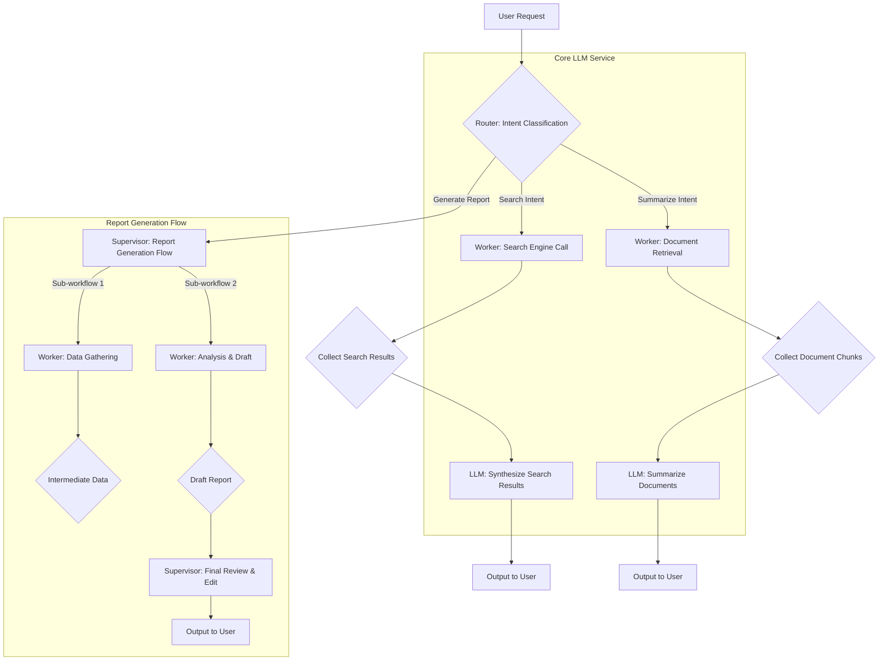

LLM 기반 서비스는 단순한 질의응답을 넘어 복잡한 비즈니스 로직과 외부 시스템 연동을 요구하며 빠르게 진화하고 있습니다. 이러한 복잡성을 효율적으로 관리하고 재사용 가능한 아키텍처를 구축하기 위해 'Harness 디자인 패턴'은 필수적입니다. Harness는 LLM 호출, 외부 도구 사용, 조건부 로직, 상태 관리 등을 유기적으로 연결하여 안정적이고 확장 가능한 AI 워크플로우를 구현하는 프레임워크 또는 구조를 의미합니다. 특히 2026년 현재, 기업들은 LLM 기반 서비스의 프로덕션 안정성과 운영 효율성을 극대화하는 데 주력하고 있으며, 이를 위해 견고한 워크플로우 오케스트레이션이 핵심 과제로 부상하고 있습니다.

## Harness 핵심 개념 및 디자인 패턴

복잡한 LLM 워크플로우를 위한 Harness는 다음 핵심 요소와 패턴을 중심으로 설계됩니다.

### 1. 모듈형 워크플로우 컴포넌트 (Modular Workflow Components)
각 LLM 호출, 데이터 처리, 외부 API 연동 등의 단일 작업을 재사용 가능한 모듈로 분리합니다. 이는 가독성과 유지보수성을 높이고, 특정 컴포넌트 변경의 영향을 최소화합니다.

### 2. 오케스트레이션 레이어 (Orchestration Layer)
워크플로우의 흐름을 정의하고 관리하는 중앙 제어 유닛입니다. LLM의 응답, 외부 도구 결과, 또는 사전 정의된 규칙에 따라 다음 단계를 결정하고 상태를 추적합니다. 'LLM-as-Orchestrator' 패턴은 LLM 자체를 복잡한 의사결정의 주체로 활용합니다.

### 3. 탄력성 및 관측성 (Resilience & Observability)
생산 환경 안정성을 위해 재시도 로직, 회로 차단기 (Circuit Breaker), 타임아웃 설정을 통해 실패 지점을 격리하고 복구합니다. 상세 로깅, 추적 (tracing), 모니터링은 문제 진단과 성능 최적화에 필수적입니다.

### 주요 디자인 패턴
*   **시퀀서 패턴 (Sequencer Pattern)**: 정해진 순서로 LLM 호출과 도구 사용을 선형적으로 실행합니다. 간단한 작업에 적합합니다.
*   **라우터 패턴 (Router Pattern)**: LLM 출력 또는 특정 조건을 기반으로 워크플로우의 다음 경로를 동적으로 결정합니다. 사용자 의도에 따라 다른 하위 워크플로우를 호출하는 데 사용됩니다.
*   **감독자-작업자 패턴 (Supervisor-Worker Pattern)**: 복잡하거나 장기 실행되는 작업을 여러 '작업자 (Worker)' LLM 에이전트에 위임하고, '감독자 (Supervisor)' 에이전트가 전체 진행 상황을 모니터링하고 조정합니다. 분산 처리와 병렬 실행에 유용합니다.
*   **도구 추상화 패턴 (Tool Abstraction Pattern)**: LLM이 사용할 외부 도구 (API, DB, 코드 실행기 등)를 표준화된 인터페이스로 래핑하여, LLM이 내부 구현을 몰라도 효과적으로 활용할 수 있도록 합니다.

이러한 패턴들을 조합하여 유연하고 강력한 LLM 기반 서비스를 구축할 수 있습니다.



### Harness 패턴 구현 예시 (Python)
아래는 간단한 `Router` 패턴과 `Tool Abstraction`을 결합하여 사용자 의도에 따라 다른 LLM과 도구를 동적으로 호출하는 개념적 예시입니다.

```python
from typing import Dict, Any

class MockLLM:
    def __call__(self, prompt: str) -> str:
        if "classify intent" in prompt:
            return "search" if "search for" in prompt else ("summarize" if "summarize this" in prompt else "general")
        return f"LLM processed: {prompt}"

class MockSearchTool:
    def execute(self, query: str) -> str:
        return f"Results for '{query}' from web."

class MockSummarizeTool:
    def execute(self, content: str) -> str:
        return f"Summary of: {content[:50]}..."

class LLMWorkflowRouterHarness:
    def __init__(self):
        self.llm = MockLLM()
        self.tools = {"search": MockSearchTool(), "summarize": MockSummarizeTool()}

    def run_workflow(self, user_query: str, doc_content: str = "") -> str:
        intent = self.llm(f"classify intent for: {user_query}")

        if intent == "search":
            search_results = self.tools["search"].execute(user_query)
            return self.llm(f"Synthesize: {search_results}")
        elif intent == "summarize" and doc_content:
            summary = self.tools["summarize"].execute(doc_content)
            return self.llm(f"Elaborate: {summary}")
        else:
            return self.llm(f"Handle general query: {user_query}")

# Usage
harness = LLMWorkflowRouterHarness()
print(harness.run_workflow("search for latest AI trends"))
print(harness.run_workflow("summarize this document", doc_content="A very long text about LLMs..."))
```
이 코드는 LLM을 이용해 의도를 분류하고, 해당 의도에 맞는 도구와 LLM 호출을 오케스트레이션하는 Harness의 핵심 원리를 보여줍니다.

## 트레이드오프 (Trade-offs)
LLM 워크플로우 Harness 패턴 적용 시 고려할 트레이드오프는 다음과 같습니다.

*   **모듈성 vs. 초기 개발 복잡성**:
    *   **언제 좋은가**: 재사용성과 유지보수성이 중요하고, 장기적인 서비스 확장을 계획할 때 유리합니다.
    *   **언제 나쁜가**: 단순한 단일 목적 서비스나 MVP 개발 단계에서는 과도한 오버헤드가 될 수 있습니다.
*   **유연한 오케스트레이션 vs. 성능 오버헤드**:
    *   **언제 좋은가**: 동적인 경로 결정, 조건부 로직이 필요한 복잡한 워크플로우에 강력합니다.
    *   **언제 나쁜가**: 각 단계 오케스트레이션에 추가 지연 시간이 발생할 수 있어, 극도로 낮은 지연 시간이 요구되는 서비스에는 최적화가 필수적입니다.
*   **강력한 오류 처리 vs. 리소스 소비**:
    *   **언제 좋은가**: 프로덕션 환경의 안정성과 가용성을 극대화하며, 예측 불가능한 LLM 응답이나 외부 시스템 장애에 강건하게 대응할 때 좋습니다.
    *   **언제 나쁜가**: 정교한 재시도, 회로 차단기 등은 추가 컴퓨팅 리소스와 개발 시간을 소비합니다.

## 실전 체크리스트 (Practical Checklist)
LLM Harness 패턴을 적용할 때 다음 항목들을 검증하십시오.

- [ ] **워크플로우 상태 관리**: 각 단계의 중간 상태가 명확히 정의되고, 영속적으로 저장되며, 복구 가능한가?
- [ ] **오류 처리 및 재시도 전략**: LLM API 실패, 외부 도구 오류 등 다양한 실패 시나리오에 대한 재시도 및 Circuit Breaker 패턴이 구현되어 있는가?
- [ ] **관측성 (Observability)**: 모든 워크플로우 단계별로 상세 로깅 (입력, 출력, 토큰 사용량, 지연 시간), 추적, 메트릭이 수집되고 시각화되는가?
- [ ] **도구 통합 표준화**: 외부 도구 연동이 추상화된 인터페이스를 통해 일관된 방식으로 이루어지며, 새로운 도구 추가가 용이한가?
- [ ] **보안 및 접근 제어**: LLM API 키, 자격 증명 등이 안전하게 관리되고, 각 단계의 권한이 최소 원칙에 따라 분리되어 있는가?
- [ ] **버전 관리 및 배포**: 워크플로우 정의, 프롬프트 등 모든 컴포넌트가 버전 관리되고, 안전하게 배포되는 CI/CD 파이프라인이 구축되어 있는가?

이 체크리스트는 Harness 아키텍처의 견고성과 운영 효율성을 확보하는 데 중요한 기준점이 될 것입니다.