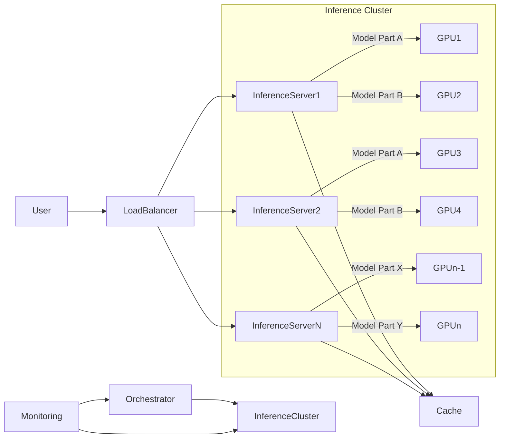

대규모 언어 모델 (LLM: Large Language Model)을 프로덕션 환경에서 안정적이고 비용 효율적으로 운영하는 것은 매우 중요한 과제입니다. 특히 수백억 개 이상의 파라미터를 가진 LLM은 단일 서버의 컴퓨팅 자원으로 효율적인 추론을 수행하기 어렵습니다. 이러한 제약을 극복하고 사용자 요청에 대한 낮은 지연 시간(low-latency)과 높은 처리량(high-throughput)을 보장하기 위해 분산 추론 시스템(Distributed Inference System) 설계는 필수적입니다. 이 문서는 대규모 LLM 워크플로우를 위한 분산 추론 시스템의 핵심 설계 원칙과 아키텍처 패턴을 다룹니다.

## 핵심 개념: LLM 분산 추론의 필요성
2026년 현재, LLM의 모델 크기는 지속적으로 증가하고 있으며, 이에 따라 필요한 컴퓨팅 자원도 기하급수적으로 늘어나고 있습니다. 단일 GPU 메모리에 전체 모델을 로드하는 것이 불가능하거나, 요청 처리 시간이 비현실적으로 길어지는 경우가 많습니다. 분산 추론은 모델을 여러 디바이스나 서버에 분할하여 로드하고, 추론 과정을 병렬화함으로써 이러한 문제를 해결합니다. 이는 모델 병렬화(Model Parallelism), 데이터 병렬화(Data Parallelism) 등의 기술을 포함합니다.

### 모델 병렬화 (Model Parallelism)
모델 병렬화는 거대한 LLM을 여러 개의 작은 부분으로 나누어 각각 다른 디바이스에 로드하고, 이들이 협력하여 하나의 추론 요청을 처리하는 방식입니다.

*   **텐서 병렬화 (Tensor Parallelism)**: 모델의 개별 레이어 내에서 텐서 연산을 여러 디바이스에 분산합니다. 예를 들어, 행렬 곱셈의 행 또는 열을 분할하여 여러 GPU가 병렬로 처리합니다. 이는 높은 통신 오버헤드를 가질 수 있으므로 고속 인터커넥트(예: NVLink, InfiniBand)가 필수적입니다.
*   **파이프라인 병렬화 (Pipeline Parallelism)**: 모델의 레이어를 여러 스테이지로 나누고, 각 스테이지를 다른 디바이스에 할당합니다. 이전 스테이지의 출력이 다음 스테이지의 입력으로 전달되는 파이프라인 형태로 추론이 진행됩니다. 이는 텐서 병렬화 대비 통신량이 적지만, 파이프라인 버블(pipeline bubble)로 인한 유휴 시간(idle time)이 발생할 수 있습니다. 이를 완화하기 위해 마이크로배치(micro-batching) 기법이 사용됩니다.

### 데이터 병렬화 (Data Parallelism)
데이터 병렬화는 동일한 모델 복사본을 여러 디바이스에 로드하고, 각각 다른 입력 데이터를 병렬로 처리하는 방식입니다. 주로 배치 추론(batch inference) 시 효율적이며, 각 디바이스가 독립적으로 추론을 수행하므로 통신 오버헤드가 상대적으로 낮습니다. 사용자 요청이 폭증할 때 처리량을 늘리는 데 효과적입니다.

## 분산 추론 시스템 아키텍처
대규모 LLM 분산 추론 시스템은 일반적으로 다음 구성 요소를 포함합니다.

*   **로드 밸런서 (Load Balancer)**: 인바운드 추론 요청을 여러 추론 서버에 분배합니다. 요청 부하, 서버 상태, 모델 가용성 등을 고려하여 최적의 서버를 선택합니다.
*   **추론 서버 (Inference Servers)**: 모델의 일부 또는 전체를 로드하고 실제 추론을 수행합니다. GPU와 같은 가속기를 포함하며, 모델 병렬화 또는 데이터 병렬화를 지원하는 런타임을 사용합니다 (예: Ray, DeepSpeed, vLLM, TensorRT-LLM).
*   **오케스트레이터 (Orchestrator)**: 분산 추론 작업의 생명 주기를 관리하고, 모델 파티셔닝, 리소스 할당, 장애 복구 등을 담당합니다. Kubernetes, Ray Serve와 같은 도구가 활용될 수 있습니다.
*   **캐싱 레이어 (Caching Layer)**: 자주 발생하는 동일한 요청에 대한 응답을 캐시하여 추론 지연 시간을 줄이고 컴퓨팅 자원 사용을 최적화합니다.
*   **모니터링 및 로깅 (Monitoring & Logging)**: 시스템의 성능 지표(latency, throughput, resource utilization), 오류, 로그 등을 수집하여 문제 진단 및 성능 최적화에 활용합니다.

다음 Mermaid 다이어그램은 일반적인 분산 LLM 추론 시스템의 아키텍처를 보여줍니다.



## 2026년 최신 트렌드: 효율성 및 최적화
최근 LLM 분산 추론의 트렌드는 다음과 같습니다.

*   **지속적인 배치 처리 (Continuous Batching)**: 전통적인 배치 처리의 비효율성(짧은 시퀀스 요청 시 GPU 유휴 시간 증가)을 개선하여, 여러 요청을 동적으로 배치에 추가/제거하며 GPU 활용률을 극대화합니다. vLLM, TensorRT-LLM 등이 이 기능을 지원합니다.
*   **스페큘레이티브 디코딩 (Speculative Decoding)**: 작은 모델(드래프트 모델)로 먼저 토큰 시퀀스를 예측하고, 큰 모델(메인 모델)은 예측된 시퀀스가 올바른지 검증하는 방식으로 추론 속도를 향상시킵니다.
*   **Quantization 및 Sparsity**: 모델의 크기를 줄여 메모리 사용량을 절감하고 추론 속도를 높이는 기법입니다. 양자화(Quantization)는 가중치의 정밀도를 낮추고, 희소성(Sparsity)은 불필요한 가중치를 제거합니다.
*   **Serverless Inference**: AWS Lambda, Google Cloud Functions와 같은 서버리스 환경에서 LLM 추론을 수행하여 운영 복잡성을 줄이고 사용량 기반 과금을 통해 비용 효율성을 높이는 시도입니다. Cold start 문제를 완화하는 것이 중요합니다.
*   **하드웨어 가속기 최적화**: NVIDIA H100, AMD MI300X 등 최신 GPU와 AI 가속기에 특화된 소프트웨어 스택(예: CUDA, ROCm) 및 런타임(예: Triton Inference Server)을 활용하여 최대 성능을 끌어냅니다.

## 코드 예제: Ray Serve를 이용한 LLM 분산 서빙 개념
Ray Serve는 Python 기반의 분산 서빙 프레임워크로, LLM과 같은 복잡한 모델을 손쉽게 배포하고 확장할 수 있게 합니다. 아래는 간단한 LLM 서비스를 Ray Serve로 배포하는 개념적 예시입니다.

```python
import ray
from ray import serve
from transformers import pipeline

@serve.deployment(num_replicas=2, ray_actor_options={"num_cpus": 1, "num_gpus": 1})
class LLMService:
    def __init__(self):
        # 대규모 LLM 로드 (실제로는 모델 병렬화 로직이 필요)
        self.model = pipeline("text-generation", model="gpt2")

    async def __call__(self, prompt: str) -> str:
        # 모델 추론
        output = self.model(prompt, max_new_tokens=50)
        return output[0]["generated_text"]

# Ray 클러스터 초기화 (로컬 또는 분산 클러스터)
ray.init(address="auto")

# LLMService 배포
serve.run(LLMService.bind())

# 배포 확인
# print(serve.list_deployments())
# 클라이언트 요청 예시 (실제로는 HTTP 요청)
# import requests
# resp = requests.post("http://localhost:8000/", json={"prompt": "안녕하세요, AI 모델이"})
# print(resp.text)
```
이 예시는 `gpt2`와 같은 소규모 모델을 사용했지만, 실제 대규모 LLM에서는 `num_gpus`를 늘리거나, 모델 로딩 부분에서 DeepSpeed-MII, vLLM 등의 분산 추론 라이브러리를 통합하여 텐서/파이프라인 병렬화를 구현할 수 있습니다. `num_replicas`를 조정하여 데이터 병렬화를 쉽게 확장할 수 있습니다.

## 트레이드오프

*   **복잡성 vs. 성능/비용 효율성**:
    *   **언제 좋은가?**: 높은 처리량, 낮은 지연 시간, 대규모 사용자 트래픽 또는 초대형 모델 배포가 필수적인 프로덕션 환경에서 분산 추론은 성능과 비용 효율성 측면에서 단일 서버 대비 월등한 이점을 제공합니다. GPU 자원을 최적으로 활용하여 총 소유 비용(TCO: Total Cost of Ownership)을 절감할 수 있습니다.
    *   **언제 나쁜가?**: 소규모 모델, 낮은 트래픽 또는 개발/테스트 환경에서는 분산 시스템의 설계, 배포, 운영 및 디버깅 복잡성이 오히려 오버헤드로 작용합니다. 초기 설정 비용과 유지보수 비용이 증가할 수 있습니다.
*   **통신 오버헤드 vs. 병렬화 이득**:
    *   **언제 좋은가?**: 모델 병렬화(특히 텐서 병렬화)는 단일 GPU 메모리에 로드할 수 없는 매우 큰 모델을 처리할 때 필수적입니다. 고속 인터커넥트(NVLink) 환경에서는 통신 오버헤드가 최소화되어 병렬화 이득을 극대화할 수 있습니다.
    *   **언제 나쁜가?**: 통신 대역폭이 제한적이거나 네트워크 지연이 높은 환경에서는 분산된 모델 파트 간의 데이터 전송이 병목 현상을 일으켜 오히려 추론 속도를 저하시킬 수 있습니다. 특히 GPU 간 통신이 잦은 텐서 병렬화에서 두드러집니다.
*   **자원 활용률 vs. 유연성**:
    *   **언제 좋은가?**: 지속적인 배치 처리, 스페큘레이티브 디코딩과 같은 최신 최적화 기법을 사용하면 GPU 활용률을 극대화하고 유휴 시간을 줄여 비용 효율성을 높일 수 있습니다.
    *   **언제 나쁜가?**: 모델 가중치 양자화나 희소화는 모델의 표현력을 저하시켜 출력 품질에 영향을 줄 수 있습니다. 또한, 특정 최적화 기법은 특정 하드웨어 또는 런타임에 종속될 수 있어 시스템의 유연성을 떨어뜨립니다.
*   **운영 용이성 vs. 확장성**:
    *   **언제 좋은가?**: Kubernetes, Ray Serve와 같은 오케스트레이션 도구는 시스템의 자동 확장(auto-scaling), 장애 복구(fault-tolerance), 로드 밸런싱 기능을 제공하여 대규모 운영을 용이하게 합니다.
    *   **언제 나쁜가?**: 이러한 복잡한 인프라를 구축하고 관리하는 데는 전문적인 지식과 인력이 필요합니다. 또한, 분산 시스템의 디버깅은 단일 시스템보다 훨씬 어렵고 시간이 많이 소요됩니다.

## 실전 체크리스트

*   [ ] **모델 크기 및 추론 지연 시간 목표 설정**: 배포하려는 LLM의 파라미터 수와 목표 추론 지연 시간(latency), 처리량(throughput)을 명확히 정의했는가? (예: 70B 모델, 평균 500ms 지연 시간, 100 QPS)
*   [ ] **모델 병렬화 전략 선택 및 검증**: 모델을 단일 GPU에 로드할 수 없는 경우, 텐서 병렬화 또는 파이프라인 병렬화 중 어떤 전략이 환경(네트워크 대역폭, GPU 구성)에 더 적합한지 벤치마크를 통해 확인했는가?
*   [ ] **지속적인 배치 처리 적용 여부 검토**: vLLM, TensorRT-LLM과 같은 최신 런타임을 사용하여 GPU 유휴 시간을 줄이고 처리량을 극대화하는 `continuous batching`을 고려하고 있는가?
*   [ ] **캐싱 전략 구현 및 효과 측정**: 반복되는 프롬프트나 예측 가능한 응답에 대해 캐싱 레이어를 적용하고, 캐시 적중률(cache hit rate) 및 지연 시간 개선 효과를 측정하고 있는가?
*   [ ] **모니터링 및 알림 시스템 구축**: GPU 활용률, 메모리 사용량, 요청 지연 시간, 오류율 등 핵심 지표를 실시간으로 모니터링하고, 임계치 초과 시 알림을 받을 수 있는 시스템을 구축했는가?
*   [ ] **장애 복구 및 고가용성 설계**: 특정 추론 서버나 GPU에 장애가 발생했을 때, 서비스 중단 없이 자동으로 다른 리소스로 전환되는 `fault-tolerance` 및 `high-availability` 전략을 설계하고 테스트했는가?
*   [ ] **비용 최적화 방안 적용**: 모델 양자화(quantization), 스페큘레이티브 디코딩(speculative decoding) 등 성능 저하를 최소화하면서 추론 비용을 절감할 수 있는 최적화 기법을 적용했거나 검토 중인가?