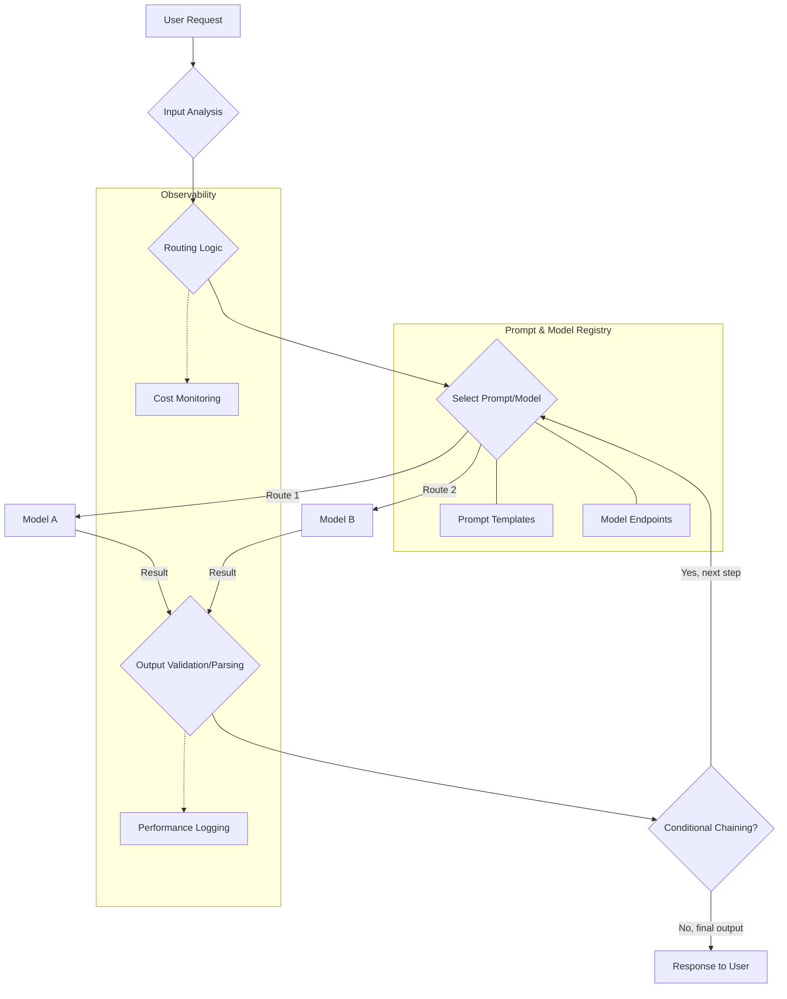

LLM 모델의 다양성과 현대 AI 애플리케이션의 복잡성이 증가함에 따라, 추론 워크플로우를 관리하기 위한 정교한 전략이 필수적입니다. 프롬프트 시퀀스를 효율적으로 오케스트레이션하고(체이닝) 최적의 모델 또는 프롬프트 변형을 적응적으로 선택하는(라우팅) 능력은 핵심 역량으로 부상하고 있습니다. 이 문서는 동적 프롬프트 체이닝 및 라우팅 하네스(harness)를 구축하기 위한 아키텍처 및 구현 고려사항을 제시합니다.

### 동적 프롬프트 체이닝 및 라우팅의 필요성

2026년에는 다양한 LLM 모델과 복잡한 프롬프트 조합을 유연하게 관리하고 최적화하는 능력이 핵심 실무 역량이 될 것입니다. 정적이고 하드코딩된 프롬프트 시퀀스나 단일 모델 배포는 유연성, 비용 효율성, 다양한 작업에 걸친 최적의 성능이 요구되는 시나리오에서는 불충분합니다. 동적 하네스는 다음과 같은 민첩성을 제공합니다:

*   **비용 최적화**: 간단한 작업에는 더 작고 저렴한 모델로 요청을 라우팅하고, 복잡한 작업에는 더 강력한 모델을 사용합니다.
*   **성능 향상**: 특정 하위 작업에 탁월한 전문 모델을 활용하여 지연 시간을 줄이고 출력 품질을 개선합니다.
*   **신뢰성 개선**: 실패 또는 성능 저하 시 모델이나 프롬프트 전략을 전환하는 폴백(fallback) 메커니즘을 구현합니다.
*   **실험 가속화**: 코드 재배포 없이 다양한 프롬프트, 모델, 체인을 쉽게 A/B 테스트할 수 있습니다.

### 동적 하네스의 핵심 구성요소

동적 프롬프트 체이닝 및 라우팅 하네스는 일반적으로 여러 핵심 구성요소로 이루어집니다:

1.  **프롬프트 레지스트리 (Prompt Registry)**: 프롬프트 템플릿, 버전, 메타데이터(예: 관련 모델, 예상 입력/출력, 비용 프로필)를 관리하기 위한 중앙 집중식 저장소입니다.
2.  **모델 게이트웨이/프록시 (Model Gateway/Proxy)**: OpenAI, Anthropic, Google Gemini 등 다양한 LLM 공급자의 API 호출을 표준화하는 추상화 계층으로, 인증, 속도 제한, 응답 파싱 등을 처리합니다.
3.  **라우터 (Router)**: 주어진 입력에 대해 어떤 프롬프트와 모델을 사용할지 결정하는 의사결정 엔진입니다. 입력 특성, 사용자 프로필, 비용 제약 또는 성능 메트릭을 기반으로 작동할 수 있습니다.
4.  **체이너/오케스트레이터 (Chainer/Orchestrator)**: 프롬프트 호출의 시퀀스를 관리하고, 중간 결과를 단계 간에 전달하며, 변환을 적용하고, 조건부 로직을 처리합니다.
5.  **관측 가능성 및 분석 (Observability & Analytics)**: 추론 비용, 지연 시간, 정확도, 모델 사용량 등을 모니터링하여 최적화 데이터를 제공하는 도구입니다.

### 동적 워크플로우 예시

전형적인 동적 프롬프트 체이닝 및 라우팅 워크플로우를 보여주는 Mermaid 다이어그램입니다:



### 하네스 구축: 실전 구현

이러한 하네스를 구현하려면 유연성과 확장성을 고려한 신중한 설계가 필요합니다.

#### 1. 프롬프트 및 모델 추상화

프롬프트와 모델에 대한 명확한 인터페이스를 정의합니다.

```python
from abc import ABC, abstractmethod
from typing import Dict, Any, List

# Model Abstraction
class LLMModel(ABC):
    def __init__(self, name: str, cost_per_token: float):
        self.name = name
        self.cost_per_token = cost_per_token

    @abstractmethod
    def invoke(self, prompt: str, **kwargs) -> str:
        pass

class OpenAIModel(LLMModel):
    def __init__(self, model_id: str, api_key: str, cost_per_token: float):
        super().__init__(model_id, cost_per_token)
        # self.client = OpenAI(api_key=api_key) # 실제 클라이언트 초기화
        print(f"Initialized OpenAI Model: {model_id}")

    def invoke(self, prompt: str, **kwargs) -> str:
        # API 호출 시뮬레이션
        print(f"Calling OpenAI {self.name} with prompt: {prompt[:50]}...")
        return f"OpenAI({self.name}) response for '{prompt[:20]}...'"

# Prompt Template Management
class PromptTemplate:
    def __init__(self, template_id: str, template_string: str, default_model: str):
        self.template_id = template_id
        self.template_string = template_string
        self.default_model = default_model

    def format(self, **kwargs) -> str:
        return self.template_string.format(**kwargs)

# Example Usage:
# openai_gpt4 = OpenAIModel("gpt-4-turbo", "sk-...", 0.03)
# intro_prompt = PromptTemplate("intro_gen", "Generate an introduction for {topic}.", "gpt-4-turbo")
# print(intro_prompt.format(topic="dynamic prompting"))
```

#### 2. 동적 라우터

라우터는 규칙, 메타데이터, 또는 작고 빠른 LLM을 사용하여 다음 단계를 결정할 수 있습니다.

```python
class DynamicRouter:
    def __init__(self, models: Dict[str, LLMModel], prompts: Dict[str, PromptTemplate]):
        self.models = models
        self.prompts = prompts

    def route_and_invoke(self, task_type: str, input_data: Dict[str, Any]) -> str:
        selected_prompt_id = None
        selected_model_name = None

        if task_type == "summarization":
            if len(input_data.get("text", "")) < 200:
                selected_prompt_id = "short_summary"
                selected_model_name = "gpt-3.5-turbo" # 짧은 텍스트에 저렴한 모델
            else:
                selected_prompt_id = "long_summary"
                selected_model_name = "gpt-4-turbo" # 긴 텍스트에 더 유능한 모델
        elif task_type == "qa":
            selected_prompt_id = "qa_answer"
            selected_model_name = "gpt-4-turbo"
        else:
            raise ValueError(f"Unknown task type: {task_type}")

        if not selected_prompt_id or not selected_model_name:
            raise ValueError("Routing failed to select prompt or model.")

        prompt_template = self.prompts[selected_prompt_id]
        model = self.models[selected_model_name]

        formatted_prompt = prompt_template.format(**input_data)
        response = model.invoke(formatted_prompt)
        return response

# Initialize components
models = {
    "gpt-3.5-turbo": OpenAIModel("gpt-3.5-turbo", "sk-...", 0.001),
    "gpt-4-turbo": OpenAIModel("gpt-4-turbo", "sk-...", 0.03)
}
prompts = {
    "short_summary": PromptTemplate("short_summary", "Summarize this in one sentence: {text}", "gpt-3.5-turbo"),
    "long_summary": PromptTemplate("long_summary", "Provide a detailed summary of: {text}", "gpt-4-turbo"),
    "qa_answer": PromptTemplate("qa_answer", "Answer the question: {question} based on context: {context}", "gpt-4-turbo")
}

router = DynamicRouter(models, prompts)

# Example: Dynamic Routing
short_text_response = router.route_and_invoke("summarization", {"text": "This is a very short text about AI. It needs a quick summary."})
print(f"Short text response: {short_text_response}")

long_text_response = router.route_and_invoke("summarization", {"text": "Longer text that requires more processing power and detailed summarization. Imagine this is a full article about the advancements in LLM technology and its impact on software development workflows, highlighting the importance of dynamic prompt chaining and intelligent routing for optimizing costs and performance in complex enterprise environments. The future of AI integration heavily relies on flexible and adaptive inference pipelines."})
print(f"Long text response: {long_text_response}")
```

#### 3. 체이너/워크플로우 오케스트레이터

다단계 프로세스의 경우, 체이너는 흐름을 오케스트레이션합니다.

```python
class WorkflowChainer:
    def __init__(self, router: DynamicRouter):
        self.router = router

    def execute_qa_workflow(self, question: str, document_text: str) -> str:
        # Step 1: Summarize document (라우터의 요약 로직 사용)
        summary = self.router.route_and_invoke("summarization", {"text": document_text})
        print(f"Intermediate Summary: {summary}")

        # Step 2: Answer question based on summary (라우터의 QA 로직 사용)
        answer = self.router.route_and_invoke("qa", {"question": question, "context": summary})
        return answer

# Example: Chained Workflow
chainer = WorkflowChainer(router)
document = "The latest AI advancements include multimodal models. These models can process text, images, and audio, leading to more robust applications. Dynamic prompt chaining helps integrate these diverse capabilities efficiently."
user_question = "What are the latest AI advancements mentioned?"
final_answer = chainer.execute_qa_workflow(user_question, document)
print(f"Final Answer: {final_answer}")
```

이 동적 접근 방식은 유연성을 향상시킬 뿐만 아니라 A/B 테스트, 점진적 롤아웃, 자동 모델 성능 저하 처리와 같은 고급 기능의 기반을 마련합니다. 2026년에는 다양한 LLM 서비스와 맞춤형 프롬프트 엔지니어링 전략을 관리하는 복잡성으로 인해 이러한 강력한 하네스 엔지니어링이 필수적이 될 것입니다.

## 트레이드오프

*   **초기 설정 복잡성 (Initial Setup Complexity) vs. 장기적 유연성 (Long-term Flexibility)**
    *   **언제 좋음**: 다양한 LLM 모델(예: Claude, Gemini, GPT)을 사용하거나, 동일 모델 내에서 프롬프트 버전을 자주 변경해야 하는 복잡한 시스템에 적합합니다. 장기적으로 유지보수 비용과 새로운 기능 추가의 용이성이 크게 향상됩니다.
    *   **언제 나쁨**: 단일 LLM 모델과 고정된 프롬프트 몇 개만 사용하는 간단한 애플리케이션에는 과도한 오버헤드가 발생할 수 있습니다. 초기 개발 시간이 길어지고 불필요한 추상화가 복잡성을 높입니다.

*   **추론 지연 증가 (Increased Inference Latency) vs. 최적화된 리소스 사용 (Optimized Resource Utilization)**
    *   **언제 좋음**: 여러 라우팅 및 체이닝 로직 단계로 인해 약간의 지연이 발생할 수 있지만, 이를 통해 더 저렴하거나 특정 작업에 최적화된 모델을 선택하여 전체 비용을 절감하고, 리소스 활용 효율을 극대화해야 하는 시나리오에 유리합니다. 배치 처리나 비동기 워크플로우에 적합합니다.
    *   **언제 나쁨**: 밀리초 단위의 응답 시간이 critical한 실시간 상호작용 애플리케이션(예: 실시간 챗봇의 사용자 응답)에는 각 라우팅/체이닝 단계의 오버헤드가 누적되어 사용자 경험에 부정적인 영향을 줄 수 있습니다.

*   **디버깅 복잡성 (Debugging Complexity) vs. 워크플로우 가시성 (Workflow Visibility)**
    *   **언제 좋음**: 동적 체이닝과 라우팅은 복잡한 논리 흐름을 만들어 디버깅을 어렵게 할 수 있지만, 잘 설계된 하네스는 각 단계의 입력, 출력, 모델 선택을 로깅하고 추적하여 워크플로우의 투명성을 높입니다. 이는 복잡한 에이전트 시스템이나 다단계 의사결정 프로세스에서 문제 발생 시 원인 분석에 필수적입니다.
    *   **언제 나쁨**: 로깅 및 모니터링 시스템이 제대로 갖춰지지 않으면, 논리적 분기가 많아질수록 특정 오류 지점을 찾아내기 매우 어려워집니다. 추상화 계층이 너무 깊어지면 실제 문제의 근원을 파악하는 데 시간이 오래 걸릴 수 있습니다.

*   **결정론적 예측 어려움 (Difficulty in Deterministic Prediction) vs. 적응성 및 회복력 (Adaptability and Resilience)**
    *   **언제 좋음**: 동적 라우팅은 환경 변화(예: 모델 API 다운, 새로운 모델 출시, 비용 변동)에 시스템이 유연하게 대응하고 자동으로 최적의 경로를 찾아 회복력을 높여야 할 때 유용합니다. 이는 예측 불가능한 운영 환경에서 안정적인 서비스를 제공하는 데 필수적입니다.
    *   **언제 나쁨**: 엄격한 출력 일관성이나 재현성이 요구되는 감사 로그, 규제 준수 시스템과 같이 '블랙박스' 결정이 허용되지 않고 예측 가능한 결과를 보장해야 하는 경우, 동적 라우팅의 비결정적 특성이 문제가 될 수 있습니다. 각 결정 경로에 대한 명확한 추적 및 검증이 필요합니다.

## 실전 체크리스트

프로젝트에 동적 프롬프트 체이닝 및 라우팅 하네스를 적용할 때 다음 항목들을 검증하십시오.

- [ ] **Prompt Registry 정합성**: 모든 프롬프트 템플릿이 버전 관리되고 있으며, 각 프롬프트에 연결된 모델, 예상 입력/출력 스키마, 비용 정보가 명확히 정의되어 있는가?
- [ ] **모델 추상화 계층 유연성**: 새로운 LLM 모델(예: Anthropic Claude, Google Gemini)이 추가될 때, 기존 라우팅 로직의 코드 변경 없이 모델 게이트웨이만 확장하여 통합할 수 있는가?
- [ ] **동적 라우팅 규칙 투명성 및 검증 가능성**: 라우팅 결정(어떤 프롬프트, 어떤 모델)이 어떤 비즈니스 로직(예: 입력 길이, 비용 상한, 성능 요구사항)에 따라 이루어졌는지 추적 가능하며, 이를 자동화된 테스트로 검증할 수 있는가?
- [ ] **체이닝 워크플로우 실패 처리 로직**: 체인 내의 특정 단계에서 LLM 호출이 실패하거나 유효하지 않은 출력을 반환할 경우, 적절한 재시도, 폴백 모델 사용, 또는 오류 메시지 전파 메커니즘이 구현되어 있는가?
- [ ] **비용 및 성능 모니터링 시스템**: 각 프롬프트 호출 및 모델 추론 단계별로 소요 시간, 토큰 사용량, 실제 비용이 실시간으로 집계 및 시각화되며, 이상 징후 발생 시 경고 시스템이 작동하는가?
- [ ] **A/B 테스트 및 실험 기능**: 새로운 프롬프트 버전, 라우팅 규칙, 또는 모델이 기존 워크플로우에 영향을 주지 않으면서 실제 트래픽의 일부에 대해 A/B 테스트를 수행하고 그 결과를 비교 분석할 수 있는 인프라가 갖춰져 있는가?
- [ ] **보안 및 접근 제어**: 프롬프트 템플릿, 모델 API 키, 중간 데이터에 대한 접근이 역할 기반 접근 제어(RBAC)를 통해 통제되며, 민감한 정보는 적절히 마스킹되거나 암호화되는가?