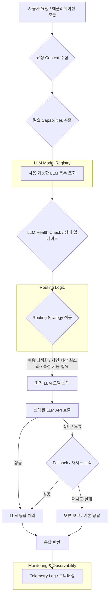

2026년, 거대 언어 모델 (LLM: Large Language Model) 생태계는 빠르게 진화하고 있으며, 단일 모델에 대한 의존성은 기술 부채와 비효율성을 초래할 수 있습니다. 각 LLM은 고유한 강점과 약점, 비용 구조, 지연 시간 특성 및 특정 작업에 대한 적합성을 가집니다. 예를 들어, `gpt-4o`는 복잡한 추론에 뛰어나지만 비용이 높을 수 있고, `gemini-flash`는 빠른 응답 속도가 필요한 애플리케이션에 적합합니다.

이러한 복잡한 LLM 환경에 유연하게 대응하기 위한 핵심 패턴이 바로 동적 라우팅 하네스 (Dynamic Routing Harness)입니다. 동적 라우팅 하네스는 애플리케이션이 특정 LLM에 종속되지 않고, 런타임에 최적의 모델을 지능적으로 선택하고 전환할 수 있도록 지원하는 추상화 계층이자 제어 메커니즘입니다.

## 동적 라우팅 하네스의 핵심 개념

### 1. 모델 추상화 계층 (Model Abstraction Layer)
애플리케이션과 개별 LLM 공급자 API 사이에 표준화된 인터페이스를 제공합니다. 이를 통해 애플리케이션 코드는 특정 LLM 클라이언트나 API 호출 방식에 묶이지 않고, 일반적인 `generate(prompt, config)`와 같은 메서드를 통해 모든 LLM에 접근할 수 있습니다. 이는 모델 전환 시 애플리케이션 코드 변경을 최소화하고 공급자 종속성 (vendor lock-in)을 줄이는 데 필수적입니다.

### 2. 라우팅 전략 (Routing Strategy)
요청의 `context`와 사용 가능한 LLM의 `capabilities`를 기반으로 최적의 모델을 선택하는 로직입니다. 주요 전략은 다음과 같습니다:

*   **규칙 기반 (Rule-based Routing)**: 특정 키워드, 사용자 역할, 요청 유형 (예: `code generation`, `creative writing`, `summarization`) 또는 비즈니스 로직에 따라 모델을 미리 정의된 규칙에 따라 라우팅합니다. 예를 들어, 보안 관련 질문은 내부 파인튜닝 모델로, 일반적인 질문은 비용 효율적인 모델로 라우팅할 수 있습니다.
*   **메타데이터 기반 (Metadata-based Routing)**: 각 모델에 `cost`, `latency`, `capability_score`, `security_level` 등의 메타데이터를 부여하고, 요청 시 이러한 메타데이터를 비교하여 최적의 모델을 선택합니다. 2026년에는 이 메타데이터가 실시간으로 업데이트되는 추세입니다.
*   **성능/비용 최적화 기반 (Performance/Cost Optimization-based Routing)**: 실시간 모니터링 데이터를 활용하여 현재 `latency`가 가장 낮은 모델, `cost`가 가장 저렴한 모델, 또는 특정 `throughput` 목표를 달성할 수 있는 모델로 동적으로 전환합니다. 이는 클라우드 비용을 절감하고 사용자 경험을 향상시키는 데 기여합니다.
*   **학습 기반 (ML-driven Routing)**: 과거 데이터를 통해 어떤 모델이 특정 `prompt`에 대해 가장 좋은 성능 (`accuracy`, `relevance`) 또는 효율성 (`cost`, `latency`)을 보였는지 학습하여 예측 기반으로 라우팅합니다. A/B 테스트 및 카나리 배포 전략과 결합하여 점진적인 최적화를 가능하게 합니다.

### 3. 헬스 체크 및 폴백 (Health Checks & Fallback)
모델의 가용성과 성능을 주기적으로 확인하는 `health check` 메커니즘을 포함해야 합니다. 특정 LLM이 응답하지 않거나 오류율이 임계치를 초과할 경우, 자동으로 다른 건강한 모델로 `fallback`하는 기능을 통해 시스템의 견고성 (resilience)을 확보합니다. `Circuit Breaker` 패턴을 적용하여 장애 모델에 대한 연속적인 요청을 방지할 수 있습니다.

### 4. 텔레메트리 및 모니터링 (Telemetry & Monitoring)
모든 LLM 호출에 대한 `latency`, `cost`, `error rate`, `token usage`, `model selection` 등의 지표를 수집하고 `monitoring`하는 것은 필수적입니다. 이 데이터는 라우팅 전략을 개선하고, `trade-off`를 평가하며, 잠재적인 문제를 진단하는 데 중요한 통찰력을 제공합니다.

## 구현 패턴

### 1. API 게이트웨이 패턴 (API Gateway Pattern)
애플리케이션의 모든 LLM 요청이 단일 `API Gateway`를 통해 이루어지며, 게이트웨이에서 라우팅 로직을 처리합니다. 이는 중앙 집중식 제어와 관리가 용이하다는 장점이 있습니다.

### 2. 사이드카 프록시 패턴 (Sidecar Proxy Pattern)
각 애플리케이션 인스턴스 옆에 `Sidecar proxy`로 라우팅 로직을 배포합니다. 애플리케이션은 로컬 사이드카에 요청하고, 사이드카가 LLM으로 라우팅합니다. `latency`가 낮고 독립적인 배포가 가능하지만, 각 인스턴스에 대한 리소스 소비가 증가할 수 있습니다.

### 3. 중앙 집중식 오케스트레이터 (Centralized Orchestrator)
별도의 `Orchestration service`가 모든 LLM의 가용성, 성능, 비용 정보를 관리하고, 애플리케이션의 요청에 따라 최적의 모델을 추천하거나 직접 라우팅합니다. 복잡한 글로벌 최적화에 유리하지만, 추가적인 네트워크 홉 (network hop)이 발생할 수 있습니다.

## 코드 예시: Python 동적 LLM 라우터

```python
import os
import time
import random
from typing import Dict, Any, List, Tuple

class LLMProvider:
    def __init__(self, name: str, cost_per_token: float, latency_ms: int, capabilities: List[str], max_tokens: int):
        self.name = name
        self.cost_per_token = cost_per_token
        self.latency_ms = latency_ms # Average latency
        self.capabilities = set(capabilities)
        self.health = True
        self.last_checked = time.time()
        self.error_rate = 0.0
        self.max_tokens = max_tokens

    def invoke(self, prompt: str, **kwargs) -> Dict[str, Any]:
        # Simulate LLM call with potential failure and variable latency
        if not self.health or random.random() < self.error_rate:
            raise ConnectionError(f"LLM {self.name} is unhealthy or failed.")
        
        simulated_latency = self.latency_ms + random.randint(-50, 50) # Simulate variation
        time.sleep(simulated_latency / 1000.0)
        
        response_tokens = min(self.max_tokens, len(prompt.split()) * 2) # Simple token estimation
        actual_cost = self.cost_per_token * response_tokens
        
        print(f"-> {self.name} invoked with latency {simulated_latency}ms, cost {actual_cost:.6f}")
        return {
            "model": self.name,
            "response": f"Generated by {self.name} for: {prompt[:50]}...",
            "tokens": response_tokens,
            "cost": actual_cost,
            "latency_ms": simulated_latency
        }

    def update_health(self, is_healthy: bool, error_rate: float = 0.0):
        self.health = is_healthy
        self.error_rate = error_rate
        self.last_checked = time.time()

class DynamicLLMRouter:
    def __init__(self):
        self.models: Dict[str, LLMProvider] = {}

    def register_model(self, model: LLMProvider):
        self.models[model.name] = model
        print(f"Model {model.name} registered.")

    def _check_model_health(self):
        # Simulate background health checks
        for model_name, model in list(self.models.items()):
            if time.time() - model.last_checked > 10: # Check every 10 seconds
                is_healthy = random.random() > 0.1 # 10% chance of being unhealthy
                error_rate = 0.2 if not is_healthy else 0.0
                model.update_health(is_healthy, error_rate)
                print(f"[Health Check] Model {model.name}: Healthy={is_healthy}, Error Rate={error_rate}")

    def choose_model(self, prompt_context: Dict[str, Any], required_capabilities: List[str] = None) -> LLMProvider:
        self._check_model_health() # Perform health checks before routing
        
        available_models = []
        for model in self.models.values():
            if model.health:
                if required_capabilities:
                    if all(cap in model.capabilities for cap in required_capabilities):
                        available_models.append(model)
                else:
                    available_models.append(model)

        if not available_models:
            raise RuntimeError("No healthy LLM models available matching capabilities.")

        # Example Routing Strategy: Prioritize by capability, then cost, then latency
        # Let's say we prioritize 'code_gen' if needed, otherwise cheapest, then fastest
        
        if "priority_capability" in prompt_context and prompt_context["priority_capability"]:
            preferred_cap = prompt_context["priority_capability"]
            capable_models = [m for m in available_models if preferred_cap in m.capabilities]
            if capable_models:
                # Among capable, choose cheapest
                capable_models.sort(key=lambda m: m.cost_per_token)
                print(f"[Routing] Prioritizing '{preferred_cap}'. Selected {capable_models[0].name}.")
                return capable_models[0]
        
        # Fallback: choose the cheapest overall if no specific capability needed or found
        available_models.sort(key=lambda m: m.cost_per_token)
        print(f"[Routing] No specific capability. Selected cheapest: {available_models[0].name}.")
        return available_models[0]

    def process_request(self, prompt: str, prompt_context: Dict[str, Any] = None, required_capabilities: List[str] = None) -> Dict[str, Any]:
        prompt_context = prompt_context or {}
        selected_model = self.choose_model(prompt_context, required_capabilities)
        try:
            result = selected_model.invoke(prompt)
            # Log telemetry (omitted for brevity)
            return result
        except ConnectionError as e:
            print(f"[ERROR] Primary model {selected_model.name} failed: {e}. Attempting fallback...")
            # Implement more sophisticated fallback (e.g., re-choose a different model)
            # For simplicity, we'll re-raise for now but in production, retry with another model.
            raise

# --- Usage Example --- 
if __name__ == "__main__":
    router = DynamicLLMRouter()

    # Register various LLM providers with different characteristics
    router.register_model(LLMProvider("GPT-4o", 0.005, 300, ["general", "complex_reasoning", "code_gen"], 4096))
    router.register_model(LLMProvider("Gemini-Flash", 0.0005, 100, ["general", "fast_response"], 2048))
    router.register_model(LLMProvider("Claude-3.5-Sonnet", 0.003, 250, ["general", "creative_writing"], 8192))

    # Simulate requests
    print("\n--- Request 1: General Purpose (should pick cheapest) ---")
    response1 = router.process_request("Explain quantum entanglement in simple terms.")
    print(f"Final Response: {response1['response']}, Model: {response1['model']}, Cost: {response1['cost']:.6f}, Latency: {response1['latency_ms']}ms\n")

    print("\n--- Request 2: Code Generation (should pick GPT-4o) ---")
    response2 = router.process_request("Write a Python function for a quicksort algorithm.", 
                                     prompt_context={"priority_capability": "code_gen"},
                                     required_capabilities=["code_gen"])
    print(f"Final Response: {response2['response']}, Model: {response2['model']}, Cost: {response2['cost']:.6f}, Latency: {response2['latency_ms']}ms\n")

    # Simulate a model becoming unhealthy
    print("\n--- Simulating Gemini-Flash becoming unhealthy ---")
    router.models["Gemini-Flash"].update_health(False, 0.5) # High error rate when unhealthy

    print("\n--- Request 3: General Purpose after health change (should pick Claude) ---")
    try:
        response3 = router.process_request("Summarize the latest AI trends.")
        print(f"Final Response: {response3['response']}, Model: {response3['model']}, Cost: {response3['cost']:.6f}, Latency: {response3['latency_ms']}ms\n")
    except RuntimeError as e:
        print(f"[ERROR] {e}\n")

    print("\n--- Request 4: Another Code Generation (still GPT-4o) ---")
    response4 = router.process_request("Create a database schema for an e-commerce platform.", 
                                     prompt_context={"priority_capability": "code_gen"},
                                     required_capabilities=["code_gen"])
    print(f"Final Response: {response4['response']}, Model: {response4['model']}, Cost: {response4['cost']:.6f}, Latency: {response4['latency_ms']}ms\n")
```

## 동적 라우팅 하네스 플로우



## 트레이드오프

1.  **복잡성 vs. 유연성 및 최적화**: 동적 라우팅 하네스는 LLM 모델 선택의 유연성과 성능, 비용 최적화 가능성을 극대화합니다. 그러나 이는 시스템에 새로운 추상화 계층과 관리 포인트를 추가하여 아키텍처적 복잡성을 증가시킵니다. 
    *   **언제 좋고**: LLM 공급자가 다양하고, 모델 성능/비용이 자주 변하며, 비즈니스 요구사항에 따라 모델 전환이 필요한 경우 (예: 비용 절감, 특정 작업에 대한 특화 모델 활용). 
    *   **언제 나쁜지**: 단일 LLM으로 충분하거나, 초기 MVP 개발 단계로 단순성이 최우선인 경우. 추가적인 운영 오버헤드를 감당할 리소스가 부족한 경우. 

2.  **성능 오버헤드 vs. 효율성 향상**: 라우팅 로직 자체는 `latency`를 약간 증가시킬 수 있습니다. 특히 복잡한 규칙 평가나 실시간 `health check`는 추가적인 처리 시간을 요구할 수 있습니다. 하지만 올바른 라우팅은 궁극적으로 `latency`가 낮은 모델을 선택하거나 `throughput`을 개선하여 전반적인 효율성을 크게 향상시킬 수 있습니다.
    *   **언제 좋고**: 모델 간 `latency`나 `cost` 차이가 크고, 올바른 모델 선택이 전반적인 시스템 `SLA` 또는 `TCO`에 큰 영향을 미치는 경우. 
    *   **언제 나쁜지**: 모든 LLM의 성능이 유사하거나, 극도로 낮은 `latency`가 요구되어 라우팅 `overhead`조차 허용되지 않는 경우. 

3.  **유지보수 용이성 vs. 초기 구축 비용**: 동적 라우팅 하네스는 중앙 집중식으로 모델 구성을 관리하고 업데이트할 수 있어 장기적인 유지보수 및 확장이 용이합니다. 하지만 초기 설계 및 구현에는 상당한 노력이 필요하며, 복잡한 라우팅 규칙의 `debugging`이 어려울 수 있습니다.
    *   **언제 좋고**: 장기적으로 여러 LLM을 운영하고 관리해야 하며, `API` 변경이나 모델 업데이트에 유연하게 대응해야 하는 엔터프라이즈 환경. 
    *   **언제 나쁜지**: 단기 프로젝트이거나, LLM 활용 계획이 단순하고 안정적인 경우. 초기 투자 비용과 시간을 최소화해야 할 때. 

4.  **리소스 활용률 vs. 견고성**: 여러 LLM 모델을 통합하고 관리한다는 것은 특정 시점에 모든 모델이 활성 상태가 아니더라도 자원을 유지해야 할 수 있음을 의미합니다. 그러나 이는 장애 발생 시 다른 모델로 `failover`하여 서비스의 `availability`와 `resilience`를 극대화하는 데 기여합니다.
    *   **언제 좋고**: 높은 `availability`와 `disaster recovery` 능력이 필수적인 미션 크리티컬 (mission-critical) 애플리케이션. 
    *   **언제 나쁜지**: `cost-effectiveness`가 최우선이고, `single point of failure`의 위험을 감수할 수 있는 (또는 `fallback` 모델 준비에 대한 추가 비용을 부담하기 어려운) 상황. 

## 실전 체크리스트

*   [ ] LLM 모델 추상화 계층이 다양한 LLM `API`와 일관된 인터페이스를 제공하는지 확인하고, 새로운 모델 통합의 용이성을 평가한다.
*   [ ] 핵심 `prompt context` (예: 사용자 역할, 요청 유형, 보안 요구사항)를 기반으로 하는 `routing strategy`를 명확히 정의하고 문서화한다.
*   [ ] 각 LLM에 대한 `active` 또는 `passive health check` 메커니즘과 `fallback` 로직이 제대로 구현되었는지 검증한다.
*   [ ] 모든 LLM 호출에 대해 `latency`, `cost`, `error rate`, `token usage`, `model selection`을 포함한 `telemetry data`를 수집하고 `monitoring dashboard`를 구축한다.
*   [ ] `routing` 규칙 변경 또는 새로운 모델 도입 시 `A/B testing` 또는 `canary deployment`를 지원하는 `CI/CD` 파이프라인이 구축되어 있는지 확인한다.
*   [ ] `routing decision`이 투명하게 `logging`되어 문제 발생 시 `debugging` 및 사후 분석에 활용될 수 있도록 한다.
*   [ ] `dynamic routing`에 의해 발생할 수 있는 추가적인 `latency overhead`가 허용 가능한 `SLA` 범위 내에 있는지 측정하고 최적화 방안을 모색한다.