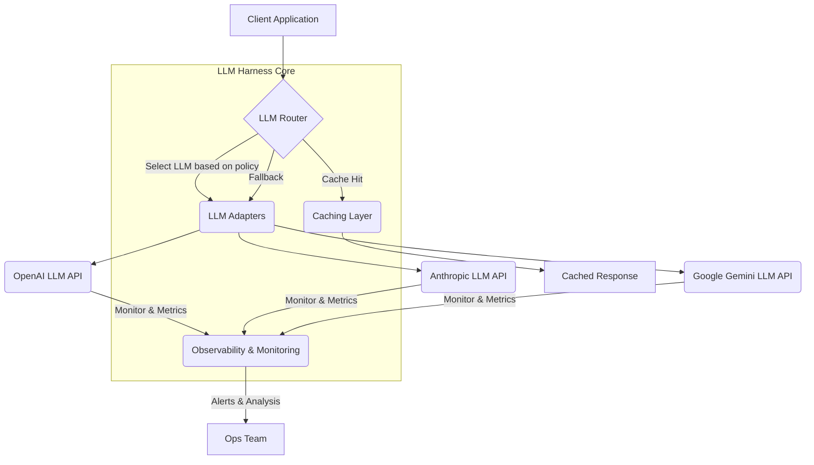

다양한 LLM 엔진 통합을 위한 Harness 디자인 패턴은 빠르게 변화하는 AI 생태계에서 필수적인 아키텍처 접근 방식입니다. 여러 LLM을 효율적으로 전환하고 관리하는 공통 아키텍처는 비용 최적화, 성능 향상, 그리고 서비스 안정성 확보에 결정적인 역할을 합니다. 본 위키 엔트리는 LLM Harness의 핵심 개념과 디자인 패턴을 다루며, 실제 구현 전략을 제시합니다.

## LLM Harness의 필요성 및 핵심 개념

Large Language Model (LLM) 기술은 빠르게 발전하고 있으며, Google Gemini, OpenAI GPT, Anthropic Claude, Meta Llama 등 다양한 LLM이 각기 다른 강점과 비용 구조를 가집니다. 특정 태스크에 최적화된 모델을 선택하거나, 서비스 안정성을 위해 여러 모델을 페일오버(failover) 전략으로 활용하는 것은 중요한 실무 역량입니다. LLM Harness는 이러한 다양한 LLM 엔진을 통합하고, 일관된 인터페이스를 통해 관리하며, 동적으로 모델을 전환할 수 있도록 지원하는 추상화 계층입니다.

핵심적인 구성 요소는 다음과 같습니다:

*   **LLM Adapter (어댑터)**: 각 LLM Provider의 상이한 API 인터페이스를 애플리케이션의 공통 인터페이스로 정규화합니다.
*   **LLM Router (라우터)**: 특정 기준(예: 비용, 성능, 기능, 사용자 그룹)에 따라 요청을 적절한 LLM 엔진으로 동적으로 라우팅합니다.
*   **Caching Layer (캐싱 계층)**: 반복적인 요청에 대한 LLM 응답을 캐싱하여 Latency를 줄이고 API 호출 비용을 절감합니다.
*   **Fallback & Retry Mechanism (페일오버 및 재시도)**: 특정 LLM 엔진의 오류 또는 성능 저하 시 다른 엔진으로 전환하거나 요청을 재시도하여 서비스 연속성을 보장합니다.
*   **Observability & Monitoring (관측성 및 모니터링)**: 각 LLM의 응답 시간, 오류율, 비용 등을 실시간으로 모니터링하여 최적의 운영을 지원합니다.

## LLM Harness 디자인 패턴

### 1. Adapter Pattern (어댑터 패턴)

Adapter Pattern은 서로 호환되지 않는 인터페이스를 가진 클래스들이 협력할 수 있도록 돕는 구조적 디자인 패턴입니다. LLM 환경에서는 각기 다른 API 스펙을 가진 LLM Provider (e.g., OpenAI, Anthropic, Google)를 하나의 통일된 인터페이스로 래핑(wrapping)하는 데 사용됩니다.

```python
from abc import ABC, abstractmethod

# Common Interface (대상 인터페이스)
class LLMService(ABC):
    @abstractmethod
    def generate_text(self, prompt: str, **kwargs) -> str:
        pass

# Concrete OpenAI LLM (기존 클래스)
class OpenAIAdapter(LLMService):
    def __init__(self, api_key: str):
        # Assume OpenAI client exists and is initialized here
        self.client = "OpenAIClient(api_key=api_key)"

    def generate_text(self, prompt: str, model: str = "gpt-4o", temperature: float = 0.7) -> str:
        # Simulate API call
        print(f"OpenAI: Generating text for '{prompt}' with model {model}")
        return "Generated text from OpenAI"

# Concrete Anthropic LLM (또 다른 기존 클래스)
class AnthropicAdapter(LLMService):
    def __init__(self, api_key: str):
        # Assume Anthropic client exists and is initialized here
        self.client = "AnthropicClient(api_key=api_key)"

    def generate_text(self, prompt: str, model: str = "claude-3-5-sonnet-20240620", max_tokens: int = 1024) -> str:
        # Simulate API call
        print(f"Anthropic: Generating text for '{prompt}' with model {model}")
        return "Generated text from Anthropic"
```

### 2. Router Pattern (라우터 패턴)

Router Pattern은 들어오는 요청을 여러 LLM Provider 중 하나로 동적으로 전달하는 역할을 합니다. 이는 비즈니스 로직, 비용, 성능, 가용성, 심지어 특정 태스크의 복잡성 등 다양한 기준에 기반할 수 있습니다. 2026년에는 특정 도메인에 특화된 소형 모델(SLM)과 멀티모달(multimodal) 모델의 등장으로 더욱 정교한 라우팅 전략이 중요해지고 있습니다.

```python
class LLMRouter:
    def __init__(self, services: dict[str, LLMService]):
        self.services = services # {"openai": OpenAIAdapter(...), "anthropic": AnthropicAdapter(...)}

    def route_and_generate(self, prompt: str, preferred_llm: str = "default", **kwargs) -> str:
        # Simple routing example: choose based on preference or fallback
        if preferred_llm in self.services:
            llm_service = self.services[preferred_llm]
        else:
            # Fallback to a default LLM or implement more complex logic
            llm_service = self.services["openai"] # Example default

        return llm_service.generate_text(prompt, **kwargs)

# Example Usage
# openai_adapter = OpenAIAdapter(api_key="sk-openai-...")
# anthropic_adapter = AnthropicAdapter(api_key="sk-anthropic-...")
# router = LLMRouter({"openai": openai_adapter, "anthropic": anthropic_adapter})

# response_gpt = router.route_and_generate("Write a poem about AI.", preferred_llm="openai", model="gpt-4o")
# response_claude = router.route_and_generate("Summarize this document.", preferred_llm="anthropic", model="claude-3-5-sonnet-20240620")
```

### 3. Circuit Breaker & Fallback Pattern (서킷 브레이커 및 페일오버 패턴)

외부 시스템과의 통합에서 흔히 발생하는 장애 상황에 대비하기 위한 패턴입니다. 특정 LLM Provider가 응답하지 않거나 오류율이 높을 경우, 자동으로 해당 Provider로의 요청을 차단(circuit break)하고, 미리 정의된 대체 LLM으로 요청을 전환(fallback)하거나 캐시된 응답을 제공하여 서비스 안정성을 높입니다.

### LLM Harness Architecture (LLM Harness 아키텍처)



Mermaid 다이어그램은 클라이언트 애플리케이션이 LLM 라우터를 통해 LLM Harness Core와 상호작용하는 방식을 보여줍니다. 라우터는 정책에 따라 적절한 어댑터를 선택하고, 어댑터는 각 LLM Provider의 API와 통신합니다. 캐싱 계층은 성능 최적화를, 관측성 및 모니터링은 운영 안정성을 담당합니다.

## 트레이드오프

### 1. 복잡성 vs. 유연성 (Complexity vs. Flexibility)
*   **언제 좋나**: 다양한 LLM을 활용할 필요가 있거나, 향후 새로운 LLM으로의 전환 가능성이 높을 때, 또는 특정 태스크에 최적화된 모델을 동적으로 선택해야 할 때 Harness는 매우 높은 유연성을 제공합니다.
*   **언제 나쁜가**: 단일 LLM만 사용하며 모델 변경 계획이 없고, 요구사항이 단순할 때는 Harness 구축에 드는 초기 개발 및 유지보수 비용이 과도한 복잡성으로 작용할 수 있습니다.

### 2. 성능 vs. 추상화 오버헤드 (Performance vs. Abstraction Overhead)
*   **언제 좋나**: 모델 스위칭 로직, 캐싱, 로드 밸런싱, 페일오버 등 추가적인 비즈니스 로직이 필요한 경우, Harness는 이러한 기능을 효율적으로 통합하여 전체 시스템의 안정성과 확장성을 높입니다.
*   **언제 나쁜가**: 극단적인 Low-latency가 요구되는 시나리오에서는 Harness 계층이 추가적인 네트워크 홉과 처리 지연을 발생시켜 직접적인 LLM API 호출보다 성능이 저하될 수 있습니다.

### 3. 비용 효율성 vs. 인프라 투자 (Cost Efficiency vs. Infrastructure Investment)
*   **언제 좋나**: 여러 LLM Provider의 가격 정책을 비교하거나, 사용량에 따라 최적의 모델을 선택함으로써 장기적인 API 호출 비용을 절감하고, 불필요한 중복 호출을 캐싱으로 방지할 수 있습니다.
*   **언제 나쁜가**: Harness 자체를 구축하고 유지보수하는 데 필요한 개발 인력 및 인프라(서버, 모니터링 도구 등) 비용이 LLM API 비용 절감분보다 클 수 있습니다. 특히 소규모 프로젝트에서는 배보다 배꼽이 더 커질 수 있습니다.

### 4. 개발 속도 vs. 벤더 종속성 완화 (Development Speed vs. Vendor Lock-in Mitigation)
*   **언제 좋나**: 특정 LLM Provider의 정책 변경, 가격 인상, 서비스 중단 등의 위험에 대비하여 벤더 종속성을 줄이고, 필요할 때 신속하게 다른 모델로 전환할 수 있는 민첩성을 확보합니다.
*   **언제 나쁜가**: 초기 개발 단계에서 시장 출시(Time-to-market)가 최우선 목표일 경우, LLM Harness 구축에 시간을 할애하는 것보다 특정 LLM API를 직접 사용하는 것이 개발 속도 측면에서 유리할 수 있습니다.

## 실전 체크리스트

프로젝트에 LLM Harness를 적용할 때 다음 항목들을 검증하십시오.

- [ ] **LLM Adapter 구현 완료**: 현재 사용하는 모든 LLM Provider (OpenAI, Anthropic, Google 등)에 대한 공통 인터페이스 `LLMService` 구현이 완료되었는가?
- [ ] **라우팅 정책 정의 및 테스트**: 비용, 성능, 기능, 가용성 등 기준에 따라 요청을 라우팅하는 `LLMRouter`의 정책이 명확하게 정의되고 각 시나리오별로 올바르게 동작하는지 테스트되었는가? (예: 특정 태스크는 `Claude 3.5 Sonnet`, 일반적인 채팅은 `GPT-4o`로 라우팅)
- [ ] **캐싱 전략 구현 및 효과 측정**: 반복적인 LLM 요청에 대한 캐싱(Redis 또는 Memcached 등)이 구현되었고, 캐시 적중률 및 Latency 감소 효과가 측정되었는가?
- [ ] **페일오버 및 재시도 메커니즘**: 특정 LLM Provider에 장애가 발생했을 때, 자동으로 다른 LLM으로 전환되거나 요청이 재시도되는 로직이 구현 및 테스트되었는가? (Circuit Breaker 패턴 포함)
- [ ] **모니터링 및 로깅 설정**: 각 LLM의 응답 시간, 오류율, 비용, 사용량 등을 실시간으로 모니터링하고 로깅하는 시스템(Prometheus, Grafana, ELK Stack 등)이 구축되어 대시보드로 시각화되는가?
- [ ] **API 키 및 보안 관리**: LLM Provider의 API 키가 안전하게 관리되고 있으며, 접근 제어(IAM) 및 회전(rotation) 정책이 적용되었는가?
- [ ] **새로운 LLM 통합 용이성**: 신규 LLM (예: `Llama 3` 또는 다음 세대 모델)을 Harness에 통합하는 과정이 문서화되어 있고, 최소한의 노력으로 연동 가능한가? (PoC를 통해 검증)