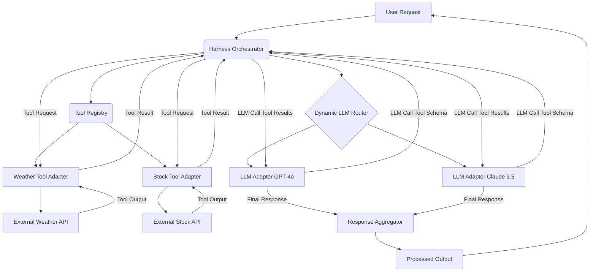

복잡한 AI 서비스를 구축하는 데 있어 다양한 대규모 언어 모델(LLM) API와 외부 도구(External Tools)의 연동은 핵심적인 과제입니다. LLM의 빠른 발전과 기능 다양화, 그리고 외부 데이터 소스 및 서비스와의 통합 요구 증가는 시스템의 복잡성을 가중시키며, 유연성과 확장성을 저해하는 주요 요인이 됩니다. `Harness` 디자인 패턴은 이러한 문제를 해결하기 위한 강력한 아키텍처 접근 방식으로, LLM 및 외부 도구의 통합 과정을 추상화하고 표준화하여 높은 유연성, 확장성, 그리고 관리 용이성을 제공합니다.

## 핵심 개념: Harness 아키텍처

LLM 및 외부 도구 연동을 위한 Harness는 다음과 같은 주요 컴포넌트들로 구성됩니다.

### 어댑터 패턴 (Adapter Pattern)

각기 다른 LLM API(예: OpenAI, Anthropic, Google Gemini)와 외부 도구(예: 데이터베이스, 웹 API)는 고유한 호출 방식과 응답 형식을 가집니다. `Adapter`는 이들을 Harness 내부의 표준화된 인터페이스로 변환하는 역할을 합니다. 이를 통해 새로운 LLM이나 도구가 추가되어도 핵심 로직 변경 없이 유연하게 시스템을 확장할 수 있습니다.

*   **LLM Adapter**: 특정 LLM API의 `generate` 또는 `invoke` 메서드를 표준화된 형태로 캡슐화합니다.
*   **Tool Adapter**: 외부 도구의 복잡한 호출 로직(인증, 데이터 파싱 등)을 단순한 `execute` 메서드로 추상화합니다.

### 오케스트레이션 계층 (Orchestration Layer)

오케스트레이션 계층은 LLM의 응답과 도구 호출 사이의 워크플로우를 관리합니다. 사용자 요청을 받아 동적으로 LLM을 선택하고, LLM이 도구 사용을 지시하면 해당 도구를 실행하며, 도구 실행 결과를 다시 LLM에 전달하여 최종 응답을 생성하는 일련의 과정을 조정합니다.

### 동적 라우터 (Dynamic Router)

`Dynamic Router`는 들어오는 사용자 요청의 특성(예: 복잡성, 비용 민감도, 지연 시간 요구사항, 특정 도구 필요 여부)을 분석하여 최적의 LLM 인스턴스 또는 모델을 동적으로 선택합니다. 이는 2026년 트렌드인 다중 LLM 전략(Multi-LLM Strategy) 및 비용 최적화에 필수적인 요소입니다.

### 도구 레지스트리 (Tool Registry)

`Tool Registry`는 시스템 내에서 사용 가능한 모든 외부 도구와 해당 `Tool Adapter`의 정보를 중앙 집중적으로 관리합니다. LLM이 `Function Calling` 또는 `Tool Use`와 같은 기능을 통해 도구 호출을 결정할 때, 레지스트리는 LLM에 필요한 도구의 스키마(Schema) 정보를 제공하고, 실제 호출 시에는 해당 Adapter를 통해 실행을 위임합니다.

## 주요 이점 및 2026년 트렌드

Harness 패턴은 다음과 같은 이점을 제공하며, 2026년 AI 서비스 개발 트렌드를 반영합니다.

*   **유연성(Flexibility)**: 새로운 LLM이나 도구 도입 시 기존 코드 수정 최소화. Multi-LLM 전략을 통한 벤더 종속성(Vendor Lock-in) 완화.
*   **확장성(Scalability)**: 다양한 LLM 및 도구 조합의 손쉬운 확장, 부하 분산(Load Balancing) 및 병렬 처리(Parallel Processing) 용이.
*   **복원력(Resilience)**: 특정 LLM 또는 도구 실패 시 대체 경로(Fallback Mechanism), 재시도 로직(Retry Logic) 구현으로 시스템 안정성 확보.
*   **비용 최적화(Cost Optimization)**: Dynamic Router를 통한 비용 효율적인 LLM 선택 및 캐싱(Caching) 전략 구현.
*   **Real-time Adaptive Tooling**: 사용자 요청의 실시간 분석 기반으로 필요한 도구를 즉각적으로 식별하고 호출하는 능력 지원.
*   **Semantic Routing**: 요청의 의미론적(Semantic) 분석을 통해 가장 적합한 LLM 및 도구 체인(Tool Chain)을 결정하는 고급 라우팅 기법 통합.

## 코드 예제: Harness 오케스트레이션

아래는 LLM 및 외부 도구 연동을 위한 Harness의 핵심 로직을 보여주는 간소화된 Python 예제입니다.

```python
import abc
from typing import Dict, Any, List, Optional
import json

# 1. LLM Adapter 인터페이스
class LLMAdapter(abc.ABC):
    @abc.abstractmethod
    def generate(self, prompt: str, tool_schemas: List[Dict], **kwargs) -> str:
        # LLM에 tool_schemas를 제공하여 함수 호출(Function Calling) 인식을 돕습니다.
        pass

# 2. 구체적인 LLM Adapter (간소화)
class GPT4oAdapter(LLMAdapter):
    def generate(self, prompt: str, tool_schemas: List[Dict], **kwargs) -> str:
        print(f"GPT-4o: '{prompt}' 처리 중.")
        # 'weather' 키워드 감지 시 도구 호출 응답 시뮬레이션
        if "weather" in prompt.lower():
            return '{"type": "tool_call", "name": "get_current_weather", "arguments": "{\"location\": \"Seoul\"}"}'
        return f"GPT-4o 응답: {prompt}"

# 3. Tool Adapter 인터페이스
class ToolAdapter(abc.ABC):
    @abc.abstractmethod
    def execute(self, **kwargs) -> Any:
        pass

# 4. 구체적인 Tool Adapter
class CurrentWeatherTool(ToolAdapter):
    def execute(self, location: str) -> Dict[str, Any]:
        print(f"날씨 도구 실행: {location}")
        # 외부 날씨 API 호출 시뮬레이션
        return {"location": location, "temperature": 25, "unit": "celsius"}

# 5. Harness 오케스트레이터
class LLMHarness:
    def __init__(self):
        self.llm_adapters: Dict[str, LLMAdapter] = {
            "gpt-4o": GPT4oAdapter()
        }
        self.tool_registry: Dict[str, ToolAdapter] = {
            "get_current_weather": CurrentWeatherTool()
        }
        # LLM에 제공할 도구 스키마 정의
        self.tool_schemas: List[Dict] = [
            {
                "name": "get_current_weather",
                "description": "현재 위치의 날씨를 가져옵니다",
                "parameters": {
                    "type": "object",
                    "properties": {
                        "location": {"type": "string", "description": "도시 이름"}
                    },
                    "required": ["location"]
                }
            }
        ]

    def _select_llm(self, prompt: str) -> LLMAdapter:
        # 동적 라우팅 로직 (간소화): 실제 환경에서는 비용, 지연 시간 등을 고려합니다.
        return self.llm_adapters["gpt-4o"]

    def process_request(self, user_query: str) -> str:
        selected_llm = self._select_llm(user_query)
        
        # 1. LLM에 사용자 질의와 사용 가능한 도구 스키마 전달
        llm_initial_response = selected_llm.generate(user_query, self.tool_schemas)

        # 2. LLM 응답 분석 및 도구 호출 결정
        try:
            parsed_response = json.loads(llm_initial_response)
            if parsed_response.get("type") == "tool_call":
                tool_name = parsed_response["name"]
                tool_args = json.loads(parsed_response["arguments"])
                
                if tool_name in self.tool_registry:
                    print(f"DEBUG: LLM이 도구 요청: {tool_name} (인자: {tool_args})")
                    tool_output = self.tool_registry[tool_name].execute(**tool_args)
                    
                    # 3. 도구 실행 결과를 다시 LLM에 전달 (간소화를 위해 바로 반환)
                    # 실제 Agentic 루프에서는 이 결과를 포함하여 LLM을 다시 호출합니다.
                    return f"도구 '{tool_name}' 실행 결과: {tool_output}"
                else:
                    return f"오류: 도구 '{tool_name}'를 찾을 수 없습니다."
            else:
                return llm_initial_response # LLM의 직접 응답
        except json.JSONDecodeError:
            return llm_initial_response # JSON 형식의 도구 호출이 아닌 경우

# 사용 예시
harness = LLMHarness()
print("요청: 서울 날씨는 어때?")
print(harness.process_request("서울 날씨는 어때?"))
print("\n요청: 재미있는 농담 하나 해줘.")
print(harness.process_request("재미있는 농담 하나 해줘."))
```

## Harness 아키텍처 다이어그램



## 트레이드오프

Harness 패턴 적용 시 고려해야 할 주요 트레이드오프는 다음과 같습니다.

*   **초기 개발 복잡성 (Initial Development Complexity)**:
    *   **장점**: 장기적으로 유지보수 용이성 및 높은 확장성 보장.
    *   **단점**: 초기 설계 및 어댑터 구현에 추가적인 시간과 노력이 필요. 단순한 서비스에는 과도할 수 있음.
*   **성능 오버헤드 (Performance Overhead)**:
    *   **장점**: 동적 라우팅 및 캐싱 전략으로 장기적 성능 최적화 가능.
    *   **단점**: 추상화 계층 추가로 인한 미세한 지연 시간 증가 가능성 존재. 직접 통합 방식 대비 초기 호출 오버헤드 발생 가능.
*   **관리 복잡성 (Management Complexity)**:
    *   **장점**: 중앙 집중식 관리로 시스템 전반의 가시성 및 통제력 확보.
    *   **단점**: 어댑터, 라우터, 레지스트리 등의 버전 관리, 배포, 모니터링에 대한 추가적인 운영 부담 발생.

## 실전 체크리스트

LLM API 및 외부 도구 연동을 위한 Harness를 프로젝트에 적용할 때 다음 항목들을 검증합니다.

*   [ ] 모든 LLM API 및 외부 도구에 대해 표준화된 `Adapter` 인터페이스가 정의되었는가? (예: `generate` 또는 `execute` 메서드)
*   [ ] 동적 라우팅 로직이 구현되어 요청 특성(비용, 지연 시간, 성능 요구사항)에 따라 LLM을 효율적으로 선택하고 있는가?
*   [ ] `Tool Registry`가 사용 가능한 모든 도구의 스키마 및 `Adapter` 인스턴스를 중앙에서 관리하고 LLM에 정확히 제공하는가?
*   [ ] LLM 호출 및 도구 실행에 대한 통합 로깅(Logging), 모니터링(Monitoring), 그리고 추적(Tracing) 시스템이 구축되어 있는가?
*   [ ] 특정 LLM 또는 도구의 응답 실패 시, 대체 LLM 선택, 재시도(Retry), 또는 폴백(Fallback) 메커니즘이 구현되어 시스템 복원력을 확보하는가?
*   [ ] Harness 계층을 통한 LLM API 호출 비용 및 도구 사용 비용이 명확히 추적되고 있으며, 비용 최적화 메커니즘이 효과적으로 작동하는가?
*   [ ] 민감한 데이터 처리 시, Harness 내부에서 데이터 마스킹, 암호화, 접근 제어 등 보안 원칙이 철저히 준수되고 있는가?