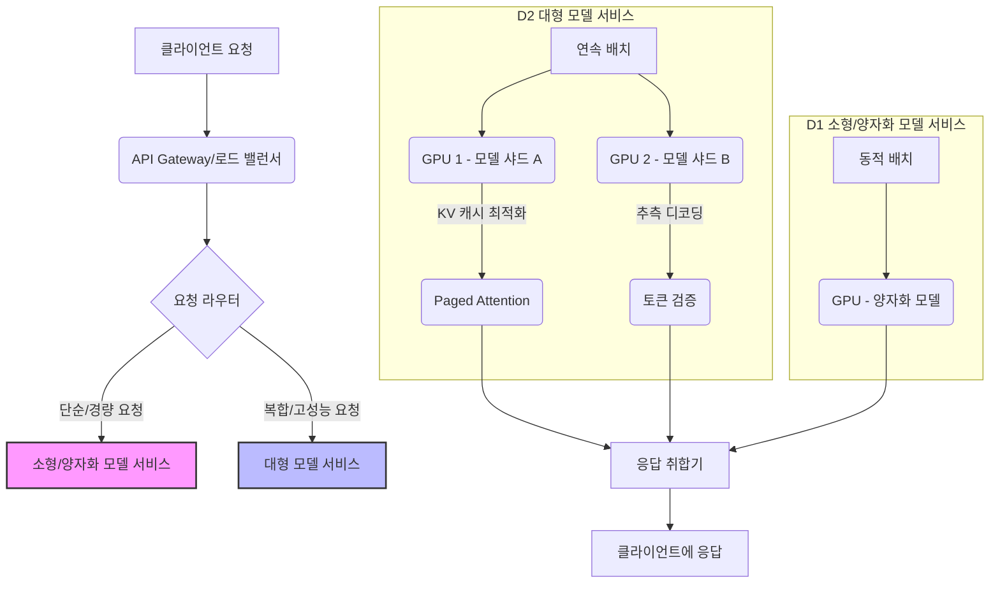

대규모 언어 모델(LLM)을 프로덕션 환경에 배포할 때, GPU 리소스의 효율적인 사용과 운영 비용 관리는 가장 중요한 과제 중 하나입니다. 2026년 현재, 모델의 규모는 지속적으로 커지고 있으며, 추론 요청량 또한 폭발적으로 증가하는 추세입니다. 이러한 환경에서 최적화되지 않은 LLM 서빙은 막대한 비용과 함께 서비스의 확장성을 저해할 수 있습니다. 본 문서에서는 LLM 서빙의 GPU 리소스 최적화 및 비용 관리 전략을 상세히 다룹니다.

## LLM GPU 리소스 최적화 기법

LLM 추론의 핵심은 제한된 GPU 자원 내에서 최대한 많은 요청을 빠르고 효율적으로 처리하는 것입니다. 다음은 주요 최적화 기법들입니다.

### 1. 양자화 (Quantization)
모델의 가중치(weights)를 더 낮은 비트 정밀도(예: FP32에서 FP16, INT8, 심지어 INT4)로 변환하여 메모리 사용량을 줄이고 연산 속도를 높이는 기법입니다. 정확도 손실이 발생할 수 있으므로, 프로덕션 환경에서는 보통 정확도 손실이 < 3% 미만인 범위에서 최적의 양자화 수준을 찾아 적용하는 것이 중요합니다.

### 2. 연속 배치 (Continuous Batching)
전통적인 LLM 서빙에서는 배치(batch)에 포함된 모든 시퀀스가 가장 긴 시퀀스 길이에 맞춰 패딩(padding)되어 GPU 유휴 시간이 발생했습니다. 연속 배치는 여러 사용자 요청을 하나의 GPU 배치로 묶어 처리하되, 각 시퀀스 길이에 맞춰 동적으로 메모리를 할당하고 스케줄링하여 GPU 유휴 시간을 최소화하고 처리량을 극대화합니다. vLLM과 같은 고성능 추론 프레임워크의 핵심 기능입니다.

### 3. KV 캐시 최적화 (Paged Attention)
트랜스포머 모델에서 Key와 Value 텐서(KV Cache)는 시퀀스 길이에 비례하여 메모리를 많이 사용합니다. Paged Attention은 가상 메모리 페이징과 유사하게 이 KV 캐시를 페이지 단위로 관리하여 메모리 단편화(fragmentation)를 줄이고, 효율적인 캐시 공유 및 재사용을 통해 메모리 사용량을 최적화합니다. 이는 GPU 메모리 부족 문제를 해결하고 더 긴 시퀀스를 처리하는 데 필수적입니다.

### 4. 추측 디코딩 (Speculative Decoding)
작은 보조 모델(draft model)로 다음 토큰 시퀀스를 미리 추측하고, 대규모 모델(target model)은 이 추측된 시퀀스가 올바른지 빠르게 검증하는 방식입니다. 추측이 맞으면 대규모 모델의 느린 자동 회귀(auto-regressive) 연산을 건너뛸 수 있어, 정확도 손실 없이 추론 속도(지연 시간)를 크게 향상시킬 수 있습니다.

### 5. 동적 배치 (Dynamic Batching)
실시간으로 들어오는 요청 부하에 따라 배치 크기를 동적으로 조절하는 기법입니다. 고정된 배치 크기를 사용하는 것보다 시스템의 유연성을 높이고, GPU 활용률을 최적화하여 전체적인 처리량을 증대시킵니다.

### 6. 모델 병렬화 (Model Parallelism)
단일 GPU에 너무 커서 로드할 수 없는 초대형 모델의 경우, 모델을 여러 GPU 또는 여러 노드에 분산하여 로드하는 기법입니다. 텐서 병렬화(Tensor Parallelism)는 개별 레이어 내의 텐서를 분할하고, 파이프라인 병렬화(Pipeline Parallelism)는 모델의 여러 레이어를 서로 다른 장치에 분배하여 병렬로 처리합니다.

## 비용 관리 및 아키텍처 전략

GPU 리소스 최적화와 함께 클라우드 비용을 효과적으로 관리하는 것은 LLM 서빙의 지속 가능성을 결정합니다.

### 1. 인스턴스 최적화 (Right-Sizing & Spot Instances)
워크로드의 특성과 모델의 요구사항에 가장 적합한 GPU 인스턴스 유형과 크기를 선택하는 것이 중요합니다. 또한, 즉각적인 응답이 필수가 아닌 비동기 또는 배치 처리 작업에는 클라우드 제공업체의 스팟 인스턴스(Spot Instances)나 Preemptible VM을 활용하여 온디맨드 인스턴스 대비 최대 70~90%의 비용을 절감할 수 있습니다.

### 2. 모델 라우팅 (Model Routing)
들어오는 요청의 복잡성이나 중요도에 따라 다른 LLM 모델로 라우팅하는 전략입니다. 예를 들어, 간단한 질의나 낮은 정확도를 허용하는 작업에는 경량화되거나 더 작은 모델(예: Mistral, Gemma)을 사용하고, 복잡하거나 미션 크리티컬한 작업에만 고성능/고비용 모델(예: Claude, GPT-4)을 할당합니다. 이는 전체 시스템의 비용 효율성을 크게 높일 수 있습니다.

### 3. 자동 스케일링 (Auto-Scaling)
실시간 트래픽 부하 변화에 맞춰 GPU 리소스를 자동으로 확장(scale-out)하거나 축소(scale-in)하는 기능입니다. 이를 통해 피크 시간대에 필요한 리소스를 유연하게 제공하고, 유휴 시간대에는 불필요한 리소스를 회수하여 비용을 최소화합니다.

### 4. 고급 모니터링 및 알림 (Advanced Monitoring & Alerting)
GPU 사용률, 메모리 사용량, 추론 지연 시간, 처리량뿐만 아니라 클라우드 비용 지표를 실시간으로 모니터링하고, 설정된 임계치를 초과할 경우 즉시 알림을 받을 수 있는 시스템을 구축해야 합니다. 비용 이상 징후를 조기에 감지하여 신속하게 대응할 수 있습니다.

## 코드 예제: vLLM을 활용한 LLM 서빙 최적화 (개념적)

vLLM은 Paged Attention, Continuous Batching 등 여러 최적화 기법을 내장하여 LLM 서빙의 효율성을 극대화하는 Python 라이브러리입니다. 아래 코드는 vLLM을 사용하여 LLM을 로드하고 여러 요청을 연속 배치로 처리하는 개념적인 예시입니다.

```python
# vLLM을 활용한 LLM 서빙 설정 예시 (개념적)
from vllm import LLM, SamplingParams

# 2026년 트렌드에 맞춰 최적화된 모델 로드 (예: 양자화된 모델)
# 'TinyLlama/TinyLlama-1.1B-Chat-v1.0'은 예시이며, 실제로는 더 큰 모델에 적용 가능.
# quantization='awq' 옵션은 vLLM이 AWQ(Activation-aware Weight Quantization)를 통해
# 모델을 로드하며 양자화 최적화를 적용함을 나타냅니다.
llm = LLM(model="TinyLlama/TinyLlama-1.1B-Chat-v1.0", quantization="awq", gpu_memory_utilization=0.9)

# 샘플링 파라미터 설정
sampling_params = SamplingParams(temperature=0.7, top_p=0.95, max_tokens=256)

# 여러 프롬프트에 대한 요청 (연속 배치로 처리됨)
prompts = [
    "Explain the concept of 'paged attention' in LLMs.",
    "What are the benefits of continuous batching for GPU utilization?",
    "Summarize the latest trends in LLM inference optimization.",
    "Write a short poem about cloud computing."
]

# 추론 실행
outputs = llm.generate(prompts, sampling_params)

# 결과 출력
for prompt, output in zip(prompts, outputs):
    print(f"Prompt: {prompt!r}")
    print(f"Generated text: {output.outputs[0].text!r}\n")

# 참고: vLLM은 Paged Attention, Continuous Batching 등을 내부적으로 관리하여
# 개발자가 명시적으로 코드로 제어할 필요 없이 높은 효율을 달성합니다.
```

## LLM 서빙 아키텍처 다이어그램

LLM 서빙을 위한 일반적인 최적화 아키텍처는 요청 라우팅, 배치 처리, KV 캐시 관리 및 모델 병렬화 등을 포함합니다.



## 트레이드오프

LLM GPU 리소스 최적화 및 비용 관리 기법들은 각각 장단점을 가지며, 서비스의 요구사항에 따라 신중하게 선택해야 합니다.

*   **양자화 (Quantization)**:
    *   **언제 좋음**: 메모리 사용량을 획기적으로 줄이고 추론 속도를 높여 비용을 절감해야 할 때, 특히 모바일/엣지 디바이스나 리소스 제약이 있는 환경에서 유용합니다.
    *   **언제 나쁨**: 높은 정확도(Accuracy)가 필수적이거나, 특정 작업(예: 민감한 금융 분석, 의료 진단)에서 미세한 성능 저하도 용납되지 않을 때 적합하지 않습니다.
*   **연속 배치 (Continuous Batching)**:
    *   **언제 좋음**: 높은 동시성 요청 처리와 전체 시스템의 처리량(Throughput) 극대화가 중요할 때, GPU 유휴 시간을 최소화하여 리소스 효율성을 높입니다.
    *   **언제 나쁨**: 개별 요청의 최저 지연 시간(Latency)이 절대적으로 중요한 경우, 배치 대기 시간으로 인해 단일 요청의 응답이 길어질 수 있습니다.
*   **스팟 인스턴스 (Spot Instances)**:
    *   **언제 좋음**: 비용 절감이 최우선인 비동기 배치 작업, 재시작 내결함성이 있는 작업, 또는 특정 시간대에 폭발적으로 증가하는 임시 워크로드에 적합합니다.
    *   **언제 나쁨**: 중단 없는 서비스(High Availability)가 필수적이거나, 갑작스러운 중단이 비즈니스에 치명적인 영향을 미치는 실시간/미션 크리티컬 서비스에는 부적합합니다.
*   **모델 라우팅 (Model Routing)**:
    *   **언제 좋음**: 다양한 복잡도의 요청이 혼재되어 있을 때, 간단한 요청은 경량 모델로 처리하여 비용을 절감하고, 복잡한 요청에만 고성능/고비용 모델을 할당하여 전체 시스템의 비용 효율성을 높일 때 유용합니다.
    *   **언제 나쁨**: 라우팅 로직 자체의 개발 및 유지보수 복잡성이 추가되고, 요청 분류의 정확도가 낮으면 오히려 사용자 경험 저하나 비용 비효율을 초래할 수 있습니다.
*   **추측 디코딩 (Speculative Decoding)**:
    *   **언제 좋음**: 추론 지연 시간(Latency)을 크게 줄여 사용자 경험을 개선하고 싶은 경우. 특히 대화형 LLM 서비스에 효과적입니다.
    *   **언제 나쁨**: 보조 모델과 대규모 모델 간의 불일치로 인해 추측 검증 과정에서 오버헤드가 발생할 수 있으며, 극도로 낮은 지연 시간 요구사항에서는 구현 복잡도 대비 이득이 미미할 수 있습니다.

## 실전 체크리스트

LLM 서빙을 위한 GPU 리소스 최적화 및 비용 관리 전략을 프로젝트에 적용할 때 다음 항목들을 검증합니다.

*   - [ ] LLM 모델별 최적 양자화 기법(FP16, INT8, INT4)을 테스트하고, 정확도 < 3% 미만 오차 범위 내에서 가장 높은 성능을 보이는지 검증했는가?
*   - [ ] vLLM, TensorRT-LLM 등 최신 고성능 추론 프레임워크를 도입하여 연속 배치 및 KV 캐시 최적화 기능을 활용하고 있는지 확인했는가?
*   - [ ] 실시간 트래픽 패턴을 분석하여 피크 로드 및 평균 로드에 대한 GPU 인스턴스 유형과 수를 최적화하고, 자동 스케일링 정책을 구현했는가?
*   - [ ] 요청 복잡도에 따른 모델 라우팅 전략(예: 단순 질의는 경량 모델, 복합 질의는 대형 모델)을 구축하고, 라우팅 정확도를 주기적으로 모니터링하고 있는가?
*   - [ ] 스팟 인스턴스 또는 Preemptible VM을 활용할 수 있는 비동기/배치 처리 워크로드를 식별하고, 이에 대한 내결함성 설계 및 비용 절감 효과를 측정했는가?
*   - [ ] GPU 사용률, 메모리 사용량, 추론 지연 시간, 처리량, 그리고 클라우드 비용 지표를 실시간으로 모니터링하고, 이상 감지 시 즉각적인 알림 시스템을 구축했는가?
*   - [ ] 2026년 이후의 최신 LLM 아키텍처(예: Mixtral, Qwen2 등)와 그에 특화된 최적화 기술(예: MoE 모델의 게이트 최적화)을 검토하고 로드맵에 반영했는가?