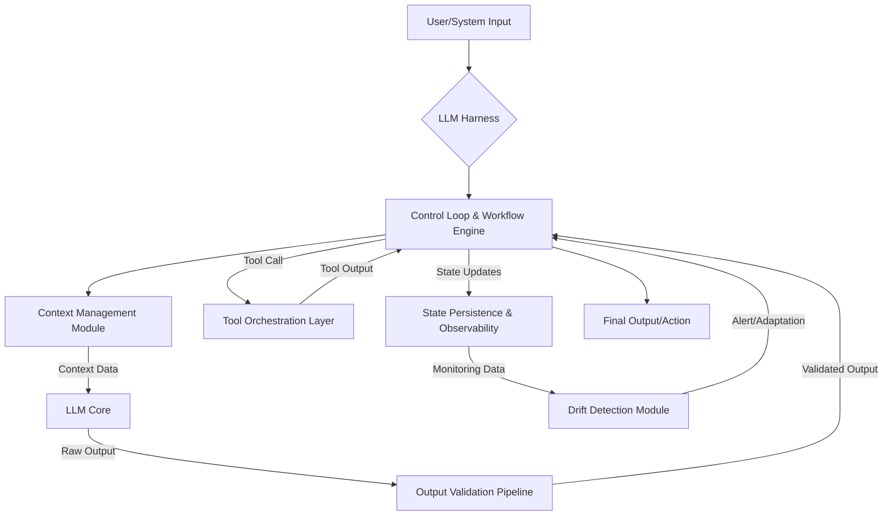

The performance of large language models (LLMs), particularly in long-running agentic tasks, is not solely determined by the underlying model's raw inference capabilities. The surrounding system, often referred to as an "LLM Harness," plays a pivotal role in augmenting reliability, stability, and overall efficacy. As demonstrated by divergent performance metrics for the same LLM (e.g., GPT-6 Astra showing 54.8% versus 99.9% in identical high inference settings but different harnesses), the integration of memory, tool orchestration, context management, and robust control loops is paramount. This emphasizes that for sophisticated, long-duration agent operations, the harness is not merely an auxiliary component but the product itself.

### LLM Harness Core Architecture

An effective LLM harness is a sophisticated control plane that wraps the core LLM, enabling it to perform complex tasks reliably. Key architectural components include:

1.  **Context Management Module**: Manages the agent's working memory, historical interactions, and relevant external information. This module handles context window limits, summarization, retrieval-augmented generation (RAG), and state persistence across multiple turns or sessions.
2.  **Tool Orchestration Layer**: Provides the agent with access to external tools (APIs, databases, code interpreters) and manages their execution, input/output parsing, and error handling. It's responsible for dynamic tool selection and robust interaction patterns.
3.  **Output Validation Pipeline**: Verifies the LLM's outputs for correctness, safety, and adherence to defined constraints. This includes semantic validation, schema checking, hallucination detection, and guardrail enforcement.
4.  **Control Loop & Agentic Workflow Engine**: Dictates the flow of execution, decision-making logic, and self-correction mechanisms. It manages task decomposition, sub-task execution, reflection, and iterative refinement.
5.  **State Persistence & Observability**: Ensures that the agent's state (memory, progress, decisions) is durable and traceable, allowing for debugging, auditing, and recovery from failures.
6.  **Drift Detection Module**: Monitors the agent's behavior and output quality over time, identifying deviations from expected performance or changes in underlying data/model characteristics that might degrade performance.



### Enhanced Implementation Roadmap

To strengthen the LLM harness for long-running agents, specific areas require immediate and prioritized investment, aligning with the scout analysis.

#### 1. Claude Code Harness & Output Validation Pipeline
The "Claude Code Harness" concept emphasizes a secure and controlled environment for code generation and execution. Integrating robust output validation within this harness is critical. This involves:
*   **Schema & Semantic Validation**: Automatically verifying LLM-generated code against predefined schemas, type systems, and semantic rules to prevent errors and ensure functional correctness.
*   **Safety & Security Guardrails**: Implementing checks for potential vulnerabilities, insecure patterns, and adherence to coding standards.
*   **Test-Driven Validation**: Generating and executing unit/integration tests against LLM outputs to confirm behavior and catch regressions.

```python
# Simplified Python example for output validation within a harness
import json
from typing import Dict, Any

class LLMOutputValidator:
    def __init__(self, schema: Dict[str, Any]):
        self.schema = schema

    def validate_json_output(self, raw_output: str) -> Dict[str, Any]:
        """Validates if the raw output is valid JSON and conforms to schema."""
        try:
            parsed_output = json.loads(raw_output)
            # Basic schema validation (can be extended with libraries like Pydantic)
            for key, expected_type in self.schema.items():
                if key not in parsed_output:
                    raise ValueError(f"Missing required key: {key}")
                if not isinstance(parsed_output[key], expected_type):
                    raise TypeError(f"Key {key} has wrong type. Expected {expected_type.__name__}, got {type(parsed_output[key]).__name__}")
            return parsed_output
        except json.JSONDecodeError as e:
            raise ValueError(f"Invalid JSON output: {e}")
        except ValueError as e:
            raise ValueError(f"Schema validation failed: {e}")
        except TypeError as e:
            raise TypeError(f"Schema type mismatch: {e}")

    def validate_code_output(self, code_string: str) -> bool:
        """Performs basic static analysis or linting on generated code."""
        # This would integrate with a linter (e.g., Flake8, Black) or static analyzer
        # For demonstration, a simple keyword check
        if "import os" in code_string and "subprocess.run" in code_string:
            print("WARNING: Potential security risk in generated code detected.")
            # In a real system, this would trigger deeper analysis or rejection
        return True # Placeholder for actual validation logic

# Example usage:
json_schema = {"name": str, "age": int}
validator = LLMOutputValidator(json_schema)

# Valid output
try:
    valid_json = validator.validate_json_output('{"name": "Alice", "age": 30}')
    print(f"Validated JSON: {valid_json}")
except (ValueError, TypeError) as e:
    print(f"Validation Error: {e}")

# Invalid JSON
try:
    validator.validate_json_output('{"name": "Bob", "age": "twenty"}')
except (ValueError, TypeError) as e:
    print(f"Validation Error: {e}")

# Code output example
generated_code = """
def execute_command(cmd):
    import subprocess
    subprocess.run(cmd, shell=True) # Potential risk
"""
validator.validate_code_output(generated_code)
```

#### 2. Advanced Context Management
Long-running agents require sophisticated context handling beyond simple prompt concatenation. This involves:
*   **Hierarchical Memory Systems**: Organizing context into short-term (scratchpad), medium-term (session history), and long-term (knowledge base/vector DB) memories.
*   **Dynamic Context Compaction**: Intelligently summarizing or filtering irrelevant information to keep the context window focused and efficient.
*   **External Knowledge Integration**: Seamlessly fetching and incorporating relevant information from internal knowledge graphs, documentation, or external APIs.

#### 3. Robust Control Loops
The agent's "brain" that orchestrates its actions needs to be resilient and adaptive:
*   **Self-Correction & Reflection**: Implementing mechanisms for the agent to evaluate its own outputs, identify errors, and devise corrective actions.
*   **Patience & Retry Logic**: Gracefully handling API failures, unexpected outputs, or non-deterministic behavior by implementing intelligent retry strategies and backoffs.
*   **Goal State Tracking**: Explicitly maintaining and updating the agent's progress towards a defined goal, allowing for redirection or termination if stuck.

#### 4. Proactive Drift Detection Module
LLM behavior can "drift" over time due to model updates, data shifts, or changes in external environments.
*   **Behavioral Monitoring**: Tracking key performance indicators (KPIs) like task completion rates, error rates, token usage, and latency.
*   **Output Quality Metrics**: Continuously evaluating LLM outputs against human-labeled data or golden sets to detect degradation in quality.
*   **Anomaly Detection**: Utilizing statistical methods or machine learning models to identify unusual patterns in agent behavior or outputs that might indicate drift.

## 트레이드오프

### 1. 복잡성 증가 vs. 안정성 및 기능성 향상
*   **언제 좋고**: 장기 실행, 미션 크리티컬한 에이전트 개발 시 시스템의 안정성과 예측 가능성이 필수적일 때 복잡성을 감수하고서라도 하네스 강화를 통해 얻는 이점이 크다. 고급 기능(예: 자기 수정, 정교한 도구 사용)을 구현하려면 복잡한 제어 로직과 모듈이 필요하다.
*   **언제 나쁜지**: 단순하고 단발성 작업만 수행하는 에이전트의 경우, 과도한 하네스 아키텍처는 불필요한 오버헤드와 개발 비용을 증가시킨다. 빠른 프로토타이핑이나 MVP 단계에서는 경량화된 접근 방식이 더 효율적이다.

### 2. 성능 오버헤드 vs. 정확성 및 신뢰성 확보
*   **언제 좋고**: LLM 추론 전후의 검증, 문맥 관리, 도구 호출 등은 추가적인 지연 시간(latency)과 컴퓨팅 자원을 소모한다. 하지만 이로 인해 결과물의 정확성, 안전성, 신뢰성이 극적으로 향상될 수 있으므로, 최종 결과의 품질이 중요한 경우 (예: 금융 거래, 의료 진단 보조) 감수할 만하다.
*   **언제 나쁜지**: 실시간 응답 속도가 최우선인 애플리케이션(예: 대화형 챗봇, 게임 AI)에서는 하네스의 과도한 검증 및 제어 로직이 사용자 경험을 저해할 수 있다. 이 경우, 경량화된 검증이나 비동기 처리, 캐싱 전략이 요구된다.

### 3. 개발 및 유지보수 비용 vs. 운영 효율성 증대
*   **언제 좋고**: 견고한 하네스 아키텍처는 초기 개발에 더 많은 시간과 리소스를 투자해야 한다. 그러나 장기적으로는 에이전트의 드리프트, 오류, 비정상적인 동작을 줄여 운영 비용(디버깅, 수동 개입, 장애 복구)을 크게 절감하고, 새로운 기능 추가 시 안정적인 기반을 제공하여 개발 속도를 높인다.
*   **언제 나쁜지**: 리소스가 제한적이거나 시장 출시 기간이 매우 촉박한 프로젝트에서는 초기 개발 비용과 시간이 부담이 될 수 있다. 이 경우, 핵심 기능에 집중하고 점진적으로 하네스를 강화하는 전략이 필요하다.

### 4. 모델 독립성 vs. 특정 LLM 최적화
*   **언제 좋고**: 범용적인 하네스 아키텍처는 특정 LLM에 종속되지 않아 모델 교체나 멀티 LLM 전략에 유연하게 대응할 수 있다. 이는 기술 변화가 빠른 LLM 생태계에서 장기적인 아키텍처의 생존력을 높인다.
*   **언제 나쁜지**: 특정 LLM의 고유한 특성(예: 특정 토큰 제한, 프롬프트 형식, 함수 호출 방식)을 깊이 활용하여 성능을 극대화하려는 경우, 모델에 특화된 하네스 구성이 더 효율적일 수 있다. 하지만 이는 다른 모델로의 전환 비용을 증가시킨다.

## 실전 체크리스트

다음은 LLM 하네스 아키텍처를 강화하기 위한 실전 체크리스트입니다.

- [ ] **콘텍스트 관리 전략 정의**: 장기 실행 에이전트의 히스토리, 외부 지식, 현재 작업 콘텍스트를 어떻게 수집, 요약, 저장하고 검색할 것인지 명확한 전략을 수립했는가? (예: 계층적 메모리, 벡터 데이터베이스, 동적 요약)
- [ ] **LLM 출력 검증 파이프라인 구현**: LLM의 모든 출력을 구조적(JSON 스키마), 의미적(가이드라인 준수), 안전성(보안 취약점, 유해 콘텐츠) 측면에서 자동 검증하는 파이프라인을 구축했는가?
- [ ] **도구 사용 및 에러 처리 메커니즘 강화**: 에이전트가 외부 도구를 호출할 때 발생할 수 있는 오류(API 타임아웃, 잘못된 응답, 예외)에 대해 견고한 재시도 로직, 대체 전략, 에러 로깅 및 알림 시스템을 마련했는가?
- [ ] **제어 루프의 자기 수정 및 회복 능력 구현**: 에이전트가 예상치 못한 상황에 직면했을 때 자체적으로 문제를 감지하고, 해결책을 모색하며, 실패로부터 학습하여 다음 시도에 반영하는 메커니즘을 포함했는가? (예: Reflection, Plan & Execute 패턴)
- [ ] **드리프트 감지 및 대응 시스템 구축**: 에이전트의 성능, 출력 품질, 리소스 사용량에 대한 핵심 지표를 지속적으로 모니터링하고, 유의미한 변화(드리프트)를 감지했을 때 자동 경고 및 필요시 롤백, 재학습 등의 대응 프로세스를 자동화했는가?
- [ ] **비용 및 성능 최적화 전략 적용**: 콘텍스트 길이 최적화, 캐싱, 모델 라우팅, 병렬 처리 등을 통해 LLM 호출 비용을 관리하고, 응답 지연 시간을 최소화하기 위한 전략을 구현했는가?
- [ ] **엔드-투-엔드 테스트 및 시뮬레이션 환경 구축**: 실제 운영 환경과 유사한 조건에서 장기 실행 에이전트의 안정성, 신뢰성, 목표 달성 능력을 검증할 수 있는 테스트 및 시뮬레이션 프레임워크를 마련했는가?