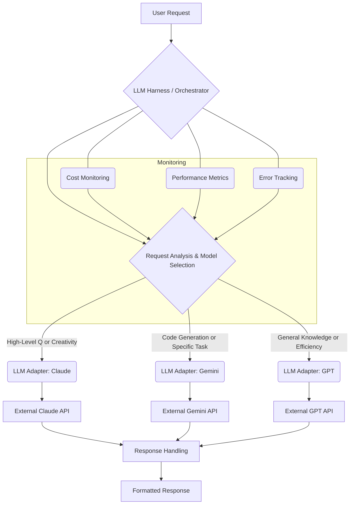

복잡한 AI 시스템에서 단일 LLM에 대한 의존성은 확장성, 비용 효율성, 그리고 특정 작업에 대한 최적화 측면에서 한계를 드러낼 수 있습니다. 2026년 현재, 다양한 LLM이 각기 다른 강점과 약점을 가지고 있으며, 이를 효과적으로 활용하기 위한 전략이 중요해지고 있습니다. LLM 하네스(Harness) 내에서 외부 모델을 동적으로 연결하고 교체하는 패턴은 이러한 문제에 대한 핵심적인 해결책을 제공합니다.

## 동적 LLM 통합의 필요성

Apple Siri의 사례에서 볼 수 있듯이, 기존 AI 시스템에 외부의 강력한 LLM (예: Claude, ChatGPT)을 연결하거나, 내부 모델을 교체할 수 있는 구조는 다음과 같은 이점을 제공합니다:

*   **유연성 (Flexibility)**: 특정 작업에 가장 적합한 모델을 실시간으로 선택하여 활용할 수 있습니다. 예를 들어, 창의적 글쓰기에는 Anthropic Claude, 복잡한 코드 생성에는 Google Gemini가 더 적합할 수 있습니다.
*   **비용 최적화 (Cost Optimization)**: 작업의 복잡성과 중요도에 따라 저렴하고 빠른 모델과 고성능의 비싼 모델을 적절히 사용하여 운영 비용을 절감할 수 있습니다.
*   **성능 최적화 (Performance Optimization)**: 지연 시간에 민감한 작업에는 빠른 모델을, 정확도가 중요한 작업에는 정교한 모델을 배정하여 전반적인 시스템 성능을 향상시킵니다.
*   **회복 탄력성 (Resilience)**: 특정 모델 API에 문제가 발생했을 때, 다른 모델로 빠르게 페일오버(Failover)하여 서비스 연속성을 확보할 수 있습니다.
*   **기술 Lock-in 회피**: 특정 벤더나 모델에 종속되지 않고, 새로운 고성능 모델이 출시될 때마다 쉽게 통합하여 시스템을 업데이트할 수 있습니다.

## 핵심 패턴: 위임(Delegation) 및 동적 스와핑(Dynamic Swapping)

### 1. 위임 패턴 (Delegation Pattern)

위임 패턴은 LLM 하네스 내의 메인 LLM이 특정 작업을 직접 처리하지 않고, 더 적합하다고 판단되는 외부 LLM에게 해당 작업을 넘기는 방식입니다. 마치 Siri가 사용자 요청을 해석한 뒤, Claude에게 특정 정보를 요청하고, 그 결과를 바탕으로 미리 알림을 생성하는 것과 유사합니다. 이 패턴은 메인 LLM의 역할을 조정자(Orchestrator)로 격상시키고, 전문화된 외부 LLM의 강점을 활용합니다.

### 2. 동적 스와핑 패턴 (Dynamic Swapping Pattern)

동적 스와핑은 런타임에 어떤 LLM을 사용할지 결정하고 교체하는 패턴입니다. 이는 주로 라우터(Router) 컴포넌트에 의해 관리되며, 요청의 유형, 사용자 선호도, 모델의 가용성, 비용, 성능 지표 등 다양한 기준에 따라 모델을 선택합니다. 예를 들어, `playbook`의 Claude Code 하네스에서 Gemini 연동을 강화할 때, 코드 관련 요청은 Gemini로, 일반적인 질의는 Claude로 라우팅할 수 있습니다.

## 아키텍처 구성 요소

이러한 패턴을 구현하기 위해서는 다음과 같은 아키텍처 컴포넌트가 필요합니다.

*   **LLM Router / Orchestrator**: 들어오는 요청을 분석하고, 어떤 LLM (내부 또는 외부)이 해당 작업을 처리할지 결정하는 핵심 모듈입니다. 라우팅 로직은 복잡한 규칙 기반(Rule-based)이거나, 더 나아가 메타 LLM(Meta-LLM)을 사용하여 지능적으로 결정될 수 있습니다.
*   **LLM Adapter Layer**: 다양한 LLM API의 인터페이스를 추상화하여, 하네스 내부에서는 일관된 방식으로 LLM을 호출할 수 있도록 합니다. 각 LLM (Claude, Gemini, GPT 등)에 대한 고유한 어댑터가 필요합니다.
*   **External LLM Services**: 실제 작업을 수행하는 외부 LLM 모델들입니다. 이들은 클라우드 API 형태로 제공되거나, 자체 호스팅된 모델일 수 있습니다.
*   **Monitoring & Telemetry**: 각 LLM의 성능, 비용, 오류율 등을 실시간으로 모니터링하여 라우팅 결정에 활용하거나 시스템 상태를 파악합니다.

다음 Mermaid 다이어그램은 동적 LLM 통합 아키텍처의 흐름을 보여줍니다.



## 코드 예시: Python 기반 LLM 라우터

다음 Python 코드는 간단한 LLM 라우터와 어댑터 계층을 보여줍니다. 이 예제는 `playbook`의 Claude Code 하네스에 동적 LLM 스와핑을 통합하는 방식의 기본 아이디어를 제공합니다.

```python
import os
from abc import ABC, abstractmethod

# --- 1. LLM Adapter Interface (추상화 계층) ---
class LLMAdapter(ABC):
    @abstractmethod
    def generate_response(self, prompt: str, **kwargs) -> str:
        pass

# --- 2. Concrete LLM Adapters ---
class ClaudeAdapter(LLMAdapter):
    def __init__(self, api_key: str):
        self.api_key = api_key
        # Initialize Claude client (e.g., anthropic.Anthropic(api_key=api_key))
        print("ClaudeAdapter initialized.")

    def generate_response(self, prompt: str, model: str = "claude-3-opus-20240229", **kwargs) -> str:
        # Simulate API call
        print(f"Calling Claude API with model {model} for prompt: {prompt[:30]}...")
        return f"[Claude ({model}) Response] {prompt} - Generated by a large language model from Anthropic."

class GeminiAdapter(LLMAdapter):
    def __init__(self, api_key: str):
        self.api_key = api_key
        # Initialize Gemini client (e.g., google.generativeai.GenerativeModel('gemini-pro'))
        print("GeminiAdapter initialized.")

    def generate_response(self, prompt: str, model: str = "gemini-1.5-flash", **kwargs) -> str:
        # Simulate API call
        print(f"Calling Gemini API with model {model} for prompt: {prompt[:30]}...")
        return f"[Gemini ({model}) Response] {prompt} - Generated by Google's AI."

class GPTAdapter(LLMAdapter):
    def __init__(self, api_key: str):
        self.api_key = api_key
        # Initialize OpenAI client (e.g., openai.OpenAI(api_key=api_key))
        print("GPTAdapter initialized.")

    def generate_response(self, prompt: str, model: str = "gpt-4o", **kwargs) -> str:
        # Simulate API call
        print(f"Calling GPT API with model {model} for prompt: {prompt[:30]}...")
        return f"[GPT ({model}) Response] {prompt} - Powered by OpenAI."

# --- 3. LLM Router (Orchestration Logic) ---
class LLMModelRouter:
    def __init__(self):
        self.adapters = {}
        self._load_adapters()

    def _load_adapters(self):
        # In a real system, API keys would be loaded securely (e.g., from environment variables or a secrets manager)
        claude_api_key = os.getenv("CLAUDE_API_KEY", "mock-claude-key")
        gemini_api_key = os.getenv("GEMINI_API_KEY", "mock-gemini-key")
        gpt_api_key = os.getenv("GPT_API_KEY", "mock-gpt-key")

        if claude_api_key != "mock-claude-key": # Only load if a real key is available or desired
            self.adapters["claude"] = ClaudeAdapter(claude_api_key)
        if gemini_api_key != "mock-gemini-key":
            self.adapters["gemini"] = GeminiAdapter(gemini_api_key)
        if gpt_api_key != "mock-gpt-key":
            self.adapters["gpt"] = GPTAdapter(gpt_api_key)
        
        if not self.adapters:
            raise RuntimeError("No LLM adapters could be loaded. Ensure API keys are set or mock keys allowed.")

    def route_request(self, prompt: str, task_type: str = "general") -> LLMAdapter:
        # Simple rule-based routing for demonstration
        if task_type == "coding" and "gemini" in self.adapters:
            print("Routing to Gemini for coding task.")
            return self.adapters["gemini"]
        elif task_type == "creative" and "claude" in self.adapters:
            print("Routing to Claude for creative task.")
            return self.adapters["claude"]
        elif "gpt" in self.adapters:
            print("Routing to GPT for general task or as fallback.")
            return self.adapters["gpt"]
        elif "claude" in self.adapters:
            print("Routing to Claude as general fallback.")
            return self.adapters["claude"]
        elif "gemini" in self.adapters:
            print("Routing to Gemini as general fallback.")
            return self.adapters["gemini"]
        else:
            raise ValueError("No suitable LLM adapter found for the request.")

    def process_request(self, prompt: str, task_type: str = "general", **kwargs) -> str:
        adapter = self.route_request(prompt, task_type)
        return adapter.generate_response(prompt, **kwargs)

# --- Usage Example ---
if __name__ == "__main__":
    router = LLMModelRouter()

    # Example 1: General Query
    print("\n--- General Query ---")
    response1 = router.process_request("Explain the concept of quantum entanglement.", task_type="general")
    print(response1)

    # Example 2: Coding Task
    print("\n--- Coding Task ---")
    response2 = router.process_request("Write a Python function to calculate the Fibonacci sequence recursively.", task_type="coding")
    print(response2)

    # Example 3: Creative Writing
    print("\n--- Creative Writing ---")
    response3 = router.process_request("Write a short story about a cat who learns to fly.", task_type="creative")
    print(response3)

    # Example 4: Specify a model explicitly (if router allows or based on more complex rules)
    print("\n--- Explicit Model Request (if implemented) ---")
    try:
        # This routing logic is simplified; real systems might allow explicit overrides
        # For this demo, let's pretend a 'force_model' parameter is used for demonstration
        print("Simulating explicit routing to Claude for a general query.")
        response4 = router.adapters["claude"].generate_response("What is the capital of France?")
        print(response4)
    except KeyError:
        print("Claude adapter not available.")

```

이 코드에서는 `LLMAdapter` 추상 클래스를 통해 Claude, Gemini, GPT 등 다양한 LLM에 대한 인터페이스를 통일합니다. `LLMModelRouter`는 요청의 `task_type`에 따라 적절한 어댑터를 선택하고, 해당 어댑터를 통해 LLM API를 호출합니다. 실제 환경에서는 `task_type` 분석이 더 정교해지거나, `cost_optimization`, `latency_target`, `availability_zone` 같은 추가 파라미터를 기반으로 라우팅될 수 있습니다.

## 트레이드오프

LLM 하네스에 외부 모델을 연결하고 교체하는 패턴은 강력한 이점을 제공하지만, 몇 가지 트레이드오프를 고려해야 합니다.

*   **복잡성 증가 (Increased Complexity)**: 다양한 LLM API를 통합하고 관리하는 것은 시스템 아키텍처 및 운영의 복잡성을 증가시킵니다. 언제 좋은가: 모델 다양성을 통해 성능 및 비용 최적화를 극대화하려는 경우. 언제 나쁜가: 단일 LLM으로도 충분하거나, 개발 및 유지보수 리소스가 제한적인 경우.
*   **잠재적 지연 시간 증가 (Potential Latency Increase)**: 외부 LLM API 호출은 네트워크 지연 시간을 발생시킬 수 있으며, 여러 모델 간의 위임 또는 라우팅 과정에서 추가적인 처리 시간이 소요될 수 있습니다. 언제 좋은가: 응답 지연이 비즈니스 핵심 요구사항이 아니며, 응답의 품질이나 비용이 더 중요한 경우. 언제 나쁜가: 실시간 상호작용이 필수적인 고성능 애플리케이션의 경우.
*   **일관성 유지의 어려움 (Challenge in Maintaining Consistency)**: 모델마다 응답 스타일, 어조, 정확도가 다를 수 있어, 사용자 경험의 일관성을 유지하기 어렵습니다. 언제 좋은가: 각 모델의 특화된 강점을 활용하여 특정 작업의 품질을 극대화하려는 경우 (예: 코드 생성은 Gemini, 창의적 글쓰기는 Claude). 언제 나쁜가: 브랜드 가이드라인에 따른 일관된 응답이 중요한 고객 대면 서비스의 경우.
*   **보안 및 데이터 프라이버시 (Security and Data Privacy)**: 민감한 데이터를 여러 외부 LLM 제공업체에 전송할 경우, 데이터 보안 및 규정 준수(Compliance) 위험이 증가합니다. 언제 좋은가: 민감하지 않은 공개 데이터나, 엄격한 데이터 비공개 계약(NDA) 및 보안 프로토콜이 적용된 환경에서. 언제 나쁜가: 규제 산업(금융, 의료)에서 민감 개인 정보(PII)를 다루는 경우, 데이터 거버넌스(Data Governance) 요건을 충족하기 어렵습니다.
*   **비용 관리의 복잡성 (Complexity of Cost Management)**: 여러 LLM의 사용량과 비용을 통합적으로 모니터링하고 최적화하는 것은 단일 모델 대비 복잡합니다. 언제 좋은가: 정교한 비용 라우팅 전략을 통해 전체 비용을 효과적으로 절감할 수 있을 때. 언제 나쁜가: 비용 모니터링 및 분석 인프라가 미흡하거나, 예측 불가능한 사용 패턴으로 인해 비용 제어가 어려울 때.

## 실전 체크리스트

LLM 하네스에 외부 모델 연결/교체 패턴을 성공적으로 적용하기 위한 실전 체크리스트입니다.

*   [ ] **라우팅 정책 정의**: 각 요청 유형(예: 코딩, 창의적 글쓰기, 일반 지식 질의)에 대해 어떤 LLM을, 어떤 기준으로(예: 성능, 비용, 가용성) 사용할지 명확한 라우팅 정책을 정의했습니다.
*   [ ] **어댑터 계층 구현**: 다양한 LLM API (Claude, Gemini, GPT 등)에 대한 추상화된 어댑터 계층을 구현하여, 새로운 모델 추가/제거 시 핵심 로직 변경 없이 유연하게 대응할 수 있도록 했습니다.
*   [ ] **강력한 오류 처리 및 페일오버**: 외부 LLM API 호출 실패 시 재시도(Retry) 로직, 다른 LLM으로의 자동 페일오버, 또는 사용자에게 명확한 오류 메시지 전달 등 견고한 오류 처리 메커니즘을 구축했습니다.
*   [ ] **성능 및 비용 모니터링**: 각 LLM의 응답 시간, 토큰 사용량, 비용 등을 실시간으로 모니터링하고 분석하는 시스템을 구축하여, 라우팅 정책 최적화의 기반으로 활용합니다.
*   [ ] **데이터 보안 및 규정 준수 확인**: 외부 LLM 사용 시 전달되는 데이터의 민감도를 평가하고, 각 LLM 제공업체의 데이터 처리 정책과 보안 조치가 우리의 데이터 거버넌스 및 규정 준수 요구사항(예: GDPR, CCPA)을 충족하는지 검토했습니다.
*   [ ] **A/B 테스트 및 점진적 롤아웃 계획**: 새로운 LLM 통합 또는 라우팅 정책 변경 시, 소수의 사용자에게만 적용하는 A/B 테스트나 점진적 롤아웃 전략을 통해 시스템 안정성과 성능 영향을 검증하는 계획을 수립했습니다.
*   [ ] **모델 버전 관리 및 설정 동기화**: LLM 어댑터 및 라우팅 로직의 코드 변경 사항과 외부 LLM 모델 버전(예: `claude-3-opus-20240229`) 및 설정(예: 온도, 최대 토큰)을 효과적으로 관리하고, 배포 환경과 동기화하는 절차를 마련했습니다.