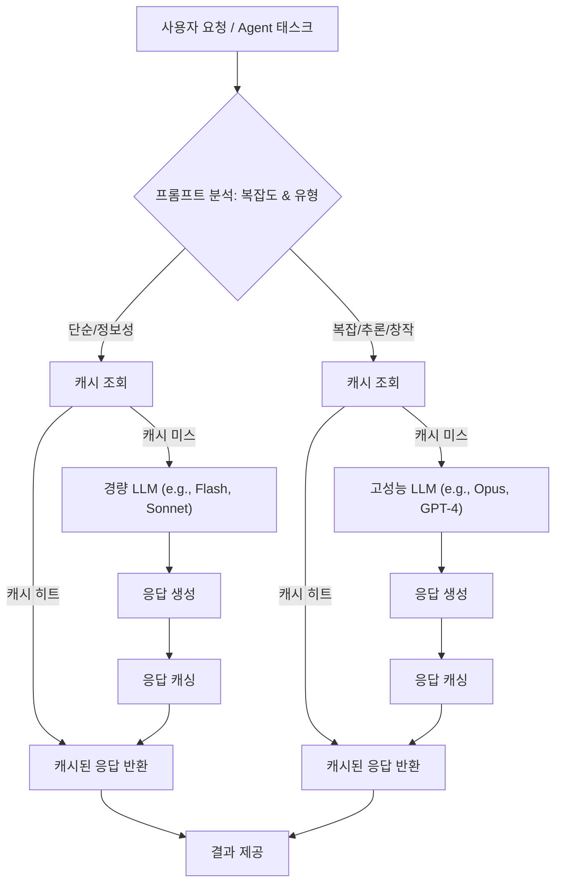

LLM(Large Language Model) 기반 솔루션의 확산과 함께, 토큰 사용량은 서비스 운영 비용의 핵심 요소로 부상했습니다. 특히 장기 실행(long-running) 에이전틱 워크플로우를 처리하는 Harness 환경에서는 토큰 사용량 최적화가 지속 가능한 운영을 위한 필수 전략입니다. 2026년 현재, 단순히 프롬프트 길이를 줄이는 것을 넘어선 고도화된 토큰 관리 기법들이 요구되고 있습니다.

## LLM Harness 토큰 사용량 최적화 전략 (LLM Harness Token Usage Optimization Strategies)

### 1. 지능형 프롬프트 엔지니어링 (Intelligent Prompt Engineering)

프롬프트 엔지니어링은 LLM의 행동을 유도하는 가장 기본적인 방법이지만, 토큰 사용량에 직접적인 영향을 미칩니다. 2026년의 최신 트렌드는 단순한 길이 축소를 넘어, 컨텍스트의 관련성과 압축률을 극대화하는 방향으로 진화하고 있습니다.

*   **컨텍스트 윈도우 최적화 (Context Window Optimization)**: 모든 관련 정보를 통째로 전달하기보다, RAG(Retrieval Augmented Generation) 패턴을 통해 필요한 정보만 선별적으로 주입하고, 장기적인 대화는 요약(summarization) 또는 캐싱(caching)을 활용하여 이전 대화의 핵심만 전달합니다. Agentic Context Compaction Trigger Heuristics와 같은 전략이 유용합니다.
*   **명령어 압축 및 명확화 (Instruction Compression and Clarification)**: LLM이 동일한 작업을 수행하는 데 필요한 토큰 수를 최소화하면서도, 명확하고 모호함 없는 지시를 제공하여 불필요한 반복이나 추론을 줄입니다. 불필요한 서론이나 수식어를 제거하고, 핵심 키워드 중심으로 프롬프트를 구성합니다.
*   **Few-shot 학습 예제 최적화 (Few-shot Learning Example Optimization)**: Few-shot 예제를 사용할 경우, 가장 대표적이고 모델이 학습할 수 있는 패턴을 효과적으로 보여주는 최소한의 예제만 사용합니다. 각 예제의 길이 또한 면밀히 검토하여 토큰 낭비를 줄입니다.

### 2. 고급 캐싱 전략 (Advanced Caching Strategies)

LLM 호출은 고비용 작업이므로, 동일하거나 유사한 요청에 대한 재사용은 비용 절감에 가장 효과적인 방법 중 하나입니다.

*   **정확 일치 캐싱 (Exact Match Caching)**: 동일한 입력 프롬프트에 대해 과거에 생성된 응답을 즉시 반환합니다. 이는 가장 구현하기 쉽고 효과적인 방법입니다.
*   **의미론적 캐싱 (Semantic Caching)**: 프롬프트의 의미적 유사성을 기반으로 캐싱합니다. 임베딩(embedding)을 활용하여 현재 프롬프트와 유사도가 높은 과거 프롬프트가 있는지 확인하고, 있다면 해당 응답을 재사용합니다. `jit-embedding-retrieval-context-cost-scale-invariant`와 같은 임베딩 검색 효율성 기법이 필수적입니다.

### 3. 동적 모델 라우팅 및 티어링 (Dynamic Model Routing and Tiering)

단일 LLM 모델에 의존하기보다는, 작업의 복잡성과 중요도에 따라 다양한 모델을 동적으로 선택하는 전략입니다. 2026년에는 더욱 세분화된 모델 티어링이 보편화되고 있습니다.

*   **경량 모델 우선 사용 (Prioritize Lightweight Models)**: 간단한 질의 응답, 포맷팅, 정보 추출 등 저복잡도 작업에는 Gemini Flash, Claude Sonnet 등 빠르고 저렴한 경량 모델을 사용합니다. 이를 통해 비용을 크게 절감할 수 있습니다.
*   **복잡도 기반 라우팅 (Complexity-based Routing)**: 프롬프트의 길이나 키워드 분석, 또는 초기 LLM 호출을 통한 `is_complex` 판단 결과에 따라 더 비싸지만 강력한 모델(예: Claude Opus, GPT-4o)로 라우팅합니다. `dynamic-llm-routing-system-implementation-patterns`이 핵심입니다.
*   **모델 캐스케이딩 (Model Cascading)**: 경량 모델로 시작하여 응답의 품질이 낮거나 특정 제약 조건을 충족하지 못할 경우, 점진적으로 더 크고 강력한 모델로 폴백(fallback)하는 전략입니다.

### 4. 응답 길이 제어 및 스트리밍 (Response Length Control and Streaming)

LLM의 응답도 토큰으로 계산되므로, 불필요하게 긴 응답을 줄이는 것이 중요합니다.

*   **최대 출력 토큰 제한 (Max Output Tokens Limit)**: LLM API 호출 시 `max_tokens` 매개변수를 통해 응답의 최대 길이를 명시적으로 제한합니다.
*   **스트리밍 및 조기 종료 (Streaming and Early Termination)**: 응답을 스트리밍 방식으로 수신하면서, 필요한 정보가 모두 추출되었거나 특정 종료 조건이 만족되면 즉시 생성을 중단합니다. 이는 `llm-token-usage-monitoring-cost-efficiency-patterns`을 통해 효과적으로 관리할 수 있습니다.

### 5. 배치 처리 및 비동기 처리 (Batch Processing and Asynchronous Handling)

여러 요청을 효율적으로 처리하여 API 호출 비용과 지연 시간을 줄입니다.

*   **배치 처리 (Batching)**: 유사하거나 독립적인 여러 요청을 묶어 한 번의 API 호출로 처리합니다. 이는 특히 LLM API의 고정 호출 비용(fixed overhead)을 줄이는 데 효과적입니다.
*   **비동기 처리 (Asynchronous Processing)**: 실시간 응답이 필수적이지 않은 작업에 대해 비동기적으로 LLM을 호출하고 결과를 나중에 처리합니다. 이는 시스템의 처리량을 늘리고 비용 효율성을 높이는 데 기여합니다.



**Python 코드 예제: 동적 모델 라우팅 및 캐싱**

```python
import hashlib
import json
from typing import Dict, Any

# Simplified in-memory cache
cache: Dict[str, Any] = {}

def get_prompt_hash(prompt: str) -> str:
    """프롬프트의 MD5 해시를 생성하여 캐시 키로 사용합니다."""
    return hashlib.md5(prompt.encode('utf-8')).hexdigest()

def is_complex_prompt(prompt: str) -> bool:
    """프롬프트의 복잡도를 판단하는 로직 (간소화).
    실제 시스템에서는 키워드 분석, 프롬프트 길이, 구조, 또는 경량 LLM의 초기 판단을 활용합니다.
    """
    word_count = len(prompt.split())
    complex_keywords = ["analyze", "evaluate", "synthesize", "develop plan", "code generation"]
    if word_count > 100 or any(keyword in prompt.lower() for keyword in complex_keywords):
        return True
    return False

def call_llm_api(model_name: str, prompt: str, max_tokens: int = 250) -> str:
    """가상의 LLM API 호출 함수."""
    print(f"[LLM CALL] Model: {model_name}, Prompt: '{prompt[:70]}...', Max Tokens: {max_tokens}")
    # 실제 LLM API 호출 (예: Anthropic, OpenAI, Google Gemini)
    if "small-model" in model_name:
        return f"[Cost-Efficient Response from {model_name}] Summary of '{prompt[:50]}...'"
    else:
        return f"[Detailed Response from {model_name}] In-depth analysis for '{prompt[:50]}...'"

def process_llm_request(prompt: str, enable_cache: bool = True) -> str:
    """LLM 요청을 처리하고 토큰 사용량을 최적화합니다."""
    prompt_hash = get_prompt_hash(prompt)

    # 1. 정확 일치 캐싱 (Exact Match Caching)
    if enable_cache and prompt_hash in cache:
        print(f"[CACHE HIT] for prompt hash {prompt_hash}")
        return cache[prompt_hash]

    # 2. 동적 모델 라우팅 (Dynamic Model Routing)
    if is_complex_prompt(prompt):
        model_to_use = "large-model-opus-or-gpt4" # 예: Claude Opus, GPT-4o
        output_token_limit = 1000
    else:
        model_to_use = "small-model-flash-or-sonnet" # 예: Gemini Flash, Claude Sonnet
        output_token_limit = 250

    # 3. LLM API 호출
    response = call_llm_api(model_to_use, prompt, output_token_limit)

    # 4. 응답 캐싱
    if enable_cache:
        cache[prompt_hash] = response

    return response

# 예시 사용
print(process_llm_request("List 5 benefits of cloud computing."))
print(process_llm_request("List 5 benefits of cloud computing.")) # 캐시 히트 예상
print(process_llm_request("Analyze the ethical implications of advanced AI agent deployment in critical infrastructure by 2026, considering societal impact and regulatory challenges."))
print(process_llm_request("Generate a detailed project plan for implementing a new microservice architecture using Go and Kubernetes, including a timeline and resource allocation."))
```

## 트레이드오프 (Trade-offs)

LLM 토큰 사용량 최적화 전략은 여러 이점을 제공하지만, 시스템 설계 및 운영에 있어 고려해야 할 트레이드오프가 존재합니다.

*   **비용 절감 vs. 구현 복잡성 (Cost Savings vs. Implementation Complexity)**: 동적 모델 라우팅, 의미론적 캐싱과 같은 고급 전략은 상당한 비용 절감 효과를 가져오지만, 초기 설계 및 구현에 더 많은 공수가 필요합니다. 저복잡도 시스템에는 단순 캐싱이 더 적합할 수 있습니다.
*   **응답 속도 vs. 토큰 정확성 (Latency vs. Token Precision)**: 컨텍스트 요약이나 간결한 프롬프트는 응답 속도를 향상시킬 수 있지만, 핵심 정보 누락이나 LLM이 오해할 여지를 남겨 응답 품질을 저하시킬 위험이 있습니다. 실시간성이 중요한 경우 요약을 최소화하고, 정확성이 중요한 경우 충분한 컨텍스트를 제공해야 합니다.
*   **자동화 수준 vs. 제어 가능성 (Automation Level vs. Controllability)**: LLM 에이전트의 자동화된 컨텍스트 관리나 동적 모델 선택은 운영 부담을 줄이지만, 예상치 못한 동작이나 비용 급증 시 즉각적인 제어가 어려울 수 있습니다. 핵심 워크플로우에는 명시적인 제어 지점을 두는 것이 좋습니다.
*   **모델 선택의 유연성 vs. 관리 오버헤드 (Model Selection Flexibility vs. Management Overhead)**: 다양한 LLM 모델을 활용하는 것은 비용 효율적이지만, 각 모델의 API, 입력/출력 형식, 성능 특성 등을 관리하는 데 추가적인 오버헤드가 발생합니다. 모델 수가 적고 표준화된 인터페이스를 가진 환경에서 관리 효율이 높습니다.
*   **개발 시간 vs. 장기적 운영 비용 (Development Time vs. Long-term Operational Cost)**: 최적화 기법을 도입하기 위한 초기 개발 시간 투자는 장기적으로 LLM 운영 비용을 크게 절감할 수 있습니다. 그러나 프로젝트 초기 단계에서는 MVP(Minimum Viable Product) 달성을 위해 최소한의 최적화만 적용하고, 이후 점진적으로 개선하는 접근 방식이 합리적입니다.

## 실전 체크리스트 (Practical Checklist)

LLM 기반 Harness 솔루션의 토큰 사용량 최적화 전략을 도입할 때 다음 항목들을 검증합니다.

*   [ ] **토큰 사용량 및 비용 모니터링 시스템 구축**: 각 LLM 호출에 대한 입력/출력 토큰 수와 비용을 실시간으로 측정하고 대시보드에서 시각화하고 있습니까? `llm-app-performance-monitoring-system`이 핵심입니다.
*   [ ] **기존 워크플로우의 토큰 사용량 기준선(Baseline) 설정**: 현재 운영 중인 주요 LLM 워크플로우의 평균 및 최대 토큰 사용량과 비용을 파악하고 기준선으로 설정했습니까?
*   [ ] **프롬프트 엔지니어링 가이드라인 수립**: 개발팀이 토큰 효율적인 프롬프트를 작성하기 위한 명확한 가이드라인(예: 명확성, 간결성, RAG 활용법)을 준수하고 있습니까?
*   [ ] **캐싱 레이어 구현 및 효과 측정**: 정확 일치 캐싱 및 의미론적 캐싱 솔루션이 구현되었고, 캐시 히트율(hit rate) 및 비용 절감 효과를 정기적으로 측정하고 있습니까?
*   [ ] **동적 모델 라우팅 로직 검증**: 작업 복잡도에 따른 LLM 모델 라우팅 규칙이 정확하게 작동하는지, 그리고 라우팅 결과가 비용과 품질 목표를 달성하는지 A/B 테스트를 통해 검증하고 있습니까?
*   [ ] **응답 길이 제한 및 스트리밍 적용 확인**: LLM 응답에 대해 적절한 `max_tokens` 제한이 설정되었으며, 불필요한 긴 응답을 방지하기 위한 스트리밍 및 조기 종료 메커니즘이 활성화되어 있습니까?
*   [ ] **정기적인 비용 감사 및 재평가 프로세스**: 월별 또는 분기별로 LLM 관련 비용을 감사하고, 새로운 모델이나 최적화 기법 도입 가능성을 정기적으로 재평가하는 프로세스가 확립되어 있습니까?
