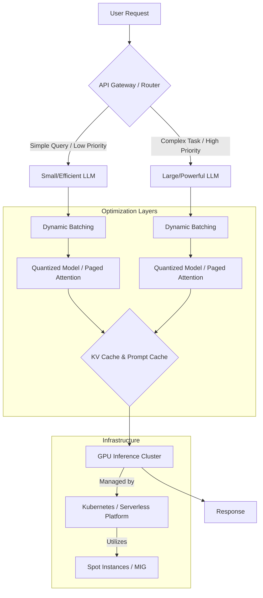

대규모 언어 모델 (LLM) 기반 서비스의 상용화는 혁신적인 기회를 제공하지만, 추론 (inference) 비용은 여전히 서비스 운영의 주요 제약 요소로 작용합니다. 특히 복잡하고 방대한 모델은 GPU 자원을 대량으로 소모하며, 이는 곧 높은 클라우드 인프라 비용으로 직결됩니다. 따라서 성능 저하를 최소화하면서 추론 비용을 효율적으로 관리하는 엔지니어링 전략이 필수적입니다. 이 문서는 대규모 LLM 기반 서비스의 비용 효율적인 추론 인프라를 구축하기 위한 핵심 방법론과 실전 기술을 다룹니다.

### 1. 모델 최적화 (Model Optimization)
모델 자체를 경량화하여 추론에 필요한 자원을 줄이는 방법입니다.
#### 1.1. 양자화 (Quantization)
모델의 가중치 (weights) 및 활성화 값 (activations)을 더 낮은 비트 (예: FP32에서 INT8, INT4)로 표현하여 모델 크기를 줄이고 연산 속도를 향상시킵니다.
```python
# PyTorch quantization 예시 (concept only)
import torch
import torch.nn as nn
from torch.quantization import get_default_qconfig, quantize_dynamic

# Assume original_model is a pre-trained LLM
qconfig = get_default_qconfig("fbgemm") # For x86 CPUs
quantized_model = quantize_dynamic(
    original_model,
    {nn.Linear, nn.LSTM}, # Apply quantization to Linear and LSTM layers
    dtype=torch.qint8,
    inplace=False
)
```
양자화는 모델의 추론 속도를 높이고 메모리 사용량을 줄여 비용 절감에 직접적인 영향을 줍니다.
#### 1.2. 가지치기 (Pruning)
모델의 중요도가 낮은 가중치를 제거하여 모델의 희소성 (sparsity)을 높이고 크기를 줄이는 기술입니다. 모델의 성능 저하를 최소화하면서 효율성을 극대화합니다.

### 2. 추론 서빙 프레임워크 (Inference Serving Frameworks)
전용 추론 프레임워크를 사용하면 GPU 활용률을 극대화하고 처리량을 높일 수 있습니다.
#### 2.1. 동적 배치 (Dynamic Batching)
들어오는 요청들을 묶어 한 번에 처리함으로써 GPU 활용률을 높이고 스루풋 (throughput)을 향상시킵니다. vLLM, TensorRT-LLM, TGI (Text Generation Inference)와 같은 프레임워크는 이러한 동적 배치를 효율적으로 구현합니다.
#### 2.2. 페이지드 어텐션 (Paged Attention)
vLLM에서 도입된 기술로, KV Cache를 페이지 단위로 관리하여 메모리 파편화를 줄이고 더 많은 시퀀스를 효율적으로 배치 처리할 수 있게 합니다. 이는 GPU 메모리 사용량을 최적화하고 최대 처리량 (max throughput)을 증가시킵니다.
```python
# vLLM 서버 시작 예시
# docker run --gpus all -p 8000:8000 --shm-size 8g -v ~/.cache/huggingface:/root/.cache/huggingface vllm/vllm-openai:latest --model meta-llama/Llama-2-7b-chat-hf
```

### 3. 캐싱 전략 (Caching Strategies)
반복적인 추론 요청에 대한 비용을 절감하기 위한 핵심 전략입니다.
#### 3.1. 프롬프트 캐싱 (Prompt Caching)
동일하거나 유사한 프롬프트가 반복될 경우, 이전 추론 결과를 재활용하여 불필요한 연산을 방지합니다. 프롬프트 임베딩 (embedding)이나 해시 값을 기반으로 캐시 여부를 결정합니다.
#### 3.2. KV 캐시 재활용 (KV Cache Reuse)
대화형 (conversational) 시나리오에서 이전 턴의 KV Cache를 다음 턴에 재활용하여 프롬프트 토큰 (prompt token) 처리 비용을 절감합니다. 예를 들어, `system prompt`나 긴 대화 기록이 반복될 때 유용합니다.

### 4. 동적 모델 라우팅 (Dynamic Model Routing)
서비스의 요구사항에 따라 여러 LLM을 전략적으로 활용하여 비용과 성능의 균형을 맞춥니다.
#### 4.1. 워크로드 기반 라우팅 (Workload-based Routing)
간단한 질의응답이나 요약에는 작고 비용이 저렴한 모델 (예: Gemma 2B, Mistral 7B)을 사용하고, 복잡한 추론이나 정밀도가 요구되는 작업에는 크고 강력한 모델 (예: GPT-4, Claude 3 Opus)을 라우팅합니다.
#### 4.2. Latency/Cost 기반 라우팅
실시간 응답 속도가 중요한 서비스에는 지연 시간이 짧은 모델을 우선하고, 배치 작업과 같이 지연 허용 범위가 넓은 작업에는 비용 효율적인 모델을 선택합니다.
```javascript
// Pseudo-code for dynamic model routing
function routeLlmRequest(request) {
  if (request.isSimpleQuery()) {
    return "efficient_small_model_endpoint";
  } else if (request.isComplexTask() && request.priority === "high") {
    return "premium_large_model_endpoint";
  } else if (request.isComplexTask() && request.priority === "low") {
    // Potentially use a mid-tier model or a cheaper large model
    return "cost_optimized_large_model_endpoint";
  } else {
    return "default_model_endpoint";
  }
}
```

### 5. 인프라 및 운영 최적화 (Infrastructure & Operations Optimization)
#### 5.1. GPU 자원 관리 (GPU Resource Management)
멀티테넌시 (multi-tenancy) 환경에서 여러 모델이나 워크로드가 하나의 GPU를 공유하도록 최적화합니다. Kubernetes의 GPU 스케줄러나 NVIDIA MIG (Multi-Instance GPU)와 같은 기술을 활용하여 GPU 활용률을 극대화합니다.
#### 5.2. 스팟 인스턴스 활용 (Leveraging Spot Instances)
클라우드 공급자의 유휴 자원을 저렴하게 활용합니다. 단, 워크로드가 중단될 수 있으므로, 재시도 로직이나 내결함성 (fault tolerance) 설계가 필수적입니다.
#### 5.3. 서버리스 추론 (Serverless Inference)
Google Cloud Run, AWS Lambda with GPU (limited), Azure Container Apps와 같은 서버리스 플랫폼을 활용하여 유휴 시간에 대한 비용을 절감하고, 트래픽 급증 시 자동 스케일링을 통해 효율적인 자원 관리를 달성합니다. 2026년에는 더 다양한 클라우드에서 LLM에 최적화된 서버리스 추론 기능이 발전할 것으로 예상됩니다.
#### 5.4. 비용 모니터링 및 분석 (Cost Monitoring & Analysis)
실시간으로 LLM 추론 비용을 모니터링하고, 토큰 사용량, 모델별 비용, API 호출 횟수 등을 분석하여 최적화 기회를 지속적으로 발굴합니다. `llm-token-usage-monitoring-cost-efficiency-patterns` 엔트리에서 상세 내용을 확인할 수 있습니다.



## 트레이드오프

*   **양자화 (Quantization)**
    *   **좋은 점**: 모델 크기 및 메모리 사용량 대폭 감소, 추론 속도 향상, 비용 절감.
    *   **나쁜 점**: 모델의 정확도 (accuracy) 및 품질 (quality) 저하 가능성, 특히 낮은 비트 (예: INT4)에서는 성능 저하가 두드러질 수 있음. **언제 좋고/언제 나쁜지**: 정확도 민감도가 낮은 애플리케이션 (예: 내부 테스트, 빠른 응답이 우선인 초안 생성)에는 유용하며, 금융, 의료 등 높은 정확도가 필수적인 분야에는 신중한 검토와 함께 제한적으로 사용해야 합니다.

*   **동적 배치 (Dynamic Batching)**
    *   **좋은 점**: GPU 활용률 극대화, 전체 시스템 스루풋 (throughput) 향상, 비용 대비 처리량 증대.
    *   **나쁜 점**: 배치 크기가 커질수록 개별 요청의 지연 시간 (latency) 증가. **언제 좋고/언제 나쁜지**: 실시간성이 덜 중요한 배치 처리나 높은 스루풋이 필요한 비동기 작업에 적합하며, 즉각적인 응답이 필요한 대화형 AI나 사용자 인터페이스에는 지연 시간 증가가 사용자 경험에 부정적인 영향을 줄 수 있습니다.

*   **캐싱 전략 (Caching Strategies)**
    *   **좋은 점**: 반복적인 요청에 대한 추론 비용 제로화 (또는 극소화), 응답 속도 향상.
    *   **나쁜 점**: 캐시 일관성 (consistency) 유지의 복잡성, 캐시 메모리 오버헤드, 캐시 미스 (miss) 시 성능 저하 가능성. **언제 좋고/언제 나쁜지**: 정적 또는 자주 반복되는 프롬프트, 짧은 기간 동안 재사용될 가능성이 높은 KV Cache에는 매우 효과적입니다. 하지만 자주 변경되는 데이터나 매우 동적인 상호작용에서는 캐시 적중률이 낮아 효과가 미미하거나 오히려 관리 비용이 더 커질 수 있습니다.

*   **동적 모델 라우팅 (Dynamic Model Routing)**
    *   **좋은 점**: 워크로드 특성에 따른 비용 및 성능 최적화, 유연한 서비스 운영.
    *   **나쁜 점**: 라우팅 로직의 복잡성 증가, 여러 모델 관리의 오버헤드, 모델 간 일관성 유지 문제. **언제 좋고/언제 나쁜지**: 다양한 종류의 LLM 작업이 혼재된 서비스에서 비용을 효과적으로 분배하고 특정 작업에 최적화된 모델을 사용할 때 유용합니다. 반면, 모든 작업이 동일한 고품질/고정밀도를 요구하거나 단일 모델로 충분한 경우에는 불필요한 복잡성을 야기할 수 있습니다.

*   **스팟 인스턴스 활용 (Leveraging Spot Instances)**
    *   **좋은 점**: 온디맨드 인스턴스 대비 최대 70-90% 비용 절감.
    *   **나쁜 점**: 클라우드 공급자의 자원 회수 (preemption) 가능성으로 인한 워크로드 중단 위험, 고가용성 (High Availability) 및 내결함성 (Fault Tolerance) 설계 필수. **언제 좋고/언제 나쁜지**: 내결함성이 뛰어나고, 중간에 중단되어도 다시 시작할 수 있는 배치 추론, 비동기 작업, 또는 리스크를 감수할 수 있는 개발/테스트 환경에 매우 적합합니다. 실시간 상용 서비스의 핵심 워크로드에는 단독으로 사용하기 어려우며, 다른 고가용성 인프라와 결합하여 사용해야 합니다.

## 실전 체크리스트

대규모 LLM 기반 서비스의 비용 효율적인 추론 인프라를 구축할 때 다음 항목들을 검토하고 구현해야 합니다.

*   [ ] **모델 양자화 수준 평가**: 서비스의 허용 가능한 정확도 저하 범위를 설정하고, INT8 또는 INT4 양자화를 적용한 모델의 성능을 벤치마킹하여 최적의 양자화 수준을 결정했는가?
*   [ ] **동적 배치 최적화**: vLLM, TensorRT-LLM 등 전용 서빙 프레임워크를 사용하여 GPU 동적 배치를 구현하고, 워크로드 패턴에 맞춰 `batch_size` 및 `max_sequence_length` 등의 파라미터를 튜닝하여 스루풋과 지연 시간의 균형을 확보했는가?
*   [ ] **프롬프트/KV 캐싱 전략 구현**: 반복적인 프롬프트에 대한 캐시 시스템 또는 대화형 시나리오에서 KV Cache 재활용 로직을 구현하여 불필요한 토큰 재연산을 방지하고, 캐시 일관성 전략을 수립했는가?
*   [ ] **동적 모델 라우팅 설계 및 배포**: 서비스 내 다양한 유형의 LLM 요청을 식별하고, 각 요청의 중요도, 복잡성, 지연 시간 요구사항에 따라 비용 효율적인 모델로 라우팅하는 로직을 구현 및 배포했는가?
*   [ ] **GPU 자원 활용률 모니터링**: GPU의 사용률, 메모리 사용량, 온도 등 핵심 지표를 실시간으로 모니터링하고, NVIDIA MIG 또는 Kubernetes GPU 스케줄링을 통해 자원 활용률을 80% 이상으로 유지하고 있는가?
*   [ ] **스팟 인스턴스 도입 및 내결함성 설계**: 비용 절감을 위해 스팟 인스턴스 활용을 검토하고, 인스턴스 회수 시 워크로드가 자동으로 재개되거나 다른 온디맨드 인스턴스로 전환되는 내결함성 아키텍처를 설계했는가?
*   [ ] **LLM 비용 대시보드 구축**: 토큰 사용량, API 호출 수, 모델별 비용, 시간대별 비용 등 LLM 추론 관련 상세 비용 데이터를 시각화하는 대시보드를 구축하고, 비정상적인 비용 지출 패턴을 탐지하는 알림 시스템을 설정했는가?